# MC Studio使用说明

## 基本介绍

MC Studio是集开发者启动器、地图编辑器、关卡编辑器、逻辑编辑器、特效编辑器、云端测试平台等功能于一体的开发工具，能够为《我的世界》开发者开发和发布作品提供极大的便利。这里主要介绍开发者启动器的功能，并简略介绍《我的世界》中国版组件的开发方式。

先通过视频来快速了解吧：

<iframe src="https://cc.163.com/act/m/daily/iframeplayer/?id=5ece4f824dd6e7349287718d" height="600" width="800" allow="fullscreen" />

## 开发者账号

目前MC Studio对《我的世界》中国版开发者开放，非开发者账号登录后，可在启动器中的“发布”分页提交资料，申请成为开发者。成为开发者后可以使用MC Studio的所有功能。

## 开发者启动器

启动器中可以选择作品模板新建自己的作品，并会列出当前开发者账号下的所有作品。

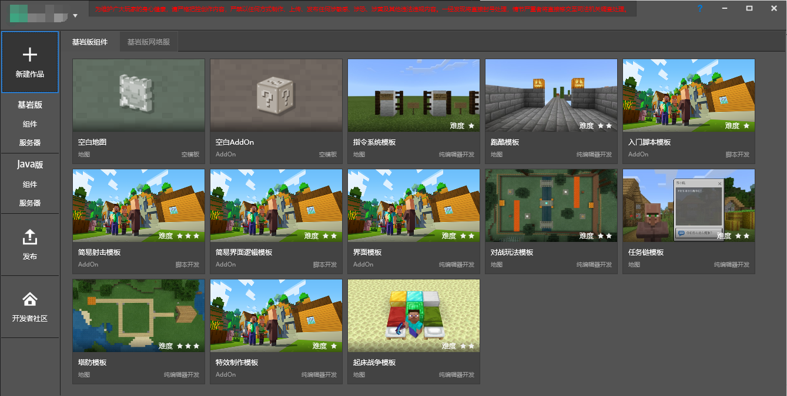

### 新建作品

目前仅支持通过MC Studio新建基岩版作品（其他类型作品需通过“本地导入”的方式导入MC Studio）。

如果要新建一个地图，将鼠标移到列表中第一项“空白地图”上，点击按钮“新建”。

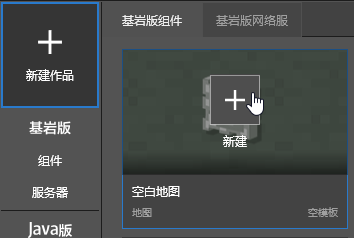

在弹出的对话框中，可以进行基本的地图设置。如果MC Studio中已经有非地图类型的基岩版作品，那么会显示在“导入功能玩法”、“导入材质光影”的列表中。导入的功能玩法和材质光影的文件会拷贝一份到新建地图中（所以只需导入一次即可）。

点击“启动编辑”后就能够开启编辑器，开始制作自己的地图。

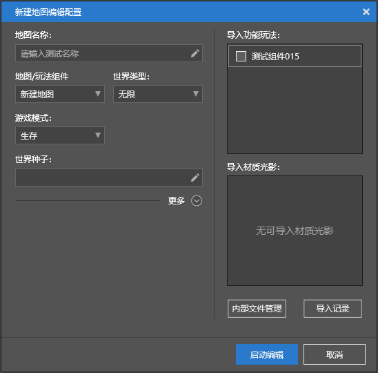

 

除了新建地图，也可以新建空白AddOn。AddOn即为附加包，具体的解释可见[wiki](https://minecraft-zh.gamepedia.com/%E9%99%84%E5%8A%A0%E5%8C%85)，AddOn不含地图文件。

目前启动器中提供了一些模板，开发者可以在模板的基础上修改，提高开发效率。模板除了地图、AddOn的分类外，还有创建方式的区别，分为“纯编辑器开发”、“脚本开发”。

**纯编辑器开发**：这部分模板完全用编辑器制作得到，新建后可直接启动编辑器进行编辑。

**脚本开发**：这部分模板含有较为复杂的Python脚本，新建之后，可通过“更多”、“打开目录”查看和修改相关的文件。当然，也可以用编辑器编辑Python脚本以外的资源。

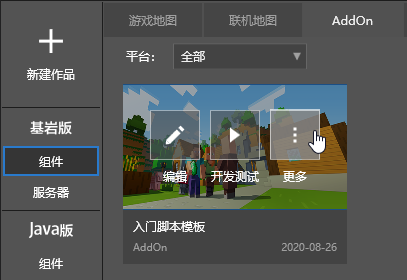

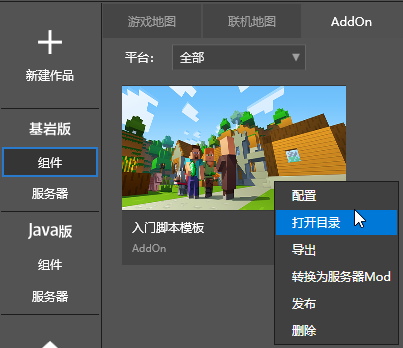

### 基岩版组件

基岩版组件分页中会列出当前账号下的所有的基岩版组件和网络游戏。其中“游戏地图”、“AddOn”、“其他作品”为本地作品，“云端列表”为开发者已经上传到《我的世界》中国版平台的作品。

Studio中也可以导入已经制作好的组件。点击右上角的“本地导入”按钮，在弹出的对话框中，可以选择导入基岩版或Java版的地图、AddOn、材质、光影、皮肤。

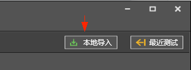

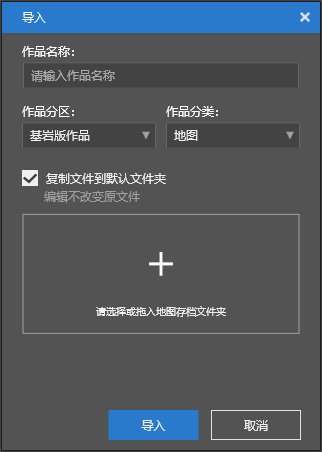

创建或者导入的作品，能够进行开发测试。开发测试会启动最新的Mod PC开发包对作品进行测试。

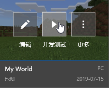

MC Studio支持单台电脑测试多人联机玩法。首先启动作品的开发测试（此时就有了第一个客户端并自动建好了局域网房间），然后从工具箱中启动其它的Mod PC开发包。

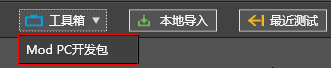

在新启动的Mod PC开发包中，点击主界面的“游戏”，点击“好友”中已经建立好的房间，这样就能够进入前面作品开发测试时自动建立好的房间，测试多人联机玩法。

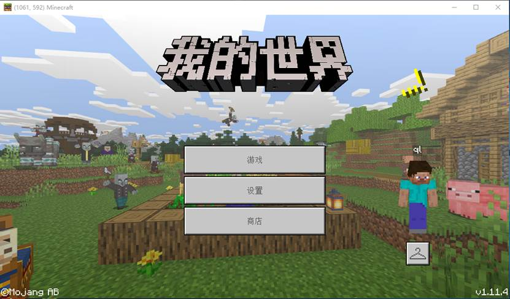

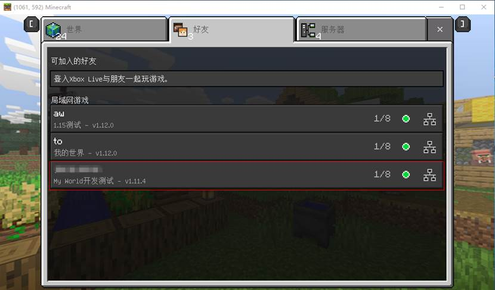

开发测试通过后，在作品页的“更多”菜单中，通过“发布”上传到开发者平台，详见下面的[发布作品](#发布作品)。  
在开发测试时，可按F11键在PC和PE操作模式间切换。

### 发布作品
组件类型的作品完成后，需发布到平台，玩家才能够从游戏里的资源中心搜索并下载到你的作品。  
在作品页的“更多”中，点击“发布”。  
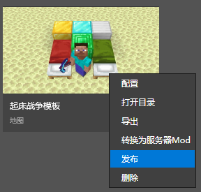
  
在弹出的发布选项中，如果是更新已经上传到平台的作品，则选择“更新已有作品”，如果是全新的作品，则选择“新建作品”。点击“确定”后，会跳转到“发布”分页，并自动填好相关的信息。  
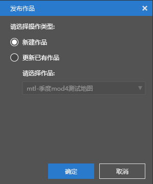
  
在“发布”分页中，补全作品的信息后，点击“保存”。  
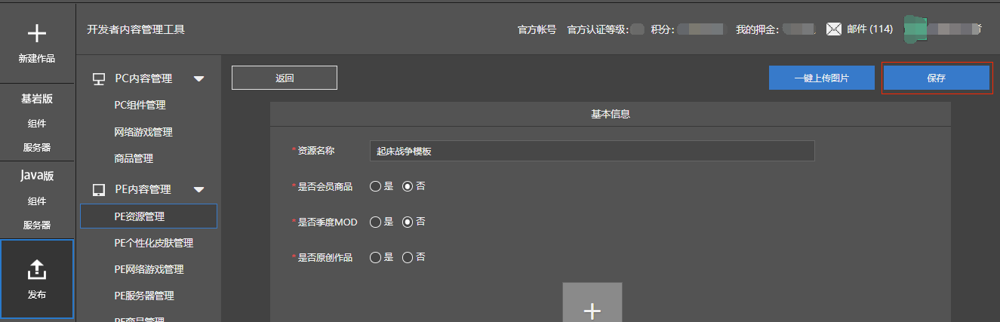
  
然后在“未审核”作品列表中，在相应作品上点击“提交审核”，即可将作品提交至平台审核。  
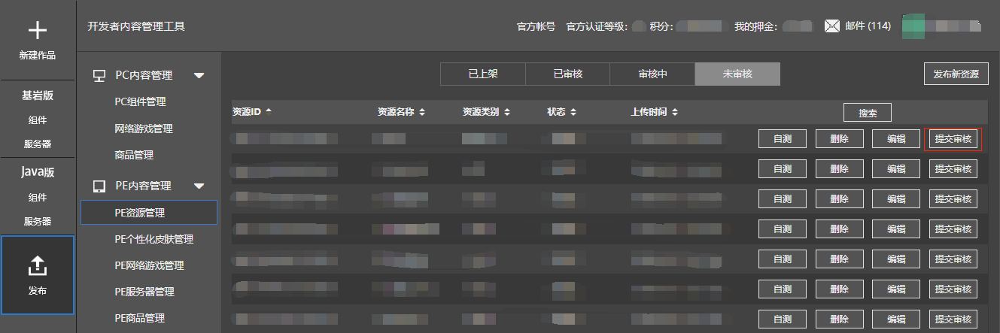

提交审核之后，平台会对作品进行打包处理。在“基岩版组件”分页的“云端列表”中能够看到已经上传的作品，可将打包后的作品下载到本地（左上角会有云标志）。对打包后的作品，能够进行“上线测试”，上线测试使用的是最新的正式游戏客户端。  
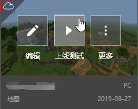

在上线测试时，可按F11键在PC和PE操作模式间切换。

上线测试没有问题后，如果是PE作品，还需在手机上测试实际效果，没问题就可以正式上架作品了。

###  其他

*基岩版服务器*

分页中会列出当前开发者账号下的所有网络游戏，可下载到本地进行测试。如果想开发网络游戏，需额外进行申请，通过审批后可获得开服工具和相关资料，进行网络游戏的开发。具体如何开发基岩版网络游戏请参考系列文档中的Apollo部分。

*Java组件和服务器*

Java作品分页的结构基本同基岩版作品分页。目前MC Studio不支持Java版作品的编辑，仅可导入Java作品进行测试。

*发布*

发布分页中，可以向《我的世界》中国版平台提交组件。通过审批后，所有玩家均可从《我的世界》中国版中下载到该组件。

*开发者社区*

开发者社区是开发者互相交流、开发者和《我的世界》中国版开发组交流的社区。开发者可以提交对Mod SDK、MC Studio、Apollo的反馈，开发组将定期在社区中回复。

##  组件开发方式

《我的世界》中国版的组件开发有多种方式，开发者可选择自己熟悉的的方式进行开发。选择MC Studio进行组件开发的优点在于：

- 基本上都在图形化交互界面下进行操作；

- 对编程能力无要求；

- 无需关注繁琐的细节（如组件的文件结构要求、uuid等），MC Studio已经做好处理。

如果组件中有较为复杂的逻辑，可以使用红石及命令方块、Mod SDK、逻辑编辑器三种方式来实现。

**红石及命令方块**是游戏本身提供的实现复杂逻辑的途径，这里不再赘述。

**Mod SDK**是《我的世界》中国版提供的一套控制游戏内各种元素的Python接口，利用这套接口，能够制作出各种创新好玩的组件。要使用Mod SDK，需有使用Python语言编程的能力，适用于有一定编程能力的开发者和开发团队。在官方网站中有着详细的Mod SDK的介绍。

而**逻辑编辑器**把Mod SDK包装成了一套图形化编程语言，灵活性不如Python编程，但使用门槛较低，适用于入门开发者。但如果有一定的编程基础，或者有学习编程的能力，我们还是建议使用编程的方式来实现作品的逻辑。