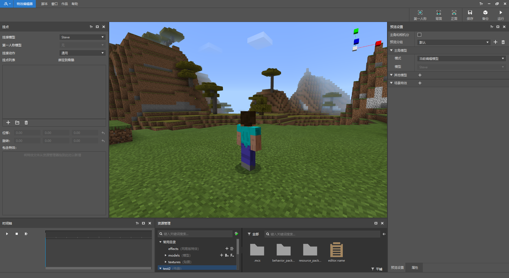

# 基本介绍

特效编辑器是一个编辑粒子效果、序列帧效果、并可将粒子挂接至骨骼模型或骨骼动画的编辑工具。当前版本的主要功能有粒子特效、序列帧特效查看和编辑、骨骼模型的导入和挂接，以及特效及模型的预览。通过在骨骼模型或动作上挂接的特效资源，可以实时预览特效在游戏中的效果。

> 为方便编辑，特效编辑器中使用的地图默认为超平坦模式。

主界面模块如下图所示：

包含以下重要模块：

1. 属性面板，用于显示或者修改所选项的属性，包含显示/修改粒子特效及序列帧特效的属性，显示模型相关文件属性。

2. 时间轴面板，用于控制特效和人物的播放，包含播放，停止，逐帧播放，并且可以在播放骨骼动画时拖动特效的时长。

3. 资源管理器面板，用于显示所拥有的资源，包含特效编辑的三个快捷目录和对应的快捷按钮。

4. 挂接面板，用于挂接特效到人物身上，能够控制不同特效播放的位置。

5. 预览设置面板，用于预览人物/模型及特效，能够支持多个不同的模型及特效在指定的位置进行播放。

这几个面板支持了特效编辑器的主体功能，各个部分的详细使用说明请参考入门教程。
