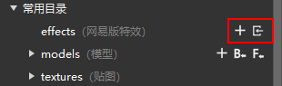
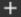
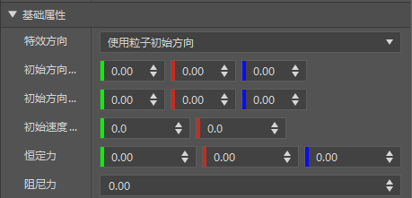
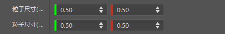
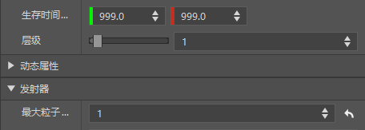
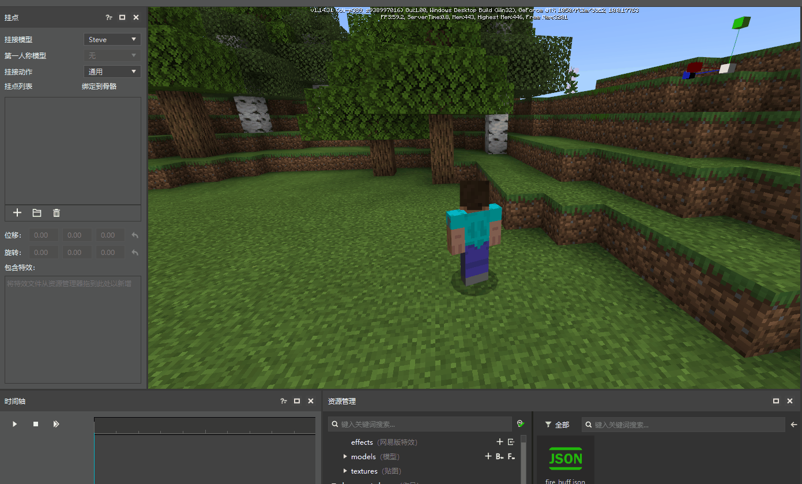
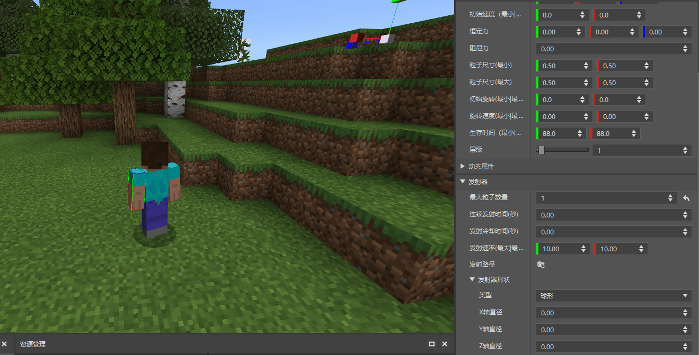
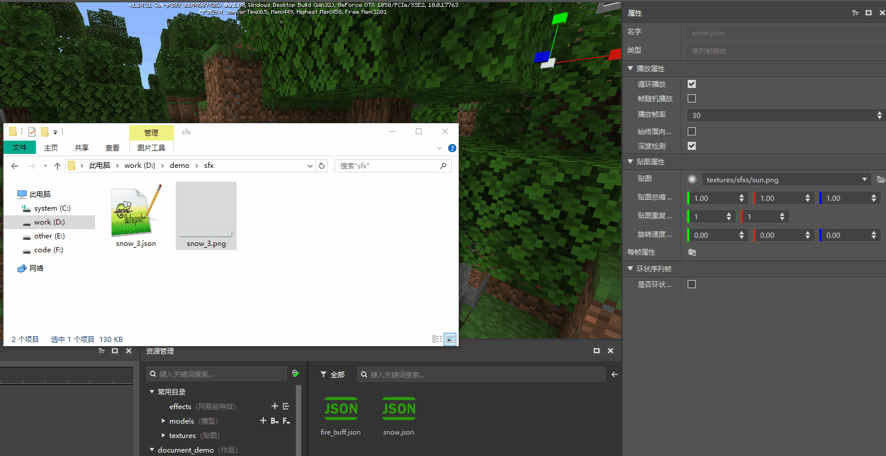
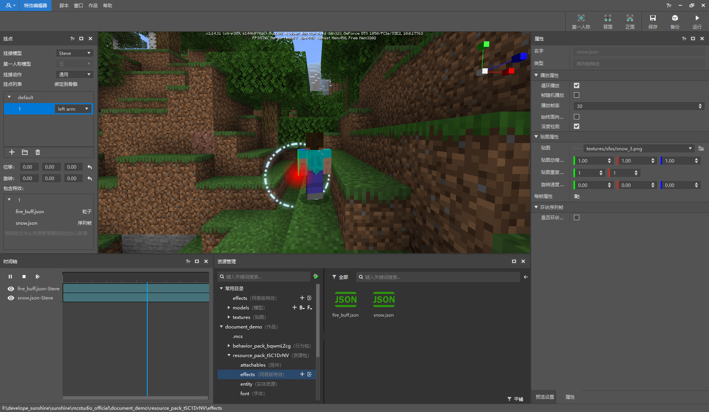

# 入门教程02-特效创建与使用

本篇教程主要介绍以下内容：

1. 粒子特效和序列帧特效的区别。
2. 如何创建/导入特效。
3. 制作第一个粒子特效和序列帧特效。

## 粒子特效和序列帧特效

1. 粒子特效是通过在场景中生成大量粒子图像来产生视觉效果，每个粒子都代表着效果中的单个元素，所有的粒子组合起来就产生了完整的粒子特效。

2. 序列帧特效是通过在场景中绘制一张单面片的贴图，在这个贴图上不断的绘制新的图片，然后这个过程形成完整的序列帧特效。

## 创建/导入特效

了解了基本概念，下面来了解如何创建或者导入特效到特效编辑器吧。

如上图所示，在 effects 文件夹的右侧，包含两个功能按钮，分别对应：新建特效  和导入特效 ，具体说明如下：

1. 新建特效，用于创建默认的粒子特效或者序列帧特效，点击后先选择特效类型，选择完毕后可以通过属性面板修改特效的属性来完成特效的制作。

2. 导入特效，用于将已有特效文件导入进来，注意导入的特效文件所对应的资源也需要存在，例如粒子特效里包含贴图文件的引用路径，如果在该路径下找不到对应的贴图文件，则会导致导入失败。

所有自定义特效都存放在 在 effects 文件夹下，通过在资源管理器点击特效文件，可在属性面板中查看并修改相应的属性，具体属性细节可以参考[特效属性说明](./99-属性详细说明.md)。

> 由于特效属性皆已支持可视化操作，不建议手动修改特效文件。

## 制作一个粒子特效

了解完基本的功能，可以开始尝试实际操作了。首先来制作一个红色buff粒子特效，步骤如下：

1. 点击新建特效 ，选择粒子，输入名称fire_buff，这样在资源管理器的 effects 文件夹下会创建一个名为 fire_buff.json 的文件，点击该文件即可查看粒子属性。

    > 特效在创建后会自动选中，这样属性栏会显示该特效的相关属性。

2. 在基础属性下，将初始方向（最大），初始方向（最小），初始速度都设置为 0，这样即可创建一个不会移动的粒子。

    

3. 将粒子尺寸（最大），粒子尺寸（最小）都设置为 0.5，这样创建了一个固定大小为 0.5 的粒子。

    

4. 在发射器下，将最大粒子数量修改为1，这样同时只会有一个粒子出现，但是由于生存时间默认为 1，即粒子存在 1 秒后就会被销毁，所以粒子会每秒闪烁一次，为了防止这种情况，将粒子的生存时间改为 999 ，这样粒子会经过很长时间才会被销毁。

    

5. 修改完粒子后，可以开始预览粒子，在挂点面板点击 + 号，新建一个挂接分组，然后将新建的 fire_buff.json 拖拽到包含特效中，然后点击时间轴上的播放按钮，即可看到创建的粒子特效在史蒂夫的头上播放出来，因为头上播放不是很明显，所以调整特效的绑定位置为 left_arm。

    > 挂接特效绑定会在第三节详细介绍，这里只用跟着动图操作即可，如果现在就感兴趣，可以去[模型挂接特效](./3-模型挂接特效.md)查看更加详细的说明和演示。

    

不过说好要制作一个红色buff 粒子，现在仍然是白色的，应该怎么修改颜色呢？

如下图所示，在属性面板展开动态属性，点击动态颜色按钮，进行修改。

> 当没有任何设定时，粒子默认颜色是白色；点击了粒子颜色后，可以看到默认的粒子颜色被修改为从白色到黄色的渐变。横坐标表示粒子生命周期百分比，由于我们把粒子生命周期改为了999，即粒子在产生时为白色，逐渐变黄，然后在999秒的时候变成黄色。

为了把粒子变红，所以只用把粒子的整个周期的颜色改成红色即可。改掉后关掉动态颜色属性设置，点击时间轴的播放，可以看到粒子已经变成了红色。

这样，就成功的制作完第一个粒子特效，如果有希望了解更多的粒子属性可以参考[特效属性说明](./99-属性详细说明.md)哦。接下来再来制作第一个序列帧特效吧。

## 制作一个序列帧特效

同样在 effects 目录右侧选择 + 号，不过这次需要选择序列帧了。输入 snow 即可在 effects 目录下看到两个文件，其中一个是新创建出来的 snow.json 序列帧特效，还有一个当然是之前创建的 fire_buff.json。

创建完后观察属性面板，可以发现序列帧特效的属性相对于粒子特效来说少了很多。这是因为自定义序列帧特效的主要是通过序列帧贴图和序列帧配置文件来控制，所以能控制得属性较少。

> 什么是序列帧贴图(.png)和序列帧配置文件(.json)呢？这里简要介绍下，序列帧贴图是将多个贴图以某种规律合在一起后输出成一张单个的图片，其中合在一起的规律就写在序列帧配置文件里。更加具体的分析可以查看[序列帧配置文件解析](./../../2-ModSDK模组开发/81-资源制作/2-特效/序列帧配置文件解析.md)。

所以对于一个序列帧特效来说，序列帧文件(序列帧贴图+序列帧配置文件)十分重要，这里我们使用给定的序列帧贴图文件，那么应该如何导入一个外部的序列帧文件呢？

方法也是十分的简单，直接从外部拖入即可。如下图所示，将 demo/sfx 文件夹下的 snow_3.png 文件拖动到序列帧属性栏的贴图上，即可看到贴图的文字变成 textures/sfxs/snow_3.png，拖动完成后，序列帧特效的贴图就已经改变并生效了。

> 拖动序列帧贴图时，特效编辑器会自动将序列帧贴图对应的序列帧配置文件也一并复制过去。被拖动的文件存放在 textures 目录下的 sfxs 文件夹下。

特效制作完毕后，再将特效文件拖动到特效面板上，点击时间轴上的播放按钮，即可看到序列帧特效。

> 前一节的的 demo 资源里包含一份序列帧文件，如果缺乏序列帧示例文件，请下载 [demo资源](https://x19.gdl.netease.com/demo.zip)

## 制作完效果

上述特效制作完并挂接后，即可看到效果如下图所示：

我们可以看到序列帧的位置很是奇怪，而且制作出来的buff粒子为什么只有左手才有呢，应该双手都有啊，这个就需要去学习如何正确的挂接特效，这将在下一个入门课程里详细介绍。
