# 入门教程03-模型挂接特效

本篇教程主要介绍以下内容：

1. 挂接面板参数说明。

2. 模型如何挂接特效。

## 挂接面板说明

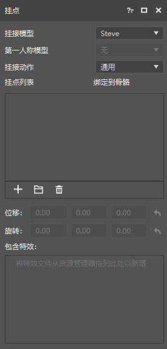
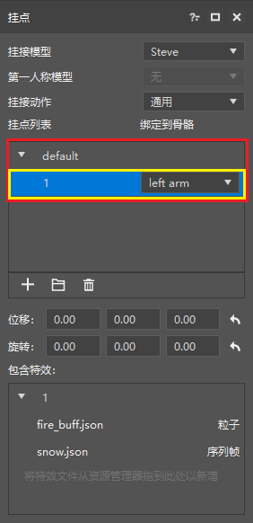

上图左侧是特效编辑器里的挂接面板，其各个参数说明如下：

1. 挂接模型，用于显示和修改当前挂接模型名称。

2. 第一人称模型，用于显示和修改当前挂接模型的第一人称模型。具体用法可参考[第一人称模型修改](./5-第一人称模型修改.md)

3. 挂接动作，用于显示和修改当前挂接模型的骨骼动画。特效编辑器为每个模型都默认添加了一个空动画“通用”，在“通用”下，模型不会播放任何动画。

    > Steve 不算骨骼模型，所有没有骨骼动画。

4. 挂点列表，挂点列表包含：挂接分组和挂接点。上图右侧的红线框住的是挂接分组，黄线框住的是挂接点。

    - 挂接点用于挂接特效文件，即模型挂接的特效信息是存放在挂接点的，每个模型拥有不同的挂接位置，挂接点可以调整自身挂接特效的位置。

    - 挂接分组，用于组织挂接点，通过创建多个不同的分组可以有效的管理挂接信息。

    - 挂接列表的下方包含三个快捷按钮，分别为：新建挂接点 ，新建挂接分组  和删除 

5. 位移，用来修正挂接点上全部特效的位置。当挂点列表选择挂接点时，位移才可用。

6. 旋转，用来修正挂接点上全部特效的旋转值。当挂点列表选择挂接点时，旋转才可用。

7. 包含特效，用来显示当前挂接分组/当前挂接点上的特效列表，若当前选择为挂接点时，可将特效文件从资源管理器/或者直接从外部拖入到包含特效列表中，这样挂接点即可新增特效。

    > 当预览设置里预览指定模型时，挂接面板的修改不影响实时游戏窗口及特效预览。

以上即为挂接面板的参数，下面来进行实际使用。

## 模型挂接特效

经过前面两个入门教程，在存档里拥有的资源为：一个骨骼模型 dataiangou 及相应的骨骼动画，两个特效文件：fire_buff.json 红色粒子特效和 snow.json 蓝色雪花圆圈特效。确定了这些资源后就可以正式开始特效挂接。

> 如果没有模型也不影响，用默认的 Steve 即可，只是无法播放其他动作。

1. 首先点击挂接模型，将 Steve 切换到 datiangou，即可看到人物变成了大天狗的模型，然后修改人物动作，改为 run，点击时间轴上的播放按钮，可以看到播放奔跑动作。

    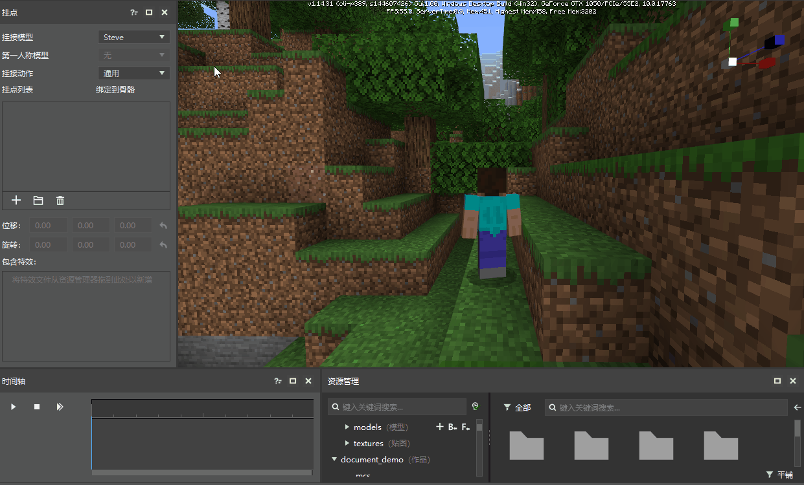

2. 创建挂接分组，点击新建挂接分组按钮 ，输入 buff，即可创建 buff 分组，然后点击新建挂接点按钮 ，输入 fire01 创建 fire01 挂接点，再次点击输入 fire02 创建 fire02 挂接点，创建完毕后如图所示：

    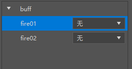

3. 修改 fire01 挂接点的挂接位置，这里选择为大天狗的左臂(l_arm)，选择完毕后，可以看到右侧游戏里模型的左臂出现包围盒，这代表该部位被选中。

    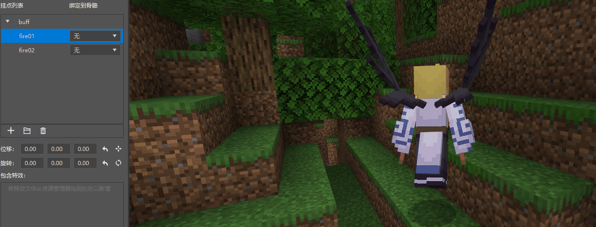

    > 注意模型的具体挂接位置是由模型本身确定的，包围盒仅仅只是显示挂接位置的范围

4. 点击资源管理器，将里面的 fire_buff.json 拖入到 包含特效中，点击时间轴的播放，即可看到模型的左肩部产生红色buff特效

    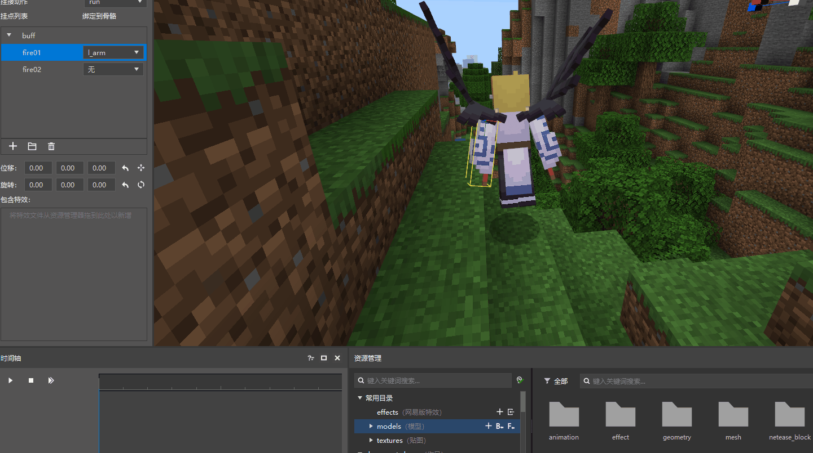

5. 点击挂接点 fire02，将 fire02 的挂接位置修改为大天狗的右臂(r_arm)，同样的将 fire_buff.json 拖入到包含特效中，即可看到效果如下：

    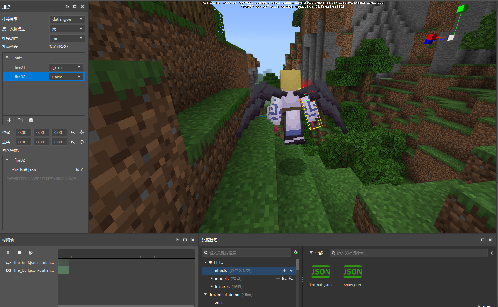

6. 修改了 fire02 后，为什么已经在左肩和右肩都挂了粒子特效，仍然只有右肩在播放呢？这里可以从两个方面去修改播放效果：

    1. 从挂点列表修改，当点击某个挂接点时，仅仅会显示该挂接点的包含特效，点击挂接分组可以查看该挂接分组下的所有挂接点特效，所以我们只用点击 buff 挂接分组即可全部显示。如图所示：

        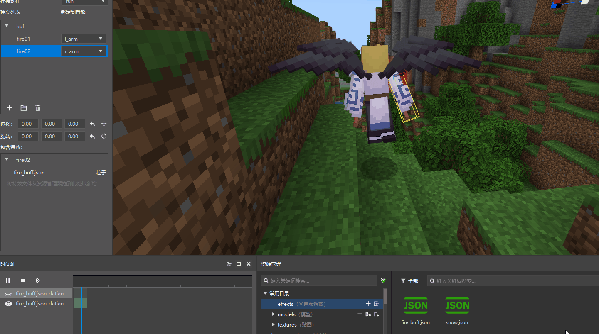

    2. 从时间轴修改(不推荐)。在时间轴上包含有特效的显示开关，分别为特效显示状态  和特效关闭状态 ，通过点击 fire_buff.json 前面的  即可打开该特效的显示，如图所示：

        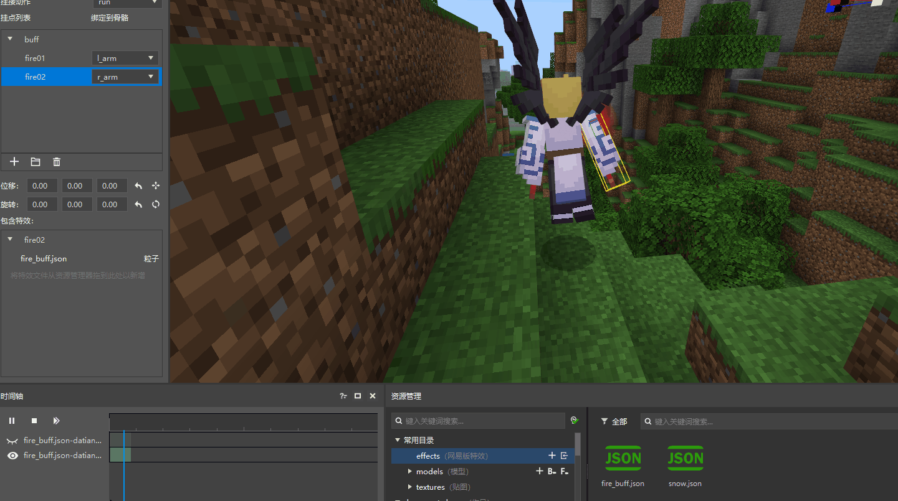

挂接粒子特效之后，接下来开始挂接序列帧特效。由于序列帧特效是一个光圈，期望是将其挂接到两个位置：一个是人物的背后，另一个是人物头顶，步骤如下：

1. 新建 snow01 挂接点，选择挂机位置为 spine，可以看到序列帧特效正好在人物的身上，如果觉得看不清，可以点击预览设置，选择主角和相机分离，这样可以360°查看人物。

    

2. 如果要将序列帧特效挂载人物的背后，需要调节特效的位置，这里需要使用挂接面板里的位移功能。注意位移仅能模型为骨骼模型而且选择为挂接点时才可用(如果是默认的 Steve 无法使用位移功能)。位移的调整方式有两种：

    - 第一种是使用可视化调节，点击可视化调节按钮 ，调整如图所示：

        

        > 点击按钮  后会出现 x, y, z 三个方向的轴，延轴方向拖动即可拖动特效的位置。

    - 第二种是直接在位移处输入相应的位移量即可，即将位移修改为 0, 0, -0.5 即可查看效果

        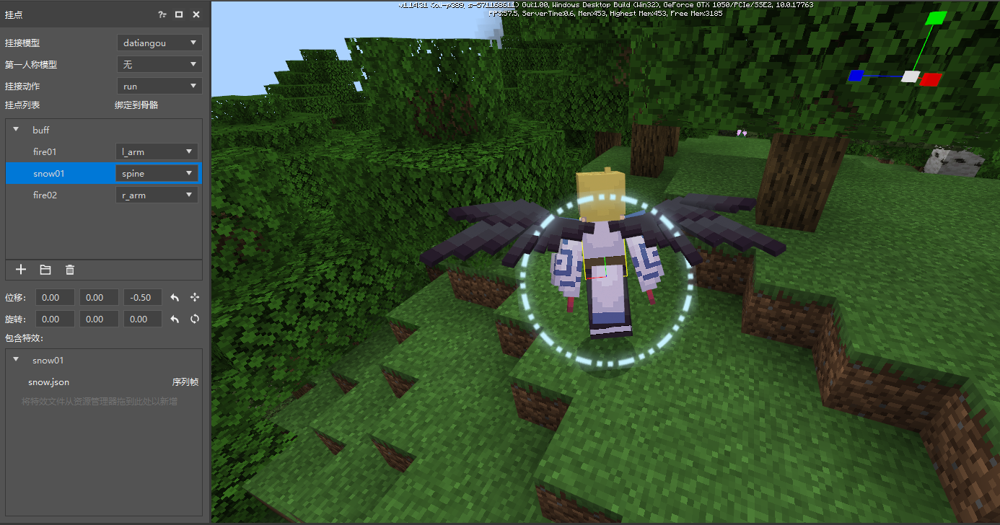

3. 背后的序列帧特效挂接完了，可以开始挂接头顶的序列帧特效了。新建 snow02 挂接点，选择相机位置为 head，这里不仅仅需要调节位移，还需要调整旋转让序列帧特效能够水平于人物的头顶，旋转的调节和位移一样，都是拥有两种方式，同样可以用可视化的方式来调节，如图所示：

    > 由于正在播放动画，旋转调节起来十分麻烦，但是如果停止播放的话就不知道特效在哪里了，这个时候就可以使用时间轴里的第三个按钮功能：逐帧播放。点击逐帧播放按钮 ，可以看到特效停止了，但是依然存在。

    

最后点击buff挂接分组，查看所有特效的效果如下：

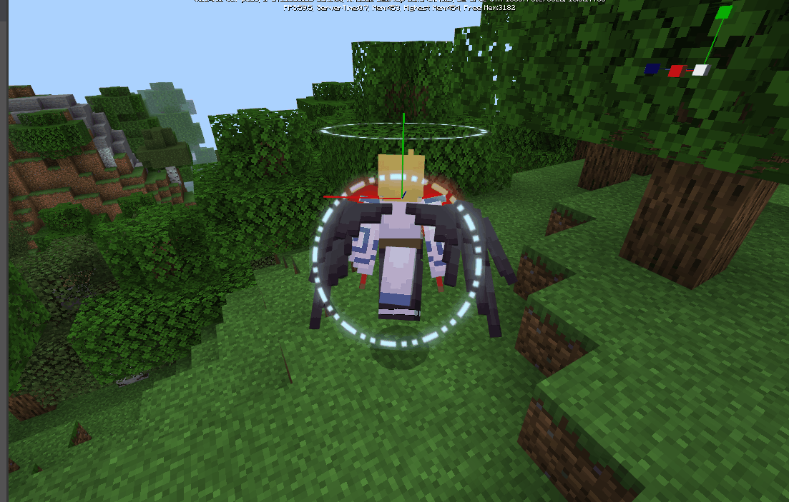

最后明显可以看到不是很完美，头顶的序列帧特效太大了，那么应该如何让它变小呢，这个就作为课后练习让查看教程的各位努力尝试把。
