# 特效属性详细说明

## 粒子特效基本属性说明

### 特效方向direction

#### direction

属性   | 说明
---- | ----------------------------------
描述   | 设置粒子方向
默认值  | `Inwards`
参数范围 | `Inwards`, `Outwards`, `Direction`

- Direction, 使用粒子初始方向方向（每个方向在 `directionMin` 和 `directionMax` 之间随机）

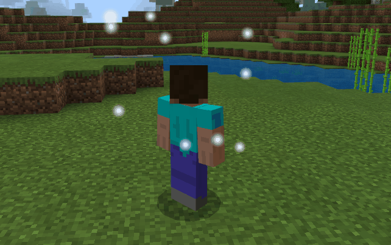

- Inwards, 使用发射器形状的向心方向

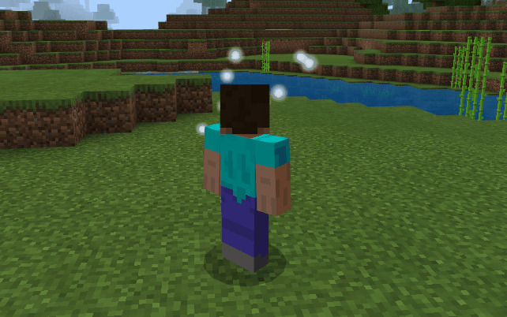

- Outwards, 使用发射器形状的离心方向

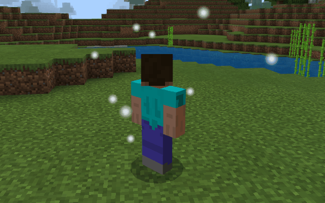

#### directionMin

属性   | 说明
---- | -------------------------------------
描述   | 设置粒子随机方向的最小值, 分别为 x, y, z 轴方向, 负值代表反向
默认值  | `-1.0 -1.0 -1.0`
参数范围 | -1.0 ~ 1.0
提示   | 该参数仅在方向为`Direction`时有效

#### directionMax

属性   | 说明
---- | ------------------------------------------------------------
描述   | 设置粒子随机方向的最大值, 分别为 x, y, z 轴方向, 负值代表反向
默认值  | `1.0 1.0 1.0`
参数范围 | -1.0 ~ 1.0
提示   | 该参数仅在方向为`Direction`时有效, directionMax各个方向需要大于directionMin的相应值

```json
{
  "direction": {
    "value": "Inwards",
    "min": "-1.0 -1.0 -1.0",
    "max": "1.0 1.0 1.0"
  }
}
```

### 初始速度velocity

属性   | 说明
---- | -----------------------
描述   | 粒子的初始速度, 矢量, 分别为最小值和最大值
默认值  | `1.0 1.0`
参数范围 | -100000.0 ~ 100000.0

```json
{
  "velocity": {
    "value": "1.0 1.0"
  }
}
```

### 恒定力constantforce

属性   | 说明
---- | -------------------------
描述   | 粒子在 x, y, z 轴上所受恒定力, 相当于粒子运动过程中的加速度
默认值  | `0.0 0.0 0.0`
参数范围 | -100000.0 ~ 100000.0

```json
{
  "constantforce": {
    "value": "0.0 0.0 0.0"
  }
}
```

### 阻尼力dampingforce

属性   | 说明
---- | --------------------
描述   | 方向与粒子速度方向相反的加速度
默认值  | `0.0`
参数范围 | -100000.0 ~ 100000.0
提示   | 当为负数时, 为加速度
说明   | v 为粒子当前速度  则计算为 `v = v - dampingforce * v`

```json
{
  "constantforce": {
    "value": "0.0 0.0 0.0"
  }
}
```

### 初始尺寸particlesize

属性   | 说明
---- | ------------------------
描述   | 面向摄像机的二维平面(x, y)上的粒子初始尺寸
默认值  | `0.1 0.1`
参数范围 | -100000.0 ~ 100000.0
提示   | max 各个方向需要大于 min 的相应值

```json
{
  "particlesize": {
    "min": "0.1 0.1",
    "max": "0.1 0.1"
  }
}
```

### 初始旋转rotation

属性   | 说明
---- | --------------------------
描述   | 面向摄像机的二维平面(x, y)上的粒子的初始旋转量，即绕z轴的旋转的角度
默认值  | `0.0`
参数范围 | -100000.0 ~ 100000.0
提示   | 正数为逆时针, 负数为顺时针
提示   | 粒子的初始旋转介于min与max之间

```json
{
  "rotation": {
    "min": "0.0",
    "max": "0.0"
  }
}
```

### 旋转速度rotationspeed

属性   | 说明
---- | ------------------------
描述   | 面向摄像机的二维平面(x, y)上的粒子旋转速度
默认值  | `0.0`
参数范围 | -100000.0 ~ 100000.0
提示   | 正数为逆时针, 负数为顺时针
提示   | 粒子的实际旋转速度介于min与max之间

```json
{
  "rotationSpeed": {
    "min": "0.0",
    "max": "0.0"
  }
}
```

### 生存时间timetolive

属性   | 说明
---- | --------------------
描述   | 粒子的生存时间
默认值  | `1.0`
参数范围 | 0.0 ~ 100000.0
提示   | 粒子的实际生存时间介于min与max之间，例如下列参数则设定粒子的存在时间为 1 - 2 秒

```json
{
  "timetolive": {
    "min": "1.0",
    "max": "2.0"
  }
}
```

### 层级layer

属性   | 说明
---- | --------------------------
描述   | 支持粒子前后层级效果，当数值越大，渲染越晚，显示越靠前
默认值  | 1
参数范围 | 0 ~ 15

```json
{
  "layer": 1
}
```

## 粒子特效动态属性说明

### 动态尺寸sizedelta

属性   | 说明
---- | --------------------
描述   | 用来控制粒子尺寸在不同时间的大小变化
默认值  | []
提示   | 包含相对时间和绝对时间两种形式

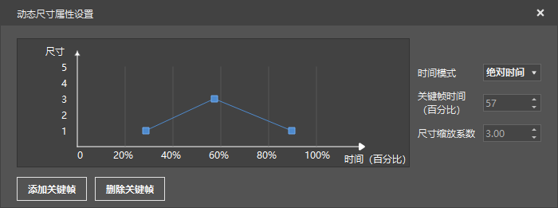

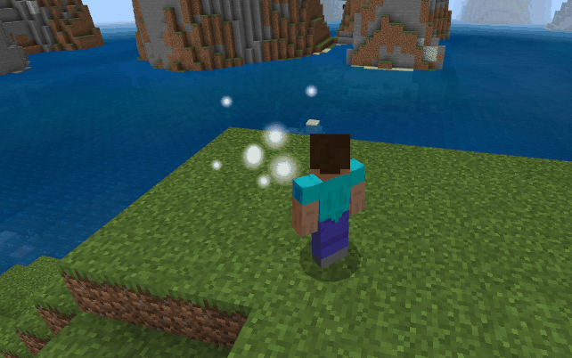


```json
"sizedelta": [
	{
		"scale": "1.000 1.000",
		"time": "27%"
	},
	{
		"scale": "3.000 3.000",
		"time": "57%"
	}
	{
		"scale": "1.000 1.000",
		"time": "89%"
	}
]
```

### 动态颜色colorfade

属性   | 说明
---- | --------------------
描述   | 用来控制粒子尺寸在不同时期的颜色变化
默认值  | []
提示 | 颜色值在不同的点之间是按照线性变化，支持透明度设置

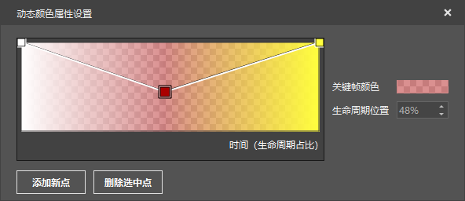

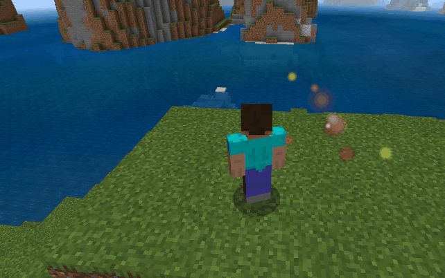


```json
"colorfade": [
	{
		"color": "1.00 1.00 1.00 1.00",
		"time": "0.0"
	},
	{
		"color": "0.67 0.00 0.00 0.44",
		"time": "0.48"
	},
	{
		"color": "1.00 1.00 0.24 1.00",
		"time": "1.0"
	}
]
```


### 粒子扰动disorder

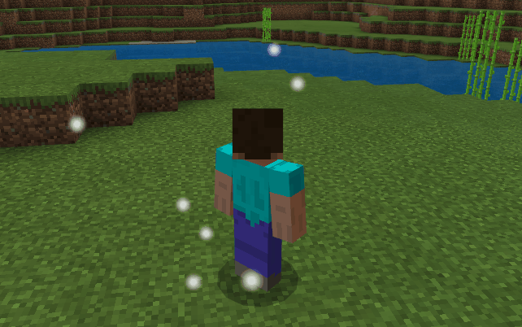

属性        | 说明
--------- | ----------------------
描述        | 支持粒子能够在 x, y, z 轴上随机扰动
min       | 粒子在 x, y, z 轴上的最小扰动值
max       | 粒子在 x, y, z 轴上的最大扰动值
interval  | 粒子扰动时间间隔(秒)
increment | 每次扰动后递增量，多用于实现散开效果
提示        | 粒子的实际扰动介于min与max之间

```json
{
  "disorder": {
    "min": "0.0 0.0 0.0",
    "max": "0.0 0.0 0.0",
    "interval": "0.0",
    "increment": "0.0"
  }
}
```

## 粒子发射器属性说明

### 最大粒子数量numparticles

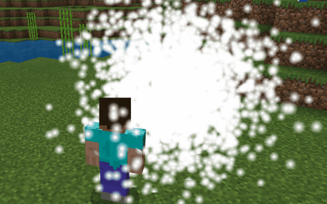

属性   | 说明
---- | -----------
描述   | 粒子同时存在的最大数量
默认值  | 10
参数范围 | 0 ~ 100000
提示   | 同屏显示的粒子数量还会受到发射速率的限制

```json
{
  "numparticles": {
    "value": "10"
  }
}
```

### 连续发射时间activetime

属性   | 说明
---- | ----------------------------
描述   | 粒子发射器连续发射粒子的时间
默认值  | 0.0
参数范围 | 0.0 ~ 100000.0
提示   | 需要配合发射冷却时间 inactivetime 联合使用
说明  | 可将其可以视为发射器生命周期，方便调试有时间限制的效果。如果设置为 0，粒子发射器会一直发射, 不会停歇

```json
{
  "activetime": {
    "value": "0.0"
  }
}
```

### 发射冷却时间inactivetime

属性   | 说明
---- | ----------------------------
描述   | 粒子发射器在连续发射粒子完毕后的进入下一次发射的间隔时间
默认值  | 0.0
参数范围 | 0.0 ~ 100000.0
提示   | 需要配合连续发射时间 activetime 联合使用
说明  | 可将其视为发射器冷却时间

```json
{
  "inactivetime": {
    "value": "0.0"
  }
}
```

### 发射速率emissionrate

属性   | 说明
---- | -------------------------------
描述   | 粒子发射器每秒发射粒子数
默认值  | 10.0
参数范围 | 0.0 ~ 100000.0
提示   | 该速率仅会在连续发射时间有效期内生效，当处于发射间隔时，将停止发射
提示   | 粒子的实际发射速率介于min与max之间

```json
{
  "emissionrate": {
    "min": "10.0",
    "max": "10.0"
  }
}
```

### 发射路径emitterpath

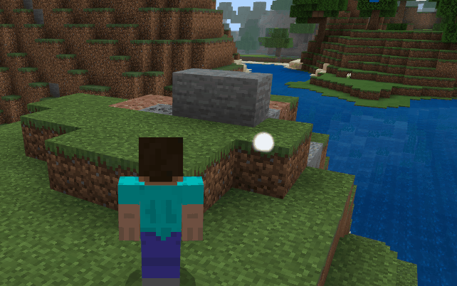

属性   | 说明
---- | -----------------------------
描述   | 粒子发射器发射的路径，多用于配置爆炸等效果
默认值  | []
参数范围 | 偏移 offset 无限制，时间 time 需要在粒子生存周期的最大值里

```json
{
  "emitterpath": [
  {"offset": "1.0 0.0 1.0", "time": "0.0"},
  {"offset": "-1.0 0.0 -1.0", "time": "0.1"},
  {"offset": "0.0 1.0 0.0", "time": "0.2"},
  ]
}
```

### 发射器形状emittertype

属性   | 说明
---- | -----------------------------------------
描述   | 粒子发射器的形状
默认值  | `Spere`
参数范围 | `Sphere`, `Hemisphere`, `Cylinder`, `Box`

- Sphere, 球形
- Hemisphere, 半球形
- Cylinder, 柱面(圆柱形)
- Box, 方形

```json
{
  "emittertype": {
    "value": "Spere"
  }
}
```

### 发射器尺寸emittersize

属性   | 说明
---- | --------------
描述   | 粒子发射器包围盒的尺寸，分别对应 x, y, z 轴
默认值  | 0.0 0.0 0.0
参数范围 | 0.0 ~ 100000.0

```json
{
  "emittersize": {
    "value": "0.0 0.0 0.0"
  }
}
```

### 发射器尺寸缩放系数emitterscale

属性   | 说明
---- | ---------------------------
描述   | 粒子发射器在不同时间的缩放系数，用于扩展发射器的大小
默认值  | []
参数范围 | value 无限制，time 需要在粒子最大生存时间内
说明 | 该参数对已发射的粒子无影响

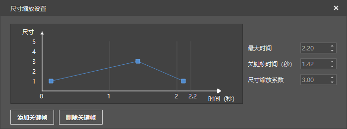

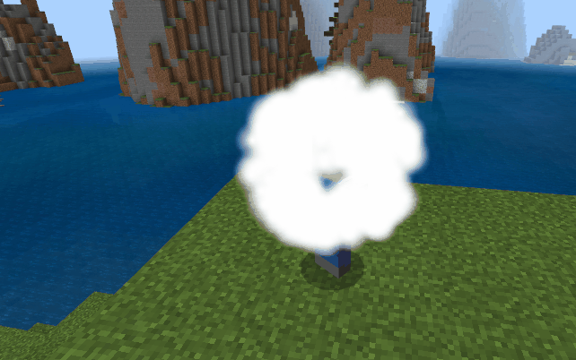

```json
{
  "emitterscale": [
    {"time": "0.26", "value": "0.9"},
    {"time": "1.41", "value": "3.0"},
    {"time": "2.11", "value": "0.9"}
  ]
}
```

### 发射器表层厚度比例thickness

属性   | 说明
---- | ----------------------------------------
描述   | 发射器表层厚度比例, 当为 0 时,发射器仅包含表面形状, 当为 1 时, 发射器为实心
默认值  | 0.0
参数范围 | 0.0 ~ 1.0

```json
{
  "thickness": {
    "value": "0.0"
  }
}
```

## 粒子特效资源属性说明

### 材质material

属性  | 说明
--- | ------------------------------
描述  | 粒子材质
默认值 | "materials/particles.material"

```json
{
  "material": {
    "name": "materials/particles.material"
  }
}
```

### 贴图texture

属性   | 说明
---- | -----------------------
描述   | 粒子贴图，仅支持显示整张贴图
默认值  | "textures/particle/sun"
参数范围 | 无

```json
{
  "texture": {
    "name": "textures/particle/sun"
  }
}
```

### 序列帧ani

属性   | 说明
---- | -------------
描述   | 粒子特效里使用的序列帧贴图
默认值  | ""
参数范围 | 无

```json
"texture": {
  "ani": {
    "fps": "1",
    "name": "textures/particle/my123_2"
  },
  "name": "textures/particle/my123_2"
}
```

### 序列帧帧率fps

属性   | 说明
---- | ----------------
描述   | 粒子特效里携带的序列帧的播放速度，每秒播放帧数
默认值  | 1

```json
"texture": {
  "ani": {
    "fps": "1",
    "name": "textures/particle/my123_2"
  },
  "name": "textures/particle/my123_2"
}
```

### 序列帧随机播放shuffle

属性   | 说明
---- | ----------------
描述   | 粒子特效里携带的序列帧是否随机播放各个帧，如果选择打开则播放序列帧是乱序的，关闭则是按顺序播放
默认值  | false

```json
"texture": {
  "ani": {
    "fps": "1",
    "name": "textures/particle/my123_2",
    "shuffle": true
  },
  "name": "textures/particle/my123_2"
}
```

## 粒子特效渲染属性说明

### 序列帧循环enableloop

属性   | 说明
---- | ---------------
描述   | 当粒子的生命周期大于所携带的序列帧的时间时，用于控制序列帧是否循环播放
默认值  | `true`
参数范围 | `false`, `true`

```json
{
  "enableloop": {
    "enable": "true"
  }
}
```

### 相对挂点运动relative

属性   | 说明
---- | --------------------
描述   | 用于控制粒子特效的运行轨迹是否相对于挂点
默认值  | `true`
参数范围 | `true`, `false`

```json
{
  "relative": {
    "value": "true"
  }
}
```

### 混合模式blend

属性   | 说明
---- | --------------
描述   | 用于控制不同粒子特效混合效果
默认值  | `blend`
参数范围 | `blend`, `add`, `Opaque`

- blend, 透明度混合, 能保证两个颜色显示正常
- add, 颜色值累加
- Opaque, 不透明

```json
{
  "blend": {
    "name": "blend"
  }
}
```

### 粒子朝向模式faceCameraMode

属性   | 说明
---- | ---------------------------------------------------
描述   | 用于控制粒子的朝向
默认值  | `Rotate XYZ`
参数范围 | `Rotate XYZ`, `Rotate Y`, `Horizontal`, `Direction`

- Rotate XYZ, 粒子朝向相机
- Rotate Y, 粒子朝向地面
- Horizontal, 粒子朝向水平方向
- Direction, 粒子朝向为速度方向

```json
{
  "faceCameraMode": {
    "value": "Rotate XYZ"
  }
}
```

## 序列帧特效播放属性说明

### 循环播放loop

属性   | 说明
---- | ---------------
描述   | 用于控制序列帧特效是否循环播放
默认值  | `true`
参数范围 | `true`, `false`

```json
{
  "loop": true
}
```

### 帧随机播放shuffle

属性   | 说明
---- | ---------------
描述   | 用于控制序列帧特效是否随机播放，即序列帧的播放顺序不是按照固定顺序
默认值  | `false`
参数范围 | `true`, `false`
提示  | 序列帧数量越多效果越明显

```json
{
  "shuffle": false
}
```

### 播放帧率fps

属性   | 说明
---- | ----------------
描述   | 用于控制序列帧特效每秒的播放数量
默认值  | 1
参数范围 | [1 - 100]
提示 | 受限于屏幕/游戏刷新率，建议序列帧的播放帧率不要超过30

```json
{
  "fps": 1
}
```

### 始终面向摄像机face_camera

属性   | 说明
---- | ------------------
描述   | 用于控制序列帧特效是否始终正向于屏幕
默认值  | `false`
参数范围 | `true`, `false`

```json
{
  "face_camera": false
}
```

### 深度检测depth_test

属性   | 说明
---- | -----------------
描述   | 用于控制序列帧特效是否开启深度检测
默认值  | `false`
参数范围 | `true`, `false`
说明 | 如果关闭深度检测，序列帧一直会遮盖所在的屏幕平面渲染的东西，如果开启，则会依据深度进行相关渲染

- 关闭深度检测


- 打开深度检测


```json
{
  "depth_test": false
}
```

## 序列帧特效贴图属性说明

### 贴图texture

属性   | 说明
---- | -----------------------------------------------
描述   | 序列帧的贴图路径
默认值  | ``
参数范围 | 无
提示   | 贴图仅支持 .png 格式，在使用时需要忽略后缀名
提示   | 序列帧 .png 贴图在同一目录下需要同名的 .json 配置文件，否则仅作为一个单帧图片显示，具体参考[序列帧配置](./../../2-ModSDK模组开发/81-资源制作/2-特效/序列帧配置文件解析.md)


```json
{
  "texture": "textures/sfxs/my123"
}
```

### 贴图总缩放系数scale

属性  | 说明
--- | --------------------------------
描述  | 序列帧贴图的总缩放参数，分别表示 x, y, z 方向的缩放系数
默认值 | 1.0 1.0 1.0
提示  | 总缩放系数与序列帧的每帧系数叠加

```json
{
  "scale": [1.0, 1.0, 1.0]
}
```

### 贴图重复次数tex_repeat_num

属性   | 说明
---- | ----------
描述   | 序列帧分别在 x, y 上的重复参数
默认值  | [1, 1]

```json
{
  "tex_repeat_num": [1, 1]
}
```

- 使用 [1, 1] 效果

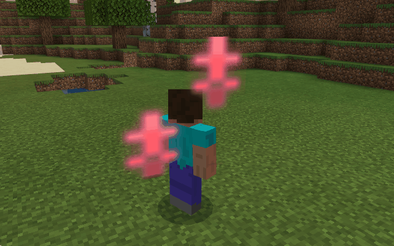

- 使用 [5, 2] 效果

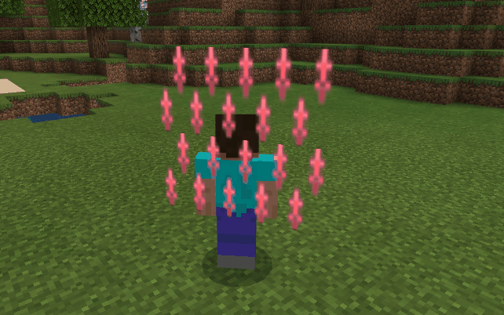

### 旋转速度rot_speed

属性  | 说明
--- | -----------------------
描述  | 序列帧贴图的沿 x, y, z 方向的旋转速度
默认值 | [0.0, 0.0, 0.0]

```json
{
  "rot_speed": [-1.0, 0.0, 1.0]
}
```

## 序列帧特效每帧属性说明

属性 | 说明
-- | ----------------------------------
描述 | 序列帧贴图的每帧缩放系数说明
提示 | 该值位在序列帧贴图配置文件的对应帧数里，序列帧属性里暂不支持独立修改
提示 | 如果修改该值，所有使用该序列帧贴图的特效都会受到影响


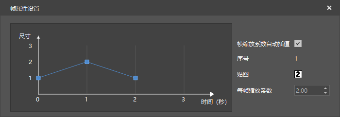

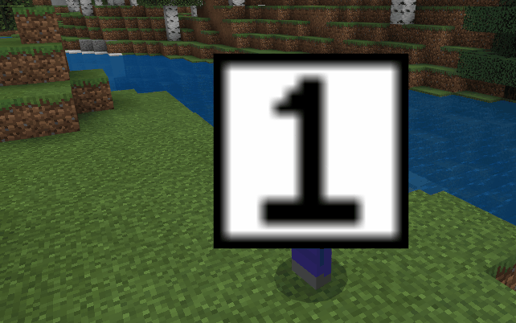


## 序列帧特效环状序列帧属性说明

### 是否环状序列帧cylinder_enable

属性   | 说明
---- | --------------------
描述   | 用于控制序列帧特效是否开启环状序列帧属性
默认值  | `false`
参数范围 | `true`, `false`

- 关闭环状序列帧

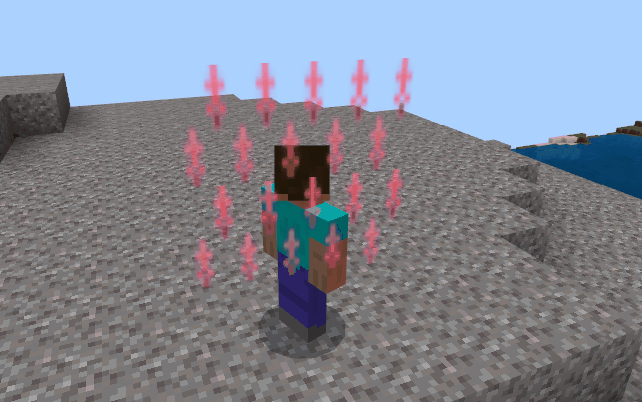

- 打开环状序列帧

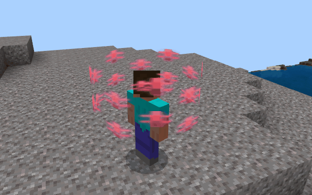

```json
{
  "cylinder_enable": false
}
```

### 顶部半径cylinder_radius_up

属性   | 说明
---- | ------------------------
描述   | 当开启环状序列帧属性后，用于控制序列帧的顶部半径
默认值  | 0.0
参数范围 | 0.0 - 100000.0

```json
{
  "cylinder_radius_up": 1.0
}
```

### 底部半径cylinder_radius_down

属性   | 说明
---- | ------------------------
描述   | 当开启环状序列帧属性后，用于控制序列帧的底部半径
默认值  | 0.0
参数范围 | 0.0 - 100000.0

```json
{
  "cylinder_radius_down": 1.0
}
```

### 近似多边形数cylinder_frac_num

属性   | 说明
---- | --------------------------
描述   | 当开启环状序列帧属性后，用于控制序列帧近似多边形数量
默认值  | 8
参数范围 | 1 - 100000
提示   | 参数越大则效果越好，当低于 3 时，该参数基本无效果

```json
{
  "cylinder_frac_num": 10
}
```

### 高度cylinder_height

属性   | 说明
---- | ----------------------
描述   | 当开启环状序列帧属性后，用于控制序列帧的高度
默认值  | 0.0
参数范围 | 0.0 - 100000.0

```json
{
  "cylinder_height": 1.0
}
```