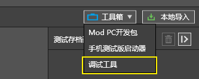
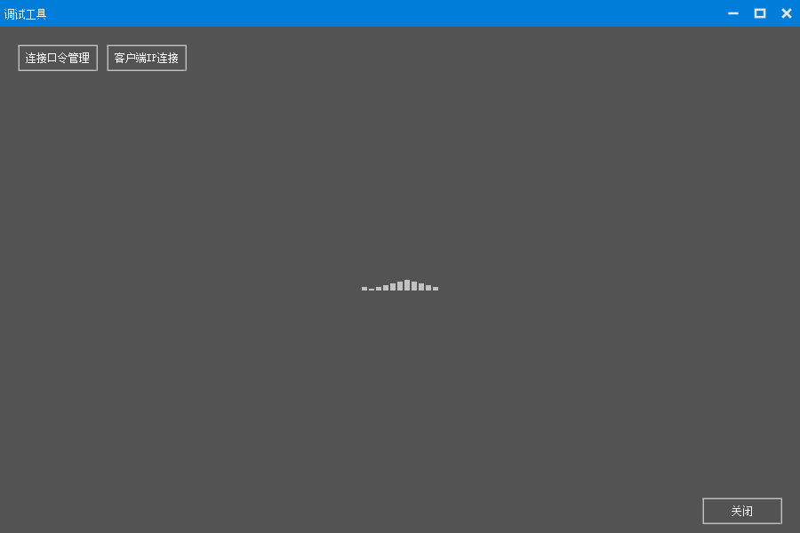
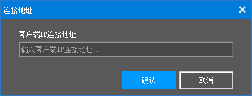
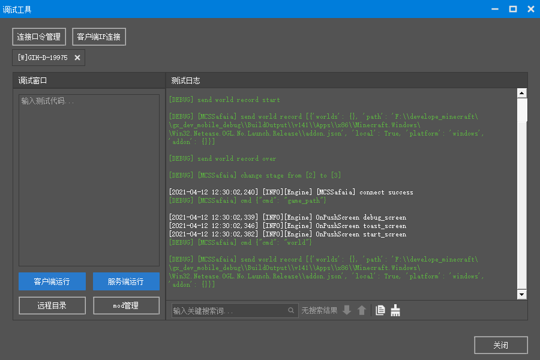
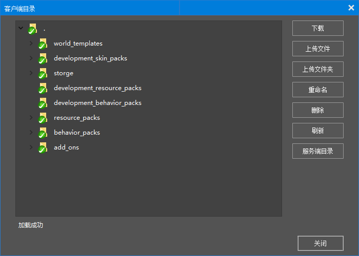
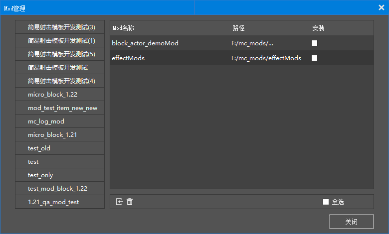

# 调试工具说明

调试工具，用来查看 PC 和 移动端（暂只包括安卓）的日志，管理游戏加载的 mod 和调整应用内文件数据。

如上图，在 MCStudio 的工具箱里点击 `调试工具`，会打开调试工具，调试工具主界面如下图所示：

打开后，调试工具会进入等待状态，用于等待客户端连接。

客户端的连接遵守如下规则：

1. 当客户端从未连接过任何调试工具时，需要调试工具主动连接，连接方法参考 `客户端IP连接`。

2. 当客户端成功连接过调试工具时，会自动向上次连接的调试工具请求连接。

3. 当客户端已经连接到调试工具，其他调试工具使用 `客户端IP连接` 无效。

由于我们是第一次打开调试工具，所以需要手动进行客户端的连接。不过在此之前，我们需要运行一个客户端（注意，这里的客户端仅支持 modPC开发包和安卓移动端测试包），这里我们以 PC 举例，点击 modPC 开发包（或者任一组件选择测试）。

当 modPC 运行后，在调试工具上点击 `客户端IP连接` ，进行客户端连接。

## 客户端IP连接

点击 `客户端IP连接`，会出现如下界面：

在输入框中需要输入modPC 开发包的 IP 地址，IP 地址的获取用如下方式：

- 对于 Windows 平台，可以点击网络和Internet 选项，选择当前的以太网，在属性里就可以看到 IPv4 地址，
  或者按住 win+R 输入 `cmd`，打开命令行，输入 `ipconfig`，可查看当前的 IPv4 地址

- 对于 Android 平台，点击 wifi 按钮，进入查看当前 wifi 的详情页，即可看到当前 wifi 的 IP 地址

> IP地址的格式为 `192.0.0.1`

输入 IP 地址后，点击确认即可连接相应的客户端。

## 主界面

当客户端连接后，会出现相应的日志界面，如下所示：

主界面的右侧为日志显示窗口，用于显示游戏日志，一共包含 5 个按钮，分别为：

1. 搜索，用于在当前日志中搜索输入的关键字，暂只支持全字符匹配。
2. 向下，当出现搜索结果时，用于高亮下一个匹配项。
3. 向上，当出现搜索结果时，用于高亮上一个匹配项。
4. 复制全文，将当前的日志复制到剪贴板。
5. 清空当前日志，将当前日志全部清空。

> 对于日志来说，包含 4 个颜色级别，分别为 debug，info，warning，error，在打印日志里使用 `[DEBUG]`，`[INFO]`，`[WARNING]`，`[ERROR]` 关键字可以显示不同的颜色，对于开发者来说，通过使用这些关键字可以方便的区分开发者日志和原有日志。

主界面的左侧为调试窗口，用于输入游戏脚本层 python 测试代码，例如 import 部分模块用于执行功能，或者打印某些全局变量等，**注意：命令输入功能仅进入游戏后才可用。**

调试窗口包含 4 个按钮，分别为：

1. 客户端运行，用于在客户端线程运行相应的测试代码。
2. 服务端运行，用于在服务端线程运行相应的测试代码。
3. 远程目录，用于管理客户端目录的部分资源。
4. mod管理，用于管理客户端游戏所选择的Mod。

## 远程目录

远程目录主要用于修改mod相关的资源文件，对于 PC 可以直接使用 Studio 进行相关的资源修改即可。对于移动端，如果需要修改某个资源文件，例如修改某个贴图，可以在 resource_packs 找到相应的文件进行修改即可，**注：远程目录暂时不支持修改 mod 脚本，也不支持添加新的资源文件，仅能修改原有资源文件**。

远程目录主要功能按钮如下：

- 下载，直接下载对应的文件或者文件夹到调试工具的目录下，可以点击 `服务端目录` 进行查看。注：**当目录下包含有同名文件会默认覆盖**。

- 上传文件，点击上传文件按钮用于选择上传具体某个文件到相应的地址，操作完成后会有相应的提示说明。

- 上传文件夹，点击上传文件夹按钮用于选择上传具体某个文件夹到相应的地址，操作完成后会有相应的提示说明。注：上传文件夹为空时，将自动剔除。

- 重命名，重命名对应的文件及文件夹，操作完成后会有相应的提示说明。

- 删除，删除对应的文件及文件夹，操作完成后会有相应的提示说明。

- 刷新，用于刷新客户端目录，一般在文件操作后进行刷新操作。

- 服务端目录，用于打开文件下载后所在的文件夹（默认为 `C:\MCStudioDownload\safaia`），暂不支持修改目录位置。

## mod 管理面板

Mod 管理面板主要用于管理游戏启动的 Mod。当然，游戏的 Mod 管理有许多种方式，不仅仅局限于调试工具。对于 PC 来说，可以使用 Studio 进行 Mod 管理，对于 PE 来说，可以使用客户端的组件管理功能。

**注：对于调试工具来说，当游戏和调试工具不在同一机器上时，Mod 的管理无法新增 Mod，只能配置已存在的 Mod。**

Mod 的配置也十分简单，通过点击相应的 world，然后在右侧选择相应的 mod，勾选安装即可，退出 Mod 管理时会默认保存并修改配置。在 PC 上，mod 配置完毕后需要重启游戏才能生效，手机端如果不在游戏里则会直接生效。

> 如果发现 mod 配置不生效，请检查 mod 文件夹是否配置正确。

在主界面，还有一个连接口令管理按钮，用于管理调试工具和客户端的连接。

## 连接口令管理

首次连接到客户端后，客户端的口令会自动添加到调试工具的口令管理中，点击 `连接口令管理` 可以查看到相应的口令，界面如下：

在口令管理界面，一共包含四项：

1. `连接口令`，不可修改。每个设备独有，在同一台设备上多开的客户端的连接口令都相同。
2. `设备名称`，不可修改。口令所在设备的名称。
3. `平台`，不可修改。口令所在设备的平台。
4. `备注`，可修改。通过双击，即可修改该口令所连客户端在主界面的显示名称（修改完需要下次重新接入生效）。

界面的下方包含两个按钮：

1. 添加按钮，用于添加客户端口令（一般不需要使用，可以复制其他调试工具已有的口令进行添加）。
2. 删除按钮，用于删除客户端口令（按住 Ctrl 后可以多选删除）。

对于连接口令，在一般情况下只用修改备注。

但是在特殊情况下，例如之前已经连接过某客户端，后续不希望该客户端连接到调试工具，可以在连接口令中删除相应的客户端口令：右键点击相应的口令进行删除，或者点击删除按钮进行删除。删除后，上次连接的客户端就不会自动连接到该调试工具了（如果调试工具希望再次连接客户端可以点击 `客户端IP连接` 进行手动连接）。

如果希望调试工具有更多更好的功能，快点来[开发者论坛](https://mc.netease.com/forum-111-1.html)提出你的反馈吧。
