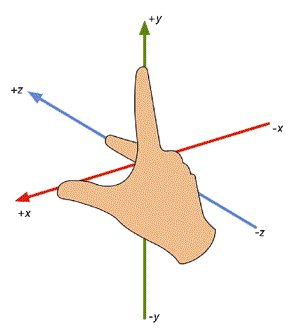

# Vector3

## 描述

用于表示 3D 向量和点。

可以使用该结构保存与计算 3D 位置和方向。 此外，它还包含用于执行常见向量操作的函数。

MC中使用的是右手坐标系，如下图所示。后文中的上下前后左右均是以steve面向z轴正方向得出来的。MC中东西方向为X坐标轴，其中X轴正方向为东，X轴负方向为西；南北方向为Z坐标轴，其中Z轴正方向为南，Z轴负方向为北。即左西右东前南后北。



## 构造函数

### Vector3(x, y, z)

- 描述

  用于构造一个向量或者3维点坐标。

- 参数

  | 参数名 | 数据类型 | 说明        |
  | ------ | :------- | :---------- |
  | x      | float    | 向量的x分量 |
  | y      | float    | 向量的y分量 |
  | z      | float    | 向量的z分量 |

- 返回值

  | 数据类型 | 说明                 |
  | :------- | :------------------- |
  | Vector3  | 返回Vector3(x, y, z) |

- 示例

```python
from common.utils.mcmath import Vector3
newOne = Vector3(1, 2, 3)
```


### Vector3(vecTuple)

- 描述

  用于构造一个向量或者3维点坐标。

- 参数

  | 参数名   | 数据类型                   | 说明               |
  | -------- | :------------------------- | :----------------- |
  | vecTuple | tuple(float, float, float) | 长度为3的tuple数组 |

- 返回值

  | 数据类型 | 说明                                               |
  | :------- | :------------------------------------------------- |
  | Vector3  | 返回Vector3(vecTuple[0], vecTuple[1], vecTuple[2]) |

- 示例

```python
from common.utils.mcmath import Vector3
import client.extraClientApi as clientApi
comp = clientApi.CreateComponent(entityId, "Minecraft", "pos")
entityFootPos = comp.GetFootPos() # 通过位置组件获取实体位置
posVec = Vector3(entityFootPos) # 直接将该位置tuple转换成Vector3以便后续计算
```


## 静态方法

可以直接通过Vector3.MethodName()调用的静态方法，无需创建实例。

### One

- 描述

  用于编写 Vector3(1, 1, 1) 的简便方法。

- 返回值

  | 数据类型 | 说明                 |
  | :------- | :------------------- |
  | Vector3  | 返回Vector3(1, 1, 1) |

- 示例

```python
from common.utils.mcmath import Vector3
newOne = Vector3.One()
```


### Up

- 描述

  用于编写 Vector3(0, 1, 0) 的简便方法。

- 返回值

  | 数据类型 | 说明                 |
  | :------- | :------------------- |
  | Vector3  | 返回Vector3(0, 1, 0) |

- 示例

```python
from common.utils.mcmath import Vector3
newOne = Vector3.Up()
```


### Down

- 描述

  用于编写 Vector3(0, -1, 0) 的简便方法。

- 返回值

  | 数据类型 | 说明                  |
  | :------- | :-------------------- |
  | Vector3  | 返回Vector3(0, -1, 0) |

- 示例

```python
from common.utils.mcmath import Vector3
newOne = Vector3.Down()
```


### Left

- 描述

  用于编写 Vector3(-1, 0, 0) 的简便方法，对应MC中的西面。

- 返回值

  | 数据类型 | 说明                  |
  | :------- | :-------------------- |
  | Vector3  | 返回Vector3(-1, 0, 0) |

- 示例

```python
from common.utils.mcmath import Vector3
newOne = Vector3.Left()
```


### Right

- 描述

  用于编写 Vector3(1, 0, 0) 的简便方法，对应MC中的东面。

- 返回值

  | 数据类型 | 说明                 |
  | :------- | :------------------- |
  | Vector3  | 返回Vector3(1, 0, 0) |

- 示例

```python
from common.utils.mcmath import Vector3
newOne = Vector3.Right()
```


### Forward

- 描述

  用于编写 Vector3(0, 0, 1) 的简便方法，对应MC中的南面。

- 返回值

  | 数据类型 | 说明                 |
  | :------- | :------------------- |
  | Vector3  | 返回Vector3(0, 0, 1) |

- 示例

```python
from common.utils.mcmath import Vector3
newOne = Vector3.Forward()
```


### Backward

- 描述

  用于编写 Vector3(0, 0, -1) 的简便方法，对应MC中的北面。

- 返回值

  | 数据类型 | 说明                  |
  | :------- | :-------------------- |
  | Vector3  | 返回Vector3(0, 0, -1) |

- 示例

```python
from common.utils.mcmath import Vector3
newOne = Vector3.Backward()
```


### Dot

- 描述

  两个向量的点积。

  点积是一个浮点值，它等于 将两个向量的大小相乘，然后乘以向量之间角度的余弦值。

  对于 normalized 向量，如果它们指向完全相同的方向，Dot 返回 1； 如果它们指向完全相反的方向，返回 -1；如果向量彼此垂直，则 Dot 返回 0。

- 参数

  | 参数名 | 数据类型 | 说明  |
  | ------ | :------- | :---- |
  | a      | Vector3  | 向量a |
  | b      | Vector3  | 向量b |

- 返回值

  | 数据类型 | 说明           |
  | :------- | :------------- |
  | float    | 两个向量的点积 |

- 示例

```python
from common.utils.mcmath import Vector3
a = Vector3(1, 2, 3)
b = Vector3(0, 3, 1)
c = Vector3.Dot(a, b) # 1 * 0 + 2 * 3 + 3 * 1 = 9
```


### Cross

- 描述

  两个向量的叉积。

  两个向量的叉积生成第三个向量， 该向量垂直于两个输入向量。结果的大小等于： 将两个输入的大小相乘，然后乘以输入之间角度的正弦值。 可以使用“右手定则”确定结果向量的方向。用右手的四指先表示向量a的方向，然后手指朝着手心的方向摆动到向量b的方向，大拇指所指的方向就是向量c的方向。

- 参数

  | 参数名 | 数据类型 | 说明  |
  | ------ | :------- | :---- |
  | a      | Vector3  | 向量a |
  | b      | Vector3  | 向量b |

- 返回值

  | 数据类型 | 说明           |
  | :------- | :------------- |
  | float    | 两个向量的点积 |

- 示例

```python
from common.utils.mcmath import Vector3
a = Vector3(1, 2, 3)
b = Vector3(0, 3, 1)
c = Vector3.Cross(a, b)
```


## 成员方法

### Length

- 描述

  返回该向量的长度。

  向量长度为 `(x*x+y*y+z*z)` 的平方根。

  如果只需要比较一些向量的大小， 则可以使用LengthSquared()函数比较它们的平方数（计算平方数更快）。

- 返回值

  | 数据类型 | 说明             |
  | :------- | :--------------- |
  | float    | 该向量长度的平方 |

- 示例

```python
from common.utils.mcmath import Vector3
a = Vector3(3, 4, 0)
print a.Length() # 打印 5.0
```


### LengthSquared

- 描述

  返回该向量的长度的平方。

- 返回值

  | 数据类型 | 说明                 |
  | :------- | :------------------- |
  | float    | 该向量标准化后的向量 |

- 示例

```python
from common.utils.mcmath import Vector3
a = Vector3(3, 4, 0)
print a.LengthSquared() # 打印 25.0
```


### ToTuple

- 描述

  返回该向量的tuple形式(x, y, z)，便于玩家转换后作为其他事件的参数进行传递。

- 返回值

  | 数据类型 | 说明                           |
  | :------- | :----------------------------- |
  | tuple    | 返回该向量的tuple形式(x, y, z) |

- 示例

```python
from common.utils.mcmath import Vector3
a = Vector3(3, 4, 0)
print a.ToTuple() # 打印 (3, 4, 0)
```


### Normalized

- 描述

  返回长度为 1 时的该向量。

  进行标准化时，向量方向保持不变，但其长度为 1.0。

  请注意，当前向量保持不变，返回一个新的归一化向量。如果 要归一化当前向量，请使用Normalize函数。

  如果向量太小而无法标准化，则返回零向量。

- 返回值

  | 数据类型 | 说明                 |
  | :------- | :------------------- |
  | Vector3  | 该向量标准化后的向量 |

- 示例

```python
from common.utils.mcmath import Vector3
a = Vector3(3, 4, 0)
print a.Normalized() # 打印结果(0.6, 0.8, 0)
print a # 打印结果(3, 4, 0)，a并没有发生变化
```


### Normalize

- 描述

  使该向量标准化，向量方向保持不变，但其长度变为 1.0。

  请注意，该函数无返回值，仅改变当前向量，如果要返回当前向量的标准化值且不改变该向量，请使用Normalized函数。

  如果向量太小而无法标准化，则设置为零向量。

- 示例

```python
from common.utils.mcmath import Vector3
a = Vector3(3, 4, 0)
a.Normalize()
print a # 打印结果(0.6, 0.8, 0)，a被标准化
```


### Set

- 描述

  设置该向量的值

- 参数

  | 参数名 | 数据类型 | 说明        |
  | ------ | :------- | :---------- |
  | x      | float    | 向量的x分量 |
  | y      | float    | 向量的y分量 |
  | z      | float    | 向量的z分量 |

- 示例

```python
from common.utils.mcmath import Vector3
a = Vector3(3, 4, 0)
a.Set(1, 2, 3)
print a # 打印结果(1, 2, 3)
```


## 成员变量

- 描述

  可以直接通过`.`运算符访问向量的x、y、z分量。也可以通过`[]`直接获取，0、1、2分别对应x、y、z。但不能直接通过该方法对各个分量进行设置，只能通过Set方法来进行设置。

- 示例

  ```python
  from common.utils.mcmath import Vector3
  a = Vector3(3, 4, 5)
  print a.x # 3
  print a.y # 4
  print a.z # 5
  print a[0] # 3
  print a[1] # 4
  print a[2] # 5
  ```


## 运算符

### operate +

- 描述

  向量加法，两向量相加等于各分量之和。向量与常数相加等于各分量分别加上该常数。

- 示例

```python
from common.utils.mcmath import Vector3
a = Vector3(3, 4, 0)
b = Vector3.One()
print a + 5 # 打印结果(8, 9, 5)
print a + b # 打印结果(4, 5, 1)
```


### operate -

- 描述

  向量减法，两向量相加等于各分量之差。向量与常数相减等于各分量分别与该常数求差。

  向量求反，返回相反方向的向量

- 示例

```python
from common.utils.mcmath import Vector3
a = Vector3(3, 4, 0)
b = Vector3.One()
print a - 2 # 打印结果(1, 2, -2)
print 2 - a # 打印结果(-1, -2, 2)
print a - b # 打印结果(2, 3, -1)
print -a # 打印结果(-3, -4, 0)
```


### operate \*

- 描述

  向量乘法，两向量相乘等于各分量相乘相加，即向量点积，等价于Vector3.Dot(a, b)。向量与常数相乘等于各分量分别乘以该常数。

- 示例

```python
from common.utils.mcmath import Vector3
a = Vector3(3, 4, 0)
b = Vector3.Up()
print a * 2 # 打印结果(6, 8, 0)
print a * b # 打印结果4
```


### operate /

- 描述

  向量除法，仅支持向量与常数相除，等于各分量分别除以该常数。

- 示例

```python
from common.utils.mcmath import Vector3
a = Vector3(3, 4, 0)
b = Vector3.One()
print a / 2 # 打印结果(1.5, 2, 0)
```


### operate ==

- 描述

  判断两个向量是否相等，当各分量均相等时返回True


### operate !=

- 描述

  判断两个向量是否不等，当各分量均相等时返回False