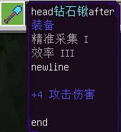

# <span id="名词解释"></span>名词解释

<span id='世界'></span>

## 世界

表示游戏的单位，单个游戏存档、单个网络服务器等都是一个世界。

<span id='区块'></span>

## 区块

区块是世界里一个大小为16×256×16的部分，是游戏地图加载卸载的基本单位。

当玩家第一次出现在世界时会在其周围生成区块，随着玩家对世界的探索，相邻的区块也会被生成。

区块的X坐标：Floor(X坐标 / 16)，区块的Z坐标：Floor(Z坐标 / 16)，Floor意为向下取整。

一个区块(X, Z)中坐标最小点的坐标为(X * 16, 0, Z * 16)，坐标最大点的坐标为(X * 16 + 15, 255, Z * 16 + 15)。

<span id='实体'></span>

## 实体

具有可区别性的物体，不一定是物理存在的实体。

包括服务端运算的，会保存到存档的生物实体、物品实体、方块实体、抛射物实体等

以及纯客户端表现，退出游戏后就销毁的特效实体（粒子实体、序列帧实体）、文字面板实体等。

<span id='生物'></span>
## 生物

指游戏世界中有生命的，可移动的一类实体。其中玩家也属于生物的一种。

<span id='玩家'></span>
## 玩家

玩家所控制的实体对象，同时也属于生物的一种。包括本地玩家和其他玩家，在游戏中，由玩家自己控制的称为本地玩家，否则为其他玩家。

<span id='物品'></span>
## 物品

物品栏中具有使用属性的物品、地面上的掉落物等都称为物品。其中掉落物也是实体的一种。

<span id='物品信息字典'></span>

## 物品信息字典

* **该部分内容已过时，请查阅<a href="/dev/mcmanual/mc-dev/mcguide/2-模组开发/基础知识/名词解释.html#物品信息字典">新版开发者文档</a>**

也叫itemDict。是python事件与接口中获取物品信息以及生成物品时使用的dict类型的变量。

该字典的内容如下

| 关键字      | 数据类型                      | 说明                                                         |
| ----------- | ----------------------------- | ------------------------------------------------------------ |
| itemName    | str                           | 必须设置，物品的identifier，即"命名空间:物品名"              |
| count       | int                           | 必须设置，物品数量。设置为0时为空物品                        |
| auxValue    | int                           | 必须设置，物品附加值                                         |
| showInHand  | bool                          | 可选，是否显示在手上，默认为True                             |
| enchantData | list(tuple(EnchantType, int)) | 可选，附魔数据，tuple中[EnchantType](../../99-参考资料/0-Minecraft枚举值文档.html#enchanttype)为附魔类型，int为附魔等级 |
| customTips  | str                           | 可选，物品的自定义tips                                       |
| extraId     | str                           | 可选，物品自定义标识符。可以用于保存数据， 区分物品          |
| userData    | dict                          | 可选，物品userData，用于灾厄旗帜、旗帜等物品，请勿随意设置该值 |
| durability  | int                           | 可选，物品耐久度，不存在耐久概念的物品默认值为零             |


customTips 设置支持自定义格式：包含四种自带格式：

| 格式字符串      | 说明     |
| --------------- | -------- |
| %name%          | 物品名   |
| %category%      | 物品类型 |
| %enchanting%    | 附魔属性 |
| %attack_damage% | 攻击伤害 |

自带格式可以与自定义文本自由组合，顺序可以打乱，物品的自定义格式的文本不存在时不予显示。

自带格式的字符串采用原版的显示格式，物品名前面不带换行符，物品类型、附魔属性前面自带一个换行符，攻击伤害前面自带两个换行符。

举个例子：`head%name%after%category%%enchanting%\nnewline%attack_damage%\n\nend`，效果如下：



<span id='方块'></span>

## 方块

游戏中场景的基本组成单位，长宽高均为1单位长度的立方体网格，不同的方块具有不同的材质。

<span id='方块信息字典'></span>

## 方块信息字典

也叫blockDict。是python事件与接口中获取方块信息以及生成方块时使用的dict类型的变量。

该字典的内容如下

| 关键字 | 数据类型 | 说明                                                         |
| ------ | -------- | ------------------------------------------------------------ |
| name   | str      | 必须设置，方块identifier，包含命名空间及名称，如minecraft:air |
| aux    | int      | 方块附加值，可缺省，默认为0                                  |

* 原版方块的identifier可以查看[官方wiki](https://minecraft-zh.gamepedia.com/基岩版数据值)

<span id='方块状态'></span>

## 方块状态

一种方块可能存在多种方块状态，例如不同颜色的羊毛。一个auxvalue实际上也是对应一种方块状态，只是相比于用int来表示的auxvalue，方块状态更为可读。

例如，橙色羊毛的identifier为minecraft:wool，auxvalue为1，而用方块状态则表示为：

```json
{
    "name": "minecraft:wool",
    "states": {
        "color": "orange"
    }
}
```

可以在游戏内使用GetBlockStates将方块状态打印出来。

也可以在[Block_states页面](https://minecraft.gamepedia.com/Block_states)中查阅，一些没有的可以在方块的页面找到，例如[羊毛](https://minecraft.gamepedia.com/Wool#Block_states)与[泥土](https://minecraft.gamepedia.com/Dirt#Block_states)。注意要使用基岩版及Bedrock Edition里的内容。（不排除wiki上有遗漏或错误）

<span id='抛射物'></span>

## 抛射物

受外力被抛射空中飞行的实体，受重力与摩擦力影响，例如游戏中射出的箭。

<span id='生物群系'></span>
## 生物群系

游戏中生成的世界被划分为一个个不同的自然环境，例如森林、丛林、沙漠和针叶林等，这些都是不同的生物群系。

<span id='模型'></span>
## 骨骼模型

与基岩版原版的基于cube搭建的模型不同，是使用3dmax等建模软件搭建的模型。游戏中的大部分生物都可以被替换为骨骼模型，进而实现不同的表现效果。

<span id='序列帧'></span>
## 序列帧

通过一帧帧的图片不断进行切换形成的动画效果，在游戏中为一个平面面片。

<span id='粒子'></span>
## 粒子

通过不断发射多个不同大小规模的平面面片形成的特效效果，通过替换贴图材质等可以模拟丰富的表现。

<span id='文字面板'></span>

## 文字面板

本质上为序列帧的文字面板，功能上与文本类似，在游戏中包括伤害飘字，实体头顶名称等内容。

<span id='UI'></span>

## UI

UI界面，游戏和用户之间进行交互和信息交换的界面。玩家可以通过触发UI来控制对应的游戏逻辑。

