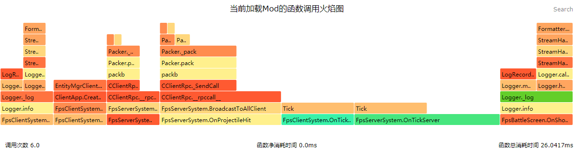

# <span id="服务端ExtraAPI接口"></span>服务端ExtraAPI接口

这里是一些服务端的基础API接口，完成基础的系统和组件的初始化，同时也能从这个module中获取到一些通用的枚举类和levelId等信息。

<span id="实体"></span>
## 实体

<span id="AddEntityTickEventWhiteList"></span>
### AddEntityTickEventWhiteList

- 描述

    添加实体类型到EntityTickServerEvent事件的触发白名单。

- 参数

    | 参数名 | 数据类型 | 说明 |
    | :--- | :--- | :--- |
    | identifier | str | 实体的类型名，原版的实体需要加上minecraft命名空间 |

- 返回值

    | 数据类型 | 说明 |
    | :--- | :--- |
    | bool | 是否成功 |

- 示例

```python
import mod.server.extraServerApi as serverApi
# 让牛触发EntityTickServerEvent事件
serverApi.AddEntityTickEventWhiteList('minecraft:cow')
```

<span id="通用"></span>
## 通用

<span id="GenerateColor"></span>
### GenerateColor

- 描述

    生成颜色字符，用于部分组件的参数设置。

- 参数

    | 参数名 | 数据类型 | 说明 |
    | :--- | :--- | :--- |
    | color | str | 颜色字符，支持的颜色有'BLACK','DARK_BLUE','DARK_GREEN','DARK_AQUA','DARK_RED','DARK_PURPLE','GOLD','GRAY','DARK_GRAY','BLUE','GREEN','AQUA','RED','LIGHT_PURPLE','YELLOW','WHITE' |

- 返回值

    | 数据类型 | 说明 |
    | :--- | :--- |
    | str | 用于引擎接口的颜色字符 |

- 示例

```python
import mod.server.extraServerApi as serverApi
ServerSystem = serverApi.GetServerSystemCls()
class FpsServerSystem(ServerSystem):
        def GameMsgTest(args):
                gameComp = serverApi.GetEngineCompFactory().CreateGame(serverApi.GetLevelId())
                #游戏通知栏消息
                gameComp.msg = "消息通知"
                #游戏通知栏消息颜色
                gameComp.msgColor = serverApi.GenerateColor("BLUE")
```

<span id="GetDirFromRot"></span>
### GetDirFromRot

- 描述

    通过旋转角度获取朝向

- 参数

    | 参数名 | 数据类型 | 说明 |
    | :--- | :--- | :--- |
    | rot | tuple(float,float) | 俯仰角度及绕竖直方向的角度，单位是角度 |

- 返回值

    | 数据类型 | 说明 |
    | :--- | :--- |
    | tuple(float,float,float) | 玩家朝向的单位向量 |

- 示例

```python
import mod.server.extraServerApi as serverApi
direction = serverApi.GetDirFromRot((0, 0))
```

<span id="GetEngineActor"></span>
### GetEngineActor

- 描述

    获取所有实体。

- 参数

    无

- 返回值

    | 数据类型 | 说明 |
    | :--- | :--- |
    | dict | 当前地图中的所有实体信息，key：实体id，value：实体dict |

- 备注
    - 实体信息字典 entityDict
        | 关键字     | 数据类型              | 说明     |
        | ----------| --------------------- | ---------|
        | dimensionId       | int | 维度id |
        | entityType  | int | 实体类型id，可参考[EntityType](../../../99-参考资料/0-Minecraft枚举值文档.html#entitytype) |
        

- 示例

```python
import mod.server.extraServerApi as serverApi
entityDicts = serverApi.GetEngineActor()
```

<span id="GetEngineNamespace"></span>
### GetEngineNamespace

- 描述

    获取引擎事件的命名空间。监听引擎事件时，namespace传该接口返回的namespace

- 参数

    无

- 返回值

    | 数据类型 | 说明 |
    | :--- | :--- |
    | str | 引擎的命名空间 |

- 示例

```python
import mod.server.extraServerApi as serverApi
ServerSystem = serverApi.GetServerSystemCls()
class FpsServerSystem(ServerSystem):
        def __init__(self, namespace, systemName):
                ServerSystem.__init__(self, namespace, systemName)
                self.ListenForEvent(serverApi.GetEngineNamespace(), serverApi.GetEngineSystemName(), ‘AddServerPlayerEvent’, self, self.OnPlayerAdd)
```

<span id="GetEngineSystemName"></span>
### GetEngineSystemName

- 描述

    获取引擎系统名。监听引擎事件时，systemName传该接口返回的systemName

- 参数

    无

- 返回值

    | 数据类型 | 说明 |
    | :--- | :--- |
    | str | 引擎的systemName |

- 示例

```python
import mod.server.extraServerApi as serverApi
ServerSystem = serverApi.GetServerSystemCls()
class FpsServerSystem(ServerSystem):
        def __init__(self, namespace, systemName):
                ServerSystem.__init__(self, namespace, systemName)
                self.ListenForEvent(serverApi.GetEngineNamespace(), serverApi.GetEngineSystemName(), ‘AddServerPlayerEvent’, self, self.OnPlayerAdd)
```

<span id="GetEntityLimit"></span>
### GetEntityLimit

- 描述

    获取当前level最大实体数量（上限值，非现有值）

- 参数

    无

- 返回值

    | 数据类型 | 说明 |
    | :--- | :--- |
    | int | 当前level最大实体数量 |

- 示例

```python
import mod.server.extraServerApi as serverApi
print serverApi.GetEntityLimit()
```

<span id="GetLevelId"></span>
### GetLevelId

- 描述

    获取levelId。某些组件需要levelId创建，可以用此接口获取levelId。其中level即为当前地图的游戏。

- 参数

    无

- 返回值

    | 数据类型 | 说明 |
    | :--- | :--- |
    | str | 当前地图的levelId |

- 示例

```python
import mod.server.extraServerApi as serverApi
ServerSystem = serverApi.GetServerSystemCls()
class FpsServerSystem(ServerSystem):
        def ExtraDataTest(args):
                extraDataComp = serverApi.GetEngineCompFactory().CreateExtraData(serverApi.GetLevelId())
                extraDataComp.score = 100
```

<span id="GetMinecraftEnum"></span>
### GetMinecraftEnum

- 描述

    用于获取[Minecraft枚举值文档](../../../99-参考资料/0-Minecraft枚举值文档.html)中的枚举值

- 参数

    无

- 返回值

    | 数据类型 | 说明 |
    | :--- | :--- |
    | minecraftEnum | 枚举集合类 |

- 示例

```python
import mod.server.extraServerApi as serverApi
comp = serverApi.GetEngineCompFactory().CreatePlayer(playerId)
# 使用枚举值作为其他接口的参数
comp.SetPlayerGameType(serverApi.GetMinecraftEnum().GameType.Survival)
```

<span id="GetPlayerList"></span>
### GetPlayerList

- 描述

    获取level中所有玩家的id列表

- 参数

    无

- 返回值

    | 数据类型 | 说明 |
    | :--- | :--- |
    | list(str) | 返回玩家id列表 |

- 示例

```python
import mod.server.extraServerApi as serverApi
print serverApi.GetPlayerList()
```

<span id="IsInApollo"></span>
### IsInApollo

- 描述

    返回当前游戏Mod是否运行在Apollo网络服，True是说明当前Mod运行于Apollo网络服环境，False时说明当前Mod运行于租赁服、联机大厅或者单机环境

- 参数

    无

- 返回值

    | 数据类型 | 说明 |
    | :--- | :--- |
    | bool | True:当前Mod运行于Apollo网络服环境 False:当前Mod运行于租赁服、联机大厅或者单机环境 |

- 示例

```python
import mod.server.extraServerApi as serverApi
IsInApollo = serverApi.IsInApollo()
```

<span id="IsInServer"></span>
### IsInServer

- 描述

    获取当前游戏是否跑在服务器环境下

- 参数

    无

- 返回值

    | 数据类型 | 说明 |
    | :--- | :--- |
    | bool | True:在服务器环境下 False:不在服务器环境下 |

- 示例

```python
import mod.server.extraServerApi as serverApi
isInServer = serverApi.IsInServer()
```

<span id="SetEntityLimit"></span>
### SetEntityLimit

- 描述

    设置以玩家为中心，6个chunk范围内的最大实体数量，实体数量超过该值后将不再随机生成实体，不影响summon指令和sdk相关生成实体接口

- 参数

    | 参数名 | 数据类型 | 说明 |
    | :--- | :--- | :--- |
    | num | int | 以玩家为中心，6个chunk范围内的最大实体数量 |

- 返回值

    | 数据类型 | 说明 |
    | :--- | :--- |
    | bool | 返回是否设置成功 |

- 备注
    - 该上限与生物json文件中配置的种群密度共同作用，比如上限是200，但种群密度是10，那么该生物随机生成不会超过10个。此外生物上限还和适合生成的区块容量相关，设置上限过高的话可能因其他限制条件而不能达到该高度。

- 示例

```python
import mod.server.extraServerApi as serverApi
print serverApi.SetEntityLimit(300)
```

<span id="StartMultiProfile"></span>
### StartMultiProfile

- 描述

    开始启动服务端与客户端双端脚本性能分析，启动后调用[StopMultiProfile(path)](#StopMultiProfile)即可在路径path生成函数性能火焰图。双端采集时数据误差较大，建议优先使用[StartProfile()](#StartProfile)单端版本，此接口只支持PC端

- 参数

    无

- 返回值

    | 数据类型 | 说明 |
    | :--- | :--- |
    | bool | 执行结果 |

- 示例

```python
import mod.server.extraServerApi as serverApi
serverApi.StartMultiProfile()
modfunc()# 处理对应的逻辑
# 之后通过计时器或者其他触发方式调用StopMultiProfile
serverApi.StopMultiProfile()
```

<span id="StartProfile"></span>
### StartProfile

- 描述

    开始启动服务端脚本性能分析，启动后调用[StopProfile(path)](#StopProfile)即可在路径path生成函数性能火焰图，此接口只支持PC端。生成的火焰图可以用浏览器打开，推荐chrome浏览器。

- 参数

    无

- 返回值

    | 数据类型 | 说明 |
    | :--- | :--- |
    | bool | 执行结果 |

- 备注
    - 火焰图主页面示例：<br>
    - 如火焰图所示，竖直方向表示调用栈，每一层都是一个函数。调用栈越深，火焰就越高，顶部就是正在执行的函数，下方都是它的父函数。分析性能时主要看火焰图的宽度（其中颜色没有特别意义），火焰图越宽，表示该函数对整体性能的消耗越大。因此需要对该函数进行优化。
    - 优化的核心主要是减少调用次数以及优化函数的写法。其中对于开发者而言，只需要关注开发者开发的代码即可，对于部分函数调用到mod框架或者引擎顶层框架进而导致性能消耗较大的，可以尝试通过减少调用次数来进行优化。
    - 另外，火焰图支持通过右上方的Search框或者“F3”快捷键对函数关键词进行搜索。同时可以点击函数缩放查看对应的调用栈。

- 示例

```python
import mod.server.extraServerApi as serverApi
serverApi.StartProfile()
modfunc()# 处理对应的逻辑
# 之后通过计时器或者其他触发方式调用StopProfile
serverApi.StopProfile()
```

<span id="StartRecordEvent"></span>
### StartRecordEvent

- 描述

    开始启动服务端与客户端之间的脚本事件收发包统计，启动后调用[StopRecordEvent()](#StopRecordEvent)即可获取两个函数调用之间引擎收发包的统计信息

- 参数

    无

- 返回值

    | 数据类型 | 说明 |
    | :--- | :--- |
    | bool | 执行结果 |

- 示例

```python
import mod.server.extraServerApi as serverApi
suc = serverApi.StartRecordEvent()
# 之后通过计时器或者其他触发方式调用StopRecordEvent
result = serverApi.StopRecordEvent()
for eventName, data in result.iteritems():
        print "event[{}] send={} sendSize={} recv={} recvSize={}".format(eventName, data["send_num"], data["send_size"], data["recv_num"], data["recv_size"])
```

<span id="StartRecordPacket"></span>
### StartRecordPacket

- 描述

    开始启动服务端与客户端之间的引擎收发包统计，启动后调用[StopRecordPacket()](#StopRecordPacket)即可获取两个函数调用之间引擎收发包的统计信息

- 参数

    无

- 返回值

    | 数据类型 | 说明 |
    | :--- | :--- |
    | bool | 执行结果 |

- 示例

```python
import mod.server.extraServerApi as serverApi
suc = serverApi.StartRecordPacket()
# 之后通过计时器或者其他触发方式调用StopRecordPacket
result = serverApi.StopRecordPacket()
for packetName, data in result.iteritems():
        print "packet[{}] send={} sendSize={} recv={} recvSize={}".format(packetName, data["send_num"], data["send_size"], data["recv_num"], data["recv_size"])
```

<span id="StopMultiProfile"></span>
### StopMultiProfile

- 描述

    停止双端脚本性能分析并生成火焰图，与[StartMultiProfile()](#StartMultiProfile)配合使用，此接口只支持PC端

- 参数

    | 参数名 | 数据类型 | 说明 |
    | :--- | :--- | :--- |
    | fileName | str | 具体路径，相对于PC开发包的路径，默认为"flamegraph.svg"，位于PC开发包目录下，自定义路径请确保文件后缀名为".svg" |

- 返回值

    | 数据类型 | 说明 |
    | :--- | :--- |
    | bool | 执行结果 |

- 示例

```python
import mod.server.extraServerApi as serverApi
serverApi.StartMultiProfile()
modfunc()# 处理对应的逻辑
# 之后通过计时器或者其他触发方式调用StopMultiProfile
serverApi.StopMultiProfile()
```

<span id="StopProfile"></span>
### StopProfile

- 描述

    停止服务端脚本性能分析并生成火焰图，与[StartProfile()](#StartProfile)配合使用，此接口只支持PC端

- 参数

    | 参数名 | 数据类型 | 说明 |
    | :--- | :--- | :--- |
    | fileName | str | 具体路径，相对于PC开发包的路径，默认为"flamegraph.svg"，位于PC开发包目录下，自定义路径请确保文件后缀名为".svg" |

- 返回值

    | 数据类型 | 说明 |
    | :--- | :--- |
    | bool | 执行结果 |

- 示例

```python
import mod.server.extraServerApi as serverApi
serverApi.StartProfile()
modfunc()# 处理对应的逻辑
# 之后通过计时器或者其他触发方式调用StopProfile
serverApi.StopProfile()
```

<span id="StopRecordEvent"></span>
### StopRecordEvent

- 描述

    停止服务端与客户端之间的脚本事件收发包统计并输出结果，与[StartRecordEvent()](#StartRecordEvent)配合使用，输出结果为字典，key为网络包名，value字典中记录收发信息，具体见示例

- 参数

    无

- 返回值

    | 数据类型 | 说明 |
    | :--- | :--- |
    | dict | 收发包信息，假如没有调用过StartRecordEvent，则返回为None |

- 示例

```python
import mod.server.extraServerApi as serverApi
suc = serverApi.StartRecordEvent()
# 之后通过计时器或者其他触发方式调用StopRecordEvent
result = serverApi.StopRecordEvent()
for eventName, data in result.iteritems():
        print "event[{}] send={} sendSize={} recv={} recvSize={}".format(eventName, data["send_num"], data["send_size"], data["recv_num"], data["recv_size"])
```

<span id="StopRecordPacket"></span>
### StopRecordPacket

- 描述

    停止服务端与客户端之间的引擎收发包统计并输出结果，与[StartRecordPacket()](#StartRecordPacket)配合使用，输出结果为字典，key为网络包名，value字典中记录收发信息，具体见示例

- 参数

    无

- 返回值

    | 数据类型 | 说明 |
    | :--- | :--- |
    | dict | 收发包信息，假如没有调用过StartRecordPacket，则返回为None |

- 示例

```python
import mod.server.extraServerApi as serverApi
suc = serverApi.StartRecordPacket()
# 之后通过计时器或者其他触发方式调用StopRecordPacket
result = serverApi.StopRecordPacket()
for packetName, data in result.iteritems():
        print "packet[{}] send={} sendSize={} recv={} recvSize={}".format(packetName, data["send_num"], data["send_size"], data["recv_num"], data["recv_size"])
```

<span id="系统"></span>
## 系统

<span id="GetServerSystemCls"></span>
### GetServerSystemCls

- 描述

    用于获取服务器system基类。实现新的system时，需要继承该接口返回的类

- 参数

    无

- 返回值

    | 数据类型 | 说明 |
    | :--- | :--- |
    | type(ServerSystem) | 服务端系统类 |

- 示例

```python
import mod.server.extraServerApi as serverApi
ServerSystem = serverApi.GetServerSystemCls()
class FpsServerSystem(ServerSystem):
        def __init__(self, namespace, systemName):
                ServerSystem.__init__(self, namespace, systemName)
```

<span id="GetSystem"></span>
### GetSystem

- 描述

    获取已注册的系统

- 参数

    | 参数名 | 数据类型 | 说明 |
    | :--- | :--- | :--- |
    | nameSpace | str | 命名空间，建议为mod名字 |
    | systemName | str | 系统名称，自定义名称，可以使用英文、拼音和下划线，建议尽量个性化 |

- 返回值

    | 数据类型 | 说明 |
    | :--- | :--- |
    | ServerSystem | 返回具体系统的实例 |

- 示例

```python
import mod.server.extraServerApi as serverApi
serverSystem = serverApi.GetSystem("TutorialMod", "TutorialServerSystem")
```

<span id="RegisterSystem"></span>
### RegisterSystem

- 描述

    系统可以执行我们引擎赋予的基本逻辑，例如监听事件、执行Tick函数、与客户端进行通讯等。

- 参数

    | 参数名 | 数据类型 | 说明 |
    | :--- | :--- | :--- |
    | nameSpace | str | 命名空间，建议为mod名字 |
    | systemName | str | 系统名称，自定义名称，可以使用英文、拼音和下划线，建议尽量个性化 |
    | clsPath | str | 组件类路径，路径从脚本的第一层开始算起 |

- 返回值

    | 数据类型 | 说明 |
    | :--- | :--- |
    | ServerSystem | 返回具体系统的实例 |

- 示例

```python
import mod.server.extraServerApi as serverApi
# 系统system的注册是在modMain.py的MOD类中
# 服务端系统system的注册方式
@Mod.InitServer()
def TutorialServerInit(self):
        serverApi.RegisterSystem("TutorialMod", "TutorialServerSystem", "tutorialScripts.tutorialServerSystem.TutorialServerSystem")
```

<span id="组件"></span>
## 组件

<span id="GetComponentCls"></span>
### GetComponentCls

- 描述

    用于获取服务器component基类。实现新的component时，需要继承该接口返回的类

- 参数

    无

- 返回值

    | 数据类型 | 说明 |
    | :--- | :--- |
    | type(BaseComponent) | 组件基类 |

- 示例

```python
import mod.server.extraServerApi as serverApi
ServerComponentCls = serverApi.GetComponentCls()
# Component要继承于基类才能生效
class ShootComponentServer(ServerComponentCls):
        def __init__(self, entityId):
                ServerComponentCls.__init__(self, entityId)
                # 这里设置了一个开关来开关更新射击
                self.mShoot = False
```

<span id="GetEngineCompFactory"></span>
### GetEngineCompFactory

- 描述

    获取引擎组件的工厂，通过工厂可以创建服务端的引擎组件

- 参数

    无

- 返回值

    | 数据类型 | 说明 |
    | :--- | :--- |
    | EngineCompFactoryServer | 服务端引擎组件工厂 |

- 示例

```python
import mod.server.extraServerApi as serverApi
compFactory = serverApi.GetEngineCompFactory()
gameComp = compFactory.CreateGame(serverApi.GetLevelId())
```

<span id="RegisterComponent"></span>
### RegisterComponent

- 描述

    用于将组件注册到引擎中

- 参数

    | 参数名 | 数据类型 | 说明 |
    | :--- | :--- | :--- |
    | nameSpace | str | 命名空间，建议为mod名字 |
    | name | str | 组件名称 |
    | clsPath | str | 组件类路径，路径从脚本的第一层开始算起 |

- 返回值

    | 数据类型 | 说明 |
    | :--- | :--- |
    | bool | 注册成功与否 |

- 示例

```python
import mod.server.extraServerApi as serverApi
@Mod.InitServer()
def TutorialServerInit(self):
        # 注册一个自定义的服务端Component
        serverApi.RegisterComponent("TutorialMod", "ServerShoot", "tutorialScripts.modServer.serverComponent.shootComponentServer.ShootComponentServer")
```

