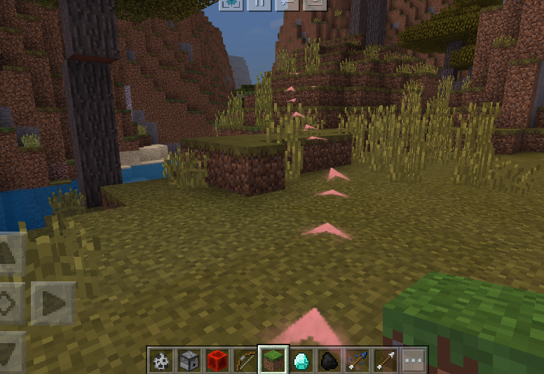

# <span id="客户端ExtraAPI接口"></span>客户端ExtraAPI接口

extraClientApi文件中的一些有用的API接口函数

<span id="AI"></span>
## AI

<span id="GetNavPath"></span>
### GetNavPath

- 描述

    获取本地玩家到目标点的寻路路径，开发者可以通过该接口定制自定义的导航系统。

- 参数

    | 参数名 | 数据类型 | 说明 |
    | :--- | :--- | :--- |
    | pos | tuple(float,float,float) | 目标点的坐标 |
    | maxTrimNode | int | 对搜索路径进行平滑时的最大尝试格数。设置的太大会影响寻路性能。默认值16 |
    | maxIteration | int | A星寻路的最大迭代次数。默认值800 |
    | isSwimmer | bool | 目标点是否在水中。默认为False |

- 返回值

    | 数据类型 | 说明 |
    | :--- | :--- |
    | int或list(tuple(float,float,float)) | 返回1：参数错误<br>返回2：玩家所在chunk未加载完毕<br>返回3：终点为实心方块，无法寻路<br>返回list(tuple(float,float,float),)：寻到路径从起点到终点的坐标点列表。注意该list可能为空，表示本地玩家离地太远，或者被堵住无法行动。 |

- 备注
    - 寻路算法迭代一定次数后（即maxIteration的数值），如果未寻到目标点，接口会返回**局部最优解**，即当前搜索到的点的集合中，离设置目标点最近的点的路径，但是这条路径可能是不准确或错误的（例如往终点的方向是死胡同的情况）。<br>出现这种可能的情况包括：目标点无法抵达（被围住等），目标点所在chunk未加载，目标点较远（但是仍在区块加载范围内）或地形较复杂（例如与终点间有很长一面墙）。
    - 上述情况中，目标点较远或地形较复杂的情况可以通过增大maxIteration的数值避免，但是这样同时也会增加客户端的卡顿。
    - 如果终点在水里需要将isSwimmer参数设为True，但如果只是路途中会经过水域是不需要的。但需要注意在水中的寻路性能非常低下，其他参数不变时，单次寻路计算出的最大路径长度会小很多。

<span id="StartNavTo"></span>
### StartNavTo

- 描述

    我们提供了一个基于上述接口的导航系统实现，做法是在路径上生成序列帧以引导玩家通向目标点，并且当玩家偏离路径会重新进行导航。

- 参数

    | 参数名 | 数据类型 | 说明 |
    | :--- | :--- | :--- |
    | pos | tuple(float,float,float) | 目标点的坐标 |
    | sfxPath | str | 构成导航路径的序列帧素材路径。样式可以参考指向上的箭头 |
    | callback | function | 玩家抵达终点时会调用的**回调函数**。该函数需要接受一个bool参数。 |
    | sfxIntl | float | 相邻两个序列帧之间的间隔。默认值2 |
    | sfxMaxNum | int | 同时存在的序列帧的最大个数。默认值16 |
    | sfxScale | tuple(float,float) | 序列帧的宽度及高度的缩放。默认为（0.5，0.5） |
    | maxIteration | int | A星寻路的最大迭代次数。默认值800 |
    | isSwimmer | bool | 目标点是否在水中。默认为False |
    | fps | int | 序列帧帧率，默认为20，不建议超过30 |
    | playIntl | int | 一轮中相邻序列帧开始播放的间隔，默认为8帧，不得小于0，否则将使用默认值 |
    | duration | int | 单个序列帧持续播放帧数，默认为60帧，不小于10，否则将使用默认值 |
    | oneTurnDuration | int | 两轮序列帧之间的播放间隔(帧)，默认值为90帧，至少为duration的1.5倍，否则将以1.5 * duration进行计算 |

- 返回值

    | 数据类型 | 说明 |
    | :--- | :--- |
    | int | 返回0：导航正常开始<br>返回-1：本地玩家离地太远，或者被堵住无法行动<br>返回1：参数错误<br>返回2：玩家所在chunk未加载完毕<br>返回3：终点为实心方块，无法寻路 |

- 备注
    - 寻路算法迭代一定次数后（即maxIteration的数值），如果未寻到目标点，接口会返回**局部最优解**，即当前搜索到的点的集合中，离设置目标点最近的点的路径，但是这条路径可能是不准确或错误的（例如往终点的方向是死胡同的情况）。<br>出现这种可能的情况包括：目标点无法抵达（被围住等），目标点所在chunk未加载，目标点较远（但是仍在区块加载范围内）或地形较复杂（例如与终点间有很长一面墙）。
    - 上述情况中，目标点较远或地形较复杂的情况可以通过增大maxIteration的数值避免，但是这样同时也会增加客户端的卡顿。
    - 如果终点在水里需要将isSwimmer参数设为True，但如果只是路途中会经过水域是不需要的。但需要注意在水中的寻路性能非常低下，其他参数不变时，单次寻路计算出的最大路径长度会小很多。
    - callback函数接受一个bool参数。当参数为True时，表示玩家到达目标点附近，但不代表导航结束，如果玩家又离开目标点，导航系统会再次尝试导航，开发者需要在某个时机手动调用停止导航（参考[StopNav接口](2-客户端ExtraAPI接口.html#stopnav)）。当参数为False时，表示玩家偏离航线并到了某个无法到达目标点的状态（即返回值不为0的那些情况），这种情况导航会自动终止。
        ```python
        # 一个到达终点时停止导航的callback函数示例
        from mod_log import logger as logger
        def myCallback(result):
            if result:
                extraClientApi.StopNav()
            else:
                logger.info('something happened in navigation')
        # 若目标点很远，需要进行分段导航的callback函数示例
        def myCallback2(result):
            if result:
                if GetDistence(localplayerPos, destinationPos) < sfxIntl*2:
                    extraClientApi.StopNav()
                else:
                    extraClientApi.StartNavTo(destinationPos, ...)
            else:
                logger.info('something happened in navigation')
        ```
    - 如果上一次导航没结束时再次调用会覆盖之前的导航
    - 使用默认参数的导航效果示例：<br>

<span id="StopNav"></span>
### StopNav

- 描述

    终止当前的导航

- 参数

    无

- 返回值

    无

<span id="IP"></span>
## IP

<span id="GetIP"></span>
### GetIP

- 描述

    获取本地玩家的ip地址

- 参数

    无

- 返回值

    | 数据类型 | 说明 |
    | :--- | :--- |
    | str | 本地玩家的ip地址 |

- 示例

```python
import mod.client.extraClientApi as clientApi
clientApi.GetIP()
```

<span id="UI"></span>
## UI

<span id="CheckCanBindUI"></span>
### CheckCanBindUI

- 描述

    检查实体是否可以绑定头顶UI，如何将UI与实体绑定详见[创建UI界面](../../../60-UI/4-UI说明文档.html#创建ui界面)

- 参数

    | 参数名 | 数据类型 | 说明 |
    | :--- | :--- | :--- |
    | entityId | str | 实体id |

- 返回值

    | 数据类型 | 说明 |
    | :--- | :--- |
    | bool | 是否可以绑定头顶UI True:可以绑定 False:不能绑定 |

- 备注
    - 不能绑定头顶UI通常是由于该实体已经死亡或该实体刚创建出来。刚创建的实体若无法绑定头顶UI，等待1-3帧后再次尝试绑定即可

- 示例

```python
import mod.client.extraClientApi as clientApi
canBind = clientApi.CheckCanBindUI(entityId)
```

<span id="CreateUI"></span>
### CreateUI

- 描述

    创建UI，详见[创建ui界面](../../../60-UI/4-UI说明文档.html#创建ui界面)

- 参数

    | 参数名 | 数据类型 | 说明 |
    | :--- | :--- | :--- |
    | nameSpace | str | 命名空间，建议为mod名字 |
    | uiKey | str | UI唯一标识 |
    | createParams | dict | 创建UI的参数，会传到UI类的_init_函数中 |

- 返回值

    | 数据类型 | 说明 |
    | :--- | :--- |
    | ScreenNode | UI节点 |

- 备注
    - createParams参数解释如下：
        | 参数              | 类型  | 解释                                                         |
        | ----------------- | ----- | ------------------------------------------------------------ |
        | isHud  | int   | 是否为Hud界面，1：是，0：否                                           |
        | mini_map_root_path | str   | 小地图控件根路径                                     |
        

- 示例

```python
import mod.client.extraClientApi as clientApi
from mod_log import logger as logger
# 监听引擎初始化完成事件，在这个事件后创建我们的战斗UI
def OnUIInitFinished(self, args):
    logger.info("OnUIInitFinished : %s" % args)
    # 注册UI 详细解释参照《UI API》
    clientApi.RegisterUI(modConfig.ModName, modConfig.FpsBattleUIName, modConfig.FpsBattleUIPyClsPath, modConfig.FpsBattleUIScreenDef)
    # 创建UI 详细解释参照《UI API》
    clientApi.CreateUI(modConfig.ModName, modConfig.FpsBattleUIName, {"isHud" : 1})
    self.mFpsBattleUINode = clientApi.GetUI(modConfig.ModName, modConfig.FpsBattleUIName)
    if self.mFpsBattleUINode:
        self.mFpsBattleUINode.Init()
```

<span id="GetTouchPos"></span>
### GetTouchPos

- 描述

    获取点击的屏幕坐标

- 参数

    无

- 返回值

    | 数据类型 | 说明 |
    | :--- | :--- |
    | tuple(float,float) | 屏幕坐标 |

- 示例

```python
import mod.client.extraClientApi as clientApi
def GetTouchPosTest():
    touchX, touchY = clientApi.GetTouchPos()
```

<span id="GetUI"></span>
### GetUI

- 描述

    获取UI节点，详见[获取ui界面](../../../60-UI/4-UI说明文档.html#获取ui界面)

- 参数

    | 参数名 | 数据类型 | 说明 |
    | :--- | :--- | :--- |
    | nameSpace | str | 命名空间，建议为mod名字 |
    | uiKey | str | UI唯一标识 |

- 返回值

    | 数据类型 | 说明 |
    | :--- | :--- |
    | ScreenNode | UI节点 |

- 示例

```python
import mod.client.extraClientApi as clientApi
uiNode = clientApi.GetUI(modConfig.ModName, modConfig.FpsBattleUIName)
```

<span id="HideAirSupplyGUI"></span>
### HideAirSupplyGUI

- 描述

    隐藏玩家氧气值界面

- 参数

    | 参数名 | 数据类型 | 说明 |
    | :--- | :--- | :--- |
    | isHide | bool | 是否隐藏，True为隐藏，False为显示 |

- 返回值

    | 数据类型 | 说明 |
    | :--- | :--- |
    | bool | 设置是否成功 |

- 示例

```python
import mod.client.extraClientApi as clientApi
clientApi.HideAirSupplyGUI(True)
```

<span id="HideArmorGui"></span>
### HideArmorGui

- 描述

    隐藏hud界面的护甲值显示

- 参数

    | 参数名 | 数据类型 | 说明 |
    | :--- | :--- | :--- |
    | isHide | bool | 是否隐藏，True为隐藏，False为显示 |

- 返回值

    | 数据类型 | 说明 |
    | :--- | :--- |
    | bool | 设置是否成功 |

- 示例

```python
import mod.client.extraClientApi as clientApi
clientApi.HideArmorGui(True)
```

<span id="HideChangePersonGui"></span>
### HideChangePersonGui

- 描述

    隐藏切换人称的按钮。隐藏后点击相应位置不会响应

- 参数

    | 参数名 | 数据类型 | 说明 |
    | :--- | :--- | :--- |
    | isHide | bool | 是否隐藏，True为隐藏，False为显示 |

- 返回值

    无

- 示例

```python
import mod.client.extraClientApi as clientApi
clientApi.HideChangePersonGui(True)
```

<span id="HideExpGui"></span>
### HideExpGui

- 描述

    非创造者模式下隐藏经验条显示

- 参数

    | 参数名 | 数据类型 | 说明 |
    | :--- | :--- | :--- |
    | isHide | bool | 是否隐藏，True为隐藏，False为显示 |

- 返回值

    无

- 示例

```python
import mod.client.extraClientApi as clientApi
clientApi.HideExpGui(True)
```

<span id="HideHealthGui"></span>
### HideHealthGui

- 描述

    隐藏hud界面的血量显示

- 参数

    | 参数名 | 数据类型 | 说明 |
    | :--- | :--- | :--- |
    | isHide | bool | 是否隐藏，True为隐藏，False为显示 |

- 返回值

    | 数据类型 | 说明 |
    | :--- | :--- |
    | bool | 设置是否成功 |

- 示例

```python
import mod.client.extraClientApi as clientApi
clientApi.HideHealthGui(True)
```

<span id="HideHorseHealthGui"></span>
### HideHorseHealthGui

- 描述

    隐藏hud界面的坐骑的血量显示

- 参数

    | 参数名 | 数据类型 | 说明 |
    | :--- | :--- | :--- |
    | isHide | bool | 是否隐藏，True为隐藏，False为显示 |

- 返回值

    | 数据类型 | 说明 |
    | :--- | :--- |
    | bool | 设置是否成功 |

- 示例

```python
import mod.client.extraClientApi as clientApi
clientApi.HideHorseHealthGui(True)
```

<span id="HideHudGUI"></span>
### HideHudGUI

- 描述

    隐藏HUD游戏界面的游戏原生UI。与原版F1按钮效果一致，只隐藏显示，但点击跳跃键等位置依然会响应

- 参数

    | 参数名 | 数据类型 | 说明 |
    | :--- | :--- | :--- |
    | isHide | bool | True为隐藏原生HUD，False为恢复显示 |

- 返回值

    无

- 示例

```python
import mod.client.extraClientApi as clientApi
clientApi.HideHudGUI(True)
```

<span id="HideHungerGui"></span>
### HideHungerGui

- 描述

    隐藏hud界面的饥饿值显示

- 参数

    | 参数名 | 数据类型 | 说明 |
    | :--- | :--- | :--- |
    | isHide | bool | 是否隐藏，True为隐藏，False为显示 |

- 返回值

    | 数据类型 | 说明 |
    | :--- | :--- |
    | bool | 设置是否成功 |

- 示例

```python
import mod.client.extraClientApi as clientApi
clientApi.HideHungerGui(True)
```

<span id="HideInteractGui"></span>
### HideInteractGui

- 描述

    隐藏交互按钮。隐藏后点击相应位置不会响应

- 参数

    | 参数名 | 数据类型 | 说明 |
    | :--- | :--- | :--- |
    | isHide | bool | 是否隐藏，True为隐藏，False为显示 |

- 返回值

    无

- 示例

```python
import mod.client.extraClientApi as clientApi
clientApi.HideInteractGui(True)
```

<span id="HideJumpGui"></span>
### HideJumpGui

- 描述

    隐藏游戏中右下角的跳跃按钮。隐藏后点击相应位置不会响应

- 参数

    | 参数名 | 数据类型 | 说明 |
    | :--- | :--- | :--- |
    | isHide | bool | 是否隐藏，True为隐藏，False为显示 |

- 返回值

    无

- 示例

```python
import mod.client.extraClientApi as clientApi
clientApi.HideJumpGui(True)
```

<span id="HideMoveGui"></span>
### HideMoveGui

- 描述

    隐藏游戏中左下角的移动按钮。隐藏后点击相应位置不会响应

- 参数

    | 参数名 | 数据类型 | 说明 |
    | :--- | :--- | :--- |
    | isHide | bool | 是否隐藏，True为隐藏，False为显示 |

- 返回值

    无

- 示例

```python
import mod.client.extraClientApi as clientApi
clientApi.HideMoveGui(True)
```

<span id="HideNeteaseStoreGui"></span>
### HideNeteaseStoreGui

- 描述

    隐藏游戏中的网易商店按钮。隐藏后点击相应位置不会响应

- 参数

    | 参数名 | 数据类型 | 说明 |
    | :--- | :--- | :--- |
    | isHide | bool | 是否隐藏，True为隐藏，False为显示 |

- 返回值

    无

- 示例

```python
import mod.client.extraClientApi as clientApi
clientApi.HideNeteaseStoreGui(True)
```

<span id="HidePlayerName"></span>
### HidePlayerName

- 描述

    隐藏玩家名字

- 参数

    | 参数名 | 数据类型 | 说明 |
    | :--- | :--- | :--- |
    | isHide | bool | 是否隐藏，True为隐藏，False为显示 |

- 返回值

    无

- 示例

```python
import mod.client.extraClientApi as clientApi
clientApi.HidePlayerName(True)
```

<span id="HideSlotBarGui"></span>
### HideSlotBarGui

- 描述

    隐藏游戏中底部中间的物品栏界面

- 参数

    | 参数名 | 数据类型 | 说明 |
    | :--- | :--- | :--- |
    | isHide | bool | 是否隐藏，True为隐藏，False为显示 |

- 返回值

    无

- 备注
    - 受限于MC主界面结构控制，不能实现在保留经验条的情况下隐藏slotbar

- 示例

```python
import mod.client.extraClientApi as clientApi
clientApi.HideSlotBarGui(True)
```

<span id="HideSneakGui"></span>
### HideSneakGui

- 描述

    隐藏游戏中左下角方向键的中心处潜行按钮。隐藏后点击相应位置不会响应

- 参数

    | 参数名 | 数据类型 | 说明 |
    | :--- | :--- | :--- |
    | isHide | bool | 是否隐藏，True为隐藏，False为显示 |

- 返回值

    无

- 示例

```python
import mod.client.extraClientApi as clientApi
clientApi.HideSneakGui(True)
```

<span id="HideSwimGui"></span>
### HideSwimGui

- 描述

    隐藏游戏中的浮潜按钮。隐藏后点击相应位置不会响应

- 参数

    | 参数名 | 数据类型 | 说明 |
    | :--- | :--- | :--- |
    | isHide | bool | 是否隐藏，True为隐藏，False为显示 |

- 返回值

    无

- 示例

```python
import mod.client.extraClientApi as clientApi
clientApi.HideSwimGui(True)
```

<span id="HideWalkGui"></span>
### HideWalkGui

- 描述

    隐藏游戏中右上角的移动类型按钮。隐藏后点击相应位置不会响应

- 参数

    | 参数名 | 数据类型 | 说明 |
    | :--- | :--- | :--- |
    | isHide | bool | 是否隐藏，True为隐藏，False为显示 |

- 返回值

    无

- 示例

```python
import mod.client.extraClientApi as clientApi
clientApi.HideWalkGui(True)
```

<span id="OpenNeteaseStoreGui"></span>
### OpenNeteaseStoreGui

- 描述

    打开游戏中的网易商店购买商品界面

- 参数

    | 参数名 | 数据类型 | 说明 |
    | :--- | :--- | :--- |
    | categoryName | str | 商品分类名称 |
    | itemName | str | 商品名称 |

- 返回值

    无

- 示例

```python
import mod.client.extraClientApi as clientApi
clientApi.OpenNeteaseStoreGui("商品", "测试商品1")
```

<span id="PopScreen"></span>
### PopScreen

- 描述

    使用堆栈管理的方式关闭UI

- 参数

    无

- 返回值

    | 数据类型 | 说明 |
    | :--- | :--- |
    | bool | 是否关闭成功 |

- 示例

```python
@comment 该接口关闭由PushScreen创建的界面
/comment
import mod.client.extraClientApi as clientApi
clientApi.PopScreen()
```

<span id="PushScreen"></span>
### PushScreen

- 描述

    使用堆栈管理的方式创建UI

- 参数

    | 参数名 | 数据类型 | 说明 |
    | :--- | :--- | :--- |
    | namespace | str | 命名空间，建议为mod名字 |
    | uiname | str | UI唯一标识 |

- 返回值

    | 数据类型 | 说明 |
    | :--- | :--- |
    | ScreenNode | UI节点，创建失败时返回None |

- 示例

```python
@comment 使用PopScreen使用可以关闭该接口创建的界面
/comment
import mod.client.extraClientApi as clientApi
# 监听引擎初始化完成事件，在这个事件后创建我们的战斗UI
# 由于UI不会在PushScreen被调用后立即创建完成，请不要在Init函数中对控件进行操作，创建完成后会调用screenNode的Create函数
def OnUIInitFinished(self, args):
    clientApi.RegisterUI(modConfig.ModName, modConfig.FpsBattleUIName, modConfig.FpsBattleUIPyClsPath, modConfig.FpsBattleUIScreenDef)
    self.mFpsBattleUINode = clientApi.PushScreen(modConfig.ModName, modConfig.FpsBattleUIName)
    if self.mFpsBattleUINode:
        self.mFpsBattleUINode.Init()
```

<span id="RegisterUI"></span>
### RegisterUI

- 描述

    注册UI，创建UI前，需要先注册UI。同一UI只需要注册一次即可。详见[注册ui界面](../../../60-UI/4-UI说明文档.html#注册ui界面)

- 参数

    | 参数名 | 数据类型 | 说明 |
    | :--- | :--- | :--- |
    | nameSpace | str | 命名空间，建议为mod名字 |
    | uiKey | str | UI唯一标识 |
    | clsPath | str | UI类路径 |
    | uiNameSpace | str | UIjson的命名空间 |

- 返回值

    | 数据类型 | 说明 |
    | :--- | :--- |
    | bool | 是否注册成功 |

- 示例

```python
import mod.client.extraClientApi as clientApi
from mod_log import logger as logger
# 监听引擎初始化完成事件，在这个事件后创建我们的战斗UI
def OnUIInitFinished(self, args):
    logger.info("OnUIInitFinished : %s" % args)
    # 注册UI 详细解释参照《UI API》
    clientApi.RegisterUI(modConfig.ModName, modConfig.FpsBattleUIName, modConfig.FpsBattleUIPyClsPath, modConfig.FpsBattleUIScreenDef)
    # 创建UI 详细解释参照《UI API》
    clientApi.CreateUI(modConfig.ModName, modConfig.FpsBattleUIName, {"isHud" : 1})
    self.mFpsBattleUINode = clientApi.GetUI(modConfig.ModName, modConfig.FpsBattleUIName)
    if self.mFpsBattleUINode:
        self.mFpsBattleUINode.Init()
```

<span id="SetCrossHair"></span>
### SetCrossHair

- 描述

    设置屏幕中心的十字是否显示

- 参数

    | 参数名 | 数据类型 | 说明 |
    | :--- | :--- | :--- |
    | visible | bool | True为显示十字光标，False为隐藏 |

- 返回值

    无

- 示例

```python
# we want to hide cross hair
clientApi.SetCrossHair(False)
```

<span id="SetResponse"></span>
### SetResponse

- 描述

    设置原生UI是否响应

- 参数

    | 参数名 | 数据类型 | 说明 |
    | :--- | :--- | :--- |
    | response | bool | 点击UI时是否屏蔽下层敲击方块/攻击实体 |

- 返回值

    无

- 示例

```python
import mod.client.extraClientApi as clientApi
clientApi.SetResponse(False)
```

<span id="通用"></span>
## 通用

<span id="GenerateColor"></span>
### GenerateColor

- 描述

    生成颜色字符，用于部分组件的参数设置。

- 参数

    | 参数名 | 数据类型 | 说明 |
    | :--- | :--- | :--- |
    | color | str | 颜色字符，支持的颜色有'BLACK','DARK_BLUE','DARK_GREEN','DARK_AQUA','DARK_RED','DARK_PURPLE','GOLD','GRAY','DARK_GRAY','BLUE','GREEN','AQUA','RED','LIGHT_PURPLE','YELLOW','WHITE' |

- 返回值

    | 数据类型 | 说明 |
    | :--- | :--- |
    | str | 用于引擎接口的颜色字符 |

<span id="GetDirFromRot"></span>
### GetDirFromRot

- 描述

    通过旋转角度获取朝向

- 参数

    | 参数名 | 数据类型 | 说明 |
    | :--- | :--- | :--- |
    | rot | tuple(float,float) | 俯仰角度及绕竖直方向的角度，单位是角度 |

- 返回值

    | 数据类型 | 说明 |
    | :--- | :--- |
    | tuple(float,float,float) | 玩家朝向的单位向量 |

- 示例

```python
import mod.client.extraClientApi as clientApi
direction = clientApi.GetDirFromRot((0, 0))
```

<span id="GetEngineNamespace"></span>
### GetEngineNamespace

- 描述

    获取引擎事件的命名空间。监听引擎事件时，namespace传该接口返回的namespace

- 参数

    无

- 返回值

    | 数据类型 | 说明 |
    | :--- | :--- |
    | str | 引擎的命名空间 |

- 示例

```python
import mod.client.extraClientApi as clientApi
ClientSystem = clientApi.GetClientSystemCls()
class FpsClientSystem(ClientSystem):
    def __init__(self, namespace, systemName):
        ClientSystem.__init__(self, namespace, systemName)
        self.ListenForEvent(clientApi.GetEngineNamespace(), clientApi.GetEngineSystemName(), 'UiInitFinished', self, self.OnUIInitFinished)
```

<span id="GetEngineSystemName"></span>
### GetEngineSystemName

- 描述

    获取引擎系统名。监听引擎事件时，systemName传该接口返回的systemName

- 参数

    无

- 返回值

    | 数据类型 | 说明 |
    | :--- | :--- |
    | str | 引擎的systemName |

- 示例

```python
import mod.client.extraClientApi as clientApi
ClientSystem = clientApi.GetClientSystemCls()
class FpsClientSystem(ClientSystem):
    def __init__(self, namespace, systemName):
        ClientSystem.__init__(self, namespace, systemName)
        self.ListenForEvent(clientApi.GetEngineNamespace(), clientApi.GetEngineSystemName(), 'UiInitFinished', self, self.OnUIInitFinished)
```

<span id="GetLevelId"></span>
### GetLevelId

- 描述

    获取levelId。某些组件需要levelId创建，可以用此接口获取levelId。其中level即为当前地图的游戏。

- 参数

    无

- 返回值

    | 数据类型 | 说明 |
    | :--- | :--- |
    | str | 当前地图的levelId |

- 示例

```python
import mod.client.extraClientApi as clientApi
ClientSystem = clientApi.GetClientSystemCls()
class FpsClientSystem(ClientSystem):
    def CameraCompTest(args):
        cameraComp = clientApi.GetComponent(clientApi.GetLevelId(), 'Minecraft', 'camera')
        cameraComp.fov = 60
```

<span id="GetLocalPlayerId"></span>
### GetLocalPlayerId

- 描述

    获取本地玩家的id

- 参数

    无

- 返回值

    | 数据类型 | 说明 |
    | :--- | :--- |
    | str | 客户端玩家Id |

<span id="GetMinecraftEnum"></span>
### GetMinecraftEnum

- 描述

    用于获取[Minecraft枚举值文档](../../../99-参考资料/0-Minecraft枚举值文档.html)中的枚举值

- 参数

    无

- 返回值

    | 数据类型 | 说明 |
    | :--- | :--- |
    | minecraftEnum | 枚举集合类 |

- 示例

```python
import mod.client.extraClientApi as clientApi
# 使用枚举值与事件参数比较
class BattleUI(ScreenNode):
    def OnButtonTouch(self, args):
        touchEventEnum = clientApi.GetMinecraftEnum().TouchEvent
        if touchEvent == touchEventEnum.TouchUp:
            pass

    def Create(self):
        self.AddTouchEventHandler("/panel/test_btn", self.OnButtonTouch, {"isSwallow":True})
```

<span id="StartMultiProfile"></span>
### StartMultiProfile

- 描述

    开始启动服务端与客户端双端脚本性能分析，启动后调用[StopMultiProfile(path)](#StopMultiProfile)即可在路径path生成函数性能火焰图。双端采集时数据误差较大，建议优先使用[StartProfile()](#StartProfile)单端版本，此接口只支持PC端

- 参数

    无

- 返回值

    | 数据类型 | 说明 |
    | :--- | :--- |
    | bool | 执行结果 |

- 示例

```python
import mod.client.extraClientApi as clientApi
clientApi.StartMultiProfile()
modfunc()# 处理对应的逻辑
# 之后通过计时器或者其他触发方式调用StopMultiProfile
clientApi.StopMultiProfile()
```

<span id="StartProfile"></span>
### StartProfile

- 描述

    开始启动客户端脚本性能分析，启动后调用[StopProfile(path)](#StopProfile)即可在路径path生成函数性能火焰图，此接口只支持PC端。生成的火焰图可以用浏览器打开，推荐chrome浏览器。

- 参数

    无

- 返回值

    | 数据类型 | 说明 |
    | :--- | :--- |
    | bool | 执行结果 |

- 备注
    - 火焰图主页面示例：<br>
    - 如火焰图所示，竖直方向表示调用栈，每一层都是一个函数。调用栈越深，火焰就越高，顶部就是正在执行的函数，下方都是它的父函数。分析性能时主要看火焰图的宽度（其中颜色没有特别意义），火焰图越宽，表示该函数对整体性能的消耗越大。因此需要对该函数进行优化。
    - 优化的核心主要是减少调用次数以及优化函数的写法。其中对于开发者而言，只需要关注开发者开发的代码即可，对于部分函数调用到mod框架或者引擎顶层框架进而导致性能消耗较大的，可以尝试通过减少调用次数来进行优化。
    - 另外，火焰图支持通过右上方的Search框或者“F3”快捷键对函数关键词进行搜索。同时可以点击函数缩放查看对应的调用栈。
    - 上架时请去掉这个接口的调用

- 示例

```python
import mod.client.extraClientApi as clientApi
clientApi.StartProfile()
modfunc()# 处理对应的逻辑
# 之后通过计时器或者其他触发方式调用StopProfile
clientApi.StopProfile()
```

<span id="StopMultiProfile"></span>
### StopMultiProfile

- 描述

    停止双端脚本性能分析并生成火焰图，与[StartMultiProfile()](#StartMultiProfile)配合使用，此接口只支持PC端

- 参数

    | 参数名 | 数据类型 | 说明 |
    | :--- | :--- | :--- |
    | fileName | str | 具体路径，相对于PC开发包的路径，默认为"flamegraph.svg"，位于PC开发包目录下，自定义路径请确保文件后缀名为".svg" |

- 返回值

    | 数据类型 | 说明 |
    | :--- | :--- |
    | bool | 执行结果 |

- 示例

```python
import mod.client.extraClientApi as clientApi
clientApi.StartMultiProfile()
modfunc()# 处理对应的逻辑
# 之后通过计时器或者其他触发方式调用StopMultiProfile
clientApi.StopMultiProfile()
```

<span id="StopProfile"></span>
### StopProfile

- 描述

    停止客户端端脚本性能分析并生成火焰图，与[StartProfile()](#StartProfile)配合使用，此接口只支持PC端

- 参数

    | 参数名 | 数据类型 | 说明 |
    | :--- | :--- | :--- |
    | fileName | str | 具体路径，相对于PC开发包的路径，默认为"flamegraph.svg"，位于PC开发包目录下，自定义路径请确保文件后缀名为".svg" |

- 返回值

    | 数据类型 | 说明 |
    | :--- | :--- |
    | bool | 执行结果 |

- 示例

```python
import mod.client.extraClientApi as clientApi
clientApi.StartProfile()
modfunc()# 处理对应的逻辑
# 之后通过计时器或者其他触发方式调用StopProfile
clientApi.StopProfile()
```

<span id="小地图"></span>
## 小地图

<span id="GetMiniMapScreenNodeCls"></span>
### GetMiniMapScreenNodeCls

- 描述

    获取小地图ScreenNode基类

- 参数

    无

- 返回值

    | 数据类型 | 说明 |
    | :--- | :--- |
    | type(MiniMapBaseScreen) | 小地图ScreenNode基类 |

- 示例

```python
import mod.client.extraClientApi as clientApi
MiniMapBaseScreen = clientApi.GetMiniMapScreenNodeCls()
```

<span id="系统"></span>
## 系统

<span id="GetClientSystemCls"></span>
### GetClientSystemCls

- 描述

    用于获取客户端system基类。实现新的system时，需要继承该接口返回的类

- 参数

    无

- 返回值

    | 数据类型 | 说明 |
    | :--- | :--- |
    | type(ClientSystem) | 客户端系统类 |

- 示例

```python
import mod.client.extraClientApi as clientApi
ClientSystem = clientApi.GetClientSystemCls()
class FpsClientSystem(ClientSystem):
    def __init__(self, namespace, systemName):
        ClientSystem.__init__(self, namespace, systemName)
```

<span id="GetSystem"></span>
### GetSystem

- 描述

    用于获取其他系统实例

- 参数

    | 参数名 | 数据类型 | 说明 |
    | :--- | :--- | :--- |
    | nameSpace | str | 系统注册的命名空间，一般为mod名字 |
    | systemName | str | 要获取的系统名称 |

- 返回值

    | 数据类型 | 说明 |
    | :--- | :--- |
    | ClientSystem | 返回具体系统的实例，如果获取不到则返回 None |

- 示例

```python
import mod.client.extraClientApi as clientApi
ClientSystem = clientApi.GetClientSystemCls()
class FpsClientSystem(ClientSystem):
    def __init__(self, namespace, systemName):
        ClientSystem.__init__(self, namespace, systemName)
        self.tutorialSystem = clientApi.GetSystem("TutorialMod", "TutorialClientSystem")
```

<span id="RegisterSystem"></span>
### RegisterSystem

- 描述

    系统可以执行我们引擎赋予的基本逻辑，例如监听事件、执行Tick函数、与服务端进行通讯等。

- 参数

    | 参数名 | 数据类型 | 说明 |
    | :--- | :--- | :--- |
    | nameSpace | str | 命名空间，建议为mod名字 |
    | systemName | str | 系统名称，自定义名称，可以使用英文、拼音和下划线，建议尽量个性化 |
    | clsPath | str | 组件类路径，路径从脚本的第一层开始算起 |

- 返回值

    | 数据类型 | 说明 |
    | :--- | :--- |
    | ClientSystem | 返回具体系统的实例 |

- 示例

```python
import mod.client.extraClientApi as clientApi
# 系统system的注册是在modMain.py的MOD类中
# 客户端系统system的注册方式
@Mod.InitClientr()
def TutorialClientInit(self):
    clientApi.RegisterSystem("TutorialMod", "TutorialClientSystem", "tutorialScripts.tutorialClientSystem.TutorialClientSystem")
```

<span id="组件"></span>
## 组件

<span id="GetComponentCls"></span>
### GetComponentCls

- 描述

    用于获取客户端component基类。实现新的component时，需要继承该接口返回的类

- 参数

    无

- 返回值

    | 数据类型 | 说明 |
    | :--- | :--- |
    | type(BaseComponent) | 组件基类 |

- 示例

```python
import mod.client.extraClientApi as clientApi
ClientComponentCls = clientApi.GetComponentCls()
# Component要继承于基类才能生效
class ShootComponentClient(ClientComponentCls):
    def __init__(self, entityId):
        ClientComponentCls.__init__(self, entityId)
        # 这里设置了一个开关来开关更新射击
        self.mShoot = False
```

<span id="GetEngineCompFactory"></span>
### GetEngineCompFactory

- 描述

    获取引擎组件的工厂，通过工厂可以创建客户端的引擎组件

- 参数

    无

- 返回值

    | 数据类型 | 说明 |
    | :--- | :--- |
    | EngineCompFactoryClient | 客户端引擎组件工厂 |

- 示例

```python
import mod.client.extraClientApi as clientApi
compFactory = clientApi.GetEngineCompFactory()
gameComp = compFactory.CreateGame(clientApi.GetLevelId())
```

<span id="RegisterComponent"></span>
### RegisterComponent

- 描述

    用于将组件注册到引擎中

- 参数

    | 参数名 | 数据类型 | 说明 |
    | :--- | :--- | :--- |
    | nameSpace | str | 命名空间，建议为mod名字 |
    | name | str | 组件名称 |
    | clsPath | str | 组件类路径，路径从脚本的第一层开始算起 |

- 返回值

    | 数据类型 | 说明 |
    | :--- | :--- |
    | bool | 注册成功与否 |

- 示例

```python
import mod.client.extraClientApi as clientApi
@Mod.InitClient()
def TutorialClientInit(self):
    # 注册一个自定义的客户端Component
    clientApi.RegisterComponent("TutorialMod", "ClientShoot", "tutorialScripts.modClient.clientComponent.shootComponentClient.ShootComponentClient")
```

