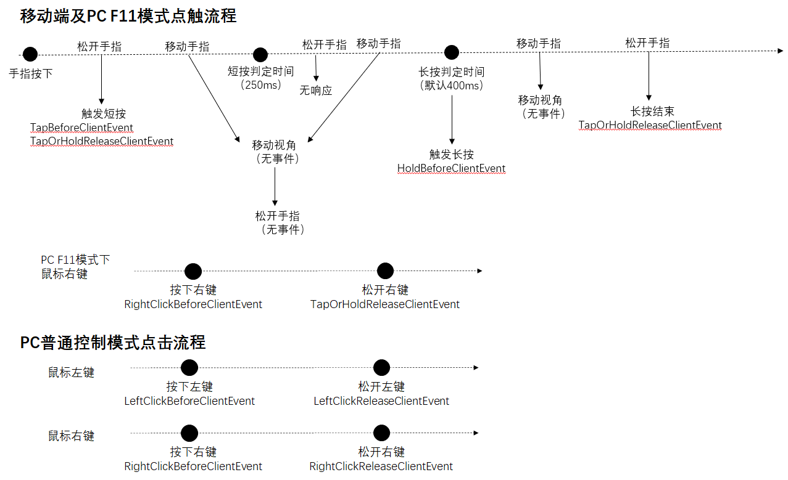

# 客户端事件

客户端引擎定义的事件如下

## UI

### GridComponentSizeChangedClientEvent

- 描述

    触发时机：UI grid组件里格子数目发生变化时触发

- 参数

    无

- 返回值

    无

## 方块

### ClientBlockUseEvent

- 描述

    触发时机：玩家右键点击新版自定义方块（或者通过接口AddBlockItemListenForUseEvent增加监听的MC原生游戏方块）时客户端抛出该事件（该事件tick执行，需要注意效率问题）。

- 参数

    | 参数名 | 数据类型 | 说明 |
    | :--- | :--- | :--- |
    | playerId | str | 玩家Id |
    | blockName | str | 方块的identifier，包含命名空间及名称 |
    | aux | int | 方块附加值 |
    | cancel | bool | 设置为True可拦截与方块交互的逻辑。 |
    | x | int | 方块x坐标 |
    | y | int | 方块y坐标 |
    | z | int | 方块z坐标 |

- 返回值

    无

- 备注
    - 有的方块是在ServerBlockUseEvent中设置cancel生效，但是有部分方块是在ClientBlockUseEvent中设置cancel才生效，如有需求建议在两个事件中同时设置cancel以保证生效。

### PlayerTryDestroyBlockClientEvent

- 描述

    当玩家试图破坏方块时，客户端线程触发该事件。主要用于床，旗帜，箱子这些根据方块实体数据进行渲染的方块，一般情况下请使用ServerPlayerTryDestroyBlockEvent

- 参数

    | 参数名 | 数据类型 | 说明 |
    | :--- | :--- | :--- |
    | x | int | 方块x坐标 |
    | y | int | 方块y坐标 |
    | z | int | 方块z坐标 |
    | face | int | 方块被敲击的面向id，参考[Facing](../../../99-参考资料/0-Minecraft枚举值文档.html#facing) |
    | blockName | str | 方块的identifier，包含命名空间及名称 |
    | auxData | int | 方块附加值 |
    | playerId | str | 试图破坏方块的玩家ID |
    | cancel | bool | 默认为False，在脚本层设置为True就能取消该方块的破坏 |

- 返回值

    无

### StepOnBlockClientEvent

- 描述

    触发时机：生物脚踩红石矿

- 参数

    | 参数名 | 数据类型 | 说明 |
    | :--- | :--- | :--- |
    | cancel | bool | 是否允许触发，默认为False，若设为True，可阻止触发后续物理交互事件 |
    | blockX | int | 方块x坐标 |
    | blockY | int | 方块y坐标 |
    | blockZ | int | 方块z坐标 |
    | entityId | str | 触发的entity的唯一ID |
    | blockName | str | 方块的identifier，包含命名空间及名称 |

- 返回值

    无

## 界面

### ClientChestCloseEvent

- 描述

    关闭箱子界面时触发，包括小箱子，合并后大箱子和末影龙箱子

- 参数

    无

- 返回值

    无

### ClientChestOpenEvent

- 描述

    打开箱子界面时触发，包括小箱子，合并后大箱子和末影龙箱子

- 参数

    | 参数名 | 数据类型 | 说明 |
    | :--- | :--- | :--- |
    | playerId | str | 玩家实体id |
    | x | int | 箱子位置x值 |
    | y | int | 箱子位置y值 |
    | z | int | 箱子位置z值 |

- 返回值

    无

### ClientPlayerInventoryCloseEvent

- 描述

    关闭物品背包界面时触发

- 参数

    无

- 返回值

    无

### ClientPlayerInventoryOpenEvent

- 描述

    打开物品背包界面时触发

- 参数

    | 参数名 | 数据类型 | 说明 |
    | :--- | :--- | :--- |
    | cancel | bool | 取消打开物品背包界面 |

- 返回值

    无

### PlayerChatButtonClickClientEvent

- 描述

    玩家点击聊天按钮或回车键触发呼出聊天窗口时客户端抛出的事件

- 参数

    无

- 返回值

    无

### PopScreenEvent

- 描述

    screen移除触发

- 参数

    | 参数名 | 数据类型 | 说明 |
    | :--- | :--- | :--- |
    | screenName | str | UI名字 |

- 返回值

    无

### PushScreenEvent

- 描述

    screen创建触发

- 参数

    | 参数名 | 数据类型 | 说明 |
    | :--- | :--- | :--- |
    | screenName | str | UI名字 |

- 返回值

    无

### UiInitFinished

- 描述

    UI初始化框架完成,此时可以创建UI

- 参数

    无

- 返回值

    无

## 控制

### ClientJumpButtonPressDownEvent

- 描述

    跳跃按钮按下事件，返回值设置参数只对当次按下事件起作用

- 参数

    | 参数名 | 数据类型 | 说明 |
    | :--- | :--- | :--- |
    | continueJump | bool | 设置是否执行跳跃逻辑 |

- 返回值

    无

### ClientJumpButtonReleaseEvent

- 描述

    跳跃按钮按下释放事件

- 参数

    无

- 返回值

    无

### HoldBeforeClientEvent

- 描述

    玩家长按屏幕，即将响应到游戏内时触发。仅在移动端或pc的F11模式下触发。pc的非F11模式可以使用RightClickBeforeClientEvent事件监听鼠标右键

- 参数

    | 参数名 | 数据类型 | 说明 |
    | :--- | :--- | :--- |
    | cancel | bool | 设置为True可拦截原版的挖方块/使用物品/与实体交互响应 |

- 返回值

    无

- 备注
    - 玩家长按屏幕的处理顺序为：
        1. 玩家点击屏幕，在长按判定时间内（默认为400毫秒，可通过SetHoldTimeThreshold接口修改）一直没有进行拖动或松手
        2. 触发该事件
        3. 若事件没有cancel，则根据主手上的物品，准心处的物体类型以及与玩家的距离，进行挖方块/使用物品/与实体交互等操作
        即该事件只会在到达长按判定时间的瞬间触发一次，后面一直按住不会连续触发，可以使用TapOrHoldReleaseClientEvent监听长按后松手
    - 与TapBeforeClientEvent事件类似，被ui层捕获，没有穿透到世界的点击不会触发该事件

### LeftClickBeforeClientEvent

- 描述

    玩家按下鼠标左键时触发。仅在pc的普通控制模式（即非F11模式）下触发。

- 参数

    | 参数名 | 数据类型 | 说明 |
    | :--- | :--- | :--- |
    | cancel | bool | 设置为True可拦截原版的挖方块或攻击响应 |

- 返回值

    无

### LeftClickReleaseClientEvent

- 描述

    玩家松开鼠标左键时触发。仅在pc的普通控制模式（即非F11模式）下触发。

- 参数

    无

- 返回值

    无

### OnClientPlayerStartMove

- 描述

    移动按钮按下触发事件

- 参数

    无

- 返回值

    无

### OnClientPlayerStopMove

- 描述

    移动按钮按下释放时触发事件

- 参数

    无

- 返回值

    无

### OnKeyPressInGame

- 描述

    按键按下时触发

- 参数

    | 参数名 | 数据类型 | 说明 |
    | :--- | :--- | :--- |
    | screenName | str | 当前screenName |
    | key | str | 键码（注：这里的int型被转成了str型，比如"1"对应的就是枚举值文档中的1），详见[枚举值文档KeyBoardType](../../../99-参考资料/0-Minecraft枚举值文档.html#keyboard)| |
    | isDown | str | 是否按下，按下为1，弹起为0 |

- 返回值

    无

### RightClickBeforeClientEvent

- 描述

    玩家按下鼠标右键时触发。仅在pc下触发（普通控制模式及F11模式都会触发）。

- 参数

    | 参数名 | 数据类型 | 说明 |
    | :--- | :--- | :--- |
    | cancel | bool | 设置为True可拦截原版的物品使用/实体交互响应 |

- 返回值

    无

### RightClickReleaseClientEvent

- 描述

    玩家松开鼠标右键时触发。仅在pc的普通控制模式（即非F11模式）下触发。在F11下右键，按下会触发RightClickBeforeClientEvent，松开时会触发TapOrHoldReleaseClientEvent

- 参数

    无

- 返回值

    无

- 备注
    - pc的普通控制模式下的鼠标点击流程见[TapOrHoldReleaseClientEvent](#TapOrHoldReleaseClientEvent)备注中的配图

### TapBeforeClientEvent

- 描述

    玩家点击屏幕并松手，即将响应到游戏内时触发。仅在移动端或pc的F11模式下触发。pc的非F11模式可以使用LeftClickBeforeClientEvent事件监听鼠标左键

- 参数

    | 参数名 | 数据类型 | 说明 |
    | :--- | :--- | :--- |
    | cancel | bool | 设置为True可拦截原版的攻击或放置响应 |

- 返回值

    无

- 备注
    - 玩家点击屏幕的处理顺序为：
        1. 玩家点击屏幕，没有进行拖动，并在短按判定时间（250毫秒）内松手
        2. 触发该事件
        3. 若事件没有cancel，则根据准心处的物体类型以及与玩家的距离，进行攻击或放置等操作
    - 与GetEntityByCoordEvent事件不同的是，被ui层捕获，没有穿透到世界的点击不会触发该事件，例如：
        1. 点击原版的移动/跳跃等按钮，
        2. 通过SetInputMode设置为UI操作模式，
        3. 对按钮使用AddTouchEventHandler接口时isSwallow参数设置为True

### TapOrHoldReleaseClientEvent

- 描述

    玩家点击屏幕后松手时触发。仅在移动端或pc的F11模式下触发。pc的非F11模式可以使用LeftClickReleaseClientEvent与RightClickReleaseClientEvent事件监听鼠标松开

- 参数

    无

- 返回值

    无

- 备注
    - 短按及长按后松手都会触发该事件
    - 移动端及pc的F11模式下点触流程见下图
        

## 世界

### ChunkAcquireDiscardedClientEvent

- 描述

    触发时机：通过AddChunkPosWhiteList接口添加监听的客户端区块即将被卸载时

- 参数

    | 参数名 | 数据类型 | 说明 |
    | :--- | :--- | :--- |
    | dimension | int | 区块所在维度 |
    | chunkPosX | int | 区块的x坐标，对应方块X坐标区间为[x * 16, x * 16 + 15] |
    | chunkPosZ | int | 区块的z坐标，对应方块Z坐标区间为[z * 16, z * 16 + 15] |

- 返回值

    无

### ChunkLoadedClientEvent

- 描述

    触发时机：通过AddChunkPosWhiteList接口添加监听的客户端区块加载完成时

- 参数

    | 参数名 | 数据类型 | 说明 |
    | :--- | :--- | :--- |
    | dimension | int | 区块所在维度 |
    | chunkPosX | int | 区块的x坐标，对应方块X坐标区间为[x * 16, x * 16 + 15] |
    | chunkPosZ | int | 区块的z坐标，对应方块Z坐标区间为[z * 16, z * 16 + 15] |

- 返回值

    无

### GameTypeChangedClientEvent

- 描述

    个人游戏模式发生变化时客户端触发。

- 参数

    | 参数名 | 数据类型 | 说明 |
    | :--- | :--- | :--- |
    | playerId | str | 玩家Id |
    | oldGameType | int | 切换前的游戏模式 |
    | newGameType | int | 切换后的游戏模式 |

- 返回值

    无

- 备注
    - 游戏模式：GetMinecraftEnum().GameType.*:Survival，Creative，Adventure分别为0~2
        默认游戏模式发生变化时最后反映在个人游戏模式之上。

### LoadClientAddonScriptsAfter

- 描述

    客户端加载mod完成事件

- 参数

    无

- 返回值

    无

### OnCommandOutputClientEvent

- 描述

    当command命令有成功消息输出时触发

- 参数

    | 参数名 | 数据类型 | 说明 |
    | :--- | :--- | :--- |
    | command | str | 命令名称 |
    | message | str | 命令返回的消息 |

- 返回值

    无

- 备注
    - 部分命令在返回的时候没有命令名称，命令组件需要showOutput参数为True时才会有返回

### OnScriptTickClient

- 描述

    客户端tick事件,1秒30次

- 参数

    无

- 返回值

    无

### UnLoadClientAddonScriptsBefore

- 描述

    客户端卸载mod之前触发

- 参数

    无

- 返回值

    无

## 实体

### AddEntityClientEvent

- 描述

    actor实体增加，事件触发

- 参数

    | 参数名 | 数据类型 | 说明 |
    | :--- | :--- | :--- |
    | id | str | 实体id |
    | posX | float | 位置x |
    | posY | float | 位置y |
    | posZ | float | 位置z |
    | dimensionId | int | 实体维度 |
    | isBaby | bool | 是否为幼儿 |
    | engineTypeStr | str | 实体类型 |
    | itemName | str | 物品identifier（仅当物品实体时存在该字段） |
    | auxValue | int | 物品附加值（仅当物品实体时存在该字段） |

- 返回值

    无

- 备注
    - 原事件名AddEntityEvent 客户端接收到服务端的AOI事件

### AttackAnimBeginClientEvent

- 描述

    modelComp替换骨骼动画后，攻击动作开始，事件触发

- 参数

    | 参数名 | 数据类型 | 说明 |
    | :--- | :--- | :--- |
    | id | str | 实体id |

- 返回值

    无

### AttackAnimEndClientEvent

- 描述

    modelComp替换骨骼动画后，攻击动作结束，事件触发

- 参数

    | 参数名 | 数据类型 | 说明 |
    | :--- | :--- | :--- |
    | id | str | 实体id |

- 返回值

    无

### EntityStopRidingEvent

- 描述

    触发时机：当实体停止骑乘时

- 参数

    | 参数名 | 数据类型 | 说明 |
    | :--- | :--- | :--- |
    | id | str | 实体id |
    | rideId | str | 坐骑id |
    | exitFromRider | bool | 是否下坐骑 |
    | entityIsBeingDestroyed | bool | 坐骑是否将要销毁 |
    | switchingRides | bool | 是否换乘坐骑 |
    | cancel | bool | 设置为True可以取消（需要与服务端事件一同取消） |

- 返回值

    无

- 备注
    - 以下情况不允许取消
        1. ride组件StopEntityRiding接口
        2. 玩家传送时
        3. 坐骑死亡时
        4. 玩家睡觉时
        5. 玩家死亡时
        6. 未驯服的马
        7. 怕水的生物坐骑进入水里
        8. 切换维度

### GetEntityByCoordEvent

- 描述

    玩家点击屏幕时触发，多个手指点在屏幕上时，只有第一个会触发。

- 参数

    无

- 返回值

    无

### GetEntityByCoordReleaseClientEvent

- 描述

    玩家点击屏幕后松开时触发，多个手指点在屏幕上时，只有第一个点击的手指松开会触发。

- 参数

    无

- 返回值

    无

### OnGroundClientEvent

- 描述

    实体着地时触发。除了玩家落地之外，沙子，铁砧，掉落的物品，点燃的TNT掉落地面时也会触发

- 参数

    | 参数名 | 数据类型 | 说明 |
    | :--- | :--- | :--- |
    | id | str | 实体id |

- 返回值

    无

### RemoveEntityClientEvent

- 描述

    实体被移除时，事件触发

- 参数

    | 参数名 | 数据类型 | 说明 |
    | :--- | :--- | :--- |
    | id | str | 移除的实体id |

- 返回值

    无

- 备注
    - 客户端接收服务端AOI事件时触发，原事件名 RemoveEntityPacketEvent

### StartRidingClientEvent

- 描述

    触发时机：一个实体即将骑乘另外一个实体

- 参数

    | 参数名 | 数据类型 | 说明 |
    | :--- | :--- | :--- |
    | cancel | bool | 是否允许触发，默认为False，若设为True，可阻止触发后续的实体交互事件 |
    | actorId | str | 骑乘者的唯一ID |
    | victimId | str | 被骑乘实体的唯一ID |

- 返回值

    无

### WalkAnimBeginClientEvent

- 描述

    modelComp替换骨骼动画后，走路动作开始，事件触发

- 参数

    | 参数名 | 数据类型 | 说明 |
    | :--- | :--- | :--- |
    | id | str | 实体id |

- 返回值

    无

### WalkAnimEndClientEvent

- 描述

    modelComp替换骨骼动画后，走路动作结束，事件触发

- 参数

    | 参数名 | 数据类型 | 说明 |
    | :--- | :--- | :--- |
    | id | str | 实体id |

- 返回值

    无

## 玩家

### AddPlayerAOIClientEvent

- 描述

    玩家加入游戏或者其余玩家进入当前玩家所在的区块时触发的AOI事件，替换AddPlayerEvent

- 参数

    | 参数名 | 数据类型 | 说明 |
    | :--- | :--- | :--- |
    | playerId | str | 玩家id |

- 返回值

    无

### ApproachEntityClientEvent

- 描述

    玩家靠近生物时触发

- 参数

    | 参数名 | 数据类型 | 说明 |
    | :--- | :--- | :--- |
    | playerId | str | 玩家实体id |
    | entityId | str | 靠近的生物实体id |

- 返回值

    无

### ClientShapedRecipeTriggeredEvent

- 描述

    玩家获取配方物品时触发

- 参数

    | 参数名 | 数据类型 | 说明 |
    | :--- | :--- | :--- |
    | recipeId | str | 配方id |

- 返回值

    无

### DimensionChangeClientEvent

- 描述

    玩家维度改变时客户端抛出

- 参数

    | 参数名 | 数据类型 | 说明 |
    | :--- | :--- | :--- |
    | playerId | str | 玩家实体id |
    | fromDimensionId | int | 维度改变前的维度 |
    | toDimensionId | int | 维度改变后的维度 |
    | fromX | float | 改变前的位置x |
    | fromY | float | 改变前的位置Y |
    | fromZ | float | 改变前的位置Z |
    | toX | float | 改变后的位置x |
    | toY | float | 改变后的位置Y |
    | toZ | float | 改变后的位置Z |

- 返回值

    无

- 备注
    - 当通过传送门从末地回到主世界时，toY值为32767，其他情况一般会比设置值高1.62

### ExtinguishFireClientEvent

- 描述

    玩家扑灭火焰时触发。下雨，倒水等方式熄灭火焰不会触发。

- 参数

    | 参数名 | 数据类型 | 说明 |
    | :--- | :--- | :--- |
    | pos | tuple(float,float,float) | 火焰方块的坐标 |
    | playerId | str | 玩家id |
    | cancel | bool | 修改为True时，可阻止玩家扑灭火焰。需要与ExtinguishFireServerEvent一起修改。 |

- 返回值

    无

### LeaveEntityClientEvent

- 描述

    玩家远离生物时触发

- 参数

    | 参数名 | 数据类型 | 说明 |
    | :--- | :--- | :--- |
    | playerId | str | 玩家实体id |
    | entityId | str | 远离的生物实体id |

- 返回值

    无

### OnLocalPlayerStopLoading

- 描述

    触发时机：玩家进入存档，出生点地形加载完成时触发。该事件触发时可以进行切换维度的操作。

- 参数

    | 参数名 | 数据类型 | 说明 |
    | :--- | :--- | :--- |
    | playerId | str | 加载完成的玩家id |

- 返回值

    无

### OnPlayerHitBlockClientEvent

- 描述

    触发时机：通过OpenPlayerHitBlockDetection打开方块碰撞检测后，当玩家碰撞到方块时触发该事件。玩家着地时会触发OnGroundClientEvent，而不是该事件。客户端和服务端分别作碰撞检测，可能两个事件返回的结果略有差异。

- 参数

    | 参数名 | 数据类型 | 说明 |
    | :--- | :--- | :--- |
    | playerId | str | 碰撞到方块的玩家Id |
    | posX | int | 碰撞方块x坐标 |
    | posY | int | 碰撞方块y坐标 |
    | posZ | int | 碰撞方块z坐标 |
    | blockId | str | 碰撞方块的identifier |
    | auxValue | int | 碰撞方块的附加值 |

- 返回值

    无

### OnPlayerHitMobClientEvent

- 描述

    触发时机：通过OpenPlayerHitMobDetection打开生物碰撞检测后，当有生物与玩家碰撞时触发该事件。注：客户端和服务端分别作碰撞检测，可能两个事件返回的结果略有差异。

- 参数

    | 参数名 | 数据类型 | 说明 |
    | :--- | :--- | :--- |
    | playerList | list[str] | 生物碰撞到的玩家id的list |

- 返回值

    无

### PerspChangeClientEvent

- 描述

    视角切换时会触发的事件

- 参数

    | 参数名 | 数据类型 | 说明 |
    | :--- | :--- | :--- |
    | from | int | 切换前的视角 |
    | to | int | 切换后的视角 |

- 返回值

    无

- 备注
    - 视角数字代表含义
        0: 第一人称
        1: 第三人称背面
        2: 第三人称正面

### RemovePlayerAOIClientEvent

- 描述

    玩家离开当前玩家同一个区块时触发AOI事件

- 参数

    | 参数名 | 数据类型 | 说明 |
    | :--- | :--- | :--- |
    | playerId | str | 玩家id |

- 返回值

    无

### StartDestroyBlockClientEvent

- 描述

    玩家开始挖方块时触发。创造模式下不触发。

- 参数

    | 参数名 | 数据类型 | 说明 |
    | :--- | :--- | :--- |
    | pos | tuple(float,float,float) | 方块的坐标 |
    | blockName | str | 方块的identifier，包含命名空间及名称 |
    | auxValue | int | 方块的附加值 |
    | playerId | str | 玩家id |
    | cancel | bool | 修改为True时，可阻止玩家进入挖方块的状态。需要与StartDestroyBlockServerEvent一起修改。 |

- 返回值

    无

- 备注
    - 如果是隔着火焰挖方块，即使将该事件cancel掉，火焰也会被扑灭。如果要阻止火焰扑灭，需要配合ExtinguishFireClientEvent使用

## 物品

### ActorAcquiredItemClientEvent

- 描述

    触发时机：玩家获得物品时客户端抛出的事件（有些获取物品方式只会触发客户端事件，有些获取物品方式只会触发服务端事件，在使用时注意一点。）

- 参数

    | 参数名 | 数据类型 | 说明 |
    | :--- | :--- | :--- |
    | actor | str | 获得物品玩家实体id |
    | secondaryActor | str | 物品给予者玩家实体id，如果不存在给予者的话，这里为空字符串 |
    | itemDict | dict | 获取到的物品的[物品信息字典](../0-名词解释.html#物品信息字典) |
    | acquireMethod | int | 获得物品的方法，详见[ItemAcquisitionMethod](../../../99-参考资料/0-Minecraft枚举值文档.html#itemacquisitionmethod) |

- 返回值

    无

### ActorUseItemClientEvent

- 描述

    触发时机：玩家使用物品时客户端抛出的事件（比较特殊不走该事件的例子：1）喝牛奶；2）染料对有水的炼药锅使用；3）盔甲架装备盔甲）

- 参数

    | 参数名 | 数据类型 | 说明 |
    | :--- | :--- | :--- |
    | playerId | str | 玩家实体id |
    | itemDict | dict | 使用的物品的[物品信息字典](../0-名词解释.html#物品信息字典) |
    | useMethod | int | 使用物品的方法，详见[ItemUseMethodEnum](../../../99-参考资料/0-Minecraft枚举值文档.html#itemusemethodenum) |

- 返回值

    无

### ClientItemTryUseEvent

- 描述

    玩家点击右键尝试使用物品时客户端抛出的事件，可以通过设置cancel为True取消使用物品

- 参数

    | 参数名 | 数据类型 | 说明 |
    | :--- | :--- | :--- |
    | playerId | str | 玩家id |
    | itemDict | dict | 使用的物品的[物品信息字典](../0-名词解释.html#物品信息字典) |
    | cancel | bool | 取消使用物品 |

- 返回值

    无

### ClientItemUseOnEvent

- 描述

    玩家在对方块使用物品时客户端抛出的事件。注：如果需要取消物品的使用需要同时在ClientItemUseOnEvent和ServerItemUseOnEvent中将ret设置为True才能正确取消。

- 参数

    | 参数名 | 数据类型 | 说明 |
    | :--- | :--- | :--- |
    | entityId | str | 玩家实体id |
    | itemDict | dict | 使用的物品的[物品信息字典](../0-名词解释.html#物品信息字典) |
    | x | int | 方块 x 坐标值 |
    | y | int | 方块 y 坐标值 |
    | z | int | 方块 z 坐标值 |
    | blockName | str | 方块的identifier |
    | blockAuxValue | int | 方块的附加值 |
    | face | int | 点击方块的面，参考[Facing](../../../99-参考资料/0-Minecraft枚举值文档.html#facing) |
    | clickX | float | 点击点的x比例位置 |
    | clickY | float | 点击点的y比例位置 |
    | clickZ | float | 点击点的z比例位置 |
    | ret | bool | 设为True可取消物品的使用 |

- 返回值

    无

### ItemReleaseUsingClientEvent

- 描述

    触发时机：释放正在使用的物品

- 参数

    | 参数名 | 数据类型 | 说明 |
    | :--- | :--- | :--- |
    | playerId | str | 玩家id |
    | durationLeft | float | 蓄力剩余时间 |
    | itemDict | dict | 使用的物品的[物品信息字典](../0-名词解释.html#物品信息字典) |
    | maxUseDuration | int | 最大蓄力时长 |
    | cancel | bool | 设置为True可以取消 |

- 返回值

    无

### OnCarriedNewItemChangedClientEvent

- 描述

    手持物品发生变化时，触发该事件；数量改变不会通知

- 参数

    | 参数名 | 数据类型 | 说明 |
    | :--- | :--- | :--- |
    | itemDict | dict | 切换后物品的[物品信息字典](../0-名词解释.html#物品信息字典) |

- 返回值

    无

### OnItemSlotButtonClickedEvent

- 描述

    点击快捷栏和背包栏的物品槽时触发

- 参数

    | 参数名 | 数据类型 | 说明 |
    | :--- | :--- | :--- |
    | slotIndex | int | 点击的物品槽的编号 |

- 返回值

    无

### StartUsingItemClientEvent

- 描述

    玩家使用物品（目前仅支持Bucket、Trident、RangedWeapon、Medicine、Food、Potion、Crossbow、ChemistryStick）时抛出

- 参数

    | 参数名 | 数据类型 | 说明 |
    | :--- | :--- | :--- |
    | playerId | str | 玩家实体id |
    | itemDict | dict | 使用的物品的[物品信息字典](../0-名词解释.html#物品信息字典) |

- 返回值

    无

### StopUsingItemClientEvent

- 描述

    玩家停止使用物品（目前仅支持Bucket、Trident、RangedWeapon、Medicine、Food、Potion、Crossbow、ChemistryStick）时抛出

- 参数

    | 参数名 | 数据类型 | 说明 |
    | :--- | :--- | :--- |
    | playerId | str | 玩家实体id |
    | itemDict | dict | 使用的物品的[物品信息字典](../0-名词解释.html#物品信息字典) |

- 返回值

    无

## 音乐

### OnMusicStopClientEvent

- 描述

    音乐停止时，当玩家调用StopCustomMusic来停止自定义背景音乐时，会触发该事件

- 参数

    | 参数名 | 数据类型 | 说明 |
    | :--- | :--- | :--- |
    | musicName | str | 音乐名称 |

- 返回值

    无

