# 自定义基础物品

## 概述

该功能不需要开启实验性玩法。

开发者可以通过在addon中配置json来添加自定义物品。添加的自定义物品支持“MOD SDK文档”中与物品相关的所有事件及接口。


## 物品相关组件事件流程

**组件事件流程**

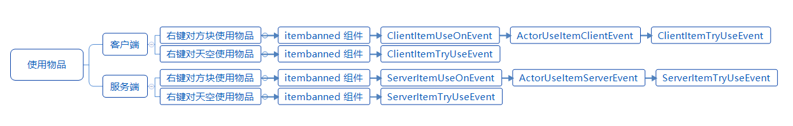

**注意：ActorUseItemClientEvent（ActorUseItemServerEvent）与ClientItemTryUseEvent（ServerItemTryUseEvent）的先后顺序与使用的物品有关。**


## 注册

以demo [CustomItemsMod](../../../4-DEMO示例/示例简介.html#CustomItemsMod)为例

1. 在behavior中新建`netease_items_beh`目录

   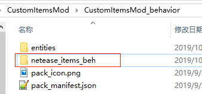

2. 在目录下新建一个json，编写物品的定义。json的格式可参考[官方wiki](https://minecraft.gamepedia.com/Bedrock_Edition_beta_item_documentation)。<a name="item_reg_2"></a>

   * json中至少有一个component
   * identifier分为命名空间及物品名，命名空间推荐与mod名称一致，identifier必须全局唯一。mod中其他地方都是用这个identifier与这个自定义物品对应上。

   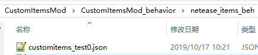

   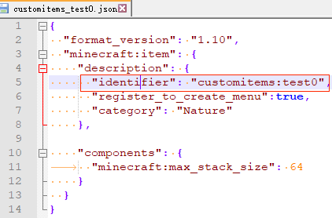

3. 下面开始操作resource包。

   将物品的贴图放到`textures\items`中

   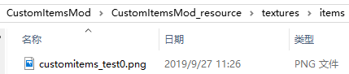

4. 在textures中新建`item_texture.json`，编写资源名与贴图的对应关系。资源名的命名必须满足全局唯一。json格式可参考“Mod PC开发包”的`data\resource_packs\vanilla\textures\item_texture.json`

   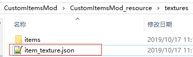

   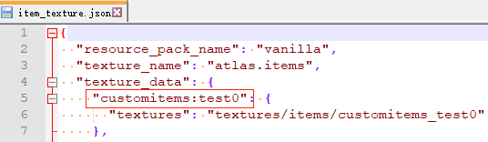

5. 在resource中新建一个`netease_items_res`文件夹，在文件夹中添加json，用于配置物品的表现属性，例如贴图。category字段需要与behavior包中的设置一致或者不填，否则可能出现错误。<a name="item_reg_5"></a>

   这个json的identifier需要与behavior中的一致，贴图的值需要与上一步`item_texture.json`中配置的资源名对应。json格式可参考“Mod PC开发包”的`data\resource_packs\vanilla\items`

   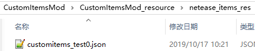

   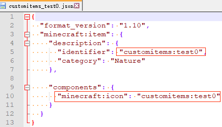

6. 在`texts\zh_CN.lang`中配置物品的中文名称。

   键的格式为item.物品identifier.name

   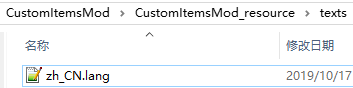

   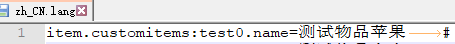

7. 重复1-6编写其他自定义物品

   

## JSON组件

### format_version

请填写1.10

### description

| 键                      | 类型 | 默认值 | 解释                                                         |
| ----------------------- | ---- | ------ | ------------------------------------------------------------ |
| identifier              | str  |        | 包括命名空间及物品名。需要全局唯一。<br>建议使用mod名称作为命名空间 |
| register_to_create_menu | bool | false  | 是否注册到创造栏                                             |
| category                | str  | Nature | 注册到创造栏的分类，可选的值有：<br>Construction<br>Nature<br>Equipment<br>Items |
| custom_item_type        | str  |        | 自定义物品类别，可选值有：<br/>weapon<br/>armor<br/>egg<br/>ranged_weapon<br/>projectile_item |

### 原版components

支持的微软原版component包括：（参数及解释见[官方wiki](https://minecraft.gamepedia.com/Bedrock_Edition_beta_item_documentation)）

* minecraft:foil

  可以使物品拥有类似附魔的闪烁效果

* minecraft:max_damage

  可以使物品拥有耐久度

  > 若物品堆叠数量大于1时，耐久度的变更对整一叠的物品生效。并且耐久度为0后，每次消耗耐久度的行为会使数量减一

* minecraft:max_stack_size

  设置物品最大堆叠数量，`注意：该值不能超过64`
  
* minecraft:seed<span id="minecraft_seed"></span>

  设置种子的属性，如crop_result、plant_at

   > plant_at列表中需要保持格式一致，如["minecraft:grass", "minecraft:dirt"]或["grass", "dirt"]，否则在相邻自定义农作物种植新的农作物会导致上一个农作物被破坏
  
* minecraft:use_animation

  使用物品时的动画类型

### 网易components

* netease:show_in_hand

  设置物品拿在手上时是否显示
  
  | 键    | 类型 | 默认值 | 解释           |
  | ----- | ---- | ------ | -------------- |
  | value | bool |        | 手持时是否显示 |
  
  - 备注：格式和微软的component不一样，里面多了一个“value"
  - 可以参考[CustomItemsMod](../../../4-DEMO示例/示例简介.html#CustomItemsMod)行为包的`netease_items_beh\customitems_test1.json`

<span id="netease_fire_resistant"></span>

* netease:fire_resistant

  设置物品是否防火，防火的物品会与下界合金一样，不会被火烧毁，掉进岩浆时会弹走

  | 键    | 类型 | 默认值 | 解释     |
  | ----- | ---- | ------ | -------- |
  | value | bool |        | 是否防火 |

  - 备注：格式和微软的component不一样，里面多了一个“value"
  - 可以参考CustomItemsMod示例行为包的`netease_items_beh\customitems_test_sword.json`

<span id="netease_frame_anim_in_scene"></span>

* netease:allow_offhand
  
  设置物品是否可以放在副手

  | 键    | 类型 | 默认值 | 解释             |
  | ----- | ---- | ------ | ---------------- |
  | value | bool |        | 是否可以放在副手 |

  - 备注：格式和微软的component不一样，里面多了一个“value"
  - 可以参考CustomItemsMod示例行为包的`netease_items_beh\customitems_test_offhand.json`  
  - 目前基岩版原版副手功能较弱，大多数时候都无法使用物品，主要用于装饰和在mod中判断副手中是否持有某物品来执行特定逻辑
  - 副手不支持一些其他组件，如`minecraft:foil`，`netease:render_offsets`

## 附属功能

### python事件及接口

支持“MOD SDK文档”中所有与物品相关的事件及组件，包括旧版自定义物品支持的全部功能。与旧版自定义物品不同，现在的事件及接口使用“itemName”传递物品identifier来区分不同的物品。

### 自定义配方

见“自定义配方”文档，材料及结果都支持填写自定义物品的identifier。可参考[CustomItemsMod](../../../4-DEMO示例/示例简介.html#CustomItemsMod)行为包的`netease_recipes`

### 自定义食品

原版apple json结构：

```python
{
  "format_version": "1.10",
  "minecraft:item": {
    "description": {
      "identifier": "minecraft:apple"
    },
    "components": {
      "minecraft:use_duration": 32,
      "minecraft:food": {
        "nutrition": 4,
        "saturation_modifier": "low"
      }
    }
  }
}
```

食品类的json结构需要包含在minecraft:item -> components中包含minecraft:food节点，下面对minecraft:food节点进行解释说明。

| json字段            | 举例                                                         | 含义                                                         |
| ------------------- | ------------------------------------------------------------ | ------------------------------------------------------------ |
| nutrition           | "nutrition": 2                                               | 营养值                                                       |
| saturation_modifier | "saturation_modifier": "low"                                 | 饱和度等级，有poor，low，normal，good，max，supernatural六个等级，系数分别是0.1，0.3，0.6，0.8，1.0，1.2 |
| using_converts_to   | "using_converts_to": "bowl"                                  | 使用后转化为的Item，如使用甜菜汤后留下碗                     |
| on_use_action       | "on_use_action": "chorus_teleport"                           | 使用食品产生的动作，目前仅支持传送到其他位置                 |
| on_use_range        | "on_use_range": [0, 10, 4]                                   | 传送位置x,y,z的偏移值                                        |
| cooldown_type       | "cooldown_type": "chorusfruit"                               | 冷却类型                                                     |
| cooldown_time       | "cooldown_time": 1                                           | 冷却时间                                                     |
| can_always_eat      | "can_always_eat": true                                       | 是否可以一直使用                                             |
| effects             | "effects": [<br/>          {<br/>            "name": "regeneration",<br/>            "chance": 1.0,<br/>            "duration": 30,<br/>            "amplifier": 4<br/>          },<br/>          {<br/>            "name": "absorption",<br/>            "chance": 1.0,<br/>            "duration": 120, // 2 * 60<br/>            "amplifier": 3<br/>          }] | 使用后的效果                                                 |


### 村民交易

可将行为包的交易配置中的item修改为自定义物品的identifier。可参考[CustomItemsMod](../../../4-DEMO示例/示例简介.html#CustomItemsMod)行为包的`trading\economy_trades\butcher_trades.json`，里面将新手级屠夫的其中一个交易项替换为绿宝石兑换customitems:test0物品

### loot_table

自定义物品的identifier可用作loot_table配置掉落物。可参考[CustomItemsMod](../../../4-DEMO示例/示例简介.html#CustomItemsMod)行为包的`loot_tables\entities\zombie.json`，里面将僵尸的掉落物由腐肉改为customitems:test0物品


## demo解释

​	[CustomItemsMod](../../../4-DEMO示例/示例简介.html#CustomItemsMod)中定义了2个自定义物品：

* customitems:test0

  平平无奇的只替换了贴图的自定义物品。

  演示了"村民交易"， “loot_table”的功能

* customitems:test1

  无法堆叠，拥有耐久度，手持时不渲染的自定义物品

  演示了“自定义配方”的功能

  

## Mod卸载

若使用了自定义物品的存档卸载mod后再进入时：

2. 对玩家背包中的自定义物品：

   物品会消失。若重新加载mod，对卸载期间登录过的玩家，物品不会恢复；没登录过的玩家，物品可以保留

3. 对地图上容器内的自定义物品：

   物品会消失。若重新加载mod，对卸载期间进行探索过的区域内的容器，物品不会恢复；未探索区域的容器，物品可以保留

4. 对地图上未捡起的掉落物：

   掉落物会消失。若重新加载mod，对卸载期间进行探索过的区域，掉落物不会恢复（除非subchunk内没有其他任何entity）；未探索区域的掉落物可以保留。
   
   

## 常见报错

* JSON: xxx has an error

  一般为json格式有问题，检查是否漏写或多写逗号，括号是否对应等

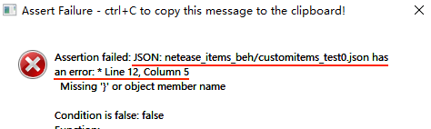

