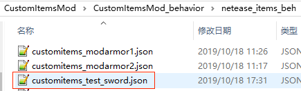

# 自定义武器及工具

## 概述

属于特殊的自定义物品，在支持自定义物品所有特性的基础上，还具有武器或工具相关的功能。


## 注册

1. 与自定义基础物品的注册1-6步相同

2. 在behavior/netease_items_beh的json中添加武器/工具相关的定义，包括：

   custom_item_type为weapon

   一个netease:weapon组件，必填。组件的参数见[json组件](#json组件)

   设置最大堆叠数量，可选
   
   设置耐久度，可选




```python
{
  "format_version": "1.10",
  "minecraft:item": {
    "description": {
      "identifier": "customitems:test_sword",
      "register_to_create_menu":true,
      "custom_item_type": "weapon"
    },

    "components": {
      "minecraft:max_stack_size":1,
      "minecraft:max_damage":153,
      "netease:weapon":{
        "type":"sword",
        "level":3,
        "speed":8,
        "attack_damage":7,
        "enchantment":10
      }
    }
  }
}
```


## JSON组件

### description

| 键       | 类型 | 默认值    | 解释                                           |
| -------- | ---- | --------- | ---------------------------------------------- |
| category | str  | Equipment | 与普通物品不同，武器/工具的默认分类是Equipment |

### 原版components

* minecraft:max_stack_size

    自定义武器/工具只支持设置为1

### 网易components

* netease:weapon

| 键            | 类型 | 默认值 | 解释                                                         |
| ------------- | ---- | ------ | ------------------------------------------------------------ |
| type          | str  |        | 武器/工具的类型,目前支持类型有：<br>sword：剑<br>shovel：铲<br>pickaxe：镐<br>hatchet：斧<br>hoe：锄头 |
| level         | int  |        | 1. 对于镐，对应挖掘等级<br>即当使用镐挖掘某些方块时，镐子的挖掘等级大于等于方块的挖掘等级，才会产生掉落物。<br>对于原版镐子，木镐与金镐是0，石镐是1，铁镐是2，钻石镐是3<br>2. 并且该值与铁砧的修复材料有关。<br>level为0：当速度为2对应木板,否则对应金锭 <br>level为1：对应石头<br>level为2：对应铁锭<br>level为3：对应钻石<br>level大于3：无法使用铁砧修复 |
| speed         | int  | 0      | 对采集工具生效，表示挖掘方块时的基础速度                     |
| attack_damage | int  | 0      | 攻击伤害                                                     |
| enchantment   | int  | 0      | 附魔能力。该值的解释见[官方wiki](https://minecraft-zh.gamepedia.com/index.php?title=%E6%95%99%E7%A8%8B/%E9%99%84%E9%AD%94%E6%9C%BA%E5%88%B6&variant=zh#.E9.AD.94.E5.92.92.E6.98.AF.E5.A6.82.E4.BD.95.E9.80.89.E6.8B.A9.E5.87.BA.E6.9D.A5.E7.9A.84) |


## demo解释

[CustomItemsMod](../../../4-DEMO示例/示例简介.html#CustomItemsMod)中定义了一个自定义武器：

* customitems:test_sword

  剑类型的自定义武器
