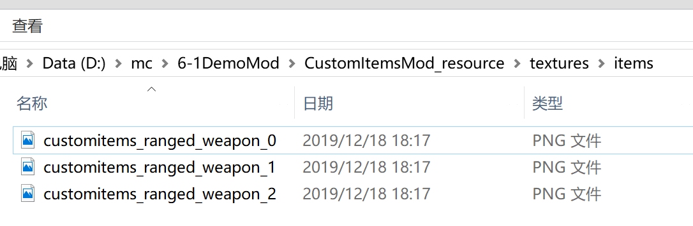

# 自定义蓄力物品

## 概述

属于特殊的自定义物品，在支持自定义物品所有特性的基础上，还具有右键按下开始蓄力过程，右键抬起触发释放事件。

与弓（minecraft:bow）、弩（minecraft:crossbow）类似，在物品使用过程支持蓄力操作，支持序列帧动画。

详细的物品定义以及物品使用详见示例mod [CustomRangedWeaponMod](../../../4-DEMO示例/示例简介.html#CustomRangedWeaponMod)。


## 注册

1. 与自定义物品的注册1-6步相同
2. 在behavior创建的json文件，如：

```python
{
    "format_version": "1.10",
    "minecraft:item": {
        "description": {
            "identifier": "customitems:ranged_weapon",
            "register_to_create_menu":true,
            "custom_item_type": "ranged_weapon"
        },

        "components": {
            "minecraft:use_animation": "bow"
        }
    }
}
```

3. 自定义序列帧

   3.1 将物品的序列帧贴图放到`textures\items`中，如：

   

   3.2 在textures/item_texture.json中增加序列帧图片的定义

   ```python
   "customitems:ranged_weapon": {
       "textures": [
           "textures/items/customitems_ranged_weapon_0",
           "textures/items/customitems_ranged_weapon_1",
           "textures/items/customitems_ranged_weapon_2"
       ]
   }
   ```

   3.3 在netease_items_res中增加json文件，如：

   ```python
   {
     "format_version": "1.10",
     "minecraft:item": {
       "description": {
         "identifier": "customrangedweapon:bow",
         "category": "Equipment"
       },
       "components": {
         "minecraft:icon": "customrangedweapon:bow",
         "netease:frame_animation": {
           "frame_count": 3,
           "texture_name": "customrangedweapon:bow_frame",
           "animate_in_toolbar": true
         }
       }
     }
   }
   ```


## 网易components

* netease:frame_animation

  | 键                 | 类型 | 默认值 | 解释                                |
  | ------------------ | ---- | ------ | ----------------------------------- |
  | frame_count        | int  | 1      | 序列帧帧数                          |
  | texture_name       | str  |        | item_texture.json中定义的序列帧数组 |
  | animate_in_toolbar | bool | true   | 在物品栏中是否支持动画              |

* netease:render_offsets

  第一人称下手中物品渲染配置

  右手坐标系，x是拇指方向，y是食指方向，z是中指方向

  | 键                         | 类型  | 默认值        | 解释         |
  | -------------------------- | ----- | ------------- | ------------ |
  | controller_position_adjust | array | [0.0,0.0,0.0] | 物品位置调整 |
  | controller_rotation_adjust | array | [0.0,0.0,0.0] | 物品旋转调整 |
  | controller_scale           | float | 1.0           | 物品大小调整 |


## 物品耐久

自定义蓄力物品可以通过minecraft:max_damage组件设置其耐久值

然后在在物品使用事件ItemReleaseUsingServerEvent中获取/设置耐久值

```python
slotIndex = 0
comp = serverApi.CreateComponent(playerId,'Minecraft','item')
val = comp.GetInvItemDurability(slotIndex)
if val == 0:
    # 销毁物品
    comp.SetInvItemNum(slotIndex, 0)
else:
	comp.SetInvItemDurability(slotIndex, val - 1)
```

