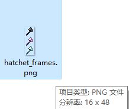
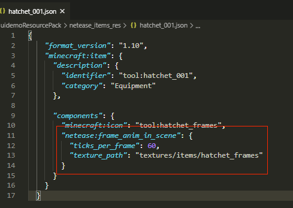
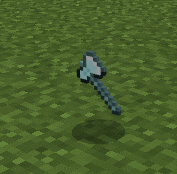
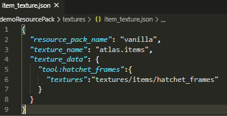
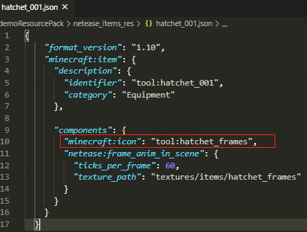
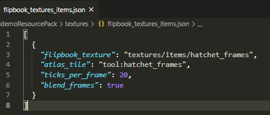
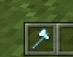

# 自定义物品贴图使用序列帧动画

## 概述

开发者按规范制作资源及json配置可实现物品贴图使用序列帧动画。

物品贴图使用序列帧的修改分为两部分，一种是手持及地图掉落贴图修改，另一种是UI界面上的修改。实际中一般同时修改，但也允许开发者单独配置其中一项。

## 物品手持及地图掉落贴图使用序列帧动画

实现分为两个步骤：
1) 资源制作：
应以由上往下平铺的方式，贴图高度必须为宽度的整数倍，第一帧在最上方位置，最后一帧在最下方位置, 贴图分辨率越大，性能消耗越大，建议贴图宽度不要超过32:

2) 添加json组件：
修改netease_items_res相应自定义物品的json，添加netease:frame_anim_in_scene组件，这里以自定义的斧头为例:

| 键                  | 类型      | 解释     |
| ------------------- | --------  | ---------------------------------------------------- |
| ticks_per_frame     | int       |代表多少帧切换一次贴图，按1秒60帧算，设置60的话即为1秒切换一帧贴图 |
| texture_path        | str       |序列帧贴图的路径 |

最终效果：

## 物品UI界面上贴图使用序列帧动画

实现分为三个步骤：

1) 在图集中声明资源。因为UI界面显示的贴图取自于图集，所以需要先声明。
在textures/item_texture.json声明我们上述使用的这张序列帧贴图hatchet_frames：

2) 修改netease_items_res自定义物品的json，修改minecraft:icon字段为我们上面图集中声明的字段：

3) 新建textures/flipbook_textures_items.json(类似于微软原版的flipbook_textures.json文件)，并在其中进行配置:

| 键                | 类型  | 默认值      | 解释     |
| ----------------- | ----  | ---------- | -------- |
| flipbook_texture  | str   |             | 序列帧资源的路径 |
| atlas_tile        | str   |             |在图集中声明的名称 |
| ticks_per_frame   | int   |             | 代表多少帧切换一次贴图，按1秒60帧算，设置60的话即为1秒切换一帧贴图 |
| blend_frames      | bool  |    True     | 切换贴图的时候是否混合上一帧 |

最终效果：

