# 自定义方块概述

<span id="customBlockJump"></span>

该功能不需要开启实验性玩法。

开发者可以通过在addon中配置json来添加自定义方块。添加的自定义方块支持ModAPI中与方块及物品相关的所有事件及接口。


## 注册

以demo [CustomBlocksMod](../../../4-DEMO示例/示例简介.html#CustomBlocksMod)为例：

1. 在行为包中新建`netease_blocks`目录

   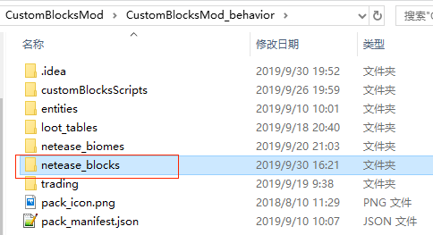

2. 在目录下新建一个json用于编写方块的定义。json的格式可参考[官方wiki](https://minecraft.gamepedia.com/Bedrock_Edition_blocks_documentation)。

   - json中至少有一个component
- **identifier**的格式为：命名空间[冒号]方块名。命名空间推荐与mod名称一致。而冒号后的**方块名**必须全局唯一，为避免与原版方块以及其他mod重复，**请加上命名空间作为前缀来保证唯一**。
   
（例如图中的**<font size="5">customblocks:<font color="red">customblocks_</font>test0</font>**）
   
​	而不要写成customblocks:test0。
   
   - **mod中其他地方都是用这个identifier与这个自定义方块对应上**。
   
   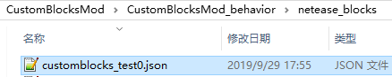
   
   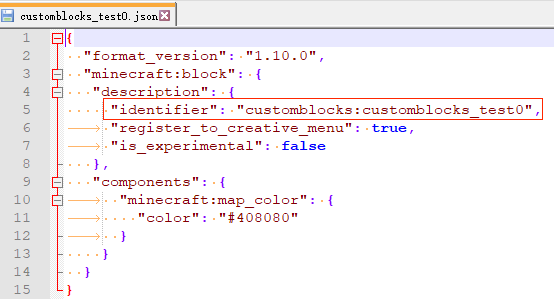

3. 将方块的贴图放到`textures\blocks`中

   可以支持高于16x16分辨率的高清贴图，但需要注意过高的分辨率会导致手机端（尤其是低端机）上无法进入游戏。

   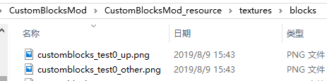

4. 在textures中新建`terrain_texture.json`，编写资源名与贴图的对应关系。资源名的命名必须满足全局唯一。json格式可参考“Mod PC开发包”的`data\resource_packs\vanilla\textures\terrain_texture.json`

   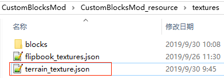

   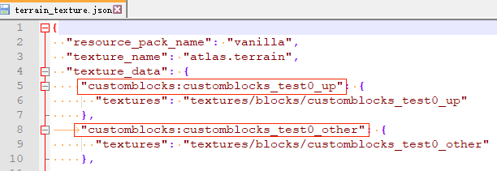

5. 在resource中新建一个`blocks.json`，编写方块贴图及声音，贴图的值需要与上一步`terrain_texture.json`中配置的资源名对应。json格式可参考“Mod PC开发包”的`data\resource_packs\vanilla\blocks.json`

   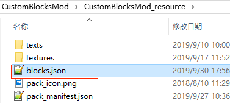

   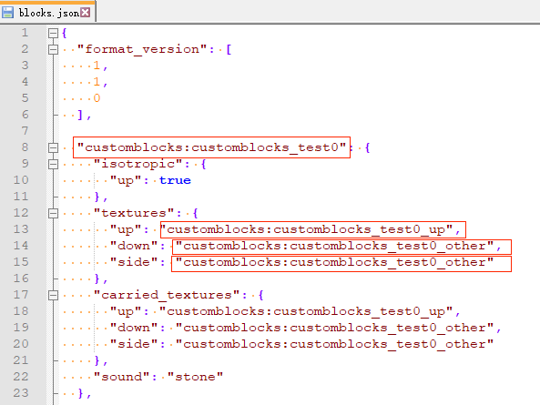

6. 在`texts\zh_CN.lang`中配置方块中文名称：

   键的格式为`tile.方块identifier.name`

   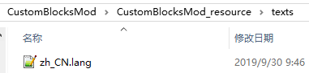

   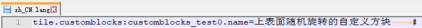

7. 重复1-6编写其他自定义方块


## 自定义分页

随着方块的越来越多，可以通过增加自定义分页把自定义方块独立放到一个单独的标签页，如下图所示：

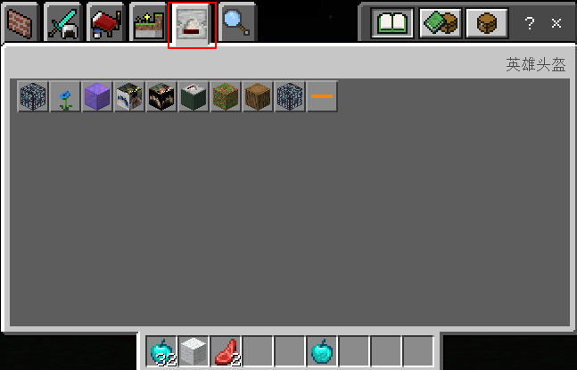

步骤如下：

1. 增加自定义分栏（参考[自定义物品分页](../03-自定义物品/9-自定义物品分页.md)）

   1.1 在 behavior 文件夹下新建 netease_tab 文件夹，并添加任意名称的 json 文件，例如 bat.json

   ```json
   {
       "name": "英雄头盔",
       "icon": "textures/items/batman_helmet"
   }
   ```

   1.2 把batman_helmet.png放置到CustomBlocksMod_resource\textures\items下

   

2. 把自定义方块放入自定义分栏

   在自定义方块的json中，增加category为custom或者其他分类，如：

   ```json
   {
   	"format_version": "1.10.0",
   	"minecraft:block": {
   		"description": {
   			"identifier": "customblocks:customblocks_test0",
   			"register_to_creative_menu": true,
   			"is_experimental": false,
   			"category": "custom" # 自定义分类
   		},
   		"components": {
   			"minecraft:map_color": {
   				"color": "#408080"
   			}
   		}
   	}
   }
   ```

3. 分类说明

   category的值可以为如下：

   | 分类         | 说明       |
   | ------------ | ---------- |
   | construction | 建造分类   |
   | nature       | 自然分类   |
   | equipment    | 装备分类   |
   | items        | 物品分类   |
   | custom       | 自定义分栏 |

   

## 卸载

若使用了自定义方块的存档卸载mod后再进入时：

1. 对地图上已存在的自定义方块：

   自定义方块会变为空气。若某个subchunk未进行过方块更新，那么重新加载mod时，自定义方块会保留。但一旦subchunk进行了方块更新，即使重新加载mod，自定义方块会永远消失。

2. 对玩家背包中的自定义方块：

   物品会消失。若重新加载mod，对卸载期间登录过的玩家，物品不会恢复；没登录过的玩家，物品可以保留。

3. 对地图上容器内的自定义方块：

   物品会消失。若重新加载mod，对卸载期间进行探索过的区域内的容器，物品不会恢复；未探索区域的容器，物品可以保留。

4. 对地图上未捡起的掉落物：

   掉落物会消失。若重新加载mod，对卸载期间进行探索过的区域，掉落物不会恢复（除非subchunk内没有其他任何entity）；未探索区域的掉落物可以保留。
