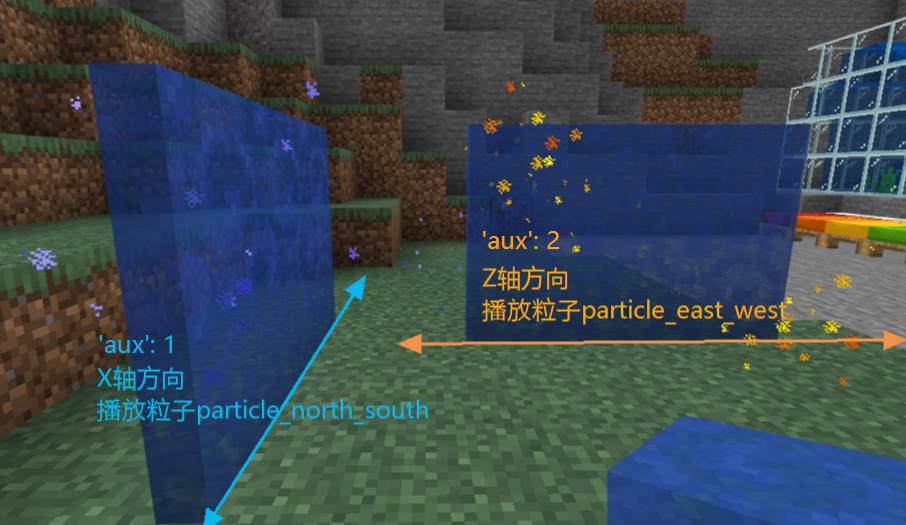

# 自定义传送门方块

## base_block设置

- **自定义传送门方块的base_block需要设为portal。**

## 动画纹理

- 可通过在`resource/textures/flipbook_textures.json`中配置动画纹理使其贴图拥有动态效果，属于微软功能。

## 传送门方块介绍

- 传送门方块拥有两种朝向，其方块延伸方向分别与X轴、Z轴相同，如图所示：
- 可在netease:portal中设置传送门方块上播放的粒子特效以及目标维度

## netease:portal

| 键                   | 类型   | 默认值 | 解释                                                         |
| -------------------- | ------ | ------ | ------------------------------------------------------------ |
| particle_east_west   | string |        | 可选，对应于粒子json文件中的identifier，用于控制方块与Z轴同向时播放的粒子特效 |
| particle_north_south | string |        | 可选，对应于粒子json文件中的identifier，用于控制方块与X轴同向时播放的粒子特效 |
| target_dimension     | int    |        | 必须设置，用于控制进入传送门方块后到达的目标维度             |

- 粒子特效应放置于`resource/particles`，粒子特效编写可参考[官方关于粒子组件的说明](https://minecraft.gamepedia.com/Bedrock_Edition_particle_documentation)。
- **目标维度为0或3-20的整数或者大于21的新版自定义维度的数值，1（下界）和2（末地）会被视作0来处理。**

## 自定义传送门方块相关特性

- 若通过服务端blockInfo组件的SetBlockNew接口放置传送门方块：

  - 附加值'aux'设为1时，该方块延伸方向与X轴相同，播放particle_north_south对应的粒子；
- 附加值'aux'设为2时，该方块延伸方向与Z轴相同，播放particle_east_west对应的粒子。
  - **避免将附加值'aux'设为0。**

- 还可以在游戏内通过指令/setblock放置方块，**注意'aux'值应设为1或2。**

  如下为在(0, 65, 0)处放置aux值为2的customblocks_test_portal_blue方块的指令：

  `/setblock 0 65 0 customblocks_test_portal_blue 2`

- 手动放置的传送门方块附加值'aux'始终为0，无论它朝向哪里，**不建议开发者手动放置传送门方块。**

- 目标维度与当前维度相同时，将不会进行传送。

- 只有玩家才能够通过自定义传送门方块进行传送。

- 同一玩家存在一定的传送冷却时间，不会连续传送。

- 传送前后玩家坐标不发生改变。