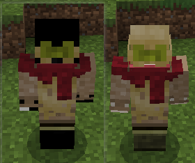
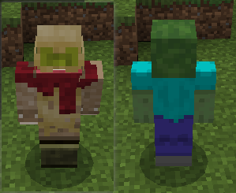

# 使用API修改玩家表现

下面结合示例CustomEntityMod说明如何通过接口动态修改玩家模型与动作。

## 修改材质

### 接口

[AddPlayerRenderMaterial](../../02-Python脚本开发/99-ModAPI/4-组件/3-客户端组件.html#addplayerrendermaterial)

### 示例

```python
actorRenderComp = self.CreateComponent(entityId, "Minecraft", "actorRender")
actorRenderComp.AddPlayerRenderMaterial("default", "custom_entity")
actorRenderComp.RebuildPlayerRender()
def reset():
    actorRenderComp.AddPlayerRenderMaterial("default", "entity_alphatest")
    actorRenderComp.RebuildPlayerRender()
    self.ShowMsg("恢复默认玩家渲染材质")
comp = clientApi.CreateComponent(clientApi.GetLevelId(), "Minecraft", "game")
comp.AddTimer(3.0, reset)
self.mIsTranform = True
self.ShowMsg("切换玩家渲染材质中")
```

### 说明

玩家的默认渲染材质为entity_alphatest，首先先修改为自定义材质custom_entity，然后定时3s恢复默认值。

### 效果



左边：custom_entity

右边：entity_alphatest

## 修改几何体与贴图

### 接口

[AddPlayerGeometry](../../02-Python脚本开发/99-ModAPI/4-组件/3-客户端组件.html#AddPlayerGeometry)

[AddPlayerTexture](../../02-Python脚本开发/99-ModAPI/4-组件/3-客户端组件.html#AddPlayerTexture)

### 示例

```python
actorRenderComp = self.CreateComponent(entityId, "Minecraft", "actorRender")
actorRenderComp.AddPlayerGeometry("default", "geometry.zombie.v1.8")
actorRenderComp.AddPlayerTexture("default", "textures/entity/zombie/zombie")
actorRenderComp.RebuildPlayerRender()
def reset():
    actorRenderComp.AddPlayerGeometry("default", "geometry.humanoid.custom")
    actorRenderComp.AddPlayerTexture("default", "textures/entity/steve")
    actorRenderComp.RebuildPlayerRender()
    self.ShowMsg("恢复默认玩家渲染几何体")

comp = clientApi.CreateComponent(clientApi.GetLevelId(), "Minecraft", "game")
comp.AddTimer(3.0, reset)
```

### 说明

玩家的默认渲染几何体为geometry.humanoid.custom

玩家的默认渲染贴图为textures/entity/steve

首先把玩家默认渲染几何体改为geometry.zombie.v1.8，默认渲染贴图改为textures/entity/zombie/zombie，然后定时3s恢复默认值。

### 效果



左边：默认

右边：修改后的僵尸几何体以及贴图

**备注：修改几何体还会涉及到贴图以及动画，如果只是修改几何体，会出现动画无法正常播放等问题**

## 修改动画

### 接口

[AddPlayerAnimation](../../02-Python脚本开发/99-ModAPI/4-组件/3-客户端组件.html#AddPlayerAnimation)

### 示例-修改动作

新增动作定义

```json
"animation.player.custom.move.arms" : {
    "loop" : true,
    "bones" : {
        "leftarm" : {
            "rotation" : [ "variable.tcos0 + 30", 0.0, 0.0 ]
        },
        "rightarm" : {
            "rotation" : [ "-variable.tcos0 + 30", 0.0, 0.0 ]
        }
    }
}
```

接口增加动画

```python
actorRenderComp = self.CreateComponent(entityId, "Minecraft", "actorRender")
actorRenderComp.AddPlayerAnimation("move.arms", "animation.player.custom.move.arms")
```

说明：对原版move.arms动作进行调整，leftarm和rightarm的rotation各增加30，然后使用接口覆盖原版的定义。

### 示例-控制动画

move.arms和move.legs分别为玩家手部和腿部摆动的动画。在原版中，此两种动画没有任何条件限制，只要走动就会计算出两者的旋转角度。

在此，我们通过简单queryVariable组件定义的变量来控制这两个动画。

```json
{
    "move.arms": "query.mod.rn_anim_index > 0"
},
{
    "move.legs": "query.mod.rn_anim_index > 1"
}
```

脚本控制如下：

```python
comp = self.CreateComponent(entityId, "Minecraft", "queryVariable")
comp.Register("query.mod.rn_anim_index", 0)
comp.Set("query.mod.rn_anim_index", 1)
```


## 修改动画控制器

### 接口

[AddPlayerAnimationController](../../02-Python脚本开发/99-ModAPI/4-组件/3-客户端组件.html#AddPlayerAnimationController)

可以通过自定义动画控制器后，使用该接口添加到玩家。