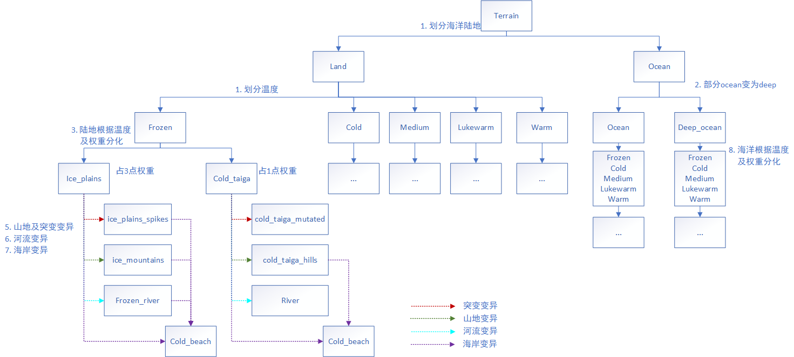
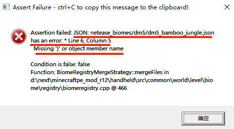
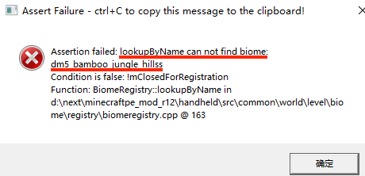
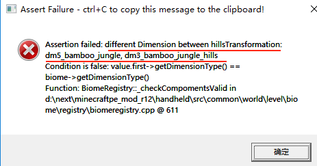
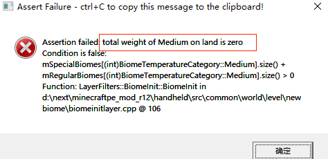

# 群系地貌

## 概述

这篇文章主要讲述了如何通过继承原版的生物群系，并修改其中的一些属性，从而控制自定义维度中的地貌及生物生成。

如果你还不了解什么是“生物群系"，可以先阅读一下[wiki](https://minecraft-zh.gamepedia.com/%E7%94%9F%E7%89%A9%E7%BE%A4%E7%B3%BB)。

## 生物群系生成简介

目前基岩版生物群系生成的管线还处于硬编码的阶段，为了让开发者对配置自定义群系有一个基本的思路，先简单描述一下生物群系生成的各个步骤。如果有兴趣或者想有更深入的了解可以参考java版的源码以及网上的一些解析。

### 术语介绍

- 陆地生物群系：表面被实心方块覆盖的群系。
- 海洋生物群系：表面被水覆盖的群系。json中会带有“ocean”的标签（例如ocean.json）
- 深海生物群系：json中会带有“deep”的标签（例如deep_ocean.json）
- 基础生物群系：第一阶段生成的群系，后续会分化为其他变种。例如陆地的有丛林，森林，沙漠，平原等，海洋的有海洋，深海。json中“minecraft:world_generation_rules”下会带有“generate_for_climates”的键值（例如plains.json）
- 山地生物群系：指以下生成山地阶段中可以转化成的群系。即json中"hills_transformation"的值。

	例如在plains.json中

	```json
	"minecraft:overworld_generation_rules": {
		"hills_transformation": [
		  [ "forest_hills", 1 ],
		  [ "forest", 2 ]
		],
		...
	},
	```

	则forest及forest_hills为plains的山地群系变种。

- 突变生物群系：指以下生成山地阶段中，有较低概率会转化成的变种。即json中"mutate_transformation"的值。并且对应群系的json中会有"mutated"的标签。

	例如在jungle.json中

	```json
	"minecraft:overworld_generation_rules": {
		"mutate_transformation": "jungle_mutated",
		...
	},
	```

	则jungle_mutated为jungle的突变群系。

- 河流生物群系：

	主要指river及frozen_river。在生成河流时，ice_plains会变成frozen_river，其他群系变成river。

- 海岸生物群系：

	陆地群系与海洋群系相邻时，相邻处会生成的过渡群系。json中一般会带有shore或者beach的标签。

### 群系生成流程

1. 将地图划分为海洋及陆地，并决定不同地区的温度。

	温度类型包括：
	
	` frozen, cold, medium, lukewarm, warm `

2. 将海洋部分变为ocean，然后将部分ocean变为deep_ocean

3. 将陆地的部分根据温度分化为基础陆地群系

4. 一些硬编码的生成：

	- 添加蘑菇岛群系

		因此所有情况下都会有mushroom_island及mushroom_island_shore生成

	- 将一些热带雨林群系变异为竹林

		因此如果jungle被允许生成，那么bamboo_jungle也会生成

	- 将一些平原变异为向日葵平原

		因此如果plains被允许生成，那么sunflower_plains也会生成

5. 进行山地及突变变异（根据json中配置的hills_transformation及mutate_transformation）

6. 进行河流变异（硬编码）

7. 进行海岸变异（硬编码）
  
8. 将海洋的部分根据温度分化为基础海洋群系



## 编写格式

1. 在行为包中新建一个netease_biomes文件夹。

2. 为每个需要自定义生物群系的自定义维度创建一个以维度命名的文件夹。

	关于<span id ="jump_to_terrant">自定义维度</span>：

	- 每个维度对应一个id，原生维度中主世界为0，地狱为1，末地为2。旧版自定义维度的id从3开始，一直到20，[新版自定义维度](./1-自定义维度.md#jump_to_custom_dimension)可以自主设置。
	- 自定义维度的名称为"dm"前缀加数字id。如id为3的维度，命名为“dm3”。

3. 在文件夹中编写需要重写的生物群系。对每个自定义群系，命名为原版群系加上维度名字及下划线为前缀。例如dm3维度的desert群系命名为"dm3_desert"。

	对每个自定义群系，必须继承一个原版的生物群系，在description中用inherits表示，新群系的identifier需要与文件名相同。例如dm3维度重写desert群系，则需要编写一个dm3_desert.json：

	```json
	{
	   "format_version": "1.14.0", 
	   "minecraft:biome": {
		   "description": {
			   "identifier": "dm3_desert", 
			   "inherits": "desert"
		   },
		"components": {
			   ...
		   }
	   }
	}
	```

	对每个自定义维度，每个原版群系都会有一个对应了继承他的自定义群系。在生成群系时，流程不会改变，但是生成时取到的是当前维度中继承后的群系。

4. 在新群系中重写属性来覆盖原版群系的属性。

	**没有进行重写的属性会使用原版群系的属性。**

	**没有进行重写的群系，会自动生成一个所有属性与原版群系相同的，带维度名称前缀的群系**

	- 目前支持的原版biomes json的字段包括：
		- minecraft:overworld_height
		- minecraft:overworld_surface
		- 不支持带有[block entity](https://minecraft-zh.gamepedia.com/%E6%96%B9%E5%9D%97%E5%AE%9E%E4%BD%93%E5%80%BC)的方块，也不支持门，床等占多个位置的方块
		- 可使用nbt设置带有auxvalue的方块。目前仅支持设置特殊沙子及特殊泥土类型。可参考原版群系的`mesa_plateau_stone`以及`savanna_mutated`
		- minecraft:world_generation_rules
		- 自定义tag

	所有的hills_transformation，mutate_transformation，值必须为当前维度的群系。

	若原版群系带有这两个transformation，都需要重写为当前维度的群系，所以如果有带这两个transformation的原版群系没被重写，属于未定义行为，会使部分地方表现的不符合预期，例如使用GetBiomeName接口获取到的名字不正确。

	例如原版desert群系，hills_transformation为desert_hills，mutate_transformation为desert_mutated，那么在自定义维度中，保持原有规则需要重写为

	```json
	{
	   "format_version": "1.14.0", 
	   "minecraft:biome": {
		   "description": {
			   "identifier": "dm3_desert", 
			   "inherits": "desert"
		   }, 
		   "components":{
			   "minecraft:overworld_generation_rules": {
					"hills_transformation": "dm3_desert_hills",
					"mutate_transformation": "dm3_desert_mutated"
				}
		   }
	   }
	}
	```

	如果想要删除群系的hills_transformation，mutate_transformation，generate_for_climates属性，可以参考以下方法：

	```json
	{
	   "format_version": "1.14.0", 
	   "minecraft:biome": {
		   "description": {
			   "identifier": "dm4_ice_plains", 
			   "inherits": "ice_plains"
		   }, 
		   "components": {
			   "minecraft:overworld_generation_rules": {
				   "hills_transformation": "dm4_ice_plains", 	//若设置为自己，则不会变异为其他群系
				   "mutate_transformation": "dm4_ice_plains", 	//若设置为自己，则不会变异为其他群系
				   "generate_for_climates": [
					   ["frozen", 0]	//若权重设置为0，则不会生成
				   ]
			   }
		   }
	   }
	}
	```

	需要注意，修改后的维度，陆地（不含ocean的tag）、海洋（含ocean的tag，但没有deep的tag）、深海（同时包含ocean及deep的tag）三种类型，每种类型的五种温度必须至少有1点权重

5. 在新群系中添加新的标签，可用于生物生成等功能。

	在“群系开发模板中”，默认给所有自定义维度添加了一个与维度名称一样的标签，便于开发。

	开发者可以按需添加其他标签。
<span id="jump_to_no_spawn_dragon"></span>

	```json
	{
	   "format_version": "1.14.0", 
	   "minecraft:biome": {
		   "description": {
			   "identifier": "dm4_ice_plains", 
			   "inherits": "ice_plains"
		   }, 
		   "components": {
			   "dm4": {},	//群系开发模板自动添加的标签
			   "my_dm4_tag": {}	//添加其他自定义标签
			   //"netease:no_spawn_end_dragon":{} //不生成末影龙和相关战斗逻辑，仅末地（包含自定义末地）维度可用
		   }
	   }
	}
	```
	注:由于末影龙生物本身是存盘的，所以一旦进入过末地（包含自定义末地）维度创建了末影龙之后，后续再添加`netease:no_spawn_end_dragon`组件也无法删除末影龙，仅屏蔽部分相关逻辑。

6. 配置群系的客户端显示部分，   
   在resource资源包的根目录下新建`biomes_client.json`，为自己想定制的群系id配置。（注：自定义群系如果不配置的话会有个默认配置，此默认配置并非父群系的配置，而是一种类似通用主世界的颜色）
   ```json
   {
		"biomes": {
			"dm22779_hell": {
				"water_surface_color": "#905957",//水面颜色
				"water_fog_color": "#905957",//水下雾效颜色
				"fog_color": "#4B0082"//空气雾效颜色
				//"water_surface_transparency": 1.0//水下不透明度
				//"water_fog_distance": 60//水下可见距离
			},
			"dm559_the_end": {
				"water_surface_color": "#62529e",
				"water_fog_color": "#62529e",
				"fog_color": "#0B080C"
			}
		}
	}

   ```

## 群系开发模板

[CustomBiomesMod](../../../4-DEMO示例/示例简介.html#CustomBiomesMod)中的`tools\template`中提供了模板工具生成符合编写格式最低要求的自定义维度。生成的自定义群系有以下特征：

1. 对两种transformation都进行了对应当前维度群系的重写
2. 保留了原有generate_for_climates的字段
3. 给每个群系添加了与维度名相同的标签
4. 对每个自定义群系，都可以找到一个与之对应的去掉维度名称前缀的原版群系（见参考资料3）

开发者在编写自己的维度时，可以以此为模板进行开发。

使用方法：

1. 在`CustomBiomesMod\customBiomesBehaviorPack\tools`目录打开命令行，输入

	```
	python .\remake.py [维度名称]
	```

​	维度名称为自定义维度的名称，例如要更改dm6自定义维度的群系，则输入

	```
	python .\remake.py dm6
	```

​	然后tools文件夹下会生成一个维度命名的文件夹。

2. 将生成的文件夹拷贝到您的mod的netease_biomes下
3. 前面完成了“编写格式”2-4步中编写一个合法自定义维度的最低要求。开发者可以在此基础上进行开发，修改群系的components。

## demo解释

示例[CustomBiomesMod](../../../4-DEMO示例/示例简介.html#CustomBiomesMod)中定义了3个自定义维度，python脚本实现了玩家输入维度名称时把他传送到对应维度的功能。

- dm3

	使用模板工具生成，未作任何修改的维度，生成的地形与主世界完全一致。

- dm4

	只会生成ice_plains及frozen_ocean的维度。

	1. 把dm4_ice_plains及dm4_frozen_ocean的generate_for_climates属性都设置为所有温度都拥有1点生成权重，然后把所有其他群系的权重都改为0。

		这样在生成基础群系时仅会生成这两种群系。

	2. 把dm4_ice_plains的hills_transformation及mutate_transformation设置为自身。frozen_ocean没有这两个属性，则不用设置。

		这样在进行山地变异及突变变异时不会生成其他群系

	注意：

	因为目前一些硬编码的生成过程，除了ice_plains及frozen_ocean，还会生成mushroom_island，mushroom_island_shore（蘑菇岛的海岸变种），cold_beach（冰原的海岸变种），frozen_river（冰原的河流变种），以及river（cold_beach的河流变种）。因此该维度一共会有7种群系生成。

- dm5

	只会生成ice_plains及frozen_ocean，并且地面由矿石方块构成。

	1. 参考dm4的第一及第二步

	2. 修改生成的7种群系（见dm4的注意）的方块构成。例如dm5_ice_plains中

	```json
	"minecraft:surface_parameters": {
		"sea_floor_depth": 7,
		"sea_floor_material": "minecraft:emerald_block",
		"foundation_material": "minecraft:iron_block",
		"mid_material": "minecraft:gold_block",
		"top_material": "minecraft:diamond_block",
	    "sea_material": "minecraft:water"
	}
	```

	则群系的表面为钻石块，中间为金块，下面为铁块。

## 参考资料

1. [官网wiki](https://minecraft.gamepedia.com/Bedrock_Edition_beta_biomes_documentation)上有更多的自定义生物群系json格式及说明：
2. 原版生物群系的json可以在“Mod PC开发包”的`data/definitions/biomes`目录找到

## 注意事项

1. 通过该方法定义的自定义维度不可以与“MirrorDimension”接口一起使用

2. 当存档卸载带自定义生物群系的mod时，地图的已探索区域会保持自定义的形态，但卸载后新探索的区域会变回原版生物群系。

   若对存档重新加载mod，卸载后新探索的区域会保持原版群系的形态。

3. 如果您不是首次使用自定义生物群系，那么在修改旧版mod时，需要留意json中的format_version。

   从网易1.21版本开始，生物群系的format_version从1.13.0升级为1.14.0，并且json的结构发生了如下改变：

   - minecraft:overworld_surface改名为minecraft:surface_parameters

   - minecraft:surface_parameters，minecraft:swamp_surface，minecraft:mesa_surface，minecraft:frozen_ocean_surface中的属性作以下调整：

     floor_depth改名为sea_floor_depth

     floor_material改名为sea_floor_material

     新增了sea_material

   - minecraft:world_generation_rules改名为minecraft:overworld_generation_rules

   - minecraft:surface_material_adjustments/adjustments/materials下，floor_material改名为sea_floor_material

   如果您需要升级json版本来使用新的功能，可以使用群系开发模板生成最新的1.14.0版本的json，然后合并修改，又或者手动根据以上规则升级您的json。无论您采用哪种方式，请确保json的结构与format_version一致。


## 常见报错

1. JSON: xxx has an error

	一般为json格式有问题，可以检查一下逗号时候漏写或多写，括号是否对应。

	图为多写逗号的报错

	

2. lookupByName can not find biome

	一般为两种transform填写的群系名有问题

	图为群系名多写了一个s

	

3. different Dimension between 

	一般为没有重写原版的transform，或者填写的群系与当前群系不是同一维度。

	若使用“群系开发模板”进行开发，检查是否漏了第2步

	图为在dm5的bamboo_jungle群系中，把hillsTransformation误填为dm3的群系

	

4. total weight of xxx is zero

	某个温度的总权重为0。检查generate_for_climates属性的编写

	图为陆地的medium温度的权重为0

	

5. empty Biome in xxxTransformation

	transformation填写了空字符串

6. Definition of biome xxx is invalid!

	继承关系有问题，检查是否继承不带维度前缀的原版群系

7. value of json is not valid

	检查json的内容是否合法，例如component的拼写，各个属性的拼写等
