# 从零开始创建UI界面

这篇教程会详细介绍如何通过MCStudio内嵌的UI编辑器，创建一个基础的FPS战斗界面。教程包括界面控件的创建（包含面板，图片和按钮）以及按钮相关的逻辑绑定。将按照以下步骤来进行介绍：
* 如何根据自己的需要使用UI编辑器进行界面编辑和保存
* 如何根据json中的内容进行按钮逻辑python的相关绑定

## 使用UI编辑器
假设大家已经看过了《Mod开发简介》以及[脚本开发入门](../02-Python脚本开发/0-脚本开发入门.html)，已经会自己搭建一个新的MOD，如果有不清楚的可以参考我们提供的Demo《awesomeMod》，如下图所示：

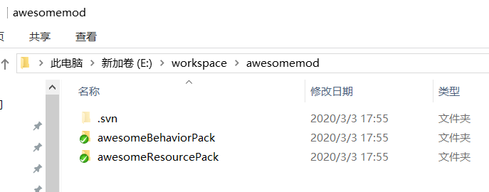

### 进入UI编辑器
使用MC Studio进行Mod编辑，进入编辑器后，如果当前显示的为地图编辑器，那么点击左上角图标，会显示编辑器列表，选择其中的“界面编辑器”，如下图：

### 导入UI资源
首先，我们把制作界面需要的图片通过UI编辑器的资源管理窗口，选择图片文件导入。如下图。

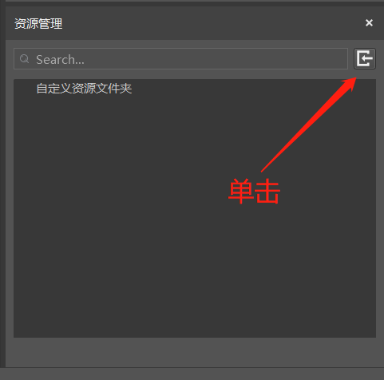

注意，目前我们仅支持png格式的图片文件，此外，图片名称仅支持以数字、字母、下划线组成的名称，该命名规则也是整个UI编辑器通用的命名规则，若不满足以上规则，资源导入会失败。

成功导入图片后的资源管理窗口如下图所示。

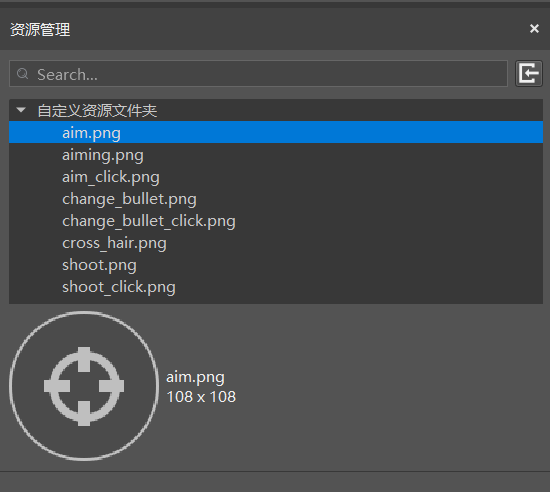

### 新建UI文件
现在，在左侧的界面文件列表界面中，点击新建按钮新建一个UI文件，如下图。

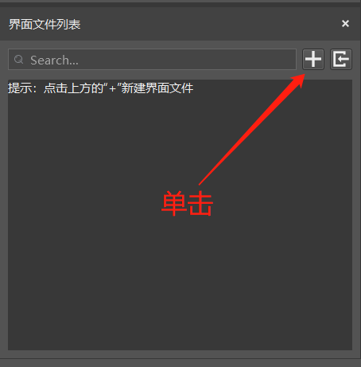

我们将新建的UI文件命名为fpsBattle。新建UI文件成功后，UI编辑器会自动载入该UI文件的编辑模式，并自带main画布，整体界面如下图所示。

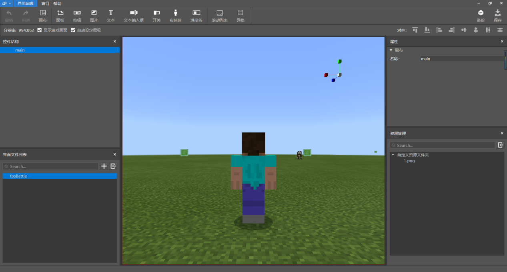

### 创建panel面板控件
首先，我们先创建两个面板（panel）。面板是所有控件中最基础的一个，除去通用属性外，没有任何专属属性，主要用于控件归纳，就如同文件夹一样。创建面板和创建所有其他控件一样，有两种方法，工具栏，以及控件结构窗口右键创建，如下图。

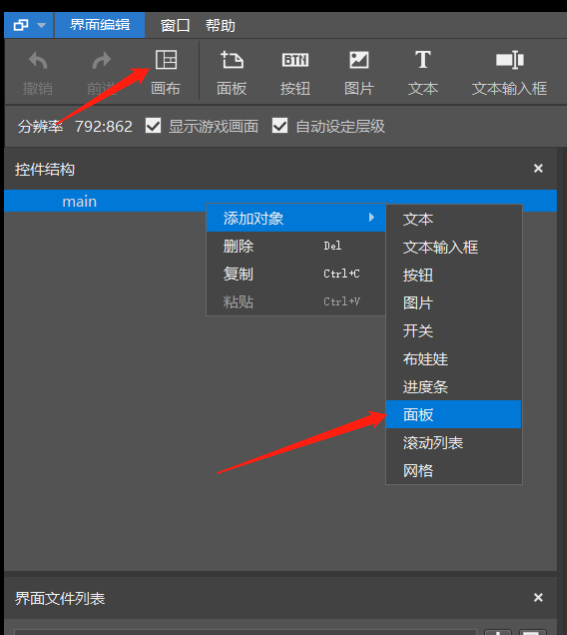

### 重命名控件
创建完毕后对两个面板进行重命名操作，方法同样有两种，在控件界面窗口中双击对应控件，或在右侧的属性面板中修改名称，如下图。将其重命名为aimPanel，buttonPanel分别用来存放准心图片控件和所有按钮控件。

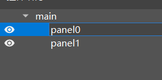

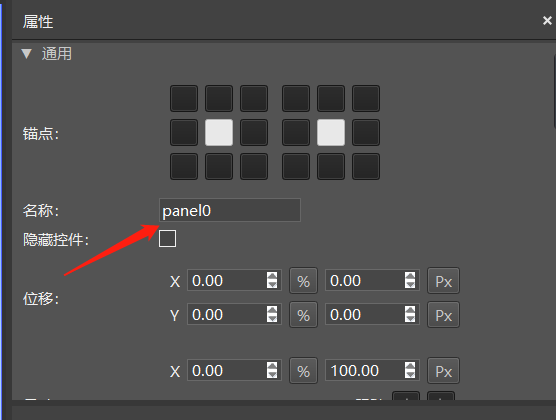

### 创建准心图片控件
面板创建成功后，我们来创建准心，准心通常是一张图片，和新建面板一样我们选中aimPanel并新建一个图片控件，这样新建的控件将会将aimPanel作为父节点。然后将其重命名为aimImage，如下图。

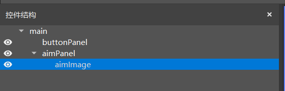

创建完成之后，我们将先前导入图片资源拖曳进在右侧的资源窗口中的贴图设置处进行赋值，完成后场景中的图片就会由默认图片显示变为我们导入的图片显示，如下图。

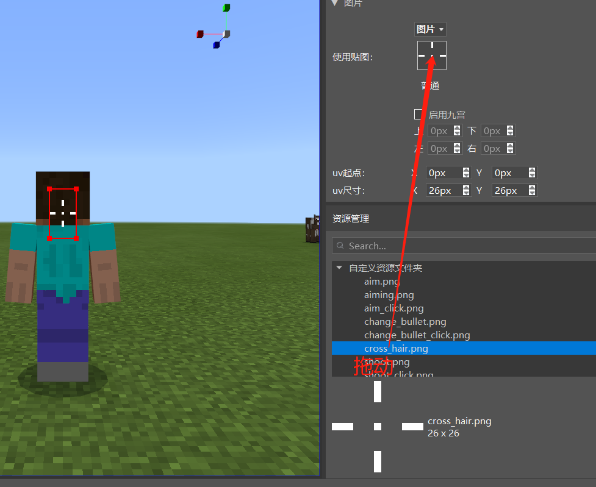

图片设置后，我们就可以通过调整锚点、尺寸和位移调整该控件相对于父节点的位置。这三个属性描述如下，最后调整结果如下图：

锚点：每个控件有9个定位点，包括四个角、四边的中点、中心点，锚点可以设定子控件的哪个定位点和父控件的哪个定位点重合，下图中左侧对应父控件、右侧对应子控件。

位移：位移用于控制该控件相对于锚点位置的偏移。位移的形式为%+Px。%表示父控件尺寸的百分比，Px表示像素。

尺寸：尺寸为控件的宽（X）和高（Y）。也是%+Px的形式，其意义同位移。相比于位移的配置，尺寸还可设置跟随关系。

一般来说，控件的偏移和尺寸均用Px配置即可，比较复杂的情况才需要用到%。

这里我们只是简要概括一下控件属性的作用和用法，详情请前往阅读[UI说明文档](4-UI说明文档.html)。

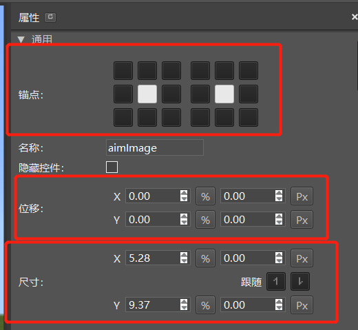

设置完成后的界面如下图。

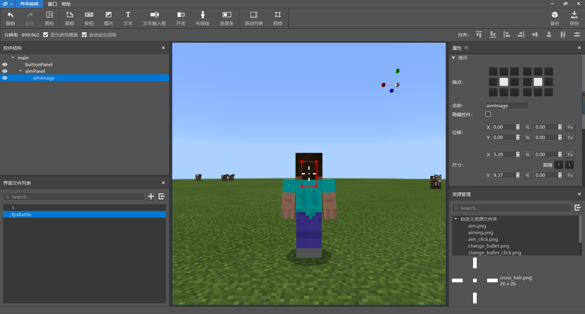

### 创建瞄准按钮控件
准心完成之后，我们随后来制作瞄准按钮。选中buttonPanel并以该节点作为父节点创建按钮控件，步骤等同于创建图片控件，创建完成之后，和上述aimImage一样设置名称、锚点、尺寸等通用属性，如下图。

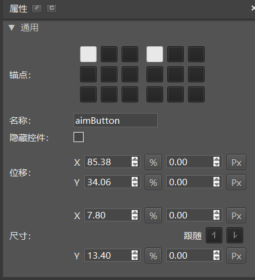

和图片控件不同的是，按钮控件有三种图片状态可供设置，分别是默认状态，按下状态和鼠标悬浮状态，由于悬浮状态用处不大暂时忽略，这边我们另外导入两张图片并拖动设置进按钮，如下图。

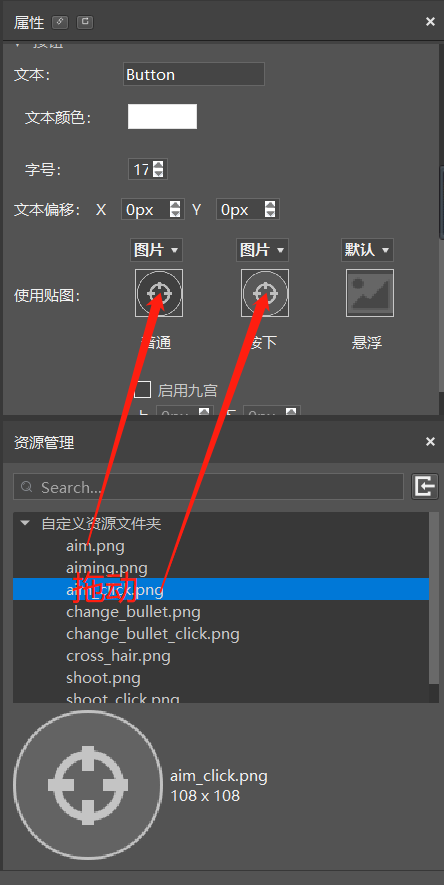

而因为瞄准按钮不需要按钮文字，我们顺便可以把按钮属性中的按钮文本设置为空，这样一来aimButton同样设置完毕，界面如下图.

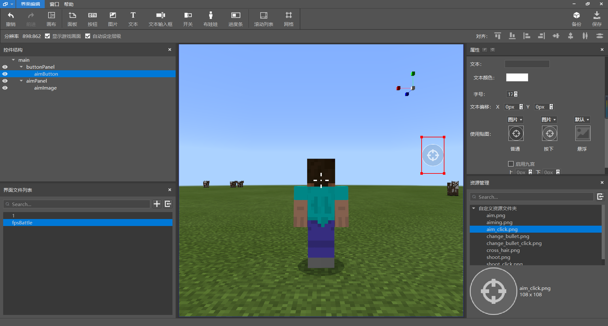

### 创建瞄准镜控件
接下来我们制作瞄准镜图片控件，将aimPanel作为父节点创建图片控件，创建完成之后，和上述aimImage一样设置名称、锚点、尺寸等通用属性，如下图。

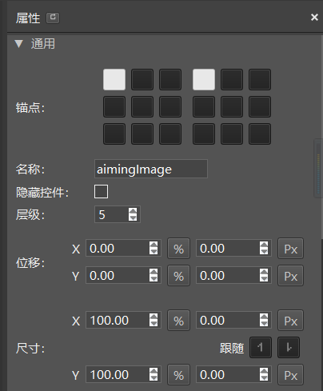

拖动瞄准镜图片赋值，如下图。

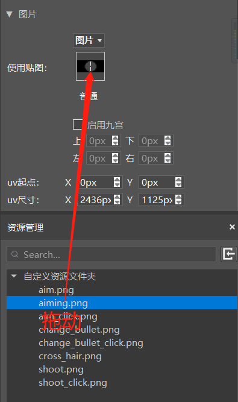

赋值完成后界面如下图。

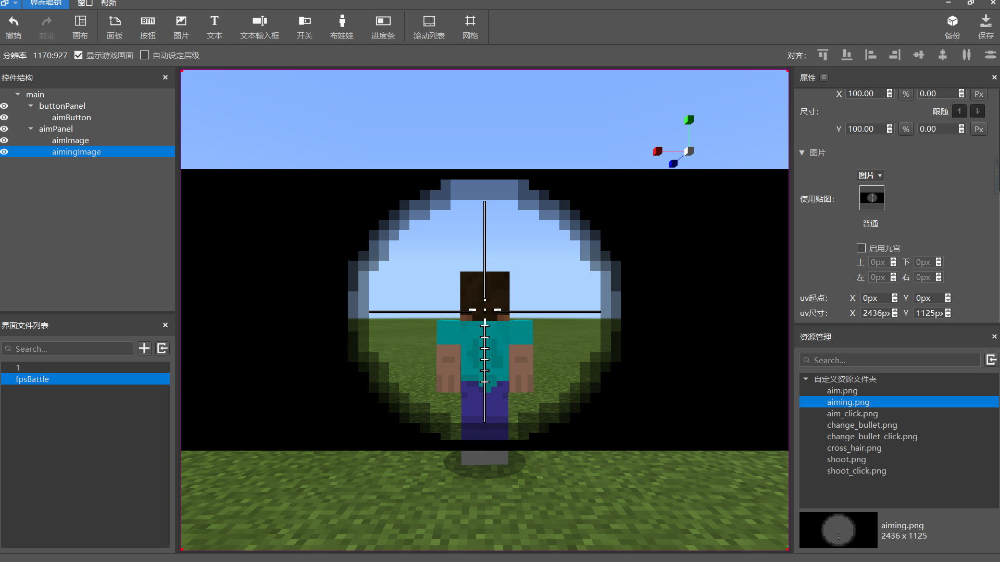

我们可以看到，瞄准镜控件赋值完成后出现了两个问题
* 瞄准镜图片盖住了我们刚刚创建的瞄准按钮
* 瞄准镜的图片没有覆盖整个场景

针对这些问题，我们一个一个解决。第一个问题很明显是层级问题，我们默认制作的UI中每个控件的层级遵循控件结构窗口中从上到下的控件层级从小到大排列的原则，如果想自己控制每个控件的层级有两种方法。

一种是在控件结构窗口中拖动控件到想要的位置，系统会自动重新计算各个控件的层级。拖动到控件上则被拖动的控件会成为该控件的子物体，且位于最底层，拖动到两个控件中间，则被拖动的控件会和这两个控件平级，且层级位于两个控件之间，如下图。

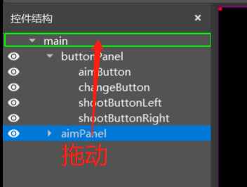

或者在工具栏中取消勾选自动层级调整的选项即可，但需注意，一旦将该UI文件设置成取消自动层级调整状态，将不可设置回自动状态。如下图。

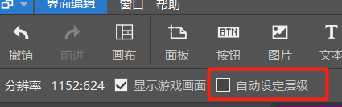

设置完成后，每个控件的通用属性区域就会多出一个层级属性，我们将buttonPanel的层级调整为2，aimPanel的层级调整为1，这样所有按钮的层级都会在图片的上方，如下图。

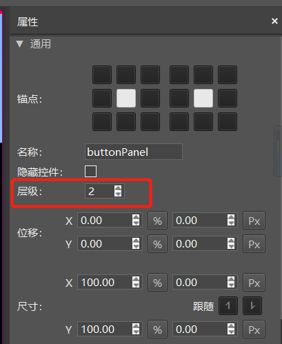

设置完成后，层级表现就正确了。接下来第二个问题，默认情况下，UI系统会默认保证图片的原生比例，让玩家自定义的方法是开启图片控件的九宫切图设置，让图片遵循九宫切图原则，如下图。

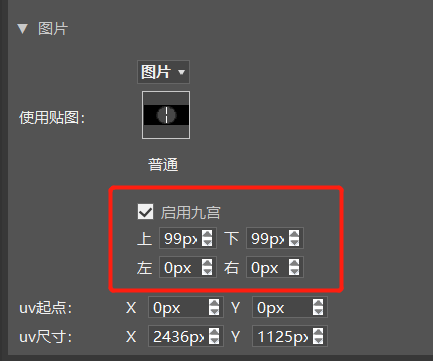

### 完善我们的UI
以此类推，我们在buttonPanel下新建changeButton切换弹匣按钮，aimButton瞄准按钮，shootButtonLeft模拟左键射击按钮，shootButtonRight模拟右键射击按钮，调整它们的锚点、大小和位置，使之到达正确的位置，如下图。

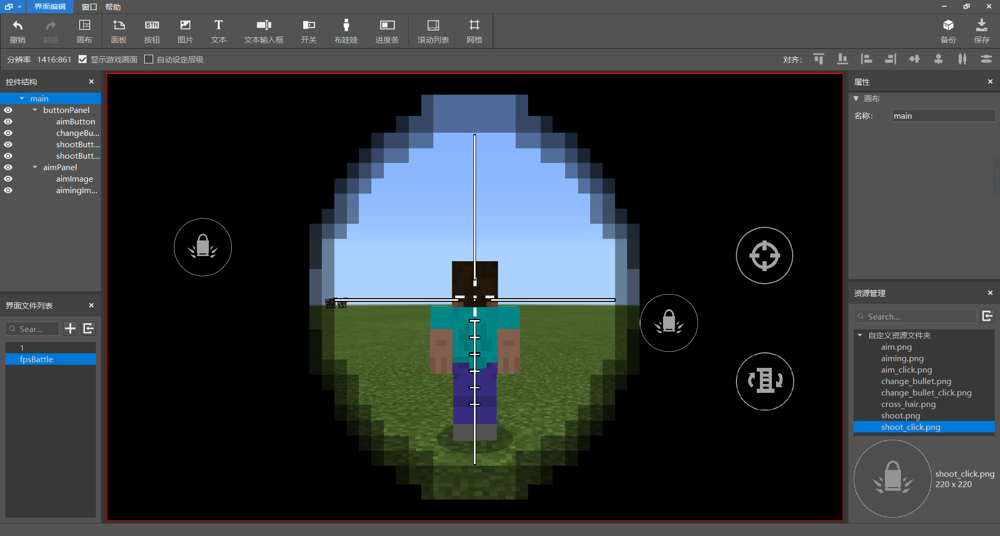

### 保存UI文件
界面完成之后点击右上角保存按钮，如下图，UI文件制作完成。

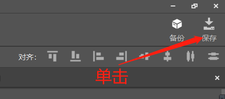

保存成功后，fpsBattls.json文件会输出到mod存档资源包的ui文件夹下，如下图。

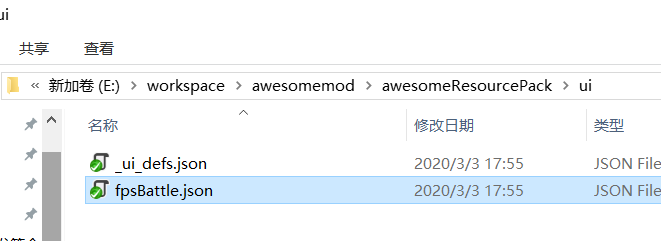

## 创建python逻辑
从上一部分的描述中我们可以得知，UI编辑器制作的json文件只负责界面布局，以及各个控件属性的初始状态。而游戏中的UI除了布局还包含具体的界面逻辑，这就需要我们通过python代码加以实现。

首先我们学习如何创建UI文件对应的python类。我们在[AwesomeMod](../../4-DEMO示例/示例简介.html#AwesomeMod)的行为包文件夹下找一个合适的路径创建用来编写ui逻辑的python文件，新建txt文件然后将文件后缀名改为py。如下图所示，我们将其命名为fpsBattle。

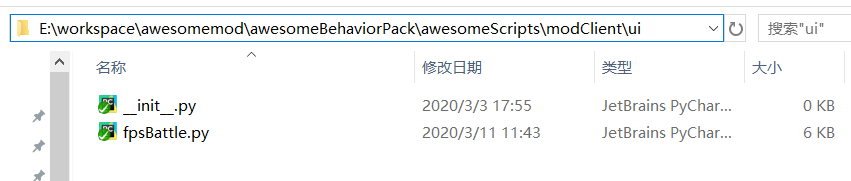

创建好了python文件，我们使用编辑器打开该文件进行编辑。我们导入client.extraClientApi模块，这是我们开发的Client端Api接口文件，并从中获得ScreenNode类，所有的UI逻辑类都必须继承ScreenNode。如下图所示。

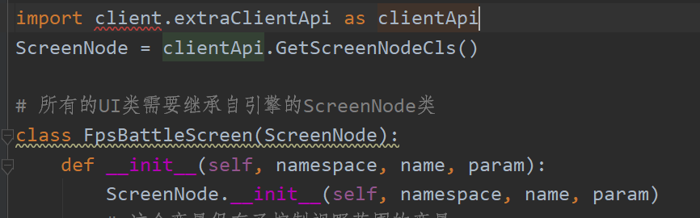

之后我们学习将UI在游戏中显现出来。显示UI的逻辑代码我们需要写在mod客户端代码中，如下图所示。

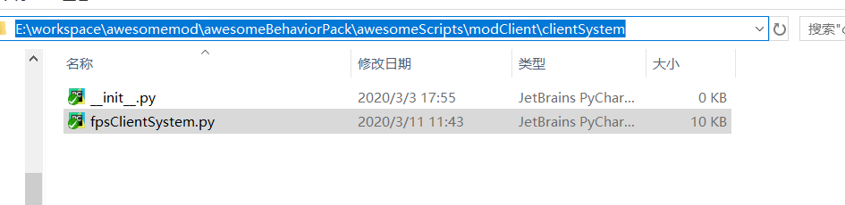

mod客户端提供的OnUIInitFinished事件，在引擎初始化完成后调用，我们可以在这里创建我们的fpsBattle界面。我们使用RegisterUI接口注册UI界面，CreateUI接口创建UI界面，GetUI接口可以获得对应的UI实例，经过图中几行代码的运行，我们就可以成功将UI界面在游戏逻辑中创建出来了。具体的内容可以参考awesomeMod内容。

这样其实我们已经完成了一个非常基本的界面，但我们想做多一些。

## 使用UIAPI
创建完了UI实例，下面我们通过一个简单的例子学习如何通过使用UI API完成控件属性动态修改，如下图.

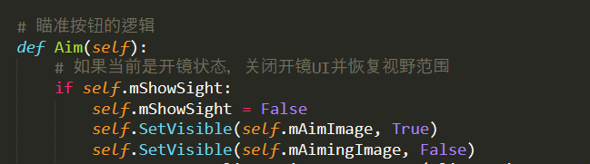

图中的代码代表我们在开镜状态下按下瞄准按钮，隐藏瞄准镜图片同时显示准心的代码。当UI继承自ScreenNode后，就可以调用一系列的UI API函数，图中SetVisible可以将对应的控件的visible属性进行设置，实现控件隐藏显示。

我们利用[UI API文档](5-UIAPI文档.html)中对各个控件的接口和游戏原生支持的格式化，可以在python代码中动态的改变界面的表现，具体可以参考[样式代码](https://minecraft-zh.gamepedia.com/index.php?title=%E6%A0%B7%E5%BC%8F%E4%BB%A3%E7%A0%81&variant=zh)

当然，更多API功能还需要你的发现和尝试。