# UI说明文档

## 文件命名说明

* json文件名  json中的namespace  python文件名  三者需要一致

* 示例中为"myUIName"

```json
    myUIName.json

    "namespace" : "myUIName"

    myUIName.py

```

## JSON编写说明

Json是UI界面的显示内容和绑定的集合，UI是一种树状的组织结构，界面和界面中的控件都是一个UI Node节点，后续的很多方法的调用也需要这个树状结构的路径来标识。

* 注：目前MCStudio已提供UI编辑器，开发者可以在UI编辑器内对界面进行可视化编辑，并导出可以使用的json文件。各个控件在UI编辑器中的使用介绍将在下文中详细介绍。

### 命名空间

命名空间是这个界面的名称，我们规定json文件名和namespace一致。

```json
	"namespace" : "myUIName"
```

### Main Screen

main是这个界面名称，我们规定使用main，即一个json文件是一个界面。

controls中的内容是该界面下的树状节点，即子节点。

```json
	"main@common.base_screen" : {
		"controls" : [
		]
	}
```

|          变量           | 解释                                          |
| :---------------------: | :-------------------------------------------- |
| main@common.base_screen | 表示main screen是common.base_screen的一个子类 |

```
my_namespace
|____main
     |test_image
	 |test_panel
              |test_label
```

* 关于控件的适配问题，固定大小像素能在屏幕像素发生变化时保持形状大小不变，而百分比则能够保持与屏幕分辨率一致的比例，可能导致控件变形。


### 特殊情况下的根节点路径变化

一般地，在使用UI API时，对某控件进行操作时我们需要通过传入该控件相对于展示screen的相对路径来对控件实例进行操作，例如如下UI界面结构

```
my_namespace
| main
	| panel0
		| text0
```

text0的路径为

```
path = "/panel0/text0"
```

但是当展示screen为了使用原生的功能而继承了common.base_screen时，部分功能的生效会伴随着根节点路径的修改，因此在使用UI API时控件的路径都发生了变化。

#### 适配异形屏

为了适配异形屏，我们可以展示screen中的内容通过引用的形式写在screen的$screen_content属性中。

```json
	"main@common.base_screen" : {
		"$screen_content":"myUIName.panel0"
    },
    "panel0":{
        "controls" : [
            {
                "text0@myUIName.text0" : {}
            }
        ],
        "type" : "panel"
    },
    "text0" : {
      "text" : "Hello World!",
      "type" : "label",
      "visible" : true
   }
```

被$screen_content引用的内容，其显示内容的范围不会被异形屏遮挡。此时text0的路径为

```
base_path = "/variables_button_mappings_and_controls/safezone_screen_matrix/inner_matrix/safezone_screen_panel/root_screen_panel"
path = base_path + "/panel0/text0"
```

可见控件的路径相对于展示screen的相对路径前还需要加上base_path路径才能正确拿到对应text0控件的路径，有关text0的api才会生效。

## 控件介绍

### screen

screen，即画布控件，是游戏中一个UI界面的根节点，所有其他控件只有挂在画布下才能被正确显示出来。

```json
"main1" : {
      "absorbs_input" : true,
      "always_accepts_input" : false,
      "controls" : [
         {
            "label0@test.label0" : {}
         }
      ],
      "force_render_below" : false,
      "is_showing_menu" : true,
      "render_game_behind" : true,
      "render_only_when_topmost" : true,
      "should_steal_mouse" : false,
      "type" : "screen"
   },
   "main2@common.base_screen" : {
      "$screen_content" : "test.netease_editor_root_panel_base_screen0",
      "absorbs_input" : true,
      "always_accepts_input" : false,
      "force_render_below" : false,
      "is_showing_menu" : true,
      "render_game_behind" : true,
      "render_only_when_topmost" : true,
      "should_steal_mouse" : false
   },
   "netease_editor_root_panel_base_screen0" : {
      "anchor_from" : "top_left",
      "anchor_to" : "top_left",
      "controls" : [
         {
            "label1@test.label1" : {}
         }
      ],
      "layer" : 1,
      "offset" : [ 0, 0 ],
      "size" : [ "100%", "100%" ],
      "type" : "panel",
      "visible" : true
   }
```

|  <div style="width:100px">变量</div>      | 解释                                                         |
| :------------: | ----------------------------------------------------------- |
|      type      | 当前控件类型 |
|  absorbs_input  | 是否阻挡输入，默认值为true，置false时方向键生效 |
|   always_accepts_input    | 是否始终接受鼠标事件，默认值为false，置true时该界面不在堆栈顶部也可以接受事件  |
|     force_render_below      | 是否渲染下方的界面，默认值为false，置true时被该界面覆盖的界面也会被渲染 |
|     is_showing_menu     | 是否是非常驻UI界面，默认为true，置false时该界面不会影响hud_screen的渲染 |
|      render_game_behind      | 是否在该界面创建时依然渲染游戏，默认值为true，置false时该界面创建时游戏界面定格 |
|    render_only_when_topmost     | 是否仅在堆栈顶部时渲染，默认值为true，置false时即使该界面被其他界面覆盖也会被渲染 |
|    should_steal_mouse     | 是否隐藏鼠标，默认值为false，置true时该界面被创建时将不会出现鼠标 |
|    $screen_content     | 当该画布继承自common.base_screen时生效，会将该属性对应的控件作为该画布的内容显示，该内容将会适配异形屏 |

* 注

always_accepts_input，force_render_below， render_game_behind， render_only_when_topmost属性仅在调用PushScreen接口创建UI时才会正常生效。

absorbs_input，is_showing_menu，should_steal_mouse暂时无法生效，等待后续修复。

下图为UI编辑器中画布属性编辑面板

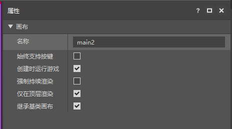

|  <div style="width:100px">变量</div>      | 解释                                                         |
| :------------: | ----------------------------------------------------------- |
|  始终支持按键  | 对应always_accepts_input字段 |
|   创建时运行游戏    | 对应render_game_behind字段  |
|      强制持续渲染     | 对应force_render_below字段 |
|    仅在顶层渲染     | 对应render_only_when_topmost字段 |
|    继承基类画布     | 是否继承基类控件，若勾选，UI编辑器会自动创建一个不可见的，以netease_editor_root_panel开头的panel，并将该画布的内容放置在该panel下，并将$screen_content属性代表的控件指向该panel。继承基类控件后，画布内容将会适配异形屏。 |

### <span id="控件通用属性"></span>通用属性

通用属性是每个控件都支持编辑的属性，对每个控件的位置、大小等基本属性进行设置。
|  <div style="width:100px">变量</div>      | 解释                                                         |
| :------------: | ----------------------------------------------------------- |
|  anchor_from  | 挂接在父节点锚点的位置，取值范围["top_left", "top_middle", "top_right", "left_middle", "center", "right_middle", "bottom_left", "bottom_middle", "bottom_right"] |
|   anchor_to    | 自身挂接锚点的位置，取值同anchor_from  |
|     layer      | 当前控件相对父节点的层级，最终显示层级取决于父节点到该节点的layer之和 |
|     offset     | 自身相对父节点的偏移，值为百分比+像素(1个像素等于屏幕上3个像素) |
|      size      | 相对父节点的大小，取值同offset                               |
|      type      | 当前控件类型                                                    |
|    visible     | 默认是否显示，true为显示，false为不显示                      |

下图为UI编辑器中控件的通用属性编辑面板

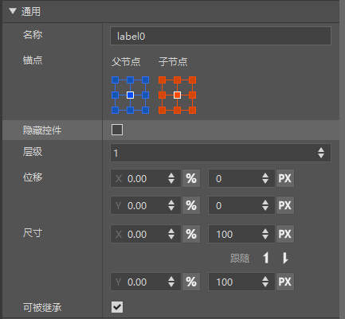

| <div style="width:100px">变量</div>  | 解释                                                         |
| :-----------------: | ----------------------------------------------------------- |
|   锚点   | 左右两侧的按钮组分别代表anchor_from字段和anchor_to字段的值，从左到右从上到下依次代表取值范围中["top_left", "top_middle", "top_right", "left_middle", "center", "right_middle", "bottom_left", "bottom_middle", "bottom_right"]的其中一个 |
|   名称    | 改变控件的名称，只接受字母、数字、下划线的组合|
|     隐藏控件     | 对应visible字段，设置visible属性会实时的反映在UI编辑器左侧的控件结构窗口里 |
|     层级     | 对应layer字段， 当UI编辑器关闭自动层级调整功能时，该属性会在属性窗口中出现。该属性仅支持正整数。 |
|      位移      |对应offset字段，用于控制该控件相对于锚点位置的偏移。位移的形式为%+Px。%表示父控件尺寸的百分比，Px表示像素，需要子控件的偏移和父控件的尺寸相关时，就需要用%配置。%和Px的按钮可点击，点击后会在两种形式中切换。|
|      尺寸     | 对应size字段，尺寸为控件的宽（X）和高（Y）。也是%+Px的形式，其意义同位移。相比于位移的配置，尺寸还可设置跟随关系。下图中，点亮了“↓”后，表示X跟随Y，如果Y的尺寸是100Px，X是20%+5Px，那么宽度为20%×100+5=25。点亮“↑”时，表示Y跟随X，计算方式同理。需要宽和高关联时，就需要用到%配置。|
|     可被继承     | 若勾选可被继承，则该控件可以被继承控件继承使用，反之则不能被继承。勾选后，该控件会生成在json文件的最外层，和main处在同一层级，即一个命名空间下唯一，不勾选则生成在该控件父节点的controls字段中 |

### Label

Label 是文本框控件，用来显示文本信息，默认的字体是MC字体，如果有中文会变成中文字体格式，暂时不支持换字体，可以通过接口统一设置字体，如果需要设置后续有介绍。
```json
  "label0" : {
      "anchor_from" : "center",
      "anchor_to" : "center",
      "color" : [ 1, 1, 1 ],
      "font_scale_factor" : 1.0,
      "font_size" : "normal",
      "font_type" : "smooth",
      "layer" : 1,
      "offset" : [ 0, 0 ],
      "shadow" : false,
      "size" : [ 100, 100 ],
      "text" : "Hello World!",
      "text_alignment" : "center",
      "line_padding" : 0.0,
      "type" : "label",
      "visible" : true
   },
```
| <div style="width:150px">变量</div> | 解释                                                         |
| :------------: | ----------------------------------------------------------- |
|     color      | 字体颜色（r , g, b, a）取值范围[0 , 1]                       |
|   font_size    | 字体大小，取值["large", "normal", "small"]|
|   font_scale_factor    | 字体缩放比例     |
|     shadow     | MC自带的字体阴影，true为显示，false则不显示                  |
|      text      | 该Label显示的内容，可以通过后续的API在代码中设置该值         |
| text_alignment | Label中文字的对齐方式，取值为["left", "center", "right"]     |
| line_padding | 行间距，可以设置每行文字之间的间距     |

下图为UI编辑器中文本控件的属性编辑面板

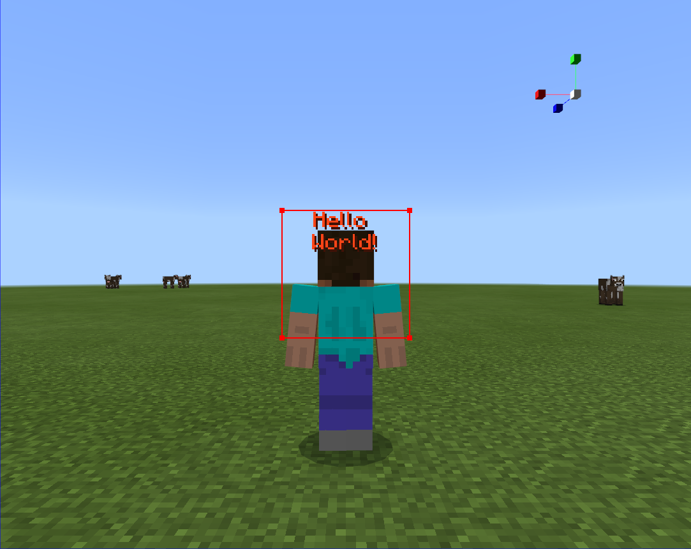

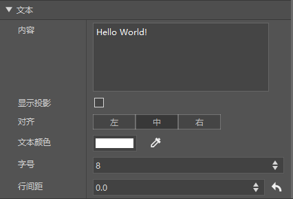

| <div style="width:100px">变量</div>  | 解释                                                         |
| :------------: | ----------------------------------------------------------- |
| 内容 | 对应text字段，支持任何形式的文本     |
| 显示投影 | 对应shadow字段  |
| 对齐 | 对应text_alignment字段，左中右对应["left", "center", "right"]数据   |
| 文本颜色 | 对应color字段，点击按钮弹出颜色选择窗口，可以在调色板上取色或者使用吸管吸取界面上的颜色|
| 字号 | 对应font_size和font_scale_factor字段，以一定的规则同时设置两个字段达到字号的效果 |
| 行间距 | 对应line_padding字段 |

### NineSliceImage

NineSliceImage是指九宫格图片控件，可以动态设置控件图片，该控件相比Image会随着拉伸改变九宫格的形状，该九宫格只显示切片后中心宫的内容。

```json
   "image0" : {
      "anchor_from" : "center",
      "anchor_to" : "center",
      "is_new_nine_slice" : false,
      "layer" : 2,
      "nine_slice_buttom" : 0,
      "nine_slice_left" : 0,
      "nine_slice_right" : 0,
      "nine_slice_top" : 0,
      "offset" : [ 0, 0 ],
      "size" : [ 100, 100 ],
      "texture" : "textures/netease/common/image/default",
      "nineslice_size" : [ 0, 0, 0, 0 ],
      "type" : "image",
      "uv" : [ 0, 0 ],
      "uv_size" : [ 107, 107 ],
      "visible" : true
   },
```

| <div style="width:150px">变量</div>   | 解释                                         |
| :-----------------: | -------------------------------------------- |
|    texture     | 贴图的路径，该路径从resouce_pack中的textures目录开始 |
|       uv       | uv坐标的初始值为[0, 0]。uv坐标为[x,y]表示图片控件以所选图片左上角为原点，偏移(x,y)像素开始截取图片。 |
|       uv_size       | uv尺寸表示需要显示的尺寸，默认值为图片的宽高。uv尺寸为[x,y]表示图片控件将截图x*y像素的图片范围显示在控件中。 |
| is_new_nine_slice | 设置为true标记该图片为NineSliceImage类型图片，与下方的nine_slice_bottom,nine_slice_left,nine_slice_right,nine_slice_top共同设置旧版九宫属性|
| nine_slice_bottom | 切片距离下边的距离，默认值为0                |
| nine_slice_left   | 切片距离左边的距离，默认值为0                |
| nine_slice_right  | 切片距离右边的距离，默认值为0                |
| nine_slice_top    | 切片距离上边的距离，默认值为0                |
| nineslice_size    | 设置原版九宫属性，相比于旧版九宫属性更符合像素风格。当设置了旧版九宫属性时优先旧版属性。该值支持数组和单个数字，数组代表[left,top,right,down]九宫属性，单个数值代表上下左右均采用该数值作为九宫属性，当四个方向的数值均为0时表示不开启原版九宫 |


下图为UI编辑器中图片控件的属性编辑面板，从支持的属性可以看出，UI编辑器中所支持的图片控件类型为NineSliceImage

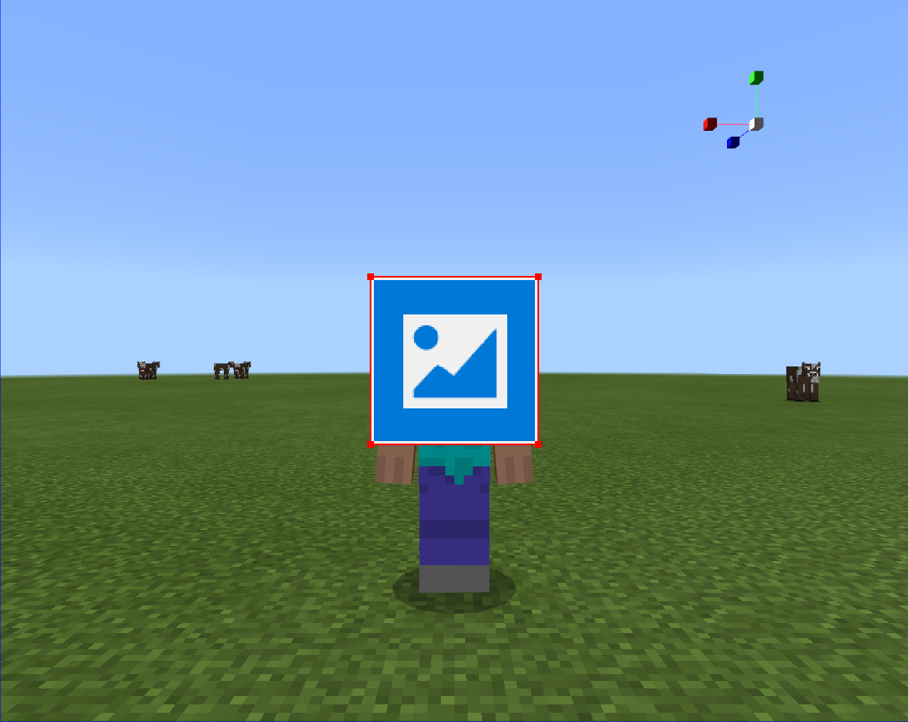

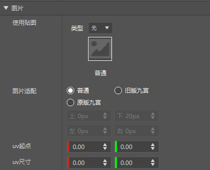

| <div style="width:100px">变量</div> | 解释                                                 |
| :------------: | ---------------------------------------------------- |
| 使用贴图 | 对应texture字段，将资源管理窗口中的图片资源拖曳到该图片小窗内赋值，可以在上方的下拉选项栏中重新选回默认图片 |
| 图片适配 | 普通表示不开启九宫，选中旧版九宫则is_new_nine_slice置true，开启旧版九宫设置，选中原版九宫则开启原版九宫。 |
|      type      | 类型为image                                          |
|       uv起点       | 对应uv字段，默认为0，0 |
|      uv尺寸      | 对应uv_size字段，默认值为该texture的宽高                                                       |

### Image Animation

图片控件允许开发者在该控件范围内制作简单的UI动画，即UI动画的属性都依赖于一个图片控件。

#### 序列帧

序列帧动画，又称逐帧动画，其原理是在“连续的关键帧”中分解动画动作，也就是在时间轴的每帧上逐帧绘制不同的内容，使其连续播放而成动画。通过一张序列帧动画资源图，以及一些自定义的设置，可以在图片控件上展示序列帧动画。

```json
"img_sfx" : {
      "anchor_from" : "top_left",
      "anchor_to" : "top_left",
      "layer" : 1,
      "offset" : [ 0, 0 ],
      "size" : [ 30, 30 ],
      "texture" : "textures/ui/eating_apple",
      "type" : "image",
      "uv" : "@myUIName.img_animation",
	   "disable_anim_fast_forward": true,
      "uv_size" : [ 64, 64 ],
      "visible" : true
   },
   "img_animation": {
    "anim_type": "flip_book",
    "initial_uv": [ 0, 0 ],
    "frame_count": 36,
    "frame_step": 1,
    "fps": 10,
    "reversible": false,
    "easing": "linear"
  }
```

img_sfx是一个图片控件，用法可见上一个小节（NineSliceImage）。和一张静态图片不同的是以下几个属性

| <div style="width:150px">变量</div>   | 解释                                         |
| :-----------------: | -------------------------------------------- |
|    texture     | 贴图的路径，贴图需要符合序列帧样式，如下图 |
|       uv       | 以@符号起始，引用一个序列帧控件img_animation，该序列帧控件所播放的动画就会成为该图片控件的内容。 |
|       uv_size       | uv尺寸表示需要显示的尺寸，要和序列帧贴图中的一帧大小相同 |
|       disable_anim_fast_forward       | 当uv指定了序列帧控件时该属性生效，默认值为false，表示是否需要禁止该序列帧快进 |

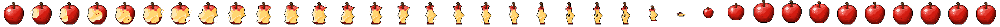

img_animation代表序列帧动画控件，该控件并不是一个完整的控件，没有type，不能离开图片控件的引用单独显示，只有序列帧动画相关的属性设置。

| <div style="width:150px">变量</div>   | 解释                                         |
| :-----------------: | -------------------------------------------- |
|    anim_type     | 动画类型，序列帧动画的动画类型为flip_book。更多图片动画类型后续补充。 |
|       initial_uv       | uv动画起始位置,以所选图片左上角为原点，偏移(x,y)像素开始截选图片播放序列帧 |
|       frame_count       | 帧数，代表序列帧贴图资源总共包含的总帧数 |
|       frame_step       | 帧步，下一帧播放当前帧加帧步后那一帧的图片 |
|       fps       | 帧率，每秒播放的帧数 |
|       reversible       | 是否可逆，默认值为false，为true时序列帧播放完毕后倒放回第一帧 |
|       easing       | 动画曲线，默认为liner，序列帧逐帧线性变化。更多可选动画曲线后续补充 |

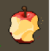

### <span id="按钮"></span>Image Button

ImageButton 是指可以动态设置贴图的按钮，同时含有NineSliceImage和Label。按钮有三种状态，分别为default/hover/pressed，可以分别对应不同的贴图。

* 注 $符号表示定义变量
* controls表示控制的子节点，

```json
   "button0@common.button" : {
      "$default_texture" : "textures/netease/common/button/default",
      "$hover_texture" : "textures/netease/common/button/hover",
      "$is_new_nine_slice" : false,
      "$label_color" : [ 1, 1, 1 ],
      "$label_font_scale_factor" : 1.0,
      "$label_font_size" : "large",
      "$label_layer" : 3,
      "$label_offset" : [ 0, 0 ],
      "$label_text" : "Button",
      "$nine_slice_buttom" : 0,
      "$nine_slice_left" : 0,
      "$nine_slice_right" : 0,
      "$nine_slice_top" : 0,
      "$nineslice_size" : [ 0, 0, 0, 0 ],
      "$pressed_button_name" : "%fpsBattle.click",
      "$pressed_texture" : "textures/netease/common/button/pressed",
      "$texture_layer" : 2,
      "anchor_from" : "center",
      "anchor_to" : "center",
      "is_handle_button_move_event" : true,
      "button_mappings" : [],
      "bindings" : [
         {
            "binding_collection_name" : "",
            "binding_condition" : "always_when_visible",
            "binding_type" : "collection_details"
         }
      ],
      "controls" : [
         {
            "default@fpsBattle.default" : {}
         },
         {
            "hover@fpsBattle.hover" : {}
         },
         {
            "pressed@fpsBattle.pressed" : {}
         },
         {
            "button_label@fpsBattle.button_label" : {}
         }
      ],
      "default_control" : "default",
      "hover_control" : "hover",
      "layer" : 3,
      "offset" : [ 0, 0 ],
      "pressed_control" : "pressed",
      "size" : [ 100, 50 ],
      "type" : "button",
      "visible" : true
   },
   "button_label" : {
      "color" : "$label_color",
      "font_scale_factor" : "$label_font_scale_factor",
      "font_size" : "$label_font_size",
      "font_type" : "smooth",
      "layer" : "$label_layer",
      "max_size" : [ "100%", "100%" ],
      "offset" : [ 0, 0 ],
      "shadow" : false,
      "text" : "$label_text",
      "text_alignment" : "center",
      "type" : "label"
   },
   "default" : {
      "is_new_nine_slice" : "$is_new_nine_slice",
      "layer" : "$texture_layer",
      "nine_slice_buttom" : "$nine_slice_buttom",
      "nine_slice_left" : "$nine_slice_left",
      "nine_slice_right" : "$nine_slice_right",
      "nine_slice_top" : "$nine_slice_top",
      "texture" : "$default_texture",
      "type" : "image"
   },
   "hover" : {
      "is_new_nine_slice" : "$is_new_nine_slice",
      "layer" : "$texture_layer",
      "nine_slice_buttom" : "$nine_slice_buttom",
      "nine_slice_left" : "$nine_slice_left",
      "nine_slice_right" : "$nine_slice_right",
      "nine_slice_top" : "$nine_slice_top",
      "texture" : "$hover_texture",
      "type" : "image"
   },
   "pressed" : {
      "is_new_nine_slice" : "$is_new_nine_slice",
      "layer" : "$texture_layer",
      "nine_slice_buttom" : "$nine_slice_buttom",
      "nine_slice_left" : "$nine_slice_left",
      "nine_slice_right" : "$nine_slice_right",
      "nine_slice_top" : "$nine_slice_top",
      "texture" : "$pressed_texture",
      "type" : "image"
   },
```

| <div style="width:200px">变量</div>  | 解释                                |
| :------------------: | ---------------------------------- |
|       default        | 表示按钮默认状态下的显示的图片内容  |
|        hover         | 表示按钮处于悬浮状态下的图片内容    |
|       pressed        | 表示按钮处于按下状态下的图片内容    |
| $is_new_nine_slice | 设置为true标记该图片为NineSliceImage类型图片,从Json结构里可以看出三张图片的九宫设置用的是同一个 |
| $nine_slice_bottom | 切片距离下边的距离，默认值为0                |
| $nine_slice_left   | 切片距离左边的距离，默认值为0                |
| $nine_slice_right  | 切片距离右边的距离，默认值为0                |
| $nine_slice_top    | 切片距离上边的距离，默认值为0                |
| $nineslice_size    | 设置原版九宫属性，相比于旧版九宫属性更符合像素风格。当设置了旧版九宫属性时优先旧版属性。该值支持数组和单个数字，数组代表[left,top,right,down]九宫属性，单个数值代表上下左右均采用该数值作为九宫属性，当四个方向的数值均为0时表示不开启原版九宫 |
| $pressed_button_name    | fpsBattle代表编写UI逻辑的python类名，click代表按钮按下时会执行该python类的click函数。也可以使用API AddTouchEventHandler 动态注册按钮回调|
| is_handle_button_move_event | 表示按钮是否可以响应按钮移动事件，需置true配合API AddTouchEventHandler使用 |
| button_mappings | 表示按钮事件响应映射网，需置[]配合API AddTouchEventHandler使用 |

下图为UI编辑器中按钮控件的属性编辑面板。

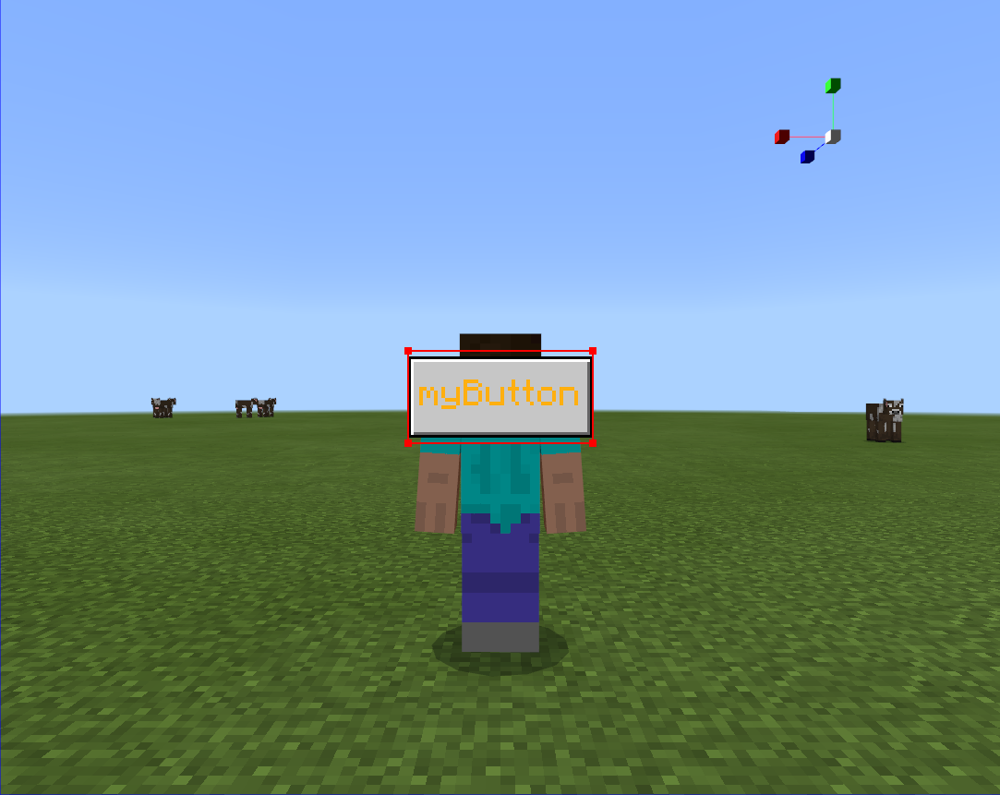

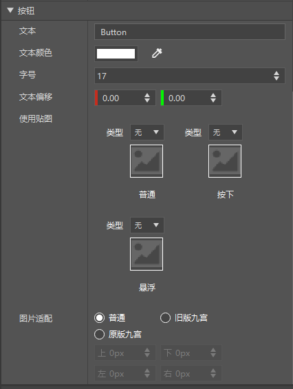

| <div style="width:100px">变量</div>  | 解释                                                 |
| :------------: | ---------------------------------------------------- |
|       文本        | 对应button_label/text字段所引用的值，支持任何形式的文本  |
|        文本颜色         | 对应button_label/color字段所引用的值，点击按钮弹出颜色选择窗口，可以在调色板上取色或者使用吸管吸取界面上的颜色    |
| 字号 | 对应button_label/font_size和button_label/font_scale_factor字段，以一定的规则同时设置两个字段达到字号的效果 |
|       文本偏移        | 对应button_label/offset字段所引用的值，设置按钮上的文字相对中心点的偏移  |
|       使用贴图        | 分别对应default/texture,pressed/texture,hover/texture字段所引用的值，将资源管理窗口中的图片资源拖曳到该图片小窗内赋值，可以在上方的下拉选项栏中重新选回默认图  |
| 图片适配 | 普通表示不开启九宫，选中旧版九宫则is_new_nine_slice置true，开启旧版九宫设置，选中原版九宫则开启原版九宫。 |
### Panel

panel为面板控件，主要是用来将控件进行分类和管理，类似文件夹。

```json
   "panel" : {
      "anchor_from" : "center",
      "anchor_to" : "center",
      "layer" : 0,
      "offset" : [ 0, 0 ],
      "size" : [ "50.000000%+0 px", "50.000000%+0px" ],
      "type" : "panel",
      "visible" : true
   }
```

| 变量 | 解释        |
| :--: | ---------- |
| type | 类型为panel |

面板控件暂时没有专属的属性，如有，后续在此处添加。

### InputPanel

input_panel与panel类似，可以用来放置其他控件，但除此之外该控件可以获得鼠标事件。

```json
"InputPanel" : {
      "anchor_from" : "top_left",
      "anchor_to" : "top_left",
      "button_mappings": [
         {
           "from_button_id": "button.menu_select",
           "to_button_id": "#netease_to_button_id",
           "mapping_type": "pressed"
         }
      ],
      "layer" : 10,
      "modal" : true,
      "contained": true,
      "draggable": "both",
      "offset" : [ 0.0, 0.0 ],
      "size" : [ 198.0, 137.0 ],
      "type" : "input_panel",
      "visible" : true
}
```

| 变量  | 默认值 | 解释                               |
| :---: | ------ | ---------------------------------- |
| draggable | not_draggable  | 当前控件可拖拽方式，默认为not_draggable不可拖拽，"horizontal"代表水平拖拽，"vertical"代表垂直拖拽，"both"代表自由拖拽 |
| contained | false  | 该控件可拖动时，是否会被父控件的大小范围所限制，默认值为false。该范围以该控件生成位置为起点，加上父控件的尺寸大小形成该控件可拖拽的范围 |
| button_mappings | []  | 该值为开启拖拽功能所必须的属性，可以理解成开启接受屏幕点击事件 |
| modal | false  | 设为true时，该InputPanel视为模态框，见**注2** |

* 注1

```
该控件的拖动功能也遵循UI控件的碰撞规则，当InputPanel中有按钮、滚动列表等接受鼠标事件的控件时，点击在这些控件并不会触发InputPanel的拖动操作。
```

* 注2

```
“模态框”是指将用户的UI点击操作限制在这个控件及其子控件，而其他的控件都不会响应用户操作。

如果界面上同时存在多个模态框，其中层级最高的生效。

可以用来处理ScrollView控件上显示其他控件时，点击会穿透到ScrollView的问题，可参考UIDemo示例的“InputPanel演示”

界面编辑器暂不支持，可先用Panel搭建后手动在json中修改属性。

```

### TextEditBox

TextEditBox是输入框控件，用来输入文字信息，可以获取输入内容，设置输入框内容，触发输入中和输入完成事件，设置最大输入值等。下面的示例展示了一个搜索框的信息。

```json
  "text_edit_box0@common.text_edit_box" : {
      "$edit_box_default_texture" : "textures/ui/edit_box_indent",
      "$edit_box_hover_texture" : "textures/ui/edit_box_indent_hover",
      "$font_size" : "normal",
      "$is_new_nine_slice" : false,
      "$nine_slice_buttom" : 0,
      "$nine_slice_left" : 0,
      "$nine_slice_right" : 0,
      "$nine_slice_top" : 0,
      "$nineslice_size" : [ 0, 0, 0, 0 ],
      "$place_holder_text" : "请输入内容",
      "$place_holder_text_color" : [ 0.50, 0.50, 0.50 ],
      "$text_background_default" : "fpsBattle.edit_box_background_default",
      "$text_background_hover" : "fpsBattle.edit_box_background_hover",
      "$text_box_name" : "%fpsBattle.message_text_box",
      "$text_box_text_color" : [ 1, 1, 1 ],
      "$text_edit_box_content_binding_name" : "#fpsBattle.message_text_box_content",
      "anchor_from" : "center",
      "anchor_to" : "center",
      "enabled_newline" : false,
      "layer" : 5,
      "max_length" : 512,
      "offset" : [ 0, 0 ],
      "size" : [ 300, 27 ],
      "type" : "edit_box",
      "visible" : true
   },
   "edit_box_background_default" : {
      "is_new_nine_slice" : "$is_new_nine_slice",
      "nine_slice_buttom" : "$nine_slice_buttom",
      "nine_slice_left" : "$nine_slice_left",
      "nine_slice_right" : "$nine_slice_right",
      "nine_slice_top" : "$nine_slice_top",
      "texture" : "$edit_box_default_texture",
      "type" : "image"
   },
   "edit_box_background_hover" : {
      "is_new_nine_slice" : "$is_new_nine_slice",
      "nine_slice_buttom" : "$nine_slice_buttom",
      "nine_slice_left" : "$nine_slice_left",
      "nine_slice_right" : "$nine_slice_right",
      "nine_slice_top" : "$nine_slice_top",
      "texture" : "$edit_box_hover_texture",
      "type" : "image"
   },
```

| <div style="width:150px">变量</div>                     | 解释                                                         |
| :----------------------------------------------------------: | ----------------------------------------------------------- |
|max_length  | 初始最大输入长度，后续可代码设置                             |
| $text_box_name | 获取输入到的信息，监听了BF_EditChanged和BF_EditFinished的函数Textbox，会在输入框内容修改和输入完成时调到该函数，可参考下面的**注1** |
|$text_edit_box_content_binding_name | 输入框显示ReturnTextString中返回的内容，这与上面形成了一个双向绑定，可参考下面的**注1** |
|   $place_holder_text | 输入框初始化没有输入时的提示语 |
| $is_new_nine_slice | 设置为true标记该图片为NineSliceImage类型图片,从Json结构里可以看出两张图片的九宫设置用的是同一个 |
| $nine_slice_bottom | 切片距离下边的距离，默认值为0                |
| $nine_slice_left   | 切片距离左边的距离，默认值为0                |
| $nine_slice_right  | 切片距离右边的距离，默认值为0                |
| $nine_slice_top    | 切片距离上边的距离，默认值为0                |
| $nineslice_size    | 设置原版九宫属性，相比于旧版九宫属性更符合像素风格。当设置了旧版九宫属性时优先旧版属性。该值支持数组和单个数字，数组代表[left,top,right,down]九宫属性，单个数值代表上下左右均采用该数值作为九宫属性，当四个方向的数值均为0时表示不开启原版九宫 |

* 注1

```python
class TestScreen(ScreenNode):
	def __init__(self, namespace, name, param):
		ScreenNode.__init__(self, namespace, name, param)
        self.text = ""
        self.holder = str("请输入姓名")

    @ViewBinder.binding(ViewBinder.BF_EditChanged | ViewBinder.BF_EditFinished)
	def TextBox(self, args):
		print "SearchTextBox  ", args
		self.text = args["Text"]
		return ViewRequest.Refresh

	@ViewBinder.binding(ViewBinder.BF_BindString)
	def ReturnTextString(self):
		return self.text

```

* 注2

max_length 可以通过接口SetEditTextMaxLength，接口详细调用可见下文。

注意：输入框不允许在inputmode为0的情况下使用。

创建带输入框的UI时inputmode必须要为1，如：

clientApi.CreateUI("testMod", "testUI", {**"inputMode":1**})

下图为UI编辑器中文本输入框控件的属性编辑面板。

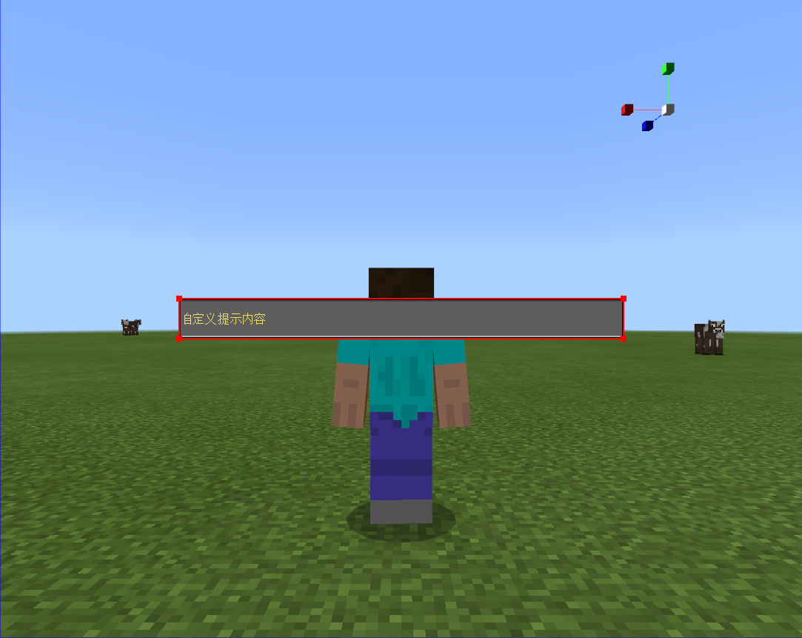

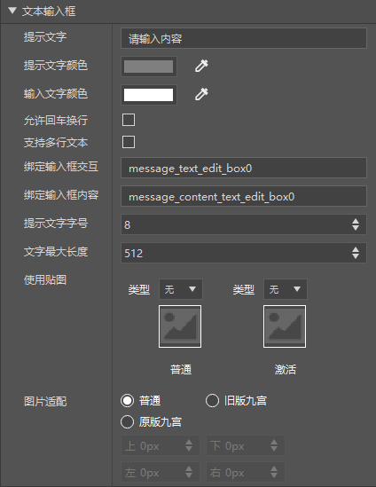

| <div style="width:100px">变量</div>   | 解释                                                 |
| :------------: | ---------------------------------------------------- |
|             提示文字             | 对应$place_holder_text字段，代表没有文本输入时底部显示                              |
|             提示文字颜色          | 对应$place_holder_text_color字段，代表提示文字的颜色，点击按钮弹出颜色选择窗口，可以在调色板上取色或者使用吸管吸取界面上的颜色  |
|             输入文本颜色           | 对应$text_box_text_color字段，代表输入文本的颜色                             |
|             绑定输入框交互           | 对应$text_box_name字段                            |
|             绑定输入框内容            | 对应$text_edit_box_content_binding_name字段                              |
|             提示文字字号            | 对应$font_size字段，可供选择的有["small","middle","large"],对应值[4，8，16]|
|             文字最大长度            | 对应max_length字段，即代表可输入文本的最大长度                          |
|             使用贴图            | 分别对应$edit_box_default_texture控件默认状态,$edit_box_hover_texture控件鼠标悬浮状态字段所引用的值，将资源管理窗口中的图片资源拖曳到该图片小窗内赋值，可以在上方的下拉选项栏中重新选回默认                              |
| 图片适配 | 普通表示不开启九宫，选中旧版九宫则is_new_nine_slice置true，开启旧版九宫设置，选中原版九宫则开启原版九宫。 |

### PaperDoll

该控件可以用于在ui上显示骨骼模型

```json
"paper_doll0" : {
      "anchor_from" : "center",
      "anchor_to" : "center",
      "animation" : "",
      "animation_looped": true,
      "layer" : 7,
      "modelname" : "",
      "modelsize" : 1.0,
      "offset" : [ 0, 0 ],
      "renderer" : "paper_doll_renderer",
      "size" : [ 100, 100 ],
      "type" : "custom",
      "visible" : true
   },
```
| <div style="width:100px">变量</div>  | 解释                                                         |
| :----------: | ----------------------------------------------------------- |
|  modelname   | 要显示的骨骼模型的名称，可通过API中的SetUiModel接口动态修改  |
|  animation   | 骨骼模型播放的动作，可通过API中的SetUiModel接口动态修改 |
| animation_looped | 骨骼模型播放动作是否循环播放，可通过API中的SetUiModel接口动态修改 |
|  modelsize   | 骨骼模型的显示缩放                                           |
|  renderer   |  对纸娃娃控件自定义的渲染模块，不建议改动该字段 |

下图为UI编辑器中文本输入框控件的属性编辑面板。

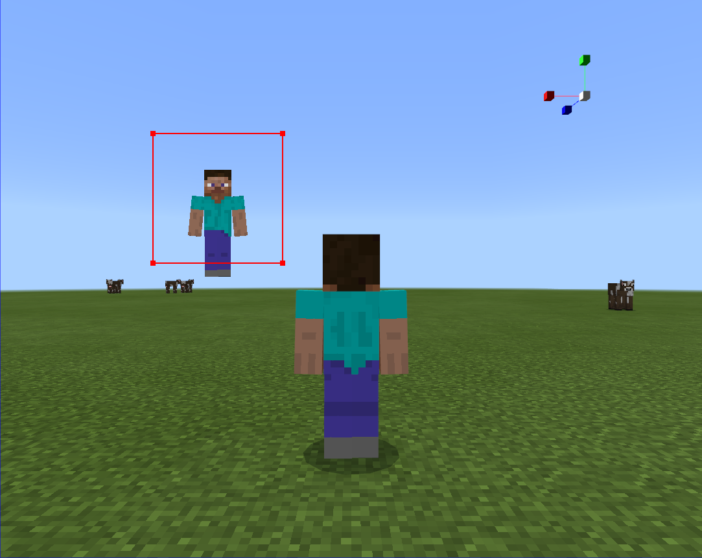

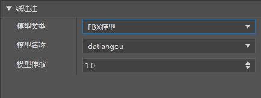

| <div style="width:100px">变量</div> | 解释                                                 |
| :------------: | ---------------------------------------------------- |
|  模型类型   | 可选原版模型和FBX模型，FBX模型可通过资源管理器界面导入。选中FBX模型时显示模型名称选项，可选导入的FBX模型。选中原版模型时默认modelname使用steve  |
|  模型名称   | 对应modelname字段  |
|  模型缩放   | 对应modelsize字段，支持0-100的正整数                                          |

### NeteasePaperDoll

该控件可以用于在ui上显示：

1）生物，包括玩家与普通生物；

2）骨骼模型展示；

3）生物类型原版模型展示。

```json
"paper_doll0" : {
      "anchor_from" : "center",
      "anchor_to" : "center",
      "layer" : 22,
      "offset" : [ 0.0, 0.0 ],
      "renderer" : "netease_paper_doll_renderer",
      "init_rot_y": 60.0,
      "rotation": "gesture_x",
      "screen_scale": 1.0,
      "size" : [ 100, 100 ],
      "type" : "custom",
      "visible" : true
}
```

相关字段说明：

| <div style="width:100px">变量</div> | 解释                                                         |
| :---------------------------------: | ------------------------------------------------------------ |
|              renderer               | 不能改动该字段                                               |
|              rotation               | 渲染模型的朝向，可选的值有：<br/>none：默认值，没有任何旋转角度<br/>auto：随着时间而旋转<br/>gesture_x：可以通过触控以Y轴旋转<br/> |
|             init_rot_y              | 初始朝向（Y轴为旋转轴），单位：角度，[RenderPaperDoll](./5-UIAPI文档.md#renderpaperdoll)参数init_rot_y动态设置 |
|            screen_scale             | 放缩系数，默认为1，基于UI的size进行放缩，[RenderPaperDoll](./5-UIAPI文档.md#renderpaperdoll)参数scale动态设置 |
|         skeleton_model_name         | 骨骼模型名称，默认为空字符，[RenderPaperDoll](./5-UIAPI文档.md#renderpaperdoll)参数skeleton_model_name动态设置 |
|              animation              | 骨骼模型动画名称，默认为idle，[RenderPaperDoll](./5-UIAPI文档.md#renderpaperdoll)参数animation动态设置 |
|          animation_looped           | 骨骼动画是否循环播放，默认为true，[RenderPaperDoll](./5-UIAPI文档.md#renderpaperdoll)参数animation_looped动态设置 |
|          entity_identifier          | 生物标识，如minecraft:cat，默认为空字符，[RenderPaperDoll](./5-UIAPI文档.md#renderpaperdoll)参数entity_identifier动态设置 |

**接口使用例子以及说明：**

1）渲染玩家或者生物，包括玩家的装备等物品的渲染

```python
path = '/demoPanel/dollPanel/viewer_panel/paper_doll_panel/paper_doll'
param = {
    "entity_id": "-8589934591", # 玩家或生物Id
    "scale": 0.5, # 放缩系数
    "render_depth": -50, # 渲染深度，对于玩家默认-50，普通生物-15，该参数可解决UI遮挡剔除问题
    "init_rot_y": 60, # 初始朝向
    "molang_dict": {"variable.liedownamount": 1} # molang变量dict，其中key为字符串，value为float类型
}
uiNode.RenderPaperDoll(path, param)
```

2）渲染骨骼模型

```python
path = '/demoPanel/dollPanel/viewer_panel/paper_doll_panel/paper_doll'
param = {
    "skeleton_model_name": "datiangou", # 大天狗模型
    "scale": 1.0,
    "animation": "fengxi", # 动画名称
    "animation_looped": False, # 是否循环播放
}
uiNode.RenderPaperDoll(path, param)
```

3）渲染原版生物模型（不需要生物实例）

```python
path = '/demoPanel/dollPanel/viewer_panel/paper_doll_panel/paper_doll'
param = {
    "scale": 1.0,
    "entity_identifier": "minecraft:cat", # 渲染猫的原版模型
    "init_rot_y": 60,
    "molang_dict": {"variable.state": 2, "variable.liedownamount": 1} # 通过molang变量来调整渲染效果（坐下的猫）
}
uiNode.RenderPaperDoll(path, param)
```

使用注意事项：

1）如果渲染位置不正确，请调整UI的位置；

2）如果渲染模型过大或者过小，请调整UI的大小或者参数scale；

3）如果生物模型被裁剪，请调整参数render_depth或者UI的layer；

4）可以通过使用参数molang_dict来驱动原版模型的渲染，如果发生如下图的渲染错误，需要自行调整molang表达式；

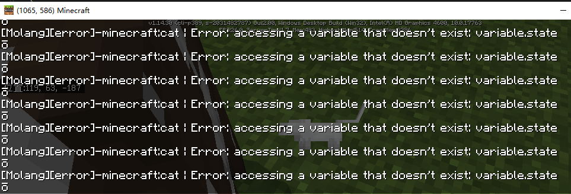


### ItemRenderer

该控件可以用于在ui上显示物品

```json
"item_renderer0" : {
      "anchor_from" : "center",
      "anchor_to" : "center",
      "layer" : 1,
      "offset" : [ 0, 0 ],
      "property_bag" : {
         "#item_id_aux" : 131072
      },
      "renderer" : "inventory_item_renderer",
      "size" : [ 100, 100 ],
      "type" : "custom",
      "visible" : true
   },
```
| <div style="width:100px">变量</div>  | 解释                                                         |
| :----------: | ----------------------------------------------------------- |
|  renderer   |  对显示物品自定义的渲染模块，不建议改动该字段 |
|  property_bag   |  控件属性信息，#item_id_aux代表物品id，131072代表草方块在游戏内的值 |

下图为ItemRenderer在UI编辑器中的控件表现

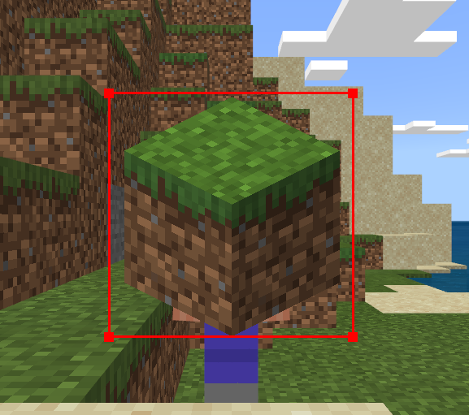

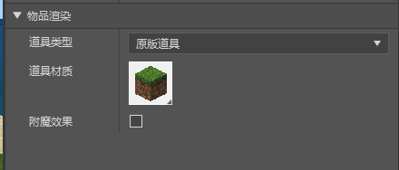

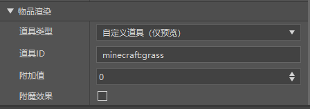

| <div style="width:100px">变量</div> | 解释                                                 |
| :------------: | ---------------------------------------------------- |
|  道具类型   | 可选原版道具和自定义道具，自定义道具可在关卡编辑器中设置。选中自定义道具时显示道具ID和附加值输入栏，可输入自定的道具ID和附加值。选中原版道具时隐藏道具ID和附加值输入栏，显示道具材质，点击弹出道具材质选择窗口  |
|  道具材质   | 点击弹出道具材质选择窗口，展示所有原版道具图片，选中后编辑器自动设置该道具对应的道具ID和附加值    |
| 道具ID和附加值   | 填写设置自定义道具时设置的道具ID和附加值  |
|  附魔效果   | 勾选后道具表现出现附魔流光效果  |

* 注

自定义道具在游戏中的物品id会根据游戏运行平台、加载Mod数量等不同会发生变化，因此UI编辑器的ItemRenderer控件设置自定义道具，在游戏中并不一定能正确显示，建议使用UIAPI-SetUiItem来对该控件进行动态设置，详见《UIAPI文档》。

原版道具显示正常。

### ScrollView

该控件是可以滑动的窗口，需要有其他控件附属。

```json
   "scroll_view0@common.scrolling_panel" : {
      "$background_nine_slice_buttom" : 0,
      "$background_nine_slice_left" : 0,
      "$background_nine_slice_right" : 0,
      "$background_nine_slice_top" : 0,
      "$background_nineslice_size" : [ 0, 0, 0, 0 ],
      "$box_nine_slice_buttom" : 0,
      "$box_nine_slice_left" : 0,
      "$box_nine_slice_right" : 0,
      "$box_nine_slice_top" : 0,
      "$box_nineslice_size" : [ 0, 0, 0, 0 ],
      "$is_background_nine_slice" : false,
      "$is_box_nine_slice" : false,
      "$is_track_nine_slice" : false,
      "$scroll_background_image_control" : "fpsBattle.scroll_background_image",
      "$scroll_background_texture" : "textures/ui/ScrollRail",
      "$scroll_box_mouse_image_control" : "fpsBattle.scroll_box_image",
      "$scroll_box_texture" : "textures/ui/newTouchScrollBox",
      "$scroll_box_touch_image_control" : "fpsBattle.scroll_box_image",
      "$scroll_track_image_control" : "fpsBattle.scroll_track_image",
      "$scroll_track_texture" : "textures/ui/ScrollRail",
      "$scrolling_content" : "fpsBattle.image",
      "$show_background" : true,
      "$track_nine_slice_buttom" : 0,
      "$track_nine_slice_left" : 0,
      "$track_nine_slice_right" : 0,
      "$track_nine_slice_top" : 0,
      "$track_nineslice_size" : [ 0, 0, 0, 0 ],
      "anchor_from" : "center",
      "anchor_to" : "center",
      "layer" : 9,
      "offset" : [ 0, 0 ],
      "size" : [ 100, 80 ],
      "type" : "scroll_view",
      "visible" : true
   },
```

|<div style="width:100px">变量</div>     | 解释                                            |
| ------------------------------ | ----------------------------------------------- |
| scrolling_content              | 这里保存了该滑动窗口的内容                      |
| show_background                | 是否显示背景                                    |
| $is_background_nine_slice | 设置为true标记背景图片为NineSliceImage类型图片 |
| $background_nine_slice_buttom | 切片距离下边的距离，默认值为0                |
| $background_nine_slice_left   | 切片距离左边的距离，默认值为0                |
| $background_nine_slice_right  | 切片距离右边的距离，默认值为0                |
| $background_nine_slice_top    | 切片距离上边的距离，默认值为0                |
| $background_nineslice_size    | 设置原版九宫属性，相比于旧版九宫属性更符合像素风格。当设置了旧版九宫属性时优先旧版属性。该值支持数组和单个数字，数组代表[left,top,right,down]九宫属性，单个数值代表上下左右均采用该数值作为九宫属性，当四个方向的数值均为0时表示不开启原版九宫 |
| $is_box_nine_slice | 设置为true标记滑动块图片为NineSliceImage类型图片 |
| $box_nine_slice_buttom | 切片距离下边的距离，默认值为0                |
| $box_nine_slice_left   | 切片距离左边的距离，默认值为0                |
| $box_nine_slice_right  | 切片距离右边的距离，默认值为0                |
| $box_nine_slice_top    | 切片距离上边的距离，默认值为0                |
| $box_nineslice_size    | 设置原版九宫属性，相比于旧版九宫属性更符合像素风格。 |
| $is_track_nine_slice | 设置为true标记滑轨图片为NineSliceImage类型图片 |
| $track_nine_slice_buttom | 切片距离下边的距离，默认值为0                |
| $track_nine_slice_left   | 切片距离左边的距离，默认值为0                |
| $track_nine_slice_right  | 切片距离右边的距离，默认值为0                |
| $track_nine_slice_top    | 切片距离上边的距离，默认值为0                |
| $track_nineslice_size    | 设置原版九宫属性，相比于旧版九宫属性更符合像素风格。 |
| $scroll_background_texture | 滚动列表背景图片                         |
| $scroll_box_texture | 滑动块图片                                 |
| $scroll_track_texture                | 滑轨图片                                 |

下图为UI编辑器中滚动列表控件的属性编辑面板。

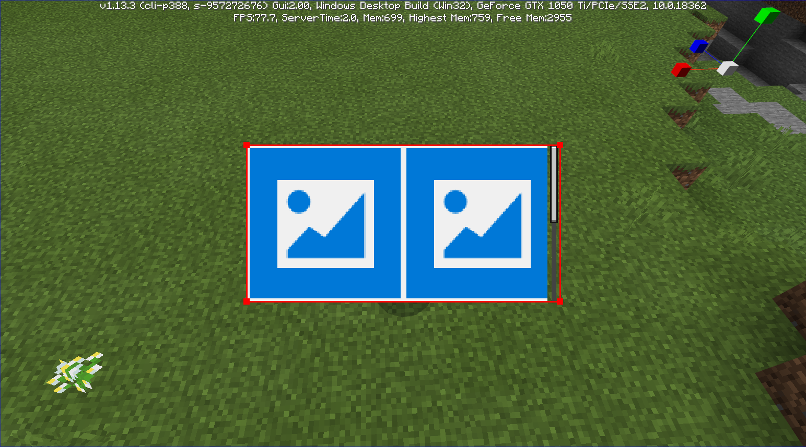

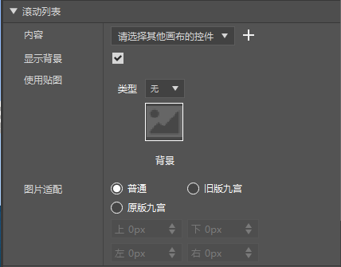

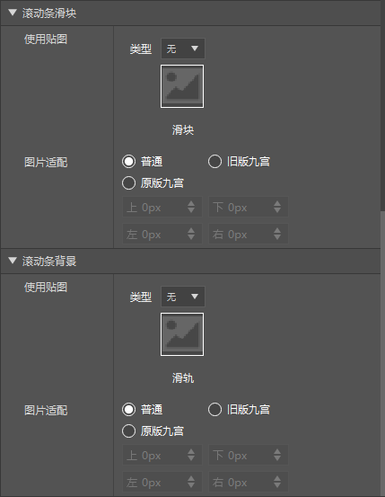

| <div style="width:150px">变量</div> | 解释                                                 |
| :------------: | ---------------------------------------------------- |
|  滚动列表-内容   | 对应$scrolling_content字段，只接受其他screen画布中的控件，且被选中控件不可以是文本、图片、滚动列表控件，若被选中控件为panel，那么子节点中含有滚动列表的panel控件同样不可以被选中 |
|  滚动列表-隐藏背景   | 对应show_background字段 |
|  滚动列表-使用贴图   | 对应$scroll_background_texture字段，将资源管理窗口中的图片资源拖曳到该图片小窗内赋值，可以在上方的下拉选项栏中重新选回默认图片 |
| 滚动列表-图片适配 | 普通表示不开启九宫，选中旧版九宫则is_new_nine_slice置true，开启旧版九宫设置，选中原版九宫则开启原版九宫。 |
|  滚动条滑块-使用贴图   | 对应$scroll_box_texture字段，将资源管理窗口中的图片资源拖曳到该图片小窗内赋值，可以在上方的下拉选项栏中重新选回默认图片 |
| 滚动条滑块-图片适配 | 普通表示不开启九宫，选中旧版九宫则is_new_nine_slice置true，开启旧版九宫设置，选中原版九宫则开启原版九宫。 |
|  滚动条背景-使用贴图   | 对应$scroll_track_texture字段，将资源管理窗口中的图片资源拖曳到该图片小窗内赋值，可以在上方的下拉选项栏中重新选回默认图片 |
| 滚动条背景-图片适配 | 普通表示不开启九宫，选中旧版九宫则is_new_nine_slice置true，开启旧版九宫设置，选中原版九宫则开启原版九宫。 |

滚动列表的内容以scrolling_content为引用可以由我们自定义，但是承载scrolling_content的父控件scrolling_view_port的size如不经修改默认为["100%","100%"]，即与我们的滚动列表定的大小相同，而可滚动区域的判定会取scrolling_content的size和其父控件scrolling_view_port作比较，两者大小之差即为可拖动范围。而我们UI控件的size是不会根据其子控件的size做到动态完全覆盖，因此如果我们的scrolling_content的大小是动态变化的，需要我们在代码中手动设置scrolling_content的size,详见UI-API[SetSize](./5-UIAPI文档.md#SetSize)

而对于scrolling_content的绝对路径，一共有以下两种，可以通过UI-API[GetAllChildrenPath](./5-UIAPI文档.md#GetAllChildrenPath)清楚的看到。

```python
scroll_view_path = "/scroll_view0"
touch_path = scroll_view_path + "/scroll_touch/scroll_view/panel/background_and_viewport/scrolling_view_port/scrolling_content"
mouse_path = scroll_view_path + "/scroll_mouse/scroll_view/stack_panel/background_and_viewport/scrolling_view_port/scrolling_content"
```

我们知道在PC端进行游戏时，按F11可以切换鼠标控制和遥感控制两种操作模式，而在手机端进行游戏时只有遥感控制这一种操作模式。不同的操作模式，scroll_view的scrolling_content会生成在不同的路径下，遥感模式使用touch_path获得scrolling_content的绝对路径，而鼠标控制使用mouse_path获得。

### Grid

Grid组件属于网格型的排列，可以依附在滚动条中，用来实现背包等功能。

```json
   "grid0" : {
      "anchor_from" : "center",
      "anchor_to" : "center",
      "collection_name" : "test_grid",
      "grid_dimensions" : [ 2, 2 ],
      "grid_item_template" : "fpsBattle.netease_editor_template_image",
      "layer" : 1,
      "offset" : [ 0, 0 ],
      "size" : [ 200, 200 ],
      "type" : "grid",
      "visible" : true
   },
   "netease_editor_template_image" : {
      "anchor_from" : "center",
      "anchor_to" : "center",
      "layer" : 1,
      "offset" : [ 0, 0 ],
      "size" : [ "50%", "50%" ],
      "texture" : "textures/netease/common/image/default",
      "type" : "image",
      "uv" : [ 0, 0 ],
      "uv_size" : [ 107, 107 ],
      "visible" : true
   },
```

| <div style="width:100px">变量</div>                            | 解释                   |
| ----------------------------------------------------------- | ---------------------- |
| grid_dimensions                           | 初始值大小2X2          |
|grid_item_template | 被当作生成网格单元的控件模板|

下图为UI编辑器中网格控件的属性编辑面板。

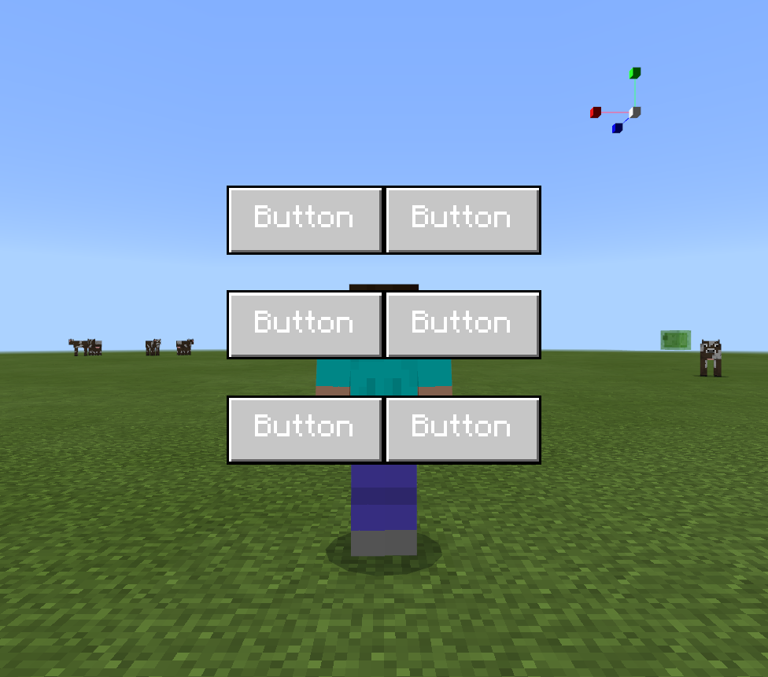

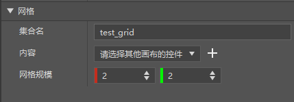

|<div style="width:100px">变量</div> | 解释                                                 |
| :------------: | ---------------------------------------------------- |
| 集合名  | 对应collection_name字段 |
| 内容 | 对应grid_item_template字段，只接受其他screen画布中的控件，且被选中控件不可以是滚动列表、网格控件，若被选中控件为panel，那么子节点中含有滚动列表、网格的panel控件同样不可以被选中 |
| 网格规模 | 对应grid_dimensions字段 |

**注：**

1. grid是在renderer渲染的时候才创建，所以只要没有显示过该界面，调用GetChildrenName和GetAllChildrenPath都无法获取到grid的子节点信息。如果要初始化grid的信息必须在UI渲染结束后一帧再来调用这两个接口获取子节点信息并初始化

2. 当grid控件与ScrollView一起使用时，如果grid控件中设置单个UI元素（例如按钮）的数目值超过当前grid控件显示的最大数目时，需要配合scrollview一同使用。当scrollview拉动时，由于MC内置逻辑实现方式，grid的单个UI元素会进行重新排序造成顺序错乱，此时需要开发者监听**GridComponentSizeChangedClientEvent**事件，当收到事件后，需要通过获取grid中返回的单个UI元素的路径值，该路径值尾部包含该UI元素在grid中的索引数目。依据索引数目，mod开发者将物品背包或者类似的显示所需的UI信息值依次设置到grid中的子元素中。建议开发者采用MVC模式控制grid中的内容显示：M代表需要显示的数据信息容器，V代表grid容器和容器中包含的子UI控件，C代表控制组装的UI元素的函数或者模块，并由初始化和监听**GridComponentSizeChangedClientEvent**事件触发驱动

### ProgressBar

ProgressBar进度条控件，用于百分比显示进度
```json
   "progress_bar0" : {
      "$clip_direction" : "left",
      "$clip_ratio" : 0.0,
      "$is_new_nine_slice" : false,
      "$nine_slice_buttom" : 0,
      "$nine_slice_left" : 0,
      "$nine_slice_right" : 0,
      "$nine_slice_top" : 0,
      "$nineslice_size" : [ 0, 0, 0, 0 ],
      "$progress_bar_empty_texture" : "textures/ui/empty_progress_bar",
      "$progress_bar_filled_texture" : "textures/ui/filled_progress_bar",
      "anchor_from" : "center",
      "anchor_to" : "center",
      "controls" : [
         {
            "empty_progress_bar@fpsBattle.empty_progress_bar" : {}
         },
         {
            "filled_progress_bar@fpsBattle.filled_progress_bar" : {}
         }
      ],
      "layer" : 8,
      "offset" : [ 0, 0 ],
      "size" : [ 100, 10 ],
      "type" : "panel",
      "visible" : true
   },
   "empty_progress_bar" : {
      "is_new_nine_slice" : "$is_new_nine_slice",
      "layer" : 1,
      "nine_slice_buttom" : "$nine_slice_buttom",
      "nine_slice_left" : "$nine_slice_left",
      "nine_slice_right" : "$nine_slice_right",
      "nine_slice_top" : "$nine_slice_top",
      "texture" : "$progress_bar_empty_texture",
      "type" : "image"
   },
   "filled_progress_bar" : {
      "clip_direction" : "$clip_direction",
      "clip_ratio" : "$clip_ratio",
      "is_new_nine_slice" : "$is_new_nine_slice",
      "layer" : 2,
      "nine_slice_buttom" : "$nine_slice_buttom",
      "nine_slice_left" : "$nine_slice_left",
      "nine_slice_right" : "$nine_slice_right",
      "nine_slice_top" : "$nine_slice_top",
      "texture" : "$progress_bar_filled_texture",
      "type" : "image"
   },
```

| <div style="width:200px">变量</div>                              | 解释                   |
| :-----------------------------------------------------------: | ---------------------- |
| $progress_bar_empty_texture  | 进度条背景图片 |
| $progress_bar_filled_texture  | 进度条前景图片 |
| $clip_direction  | 进度条加载方向，目前支持["left", "right", "up", "down", "center"] |
|grid_item_template | 被当作生成网格单元的控件模板|
| $is_new_nine_slice | 设置为true标记该图片为NineSliceImage类型图片,从Json结构里可以看出两张图片的九宫设置用的是同一个 |
| $nine_slice_bottom | 切片距离下边的距离，默认值为0                |
| $nine_slice_left   | 切片距离左边的距离，默认值为0                |
| $nine_slice_right  | 切片距离右边的距离，默认值为0                |
| $nine_slice_top    | 切片距离上边的距离，默认值为0                |
| $nineslice_size    | 设置原版九宫属性，相比于旧版九宫属性更符合像素风格。当设置了旧版九宫属性时优先旧版属性。该值支持数组和单个数字，数组代表[left,top,right,down]九宫属性，单个数值代表上下左右均采用该数值作为九宫属性，当四个方向的数值均为0时表示不开启原版九宫 |

下图为UI编辑器中进度条控件的属性编辑面板。

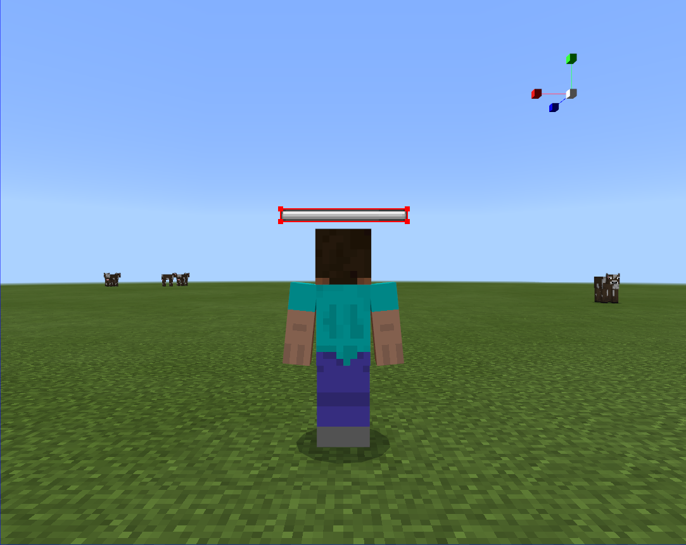

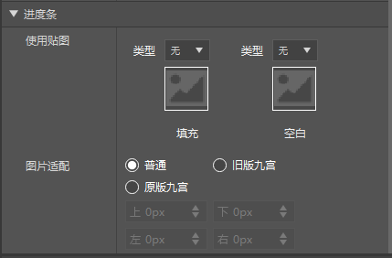

| <div style="width:100px">变量</div> | 解释                                                 |
| :------------: | ---------------------------------------------------- |
| 使用贴图 | 填充对应$progress_bar_filled_texture字段，空白对应$progress_bar_empty_texture,将资源管理窗口中的图片资源拖曳到该图片小窗内赋值，可以在上方的下拉选项栏中重新选回默认图片 |
| 图片适配 | 普通表示不开启九宫，选中旧版九宫则is_new_nine_slice置true，开启旧版九宫设置，选中原版九宫则开启原版九宫。 |

### SwitchToggle

开关控件，用于两个状态之间的切换
```json
"switch_toggle0@common_toggles.switch_toggle_collection" : {
      "$default_texture" : "textures/ui/toggle_off",
      "$hover_texture" : "textures/ui/toggle_on",
      "$pressed_no_hover_texture" : "textures/ui/toggle_on_hover",
      "$pressed_texture" : "textures/ui/toggle_off_hover",
      "$toggle_name" : "#fpsBattle.toggle_name",
      "$toggle_state_binding_name" : "#fpsBattle.toggle_state",
      "anchor_from" : "center",
      "anchor_to" : "center",
      "bindings" : [
         {
            "binding_collection_name" : "",
            "binding_condition" : "always_when_visible",
            "binding_type" : "collection_details"
         }
      ],
      "layer" : 6,
      "offset" : [ 0, 0 ],
      "size" : [ 100, 100 ],
      "type" : "panel",
      "visible" : true
   },
```

| <div style="width:200px">变量</div>                         | 解释                   |
| :-----------------------------------------------------------: | ---------------------- |
| $default_texture  | 开关默认图片 |
| $hover_texture  | 开关鼠标悬浮状态图片 |
| $pressed_texture  | 开关按下图片 |
| $pressed_no_hover_texture  | 开关鼠标悬浮状态按下图片 |
| $toggle_name | 获取输入到的信息，监听了BF_ToggleChanged的函数,类似文本输入框 |
|$toggle_state_binding_name | 开关控件显示toggle_state中返回的内容，这与上面形成了一个双向绑定，类似文本输入框|

* 注1

```python
class TestScreen(ScreenNode):
   def __init__(self, namespace, name, param):
      ScreenNode.__init__(self, namespace, name, param)
        self.currentToggleShow = True

    @ViewBinder.binding(ViewBinder.BF_ToggleChanged)
    def OnDemoToggleChangeCallback(self,args):
        self.currentToggleShow = args["state"]
        return ViewRequest.Refresh

   @ViewBinder.binding(ViewBinder.BF_BindBool)
    def ReturnToggleState(self):
        return self.currentToggleShow

```

下图为UI编辑器中开关控件的属性编辑面板。

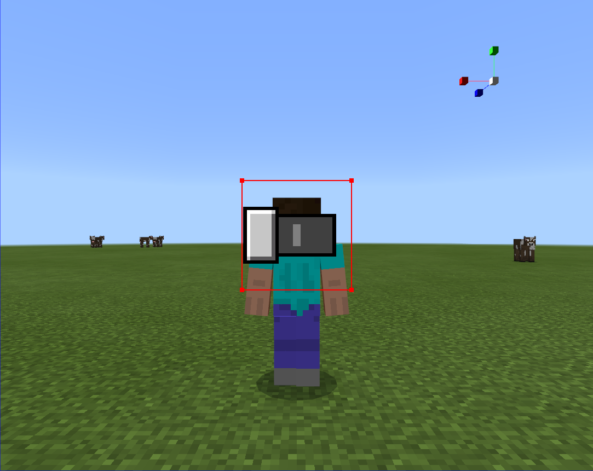

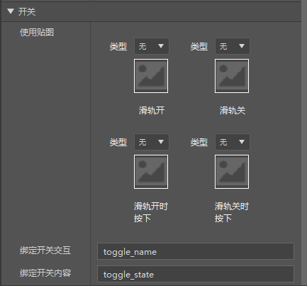

| <div style="width:100px">变量</div> | 解释                                                 |
| :------------: | ---------------------------------------------------- |
| 使用贴图 | 滑轨开对应$hover_texture字段，滑轨关对应$default_texture,滑轨开时按下对应$pressed_no_hover_texture字段，滑轨关时按下对应$pressed_texture,将资源管理窗口中的图片资源拖曳到该图片小窗内赋值，可以在上方的下拉选项栏中重新选回默认图片 |
| 绑定开关交互  | 对应$toggle_name字段 |
| 绑定开关内容  | 对应$toggle_state_binding_name字段 |

### Slider

滑动条控件，用于拖动设置进度或百分比。

```json
"slider0@common.slider": {
      "$slider_tts_text_value": "#netease_tts_text_value",
      "$slider_name": "#UIDemoScreen.OnDemoSliderChange",
      "$slider_value_binding_name":"#UIDemoScreen.ReturnSliderValue",
      "$slider_steps_binding_name": "#UIDemoScreen.ReturnSliderStep",
      "$background_default_control": "common.slider_background",
      "$progress_default_control": "common.slider_progress",
      "$progress_default_clip_direction": "left",
      "$background_hover_control": "common.slider_background_hover",
      "$progress_hover_control": "common.slider_progress_hover",
      "$progress_hover_clip_direction": "left",
      "$slider_direction": "horizontal",
      "$slider_box_layout": "common.slider_button_layout",
      "$slider_box_hover_layout": "common.slider_button_hover_layout",
      "$slider_box_locked_layout": "common.slider_button_locked_layout",
      "$slider_box_indent_layout": "common.slider_button_indent_layout",
      "$slider_box_size": [ 10, 16 ],
      "size": [ 100, 10 ],
      "offset": [ 0, 0 ],
      "$slider_step_factory_control_ids": {
         "slider_step": "@common.slider_step",
         "slider_step_hover": "@common.slider_step_hover",
         "slider_step_progress": "@common.slider_step_progress",
         "slider_step_progress_hover": "@common.slider_step_progress_hover"
      },
   }
```

| <div style="width:200px">变量</div>                         | 解释                   |
| :-----------------------------------------------------------: | ---------------------- |
| $slider_tts_text_value  | 开发者无需关注，但为必填属性 |
| $slider_name  | 获取滑动条的信息，监听了BF_SliderChanged的函数OnDemoSliderChange，会在滑动条值改变时调到该函数，可参考下面的**注1** |
| $slider_value_binding_name  | 滑动条显示ReturnSliderValue中返回的值，这与上面形成了一个双向绑定，该值必须是float类型，可参考下面的**注1** |
| $slider_steps_binding_name  | 滑动条总步长，由ReturnSliderStep函数中返回的值进行设置。当设置大于1时该滑动条为固定格类型，类似设置面板中能见度设置，滑动范围为0-总步长；当设置小于等于1时该滑动条为百分比类型，类似设置面板中音量设置，滑动范围为0-1。 |
| $background_default_control | 滑动条背景默认情况下显示的控件，须为image |
|$progress_default_control | 滑动条前景默认情况下显示的控件，会根据当前进度进行裁剪，须为image|
|$progress_default_clip_direction | 滑动条前景默认情况下被裁剪方向, 可填"left", "right", "up", "down", "center"|
|$background_hover_control | 滑动条背景在鼠标悬浮及按下情况下显示的控件，须为image|
|$progress_hover_control | 滑动条前景在鼠标悬浮及按下情况下显示的控件，会根据当前进度进行裁剪，须为image|
|$progress_hover_clip_direction | 滑动条前景在鼠标悬浮及按下情况下被裁剪方向, 可填"left", "right", "up", "down", "center"|
|$slider_direction | 滑动条方向，可填"horizontal","vertical"和"none"，默认为"horizontal"。注意当滑动条方向改变时不会自动改变滑动条前景默认情况和悬浮及按下情况下被裁减的方向，如有需要请修改$progress_default_clip_direction和$progress_hover_clip_direction属性|
|$slider_box_layout | 滑动格默认情况下显示的控件 |
|$slider_box_hover_layout | 滑动格鼠标悬浮情况下显示的控件 |
|$slider_box_locked_layout | 滑动格鼠标不可用情况下显示的控件 |
|$slider_box_indent_layout | 滑动格按下情况下显示的控件 |
|$slider_box_size | 滑动格大小 |
|$slider_step_factory_control_ids | 当滑动条为固定格类型滑动条时，滑动条会生成等距的分隔线来标明单步滑动的位置。而这一系列的分割线就是由$slider_step_factory_control_ids属性内的各个控件控制的。 |
|slider_step | 背景分隔线默认情况下显示的控件 |
|slider_step_hover | 背景分隔线鼠标悬浮情况下显示的控件 |
|slider_step_progress | 前景分隔线默认情况下显示的控件 |
|slider_step_progress_hover | 前景分隔线鼠标悬浮情况下显示的控件 |

* 注1

```python
class UIDemoScreen(ScreenNode):
   def __init__(self, namespace, name, param):
      ScreenNode.__init__(self, namespace, name, param)
        self.sliderPercentValue = 0.5  # 百分比值
        # self.sliderAbsValue = 5.0 # 固定值

    @ViewBinder.binding(ViewBinder.BF_SliderChanged)
	def OnDemoSliderChange(self, value, _unused):
		self.sliderPercentValue = value   # 百分比类型滑动条保存值
		# self.sliderAbsValue = value   # 固定格类型滑动条保存值
		return ViewRequest.Refresh

	@ViewBinder.binding(ViewBinder.BF_BindFloat)
	def ReturnSliderValue(self):
		return self.sliderPercentValue   # 百分比类型滑动条返回值
		# return self.sliderAbsValue  # 固定格类型滑动条返回值

	@ViewBinder.binding(ViewBinder.BF_BindInt)
	def ReturnSliderStep(self):
		return 1  # 百分比类型滑动条
      # return 10  # 固定格类型滑动条
```

下图为Slider在游戏中的控件表现

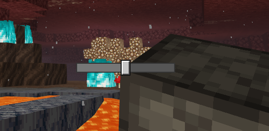

UI编辑器暂时不支持编辑

### MiniMap

该控件可以在UI上画小地图，需要继承mini_map命名空间下的mini_map_wrapper控件。

其中官方封装了地图界面基类[MiniMapBaseScreen](../02-Python脚本开发/99-ModAPI/1-ExtraAPI接口/2-客户端ExtraAPI接口.html#GetMiniMapScreenNodeCls)供开发者扩展。

```json
"mainPanel@mini_map.mini_map_wrapper" : {
    "anchor_from" : "top_right",
    "anchor_to" : "top_right",
    "layer" : 1,
    "offset" : [ -10.0, 10.0 ],
    "$enable_live_update": false,
    "$live_update_interval": 5,
    "$use_default_face_icon": true,
    "$face_icon_size": [4,4],
    "$face_icon_bg_color": "white",
    "$highest_y": 0
}
```

相关字段说明：

| <div style="width:100px">变量</div> | 解释                                                         |
| :---------------------------------: | ------------------------------------------------------------ |
|         $enable_live_update         | 是否开启方块变化更新到小地图上（简称“热更”）                 |
|        $live_update_interval        | “热更”的时间间隔，单位秒（s），不建议间隔太小，更新太频繁在低端机器可能有性能问题 |
|       $use_default_face_icon        | 本地玩家是否使用默认的脸部作为标记icon                       |
|           $face_icon_size           | 脸部icon的大小，默认为[4,4]                                  |
|         $face_icon_bg_color         | 标记icon底部背景颜色，默认为白色                             |
|             $highest_y              | 绘制的高度最大值，默认当前区块的最大值，当该值为-1时，表示最大高度值为玩家当前位置所在的高度 |


### 继承控件

继承控件允许开发者选择并继承目标控件，继承成功后该控件拥有目标控件的所有属性，并可以重写其中任何一个属性的数据。

#### 继承写法简述

在界面json文件所有的编写技巧中，最为好用和灵活的功能当属继承写法。当界面中有一个需求，需要将若干个相同的控件按序排列，除了可以通过复制粘贴出若干个控件副本外，继承模板控件并只修改我们所需要修改的属性，其他的属性依然沿用模板控件的数据才是最便捷，也是最漂亮的写法。下面我们从一个简单的例子入手熟悉继承的写法，从例子中我们可以快速熟悉继承技巧。

```json
{
   "main" : {
      "absorbs_input" : true,
      "always_accepts_input" : false,
      "controls" : [
         {
            "label0@myInherit.label0" : {}
         },
         {
            "inheritor0@myInherit.label0" : {
               "offset" : [ 10.0, 0.0 ]
            }
         },
         {
            "inheritor1@myInherit.label0" : {
               "offset" : [ 20.0, 0.0 ]
            }
         }
      ],
      "force_render_below" : false,
      "is_showing_menu" : true,
      "render_game_behind" : true,
      "render_only_when_topmost" : true,
      "should_steal_mouse" : false,
      "type" : "screen"
   },
   "label0" : {
      "anchor_from" : "center",
      "anchor_to" : "center",
      "color" : [ 1, 1, 1 ],
      "font_scale_factor" : 1.0,
      "font_size" : "normal",
      "font_type" : "smooth",
      "layer" : 0,
      "offset" : [ 0, 0 ],
      "shadow" : false,
      "size" : [ 100, 100 ],
      "text" : "Hello World!",
      "text_alignment" : "center",
      "type" : "label",
      "visible" : true
   },
   "namespace" : "myInherit"
}
```

该段json描述了在main画布中创建了一个文本控件label0，并使继承控件inherit0和inherit1均继承了label0控件，并重写了offset属性，在场景中就得到了三个文本控件，这三个文本控件除了在场景中的位置因为重写而不同外，其他的属性一模一样。但是要注意的是，可以被继承的控件必须写在json文件的最外层，和main处在同一层级，即一个命名空间下有且仅有一个该名称的控件，满足该条件的控件才可以被继承。

#### UI编辑器中的继承

如下图所示，在UI编辑器中继承控件的属性面板。

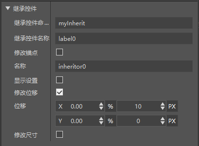

| <div style="width:100px">变量</div> | 解释                                                 |
| :------------: | ---------------------------------------------------- |
| 继承控件命名空间 | 想要继承的目标控件所在的命名空间 |
| 继承控件命名名称 | 想要继承的目标控件名 |
| 修改锚点 | 是否想要重写该控件的锚点，勾选后弹出锚点修改区域进行修改 |
| 锚点 | 修改该控件的锚点，用法同通用属性 |
| 名称 | 该继承控件的名称，用法同通用属性 |
| 显示设置 | 是否显示该控件，用法同通用属性 |
| 修改位移 | 是否想要重写该控件的位移，勾选后弹出位移修改区域进行修改 |
| 位移 | 修改该控件的位移，用法同通用属性 |
| 修改尺寸 | 是否想要重写该控件的尺寸，勾选后弹出尺寸修改区域进行修改 |
| 尺寸 | 修改该控件的尺寸，用法同通用属性 |

修改继承控件的命名空间和名称即可继承想要的控件，当输入的命名空间+名称组合对应的控件不存在时不会有反应，而找到对应的控件时，该继承控件就会继承目标控件并显示在场景中。需要注意的是继承控件继承了目标控件的所有属性，但又是区别于目标控件的完全不同的存在，因此会出现例如继承控件继承了自己的父控件之类的循环继承问题，UI编辑器会在制作过程中帮助开发者规避这个问题，但还请多加小心。

## Python编写说明

### 必要的属性

```python
import mod.client.extraClientApi as clientApi
ViewBinder = clientApi.GetViewBinderCls()
ViewRequest = clientApi.GetViewViewRequestCls()
ScreenNode = clientApi.GetScreenNodeCls()
```
|      变量      | 解释                                 |
| :------------: | :----------------------------------- |
| extraClientApi | 我们开发的Client端Api接口文件        |
|   ViewBinder   | 用于绑定回调函数的类型和响应的方法   |
|  ViewRequest   | 用于返回绑定函数的返回值             |
|   ScreenNode   | UI的基类，用于继承基类的方法和UI管理 |

### UI界面初始化

```python
class TestScreen(ScreenNode):
	def __init__(self, namespace, name, param):
		ScreenNode.__init__(self, namespace, name, param)
```

ScreenNode是我们的UI节点基类，必须继承。

```python
# Bind Type
class ViewBinder(object):
	ButtonFilter = 0x10000000
	BF_ButtonClickUp	=	0 | ButtonFilter
	BF_ButtonClickDown	=	1 | ButtonFilter
	BF_ButtonClick		= 	2 | ButtonFilter
	BF_ButtonClickCancel= 	3
	BF_InteractButtonClick = 4
	BindFilter = 0x01000000
	BF_BindBool		= 5 | BindFilter
	BF_BindInt		= 6 | BindFilter
	BF_BindFloat	= 7 | BindFilter
	BF_BindString	= 8 | BindFilter
	BF_BindGridSize = 9 | BindFilter
	BF_BindColor	= 10 | BindFilter
	EditFilter = 0x00100000
	BF_EditChanged	= 11 | EditFilter
	BF_EditFinished	= 12 | EditFilter
    ToggleFilter = 0x00010000
	BF_ToggleChanged = 13 | ToggleFilter
# Return Type
class ViewRequest(object):
	Nothing = 0
	Refresh = 1 << 0
	PointerHeldEventsRequest = 1 << 1
	PointerHeldEventsCancel = 1 << 2
	Exit = 1 << 3  

```

### UI绑定和返回

UI的绑定分为binding单个绑定和binding_collection集合绑定，适合集合容器。

| 绑定类型               |           绑定方式            | 解释                                   |
| :--------------------- | :---------------------------: | :------------------------------------- |
| BF_ButtonClickUp       |            binding            | 绑定按钮的Up事件                       |
| BF_ButtonClickDown     |            binding            | 绑定按钮的Down事件                     |
| BF_ButtonClick         |            binding            | 同时绑定Up和Down事件                   |
| BF_ButtonClickCancel   |            binding            | 绑定按钮的Cancel事件（按钮down其他up） |
| BF_InteractButtonClick |            binding            | 绑定游戏原生的按钮点击事件             |
| BF_BindBool            | binding \| binding_collection | 绑定Bool变量                           |
| BF_BindInt             | binding \| binding_collection | 绑定Int变量                            |
| BF_BindFloat           | binding \| binding_collection | 绑定Float变量                          |
| BF_BindString          | binding \| binding_collection | 绑定String变量                         |
| BF_BindGridSize        |            binding            | 绑定GridSize变量                       |
| BF_BindColor           | binding \| binding_collection | 绑定颜色变量                           |
| BF_EditChanged         |            binding            | 绑定输入框输入改变事件                 |
| BF_EditFinished        |            binding            | 绑定输入框输入完成事件                 |
| BF_ToggleChanged       |            binding            | 开关状态改变事件                       |

**binding(bind_flag, binding_name = None)**

bind_flag为上文中绑定类型，binding_name为绑定名称。

binding_name为脚本绑定变量，binding_name_override为引擎变量，json格式如下

```json
      "bindings" : [
         {
            "binding_condition" : "always",
            "binding_name" : "#scoreboard_grid.item_count",
            "binding_name_override" : "#StackGridItemsCount"
         }
      ]
```
对应的Python代码如下
```python
	@ViewBinder.binding(ViewBinder.BF_BindInt, "#scoreboard_grid.item_count")
	def OnStarkGridResize(self):
		return len(self.scoreBoardList)
```

**binding_collection(bind_flag, collection_name, binding_name = None)**

bind_flag为上文中的绑定类型，collection_name为集合名称，binding_name为绑定的变量名称。

集合的json如下：

```json
"collection_name" : "scoreboard_stackgrid"
```

在集合的子控件中，binding_collection_name为集合名，binding_condition为绑定条件，binding_name为绑定名称，binding_type为collection绑定，property_bag设置他的初始值，text为它的绑定值。

```json
   "label_score_board" : {
      "bindings" : [
         {
            "binding_collection_name" : "scoreboard_stackgrid",
            "binding_condition" : "always",
            "binding_name" : "#label_score_board.text",
            "binding_type" : "collection"
         }
      ],
      "offset" : [ "0%+0 px", "0%+0px" ],
      "property_bag" : {
         "#label_score_board.text" : "666666666666"
      },
      "text" : "#label_score_board.text",
      "text_alignment" : "left",
      "type" : "label",
      "visible" : true
   },
```

对应的Python代码如下，其中index表示在集合中的哪一元素。

```python
	@ViewBinder.binding_collection(ViewBinder.BF_BindString, "scoreboard_stackgrid", "#label_score_board.text")
	def OnRefreshScoreBoardLabel(self, index):
		return self.scoreBoardList[index] if len(self.scoreBoardList) > index else ""
```

## 接口调用说明

### 参数命名说明

@Mod.Binding(name = myModName, version = myModVersion)

|     参数     | 类型 | 解释    |
| :----------: | :--: | :------ |
|  myModName   | str  | Mod名称 |
| myModVersion | str  | Mod版本 |

假设设置Mod名称为"myModName"，示例：
```python
    @Mod.Binding(name = "myModName", version = "0.1")
    class MyModClass(object):
        def __init__(self):
            pass
```

### 注册UI界面

RegisterUI(myModName, key, clsPath, uiDef)  
|   参数    | 类型 | 解释                                      |
| :-------: | :--: | :---------------------------------------- |
| myModName | str  | 用来标识Mod名称，尽量个性化不与其他人重复 |
|    key    | str  | 用来标识界面名称                          |
|  clsPath  | str  | 用来标识python中ui类的路径                |
|   uiDef   | str  | 用来标识json ui的命名空间和界面名         |

- 示例

```python
import mod.client.extraClientApi as clientApi
clientApi.RegisterUI("myModName", "myUIName", "myScripts.modClient.ui.myUIName.MyUIClass", "myUIName.main")
```

### 创建UI界面

CreateUI(myModName, key, paramDict=None)

|   参数    | 类型 | 解释                                                         |
| :-------: | :--: | :----------------------------------------------------------- |
| myModName | str  | 用来标识Mod名称                                              |
|    key    | str  | 用来标识界面名称                                             |
| paramDict | dict | 参数字典<br><ul>参数Key为( **isHud** ) ，值为( 0 / 1) ，意为是否为HUD界面的UI。一般情况下，射击按钮不屏蔽游戏, 原生的操作的界面应该isHud为1；商城界面等不是游戏内操作的界面isHud应该为0，默认值为0。当isHud取0时，创建的UI会默认从比当前UI的层级大1000的地方生成，可能会造成控件遮挡情况；当isHud为1时，创建的UI会从层级为0的地方生成</ul><br><ul>参数Key为( **inputMode** ) ，值为( 0 / 1 ) ，属于旧版本写法，和isHud含义相同但取值相反，即isHud取0 等于 inputMode取1，两者同时存在优先判断isHud。</ul><br><ul>参数Key为( **bindEntityId** ) ，值为字符串，意为绑定实体的id。若不传入该键值对或值为None，则会以isHud = 0来处理该UI界面。</ul><br><ul>参数Key为( **bindOffset** ) ，值为( float, float, float ) ，意为UI与绑定实体的偏移量，默认值为(0, 1, 0)。</ul><br><ul>参数Key为( **autoScale** ) ，值为( 0 / 1 ) ，意为绑定实体的UI是否会自动根据实体与本地玩家的距离动态缩放大小，默认值为1，即会动态缩放头顶UI的大小。</ul> |

* 注意

  若同屏中存在太多绑定实体的UI或一次性创建、删除大量绑定实体UI，都可能会造成卡顿等性能问题。

  建议使用资源池来管理绑定实体UI，当实体与本地玩家距离超过一定范围时，隐藏/移除其绑定UI，或使其绑定UI改为绑定其他有需求的实体。

  当需要大批量创建绑定实体UI时，建议将创建UI的任务分为小批量多次执行，每批次间相距至少一帧。例如需要创建100个绑定实体UI，将任务分散在5帧中，每帧创建20个绑定实体UI。

- 示例


```python
import mod.client.extraClientApi as clientApi
# 普通UI界面
clientApi.CreateUI("myModName", "myUIName", {"isHud" : 1})

# 绑定实体的UI界面
self.headUIs = {}
headUI = clientApi.CreateUI(
    "myModName",
    "myHeadUIName",
    {
        "bindEntityId": entityId,
        "bindOffset": (0, 2, 0),
        "autoScale": 1
    }
)
self.headUIs[entityId] = headUI
```

### 获取UI界面

GetUI(myModName, key)

|   参数    | 类型 | 解释             |
| :-------: | :--: | :--------------- |
| myModName | str  | 用来标识Mod名称  |
|    key    | str  | 用来标识界面名称 |
获取UI结点，该结点就是python类的实例，示例：

```python
    import mod.client.extraClientApi as clientApi
    uiNode = clientApi.GetUI("myModName", "myUIName")
```

### 删除UI界面

uiNode.SetRemove()    

```python
    import mod.client.extraClientApi as clientApi
    uiNode = clientApi.GetUI("myModName", "myUIName")
    uiNode.SetRemove()
```
    从上面获取的UI结点删除界面，会调用node的Destroy()方法。

* 注意 单个json界面内的layer值应小于1000

### 生命周期函数

生命周期函数会被自动在以下情况下调用，重写函数可以完成一些逻辑。

|    函数    | 作用                     |
| :--------: | :----------------------- |
|   Create   | UI创建成功时调用         |
|  OnActive  | UI重新回到栈顶时调用     |
| OnDeactive | 栈顶UI有其他UI入栈时调用 |
|  Destroy   | UI销毁时调用             |

* 注意 不建议使用在OnDeactive函数中调用SetScreenVisible(False)，在OnActive函数中调用SetScreenVisible(True)的方式实现打开新界面时隐藏原界面，新界面关闭时自动显示原界面的功能，由于隐藏接口不会改动UI栈，多Mod容易形成冲突。推荐使用PushScreen，PopScreen接口实现。

下面是一些示例：

```python
	def Create(self):
		print "================ fpsui create "
		clientApi.HideHudGUI(False)
		comp = clientApi.CreateComponent(clientApi.GetLevelId(), "Minecraft", "operation")
		comp.all = True
		clientApi.NeedsUpdate(comp)

	def OnActive(self):
		print "================ fpsui OnActive "
		clientApi.HideHudGUI(False)
		comp = clientApi.CreateComponent(clientApi.GetLevelId(), "Minecraft", "operation")
		comp.all = True
		clientApi.NeedsUpdate(comp)

	def OnDeactive(self):
		print "================ fpsui OnDeactive "
		clientApi.HideHudGUI(True)
		comp = clientApi.CreateComponent(clientApi.GetLevelId(), "Minecraft", "operation")
		comp.all = False
		clientApi.NeedsUpdate(comp)

	def Destroy(self):
		print "================ fpsui Destroy "
		clientApi.HideHudGUI(False)
		comp = clientApi.CreateComponent(clientApi.GetLevelId(), "Minecraft", "operation")
		comp.all = True
		clientApi.NeedsUpdate(comp)
```

## UIDemoMod介绍

为了让开发者更好的了解各个UI控件的使用方法以及控件在mod界面中的应用，我们开发了一个简单的[UIDemoMod](../../4-DEMO示例/示例简介.html#UIDemoMod)，开发者可以在官网下载到它。该Demo包含了文本、文本输入框、滚动列表、网格、进度条、按钮、图片、开关、纸娃娃、道具渲染等控件的操作与逻辑演示。下图为UIDemoMod菜单界面。

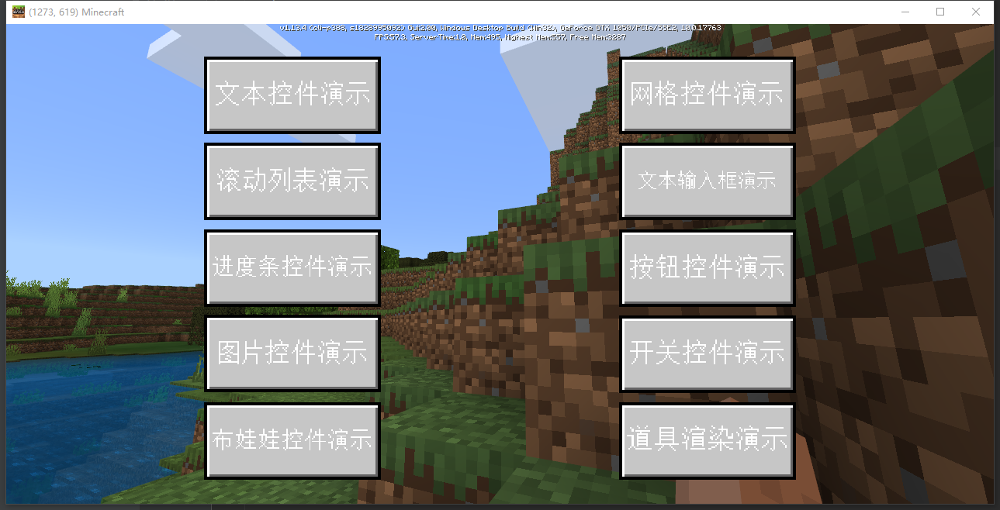

例如我们想了解一下文本控件是如何使用的，点击“文本控件演示”按钮进入演示界面，如下图。

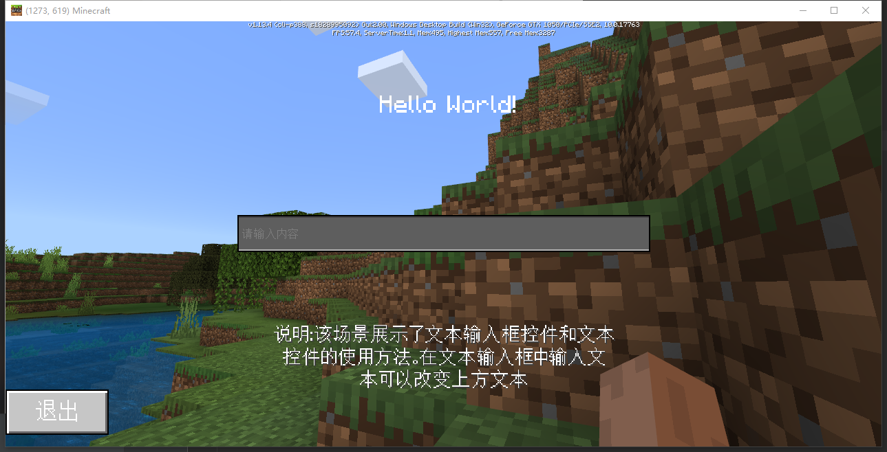

由于功能相关以及方便演示，我们将文本和文本输入框控件做在一个界面中共同演示。控件的演示界面中有待演示的UI控件、操作方法和返回菜单界面按钮。如操作方法描述的，我们在文本输入框中输入文本，上方的文本控件会根据文本输入框输入的内容发生对应的变化，逻辑可以在UIDemoMod的脚本代码中查到，如下图。

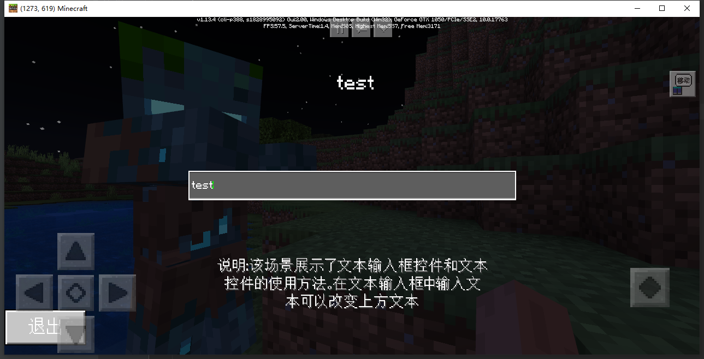

还想了解其他控件的用法，就下一个UIDemo看看吧！


## 富文本控件介绍

富文本控件提供了一个支持文本、图片、按钮、超链接、序列帧的复合文本控件，富文本控件接受按一定规则组成的字符串，除去常规文本外，定制化文本及非文本控件用html的标签写法隔开（如`<button></button>`）,中间填写json格式数据。开发者可以在UI中引用该控件，并将符合解析规则的字符串传入解析接口，富文本控件会根据传入的字符串顺序排列生成富文本。以下详细介绍用法。

### 富文本支持定制化文本及非文本控件及写法

#### 定制化文本控件

在字符串中嵌入`<label>label_data</label>`样式文本会被解析成定制文本，与常规文本不同的是定制化文本可以独立设置文字的字体、大小、颜色等，丰富富文本的文本样式。label_data为特殊化数据，以下所列属性为必须属性，text为文本，font为字体，默认值为unicode，scale为字体缩放倍率，默认值为1.0，color为字体颜色，默认值为[1,1,1,1]。需要注意的是如果文本中存在中文字符则字体会被强制设置为unicode，此外如果字体缩放倍率过大该段文本将不会被显示。

```json
   label_data：{
      "text" : "玩家一", 
      "font" : "smooth", 
      "scale": 3, 
      "color": [1,0,0,1]
      }
```

#### 图片控件

在字符串中嵌入`<image>image_data</image>`样式文本会被解析成图片，image_data为特殊化数据，以下所列属性为必须属性，texture为资源路径，x为图片宽度，y为图片高度

```json
   image_data：{
      "texture":"texture/ui/laugh",
      "x":30,
      "y":30
   }
```

#### 按钮

在字符串中嵌入`<button>button_data</button>`样式会被解析成按钮，button_data为特殊化数据，开发者可以在其中添加符合json格式的自定义数据，在点击富文本中对应按钮时会将button_data通过回调函数整个返回，以下属性为必须属性，press_texture为按钮按下贴图，hover_texture为按钮鼠标悬浮贴图，default_texture为默认状态下按钮贴图，button_label为按钮上的问题，x为按钮宽度，y为按钮高度

```json
   button_data:{
      "press_texture": "",
      "hover_texture": "",
      "default_texture": "",
      "button_label": "",
      "x":20,
      "y":20
   }
```

#### 超链接

在字符串中嵌入`<link>link_data</link>`样式会被解析成超链接，外观和普通文本无异但可以被点击，link_data为特殊化数据，开发者可以在其中添加符合json格式的自定义数据，在点击富文本中对应超链接时会将link_data通过回调函数整个返回，以下属性为必须属性，text表示显示文本，format_code表示该段显示文本的样式代码，注意，基岩版的文本控件不支持下划线和删除线。

```json
   link_data:{
      "text":"末影人",
      "format_code":"§2"
      }
```

#### 序列帧动画

在字符串中嵌入`<sfx>sfx_data</sfx>`样式文本会被解析成图片，sfx_data为特殊化数据，以下所列属性为必须属性，texture为资源路径，x为显示图片宽度，y为显示图片高度，uv_x为截取图片宽度，uv_y为截取图片高度，frame_count表示该序列帧的总帧数，fps为每秒执行帧数。

```json
   sfx_data:{
      "texture": "textures/ui/eating_apple",
      "x":30,
      "y":30,
      "uv_x": 64,
      "uv_y": 64,
      "frame_count": 36,
      "fps": 10
   }
```

### 富文本成品范例

#### 文本

```python
'[玩家]<label>{"text" : "玩家一", "font" : "smooth", "scale": 3, "color": [1,0,0,1]}</label><button>{"press_texture" : "textures/ui/btn_pressed","hover_texture" : "textures/ui/btn_hover","default_texture" : "textures/ui/btn_light_default","x":20, "y":20}</button>:恭喜！<image>{"texture":"textures/ui/skin/ty_yuanshenghuli_0_0", "x":30, "y":30}</image>击杀了<link>{"text" : "末影人", "format_code":"§2"}</link><sfx>{"texture": "textures/ui/eating_apple","x":30, "y":30,"uv_x": 64,"uv_y": 64,"frame_count": 36,"fps": 10}</sfx>'
```

#### 效果

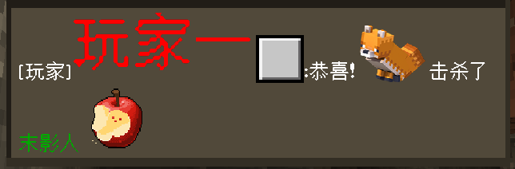


### 如何使用富文本

#### UI文件编写

若需要使用富文本，开发者只需要继承rich_text命名空间下的RichTextPanel控件，它是一个panel控件，也是单个富文本控件的根节点，该panel的宽度决定了富文本宽度。我们开放了若干引用属性可供设置。
 - $rich_panel_bg

   开发者可以设置富文本的背景图片

 - $rich_panel_nineslice_size

   开发者可以设置背景图片的九宫切图,值为0.01代表开启微软版本的九宫切图，且上下左右为切图像素为0.01，等价于[0.01,0.01,0.01,0.01]。

 - $rich_panel_font_size

   开发者可以设置富文本的文本字体大小，可设置选项为small, normal, large其中一个，默认值为normal

 - $rich_panel_font_scale_factor

   开发者可以设置富文本的文本字体缩放倍率，和$rich_panel_font_size一起影响富文本字体的最终大小，默认值为1.0

 - $rich_panel_color
  
   开发者可以设置富文本的文本字体颜色，默认值为[1,1,1]，白色

```json
   "main" : {
      "absorbs_input" : true,
      "always_accepts_input" : false,
      "controls" : [
         {
            "RichTextPanel@RichText.RichTextPanel" : {}
         }
      ],
      "force_render_below" : false,
      "is_showing_menu" : true,
      "render_game_behind" : true,
      "render_only_when_topmost" : true,
      "should_steal_mouse" : false,
      "type" : "screen"
   },
   "RichTextPanel@rich_text.RichTextPanel" : {
      "$rich_panel_bg": "textures/ui/effect_background",
      "$rich_panel_nineslice_size": 0.01,
      "$rich_panel_font_size" : "large",
      "$rich_panel_font_scale_factor" : 2.0,
      "$rich_panel_color" : [1,1,1]
   },
```

#### python脚本编写

在需要创建富文本时，调用UIAPI GetRichTextItem，将富文本控件路径作为参数传入，就能返回得倒一个RichTextItem实例，就完成了富文本的初始化。

富文本提供了三个回调注册接口和一个设置文本接口。

##### registerLinkItemClickCallback

注册点击超链接回调函数，参数为一个函数引用。超链接点击触发时会返回开发者给超链接设置的数据，以及当前点击屏幕的坐标值touchX和touchY

##### registerButtonItemClickCallback

注册点击按钮回调函数，参数为一个函数引用。按钮点击触发时会返回开发者给按钮设置的数据，以及当前点击屏幕的坐标值touchX和touchY

##### registerRichTextFinishCallback

注册富文本创建完毕回调函数，由于富文本构成较为复杂，无法在一帧之内生成完毕，因此生成需要一点点时间，等富文本创建完毕后会调用该回调函数。

##### readRichText

创建富文本入口，接受一个符合格式的字符串，将其转变为富文本显示出来。

以下是示例

```python
   def CreateRichText(self):
      self.richTextPath = "/RichTextPanel"
      self.richTextItem = self.GetRichTextItem(self.richTextPath)
      self.richTextItem.registerLinkItemClickCallback(self.OnLinkItemClickCallback)
      self.richTextItem.registerButtonItemClickCallback(self.OnButtonItemClickCallback)
      self.richTextItem.registerRichTextFinishCallback(self.OnRichTextCreateFinishCallback)
      self.richTextItem.readRichText('[玩家]<label>{"text" : "玩家一", "font" : "smooth", "scale": 3, "color": [1,0,0,1]}</label><button>{"press_texture" : "textures/ui/btn_pressed","hover_texture" : "textures/ui/btn_hover","default_texture" : "textures/ui/btn_light_default","x":20, "y":20}</button>:恭喜！<image>{"texture":"textures/ui/skin/ty_yuanshenghuli_0_0", "x":30, "y":30}</image>击杀了<link>{"text" : "末影人", "format_code":"§2"}</link><sfx>{"texture": "textures/ui/eating_apple","x":30, "y":30,"uv_x": 64,"uv_y": 64,"frame_count": 36,"fps": 10}</sfx>')

   def OnButtonItemClickCallback(self, data, touchX, touchY):
      print("---OnButtonItemClickCallback---", data, touchX, touchY)

   def OnLinkItemClickCallback(self, data, touchX, touchY):
      print("---OnLinkItemClickCallback---", data, touchX, touchY)

   def OnRichTextCreateFinishCallback(self):
      print("---OnRichTextCreateFinishCallback---")
```

##### 使用事项
 - 富文本是python实现的一个复合控件，在生成富文本后会有部分数据缓存在RichTextItem实例中，因此不支持使用clone接口复制已创建完成的富文本，但是clone没有调用过readRichText的富文本是可行的。
 - 我们在内部会缓存路径与RichTextItem实例的映射，使用GetRichTextItem接口，传入相同路径返回的RichTextItem实例也会是相同的。
