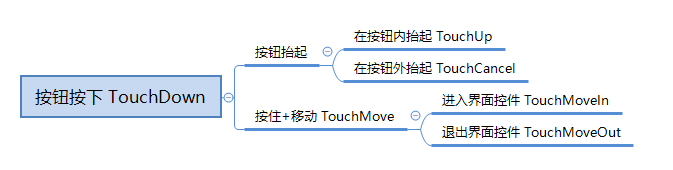

# <span id="UI控件对象API"></span>UI控件对象API

<span id="BaseUIControl"></span>
## BaseUIControl

UI面向对象基类

<span id="GetChildByName"></span>
### GetChildByName

- 描述

    根据子控件的名称获取BaseUIControl实例

- 参数

    | 参数名 | 数据类型 | 说明 |
    | :--- | :--- | :--- |
    | childName | str | 子节点名称 |

- 返回值

    | 数据类型 | 说明 |
    | :--- | :--- |
    | BaseUIControl | 子控件的BaseUIControl实例 |

- 示例

```python
# text1的BaseUIControl实例获得text2的BaseUIControl实例
text1Path = "/text1"
text1Control = uiNode.GetBaseUIControl(text1Path)
text2Control = text1Control.GetChildByName("text2")
```

<span id="GetChildByPath"></span>
### GetChildByPath

- 描述

    根据相对路径获取BaseUIControl实例

- 参数

    | 参数名 | 数据类型 | 说明 |
    | :--- | :--- | :--- |
    | childPath | str | 相对当前BaseUIControl路径的路径 |

- 返回值

    | 数据类型 | 说明 |
    | :--- | :--- |
    | BaseUIControl | 子控件的BaseUIControl实例 |

- 示例

```python
# 根据路径"/text1"的BaseUIControl实例获得路径为"/text1/text2/text3"的BaseUIControl实例
text1Path = "/text1"
text1Control = uiNode.GetBaseUIControl(text1Path)
text3Control = text1Control.GetChildByPath("/text2/text3")
```

<span id="GetPosition"></span>
### GetPosition

- 描述

    获取控件相对父节点的坐标

- 参数

    无

- 返回值

    | 数据类型 | 说明 |
    | :--- | :--- |
    | tuple(float,float) | 该控件相对父节点的坐标信息，第一项为横轴，第二项为纵轴 |

- 示例

```python
# we want to get text2 position
text2Path = "/panel/text2"
baseUIControl = uiNode.GetBaseUIControl(text2Path)
textPosition = baseUIControl.GetPosition()
```

<span id="GetSize"></span>
### GetSize

- 描述

    获取控件的大小

- 参数

    无

- 返回值

    | 数据类型 | 说明 |
    | :--- | :--- |
    | tuple(float,float) | 该控件的大小信息，第一项为横轴，第二项为纵轴 |

- 示例

```python
# we want to get text2 size
text2Path = "/panel/text2"
baseUIControl = uiNode.GetBaseUIControl(text2Path)
text2Size = baseUIControl.GetSize()
```

<span id="GetVisible"></span>
### GetVisible

- 描述

    根据控件路径返回某控件是否已显示

- 参数

    无

- 返回值

    | 数据类型 | 说明 |
    | :--- | :--- |
    | bool | 该控件是否已显示 |

- 示例

```python
# 我们获得panel下面的text2是否显示
text2Path = "/panel/text2"
baseUIControl = uiNode.GetBaseUIControl(text2Path)
textVisible = baseUIControl.GetVisible()
```

<span id="SetAlpha"></span>
### SetAlpha

- 描述

    设置节点的透明度，仅对image和label控件生效

- 参数

    | 参数名 | 数据类型 | 说明 |
    | :--- | :--- | :--- |
    | alpha | float | 透明度，取值0-1之间，0表示完全透明，1表示完全不透明 |

- 返回值

    无

- 示例

```python
# 设置text2的透明度为半透明
text2Path = "/panel/text2"
baseUIControl = uiNode.GetBaseUIControl(text2Path)
baseUIControl.SetAlpha(0.5)
```

<span id="SetPosition"></span>
### SetPosition

- 描述

    设置控件相对父节点的坐标

- 参数

    | 参数名 | 数据类型 | 说明 |
    | :--- | :--- | :--- |
    | pos | tuple(float,float) | 该控件相对父节点的坐标信息，第一项为横轴，第二项为纵轴 |

- 返回值

    无

- 示例

```python
# we want to set text2 position
text2Path = "/panel/text2"
pos = (10, 10)
baseUIControl = uiNode.GetBaseUIControl(text2Path)
baseUIControl.SetPosition(pos)
```

<span id="SetSize"></span>
### SetSize

- 描述

    设置控件的大小

- 参数

    | 参数名 | 数据类型 | 说明 |
    | :--- | :--- | :--- |
    | size | tuple(float,float) | 该控件的大小信息，第一项为横轴，第二项为纵轴 |
    | resizeChildren | bool | 是否同时调整子控件尺寸，默认为False |

- 返回值

    无

- 示例

```python
# we want to set text2 size
text2Path = "/panel/text2"
text2Size = (10, 10)
baseUIControl = uiNode.GetBaseUIControl(text2Path)
baseUIControl.SetSize(text2Size)
```

<span id="SetTouchEnable"></span>
### SetTouchEnable

- 描述

    设置控件是否可点击交互

- 参数

    | 参数名 | 数据类型 | 说明 |
    | :--- | :--- | :--- |
    | enable | bool | False为不响应，True为恢复响应 |

- 返回值

    无

- 示例

```python
# we want to set image_button unable
imageButtonPath = "/image_button"
baseUIControl = uiNode.GetBaseUIControl(imageButtonPath)
baseUIControl.SetTouchEnable(False)
```

<span id="SetVisible"></span>
### SetVisible

- 描述

    根据控件路径选择是否显示某控件

- 参数

    | 参数名 | 数据类型 | 说明 |
    | :--- | :--- | :--- |
    | visible | bool | False为隐藏该控件，True为显示该控件 |

- 返回值

    无

- 示例

```python
# 我们隐藏panel下面的text2
text2Path = "/panel/text2"
baseUIControl = uiNode.GetBaseUIControl(text2Path)
baseUIControl.SetVisible(False)
```

<span id="asButton"></span>
### asButton

- 描述

    将当前BaseUIControl转换为ButtonUIControl实例，如当前控件非button类型则返回None

- 参数

    无

- 返回值

    | 数据类型 | 说明 |
    | :--- | :--- |
    | ButtonUIControl | ButtonUIControl实例 |

- 示例

```python
buttonPath = "/button"
buttonBaseControl = uiNode.GetBaseUIControl(buttonPath)
buttonControl = buttonBaseControl.asButton()
```

<span id="asGrid"></span>
### asGrid

- 描述

    将当前BaseUIControl转换为GridUIControl实例，如当前控件非grid类型则返回None

- 参数

    无

- 返回值

    | 数据类型 | 说明 |
    | :--- | :--- |
    | GridUIControl | GridUIControl实例 |

- 示例

```python
gridPath = "/grid"
gridBaseControl = uiNode.GetBaseUIControl(gridPath)
gridControl = gridBaseControl.asGrid()
```

<span id="asImage"></span>
### asImage

- 描述

    将当前BaseUIControl转换为ImageUIControl实例，如当前控件非image类型则返回None

- 参数

    无

- 返回值

    | 数据类型 | 说明 |
    | :--- | :--- |
    | ImageUIControl | ImageUIControl实例 |

- 示例

```python
imagePath = "/image"
imageBaseControl = uiNode.GetBaseUIControl(imagePath)
imageControl = imageBaseControl.asImage()
```

<span id="asLabel"></span>
### asLabel

- 描述

    将当前BaseUIControl转换为LabelUIControl实例，如当前控件非Label类型则返回None

- 参数

    无

- 返回值

    | 数据类型 | 说明 |
    | :--- | :--- |
    | LabelUIControl | LabelUIControl实例 |

- 示例

```python
text1Path = "/text1"
text1BaseControl = uiNode.GetBaseUIControl(text1Path)
text1LabelControl = text1BaseControl.asLabel()
```

<span id="asNeteasePaperDoll"></span>
### asNeteasePaperDoll

- 描述

    将当前BaseUIControl转换为NeteasePaperDollUIControl实例，如当前控件非custom类型则返回None

- 参数

    无

- 返回值

    | 数据类型 | 说明 |
    | :--- | :--- |
    | NeteasePaperDollUIControl | NeteasePaperDollUIControl实例 |

- 示例

```python
paperDollPath = "/paper_doll"
paperDollBaseControl = uiNode.GetBaseUIControl(paperDollPath)
paperDollControl = paperDollBaseControl.asNeteasePaperDoll()
```

<span id="asProgressBar"></span>
### asProgressBar

- 描述

    将当前BaseUIControl转换为TextEditBoxUIControl实例，如当前控件非panel类型则返回None

- 参数

    | 参数名 | 数据类型 | 说明 |
    | :--- | :--- | :--- |
    | fillImagePath | str | 进度条填充图片路径，默认为"/filled_progress_bar",该参数影响该控件API的效果 |

- 返回值

    | 数据类型 | 说明 |
    | :--- | :--- |
    | ProgressBarUIControl | ProgressBarUIControl实例 |

- 示例

```python
progressBarPath = "/progress_bar"
progressBarBaseControl = uiNode.GetBaseUIControl(progressBarPath)
progressBarControl = progressBarBaseControl.asProgressBar()
```

<span id="asScrollView"></span>
### asScrollView

- 描述

    将当前BaseUIControl转换为ScrollViewUIControl实例，如当前控件非scrollview类型则返回None

- 参数

    无

- 返回值

    | 数据类型 | 说明 |
    | :--- | :--- |
    | ScrollViewUIControl | ScrollViewUIControl实例 |

- 示例

```python
scrollViewPath = "/scroll_view"
scrollViewBaseControl = uiNode.GetBaseUIControl(scrollViewPath)
scrollViewControl = scrollviewBaseControl.asScrollView()
```

<span id="asSwitchToggle"></span>
### asSwitchToggle

- 描述

    将当前BaseUIControl转换为SwitchToggleUIControl实例，如当前控件非panel类型则返回None

- 参数

    无

- 返回值

    | 数据类型 | 说明 |
    | :--- | :--- |
    | SwitchToggleUIControl | SwitchToggleUIControl实例 |

- 示例

```python
switchTogglePath = "/switch_toggle"
switchToggleBaseControl = uiNode.GetBaseUIControl(switchTogglePath)
switchToggleControl = switchToggleBaseControl.asSwitchToggle()
```

<span id="asTextEditBox"></span>
### asTextEditBox

- 描述

    将当前BaseUIControl转换为TextEditBoxUIControl实例，如当前控件非editbox类型则返回None

- 参数

    无

- 返回值

    | 数据类型 | 说明 |
    | :--- | :--- |
    | TextEditBoxUIControl | TextEditBoxUIControl实例 |

- 示例

```python
textEditBoxPath = "/text_edit_box"
textEditBoxBaseControl = uiNode.GetBaseUIControl(textEditBoxPath)
textEditBoxControl = textEditBoxBaseControl.asTextEditBox()
```

<span id="GridUIControl"></span>
## GridUIControl

UI面向对象网格控件类

<span id="SetGridDimension"></span>
### SetGridDimension

- 描述

    设置Grid控件的大小

- 参数

    | 参数名 | 数据类型 | 说明 |
    | :--- | :--- | :--- |
    | dimension | tuple(int,int) | 设置网格的横向与纵向大小 |

- 返回值

    无

- 示例

```python
# we want change grid dimension
gridPath = "/grid1"
gridUIControl = uiNode.GetBaseUIControl(gridPath).asGrid()
gridUIControl.SetGridDimension((2, 2))
```

<span id="ButtonUIControl"></span>
## ButtonUIControl

UI面向对象按钮控件类

<span id="AddTouchEventParams"></span>
### AddTouchEventParams

- 描述

    开启按钮回调功能，不调用该函数则按钮无回调

- 参数

    | 参数名 | 数据类型 | 说明 |
    | :--- | :--- | :--- |
    | args | dict | 默认为None，详细说明请见备注。 |

- 返回值

    无

- 备注
    - AddTouchEventParams参数args说明：
        | 关键字     | 数据类型              | 说明     |
        | ----------| --------------------- | ---------|
        | isSwallow | bool | 默认为True, 按钮是否吞噬事件；或为Ture时，点击按钮时，点击事件不会穿透到世界。如破坏方块、镜头转向不会被响应|
        

- 示例

```python
buttonPath = "/panel/test_btn"
buttonUIControl = uiNode.GetBaseUIControl("/panel/test_btn").asButton()
buttonUIControl.AddTouchEventParams({"isSwallow":True})
```

<span id="SetButtonTouchCancelCallback"></span>
### SetButtonTouchCancelCallback

- 描述

    设置触控在按钮范围外弹起时触发的回调函数

- 参数

    | 参数名 | 数据类型 | 说明 |
    | :--- | :--- | :--- |
    | callbackFunc | function | 回调函数，必须是UI的类函数 |

- 返回值

    无

- 备注
    - 其他相关说明见SetButtonTouchDownCallback接口：

- 示例

```python
def onButtonTouchCancelCallback(args):
        pass

buttonPath = "/panel/test_btn"
buttonUIControl = uiNode.GetBaseUIControl("/panel/test_btn").asButton()
buttonUIControl.AddTouchEventParams({"isSwallow":True})
buttonUIControl.SetButtonTouchCancelCallback(onButtonTouchCancelCallback)
```

<span id="SetButtonTouchDownCallback"></span>
### SetButtonTouchDownCallback

- 描述

    设置按钮按下时触发的回调函数

- 参数

    | 参数名 | 数据类型 | 说明 |
    | :--- | :--- | :--- |
    | callbackFunc | function | 回调函数，必须是UI的类函数 |

- 返回值

    无

- 备注
    - onButtonTouchDownCallback参数args说明：
        | 参数              | 类型  | 解释                                                         |
        | ----------------- | ----- | ------------------------------------------------------------ |
        | #collection_name  | str   | 按钮所属的集合名称                                           |
        | #collection_index | int   | 按钮在集合所属的集合序号                                     |
        | ButtonState       | int   | 按钮的状态：Up为0，Down为1，默认是-1，建议使用New            |
        | TouchEvent        | int   | 按钮的状态新版本：Up为0，Down为1，Cancel为3，Move为4，默认是-1 |
        | PrevButtonDownID  | str   | 上一个被点击Down的按钮的ID，如果没有取值为"-1"               |
        | TouchPosX         | float | 按钮被点击时屏幕上的UI坐标X值                                |
        | TouchPosY         | float | 按钮被点击时屏幕上的UI坐标Y值                                |
        | ButtonPath        | str   | 被点击的按钮的ComponentPath                                  |
        
        事件之间的关系如下图所示：
        

- 示例

```python
def onButtonTouchDownCallback(args):
        pass

buttonPath = "/panel/test_btn"
buttonUIControl = uiNode.GetBaseUIControl("/panel/test_btn").asButton()
buttonUIControl.AddTouchEventParams({"isSwallow":True})
buttonUIControl.SetButtonTouchDownCallback(onButtonTouchDownCallback)
```

<span id="SetButtonTouchMoveCallback"></span>
### SetButtonTouchMoveCallback

- 描述

    设置按下后触控移动时触发的回调函数

- 参数

    | 参数名 | 数据类型 | 说明 |
    | :--- | :--- | :--- |
    | callbackFunc | function | 回调函数，必须是UI的类函数 |

- 返回值

    无

- 备注
    - 其他相关说明见SetButtonTouchDownCallback接口：

- 示例

```python
def onButtonTouchMoveCallback(args):
        pass

buttonPath = "/panel/test_btn"
buttonUIControl = uiNode.GetBaseUIControl("/panel/test_btn").asButton()
buttonUIControl.AddTouchEventParams({"isSwallow":True})
buttonUIControl.SetButtonTouchMoveCallback(onButtonTouchMoveCallback)
```

<span id="SetButtonTouchMoveInCallback"></span>
### SetButtonTouchMoveInCallback

- 描述

    设置按下按钮后进入控件时触发的回调函数

- 参数

    | 参数名 | 数据类型 | 说明 |
    | :--- | :--- | :--- |
    | callbackFunc | function | 回调函数，必须是UI的类函数 |

- 返回值

    无

- 备注
    - 其他相关说明见SetButtonTouchDownCallback接口：

- 示例

```python
def onButtonTouchMoveInCallback(args):
        pass

buttonPath = "/panel/test_btn"
buttonUIControl = uiNode.GetBaseUIControl("/panel/test_btn").asButton()
buttonUIControl.AddTouchEventParams({"isSwallow":True})
buttonUIControl.SetButtonTouchMoveInCallback(onButtonTouchMoveInCallback)
```

<span id="SetButtonTouchMoveOutCallback"></span>
### SetButtonTouchMoveOutCallback

- 描述

    设置按下按钮后退出控件时触发的回调函数

- 参数

    | 参数名 | 数据类型 | 说明 |
    | :--- | :--- | :--- |
    | callbackFunc | function | 回调函数，必须是UI的类函数 |

- 返回值

    无

- 备注
    - 其他相关说明见SetButtonTouchDownCallback接口：

- 示例

```python
def onButtonTouchMoveOutCallback(args):
        pass

buttonPath = "/panel/test_btn"
buttonUIControl = uiNode.GetBaseUIControl("/panel/test_btn").asButton()
buttonUIControl.AddTouchEventParams({"isSwallow":True})
buttonUIControl.SetButtonTouchMoveOutCallback(onButtonTouchMoveOutCallback)
```

<span id="SetButtonTouchUpCallback"></span>
### SetButtonTouchUpCallback

- 描述

    设置触控在按钮范围内弹起时的回调函数

- 参数

    | 参数名 | 数据类型 | 说明 |
    | :--- | :--- | :--- |
    | callbackFunc | function | 回调函数，必须是UI的类函数 |

- 返回值

    无

- 备注
    - 其他相关说明见SetButtonTouchDownCallback接口：

- 示例

```python
def onButtonTouchUpCallback(args):
        pass

buttonPath = "/panel/test_btn"
buttonUIControl = uiNode.GetBaseUIControl("/panel/test_btn").asButton()
buttonUIControl.AddTouchEventParams({"isSwallow":True})
buttonUIControl.SetButtonTouchUpCallback(onButtonTouchUpCallback)
```

<span id="LabelUIControl"></span>
## LabelUIControl

UI面向对象文本控件类

<span id="GetText"></span>
### GetText

- 描述

    获取Label的文本信息，获取失败会返回None

- 参数

    无

- 返回值

    | 数据类型 | 说明 |
    | :--- | :--- |
    | str | 文本信息 |

- 备注
    - 获取失败通常是由于路径填写错误，或该控件不是Label类型

- 示例

```python
# we want to get text2 content
text2Path = "/panel/text2"
labelUIControl = uiNode.GetBaseUIControl(text2Path).asLabel()
labelUIControl.GetText()
```

<span id="GetTextColor"></span>
### GetTextColor

- 描述

    获取Label文本颜色

- 参数

    无

- 返回值

    | 数据类型 | 说明 |
    | :--- | :--- |
    | tuple(float,float,float,float) | 获取文本的颜色信息(r, g, b, a), 取值[0, 1] |

- 示例

```python
# we want to get text2 color
text2Path = "/panel/text2"
labelUIControl = uiNode.GetBaseUIControl(text2Path).asLabel()
labelUIControl.GetTextColor()
```

<span id="SetText"></span>
### SetText

- 描述

    设置Label的文本信息

- 参数

    | 参数名 | 数据类型 | 说明 |
    | :--- | :--- | :--- |
    | text | str | 文本的内容，可以支持[样式代码](https://minecraft-zh.gamepedia.com/%E6%A0%B7%E5%BC%8F%E4%BB%A3%E7%A0%81)（§可以设置文字的颜色、格式等，该种用法更加灵活多变） |
    | syncSize | bool | 是否设置文本时同步更新文本框大小，默认值为False |

- 返回值

    无

- 示例

```python
# we want to set text2 content
text2Path = "/panel/text2"
text = "Hello World!"
labelUIControl = uiNode.GetBaseUIControl(text2Path).asLabel()
labelUIControl.SetText(text)
```

<span id="SetTextColor"></span>
### SetTextColor

- 描述

    设置Label文本的颜色

- 参数

    | 参数名 | 数据类型 | 说明 |
    | :--- | :--- | :--- |
    | color | tuple(float,float,float,float) | 文本的颜色信息(r, g, b, a)，取值[0, 1] |

- 返回值

    无

- 示例

```python
# we want to set text2 green
text2Path = "/panel/text2"
color = (0, 1, 0, 0.8)
labelUIControl = uiNode.GetBaseUIControl(text2Path).asLabel()
labelUIControl.SetTextColor(color)
```

<span id="SetTextFontSize"></span>
### SetTextFontSize

- 描述

    设置Label中文本字体的大小

- 参数

    | 参数名 | 数据类型 | 说明 |
    | :--- | :--- | :--- |
    | componentPath | str | 为从main节点开始的控件路径 |
    | scale | float | label的font_size的作用是Label中的默认字体大小，取值有限为[small normal large]，这个scale是在这个默认字体的基础上进行缩放字体大小，默认字体大小为1.0 |

- 返回值

    无

- 示例

```python
# set text font size
text2Path = "/panel/text2"
labelUIControl = uiNode.GetBaseUIControl(text2Path).asLabel()
labelUIControl.SetTextFontSize(0.8)
```

<span id="ScrollViewUIControl"></span>
## ScrollViewUIControl

UI面向对象滚动列表控件类

<span id="GetScrollViewContentControl"></span>
### GetScrollViewContentControl

- 描述

    返回该scroll_view内容的路径

- 参数

    无

- 返回值

    | 数据类型 | 说明 |
    | :--- | :--- |
    | BaseUIControl | 该scroll_view内容的BaseUIControl实例 |

- 示例

```python
# we want get scroll_view content
scrollViewPath = "/scroll_view0"
scrollViewUIControl = uiNode.GetBaseUIControl(scrollViewPath).asScrollView()
contentUIControl = scrollViewUIControl.GetScrollViewContentControl()
```

<span id="GetScrollViewContentPath"></span>
### GetScrollViewContentPath

- 描述

    返回该scroll_view内容的路径

- 参数

    无

- 返回值

    | 数据类型 | 说明 |
    | :--- | :--- |
    | str | 该scroll_view内容的路径 |

- 示例

```python
# we want get scroll_view content path
scrollViewPath = "/scroll_view0"
scrollViewUIControl = uiNode.GetBaseUIControl(scrollViewPath).asScrollView()
path = scrollViewUIControl.GetScrollViewContentPath()
```

<span id="GetScrollViewPos"></span>
### GetScrollViewPos

- 描述

    获得当前scroll_view最上方内容的位置

- 参数

    无

- 返回值

    | 数据类型 | 说明 |
    | :--- | :--- |
    | float | 当前scroll_view最上方内容的位置 |

- 示例

```python
# we want get scroll_view pos
scrollViewPath = "/scroll_view0"
scrollViewUIControl = uiNode.GetBaseUIControl(scrollViewPath).asScrollView()
scrollViewUIControl.GetScrollViewPos()
```

<span id="SetScrollViewPercentValue"></span>
### SetScrollViewPercentValue

- 描述

    设置当前scroll_view内容的百分比位置

- 参数

    | 参数名 | 数据类型 | 说明 |
    | :--- | :--- | :--- |
    | percent_value | int | 需要跳转到的百分比位置，一般设置的位置会出现在scroll_view的最上方。该值取值范围0-100 |

- 返回值

    无

- 示例

```python
# we want set scroll_view percent pos
scrollViewPath = "/scroll_view0"
scrollViewUIControl = uiNode.GetBaseUIControl(scrollViewPath).asScrollView()
scrollViewUIControl.SetScrollViewPercentValue(20)
```

<span id="SetScrollViewPos"></span>
### SetScrollViewPos

- 描述

    设置当前scroll_view内容的位置

- 参数

    | 参数名 | 数据类型 | 说明 |
    | :--- | :--- | :--- |
    | pos | float | 需要跳转到的位置，一般设置的位置会出现在scroll_view的最上方。 |

- 返回值

    无

- 示例

```python
# we want set scroll_view pos
scrollViewPath = "/scroll_view0"
scrollViewUIControl = uiNode.GetBaseUIControl(scrollViewPath).asScrollView()
scrollViewUIControl.SetScrollViewPos(100)
```

<span id="ImageUIControl"></span>
## ImageUIControl

UI面向对象图片控件类

<span id="SetSprite"></span>
### SetSprite

- 描述

    给图片控件换指定贴图

- 参数

    | 参数名 | 数据类型 | 说明 |
    | :--- | :--- | :--- |
    | texturePath | str | 贴图的路径，需要从resource_pack下面的textures目录开始 |

- 返回值

    无

- 备注
    - 给ImageButton换贴图的时候注意使用子控件路径(default / hover / pressed)获得ImageUIControl

- 示例

```python
# we want to set image_button textures
imageButtonPath = "/image_button"
buttonUIControl = uiNode.GetBaseUIControl(imageButtonPath).asButton()
buttonDefaultUIControl = buttonUIControl.GetChildByName("default").asImage()
buttonHoverUIControl = buttonUIControl.GetChildByName("hover").asImage()
buttonPressedUIControl = buttonUIControl.GetChildByName("pressed").asImage()
buttonDefaultUIControl.SetSprite("textures/button01_default")
buttonHoverUIControl.SetSprite("textures/button01_hover")
buttonPressedUIControl.SetSprite("textures/button01_pressed")
```

<span id="SetSpriteClipRatio"></span>
### SetSpriteClipRatio

- 描述

    设置图片的裁剪区域比例（不改变控件尺寸）。可以配合image控件的clip_ratio属性控制方向。

- 参数

    | 参数名 | 数据类型 | 说明 |
    | :--- | :--- | :--- |
    | clipRatio | float | 图片的裁剪比例（范围0到1），裁剪精度与图片分辨率相关 |

- 返回值

    无

- 示例

```python
# 我们想对UI编辑器创建的进度条设置进度
# 编辑器进度条包含两个image控件（名为empty_progress_bar和filled_progress_bar）
progress = 0.8  # 用于模拟进度时，下面的裁剪比例需设为(1-进度)，才能得到正确的视觉效果
imagePath = "/progress_bar0/filled_progress_bar"
imageUIControl = uiNode.GetBaseUIControl(imagePath).asImage()
imageUIControl.SetSpriteClipRatio(1.0 - progress)
```

<span id="SetSpriteColor"></span>
### SetSpriteColor

- 描述

    设置图片颜色

- 参数

    | 参数名 | 数据类型 | 说明 |
    | :--- | :--- | :--- |
    | color | tuple(float,float,float) | 图片颜色rgb |

- 返回值

    无

- 示例

```python
# 我们想对耐久度条随耐久度变化颜色，满的时候为绿色，空的时候为红色，其中barPath为耐久度条路径
durabilityRatio = 0.8  # 耐久度比例，1为满耐久
barPath = "/image_bar"
imageUIControl = uiNode.GetBaseUIControl(barPath).asImage()
imageUIControl.SetSpriteColor((1 - durabilityRatio, durabilityRatio, 0))
```

<span id="SetSpriteGray"></span>
### SetSpriteGray

- 描述

    给图片控件置灰，比直接SetSprite一张灰图片效率要高

- 参数

    | 参数名 | 数据类型 | 说明 |
    | :--- | :--- | :--- |
    | gray | bool | True为将图片置灰，False为恢复原色 |

- 返回值

    无

- 示例

```python
# we want set image gray
imagePath = "/image"
imageUIControl = uiNode.GetBaseUIControl(imagePath).asImage()
imageUIControl.SetSpriteGray(True)
```

<span id="SetSpriteUV"></span>
### SetSpriteUV

- 描述

    设置图片的起始uv，与json中的"uv"属性作用一致

- 参数

    | 参数名 | 数据类型 | 说明 |
    | :--- | :--- | :--- |
    | uv | tuple(float,float) | 图片的左上角为(0,0)，向右为x轴，向下为y轴 |

- 返回值

    无

- 示例

```python
imagePath = "/image"
imageUIControl = uiNode.GetBaseUIControl(imagePath).asImage()
imageUIControl.SetSpriteUV((10, 0))
```

<span id="SetSpriteUVSize"></span>
### SetSpriteUVSize

- 描述

    设置图片的uv大小，与json中的"uv_size"属性作用一致

- 参数

    | 参数名 | 数据类型 | 说明 |
    | :--- | :--- | :--- |
    | uvSize | tuple(float,float) | 图片向右为x轴，向下为y轴 |

- 返回值

    无

- 示例

```python
imagePath = "/image"
imageUIControl = uiNode.GetBaseUIControl(imagePath).asImage()
imageUIControl.SetSpriteUVSize((40, 30))
```

<span id="SwitchToggleUIControl"></span>
## SwitchToggleUIControl

UI面向对象开关控件类

<span id="SetToggleState"></span>
### SetToggleState

- 描述

    设置Toggle开关控件的值

- 参数

    | 参数名 | 数据类型 | 说明 |
    | :--- | :--- | :--- |
    | is_on | bool | 设置Toggle开关控件是打开还是关闭状态 |

- 返回值

    无

- 示例

```python
togglePath = "/toggle1"
switchToggleUIControl = uiNode.GetBaseUIControl(togglePath).asSwitchToggle()
switchToggleUIControl.SetToggleState(True)
```

<span id="TextEditBoxUIControl"></span>
## TextEditBoxUIControl

UI面向对象文本输入框控件类

<span id="GetEditText"></span>
### GetEditText

- 描述

    获取edit_box输入框的文本信息，获取失败会返回None

- 参数

    无

- 返回值

    | 数据类型 | 说明 |
    | :--- | :--- |
    | str | 文本信息 |

- 备注
    - 获取失败通常是由于路径填写错误，或该控件不是edit_box类型

- 示例

```python
# we want to get edit2 content
editBoxPath = "/panel/edit2"
textEditBoxUIControl = uiNode.GetBaseUIControl(editBoxPath).asTextEditBox()
text = textEditBoxUIControl.GetEditText()
```

<span id="SetEditText"></span>
### SetEditText

- 描述

    设置edit_box输入框的文本信息

- 参数

    | 参数名 | 数据类型 | 说明 |
    | :--- | :--- | :--- |
    | text | str | 文本的内容 |

- 返回值

    无

- 示例

```python
# we want to clear edit2 content
editBoxPath = "/panel/edit2"
text = ""
textEditBoxUIControl = uiNode.GetBaseUIControl(editBoxPath).asTextEditBox()
textEditBoxUIControl.SetEditText(text)
```

<span id="SetEditTextMaxLength"></span>
### SetEditTextMaxLength

- 描述

    设置输入框的最大输入长度

- 参数

    | 参数名 | 数据类型 | 说明 |
    | :--- | :--- | :--- |
    | maxLength | int | 输入框可输入的最大长度，取值[0, +∞) |

- 返回值

    无

- 示例

```python
# we want to set text_edit_box max input length 10
editTextPath = "/panel2/text_edit_box"
textEditBoxUIControl = uiNode.GetBaseUIControl(editBoxPath).asTextEditBox()
textEditBoxUIControl.SetEditTextMaxLength(10)
```

<span id="NeteasePaperDollUIControl"></span>
## NeteasePaperDollUIControl

I面向对象纸娃娃控件类
用于在UI上渲染实体/骨骼模型/特效

<span id="GetModelId"></span>
### GetModelId

- 描述

    获取渲染的骨骼模型Id

- 参数

    无

- 返回值

    | 数据类型 | 说明 |
    | :--- | :--- |
    | int | 骨骼模型Id，失败或者不存在返回-1 |

- 备注
    - 注意：请不要在RenderEntity/RenderSkeletonModel调用之后立即执行。
        骨骼模型Id可用于一下情形：
        1.绑定一个另外的骨骼模型；
        2.绑定序列帧动画；
        3.绑定特效粒子动画

- 示例

```python
import mod.client.extraClientApi as clientApi
path = '/demoPanel/paper_doll'
doll = uiNode.GetBaseUIControl(path).asNeteasePaperDoll()
modelId = doll.GetModelId()
if modelId == -1:
        return
#用途1：绑定一个另外的骨骼模型
modelComp = clientApi.GetEngineCompFactory().CreateModel(modelId)
newModelId = modelComp.BindModelToModel("rightHand", "gun") # 把名称为gun的骨骼模型挂接到rightHand骨骼上
#用途2：绑定序列帧动画
sfxId = clientSystem.CreateEngineSfxFromEditor("effects/example_sfx.json") # 创建特效
comp = clientApi.GetEngineCompFactory().CreateFrameAniSkeletonBind(sfxId)
comp.Bind(modelId, "root", (0, 1, 0), (0, 0, 0)) # 把特效绑定到骨骼模型的骨骼节点上
frameComp = clientApi.GetEngineCompFactory().CreateFrameAniControl(sfxId)
frameComp.Play() # 播放动画
clientSystem.DestroyEntity(sfxId) # 销毁动画
#用途3：绑定特效粒子动画
particleEntityId = clientSystem.CreateEngineParticle("effects/example_particle.json", (0,0,0)) # 创建特效
comp = clientApi.GetEngineCompFactory().CreateParticleSkeletonBind(particleEntityId)
comp.Bind(modelId, "root", (0, 1, 0), (0, 0, 0)) # 把特效绑定到骨骼模型的骨骼节点上
particleComp = clientApi.GetEngineCompFactory().CreateParticleControl(particleEntityId)
particleComp.Play() # 播放动画
clientSystem.DestroyEntity(particleEntityId) # 销毁动画
```

<span id="RenderEntity"></span>
### RenderEntity

- 描述

    渲染实体

- 参数

    | 参数名 | 数据类型 | 说明 |
    | :--- | :--- | :--- |
    | params | dict | 渲染参数，详细说明请见备注 |

- 返回值

    | 数据类型 | 说明 |
    | :--- | :--- |
    | bool | 是否成功 |

- 备注
    - RenderEntity参数params说明：
        params参数解释如下：
        | 参数              | 类型  | 解释                                                         |
        | ----------------- | ----- | ------------------------------------------------------------ |
        | entity_id  | str   | 渲染生物的实体Id                                           |
        | scale | float   | 渲染缩放比例，默认为1.0                                     |
        | render_depth       | int   | 渲染深度，对于玩家默认-50，普通生物-15，该参数可解决UI遮挡剔除问题            |
        | init_rot_y        | float   | 初始Y方向的朝向 |
        | molang_dict  | dict   | molang表达式字典，其中key为str，value为float               |
        

- 示例

```python
path = '/demoPanel/paper_doll'
param = {
        "entity_id": "-8589934591",
        "scale": 0.5,
        "render_depth": -50,
        "init_rot_y": 60,
        "molang_dict": {"variable.liedownamount": 1}
}
doll = uiNode.GetBaseUIControl(path).asNeteasePaperDoll()
doll.RenderEntity(param)
```

<span id="RenderSkeletonModel"></span>
### RenderSkeletonModel

- 描述

    渲染骨骼模型（不依赖实体）

- 参数

    | 参数名 | 数据类型 | 说明 |
    | :--- | :--- | :--- |
    | params | dict | 渲染参数，详细说明请见备注 |

- 返回值

    | 数据类型 | 说明 |
    | :--- | :--- |
    | bool | 是否成功 |

- 备注
    - RenderSkeletonModel参数params说明：
        params参数解释如下：
        | 参数              | 类型  | 解释                                                         |
        | ----------------- | ----- | ------------------------------------------------------------ |
        | skeleton_model_name         | str | 骨骼模型名称                                |
        | animation         | str | 骨骼动作名称，默认为idle                                |
        | animation_looped        | bool   | 骨骼动作是否循环播放，默认True                                  |
        | scale | float   | 渲染缩放比例，默认为1.0                                     |
        | render_depth       | int   | 渲染深度，对于玩家默认-50，普通生物-15，该参数可解决UI遮挡剔除问题            |
        | init_rot_y        | float   | 初始Y方向的朝向 |
        | molang_dict  | dict   | molang表达式字典，其中key为str，value为float               |
        

- 示例

```python
import mod.client.extraClientApi as clientApi
path = '/demoPanel/paper_doll'
param = {
        "skeleton_model_name": "ty_yuanshenghuli_0_0",
        "animation": "idle_stand",
        "scale": 0.5,
        "render_depth": -50,
        "init_rot_y": 60,
        "molang_dict": {"variable.liedownamount": 1}
}
doll = uiNode.GetBaseUIControl(path).asNeteasePaperDoll()
doll.RenderSkeletonModel(param)
```

<span id="ProgressBarUIControl"></span>
## ProgressBarUIControl

UI面向对象进度条控件类

<span id="SetValue"></span>
### SetValue

- 描述

    设置进度条的进度

- 参数

    | 参数名 | 数据类型 | 说明 |
    | :--- | :--- | :--- |
    | progress | float | 进度，取值[0, 1] |

- 返回值

    无

- 示例

```python
# we want to set progress
progressBarPath = "/panel/progress_bar"
progressBarUIControl = uiNode.GetBaseUIControl(progressBarPath).asProgressBar()
progressBarUIControl.SetValue(0.8)
```

