# 原生界面添加自定义UI

## 设计初衷

开发者在开发游戏玩法时，不可避免地想在游戏的原生界面上做一些自己的修改，而原生界面的逻辑开发者无法改动。为了达到改动原生界面的视觉效果，似乎只有做一个界面盖在原生界面上模拟修改或实现一个自己的界面并复刻原生界面的功能这两种方式，而这两种方式或效果不是很完美或实现难度较高，针对上述希望在原生界面上做些简单的，不影响原生界面逻辑的自定义UI附加，我们提供如下接口进行支持，方便开发者在若干常用的原生UI上进行自定义的修改。

## 框架介绍

该框架涉及到两个类，NativeScreenManager和CustomUIControlProxy，这两个类均可通过extraClientApi中对应API获取。NativeScreenManager提供开发者想要修改的原生界面的注册与反注册接口，通过注册接口注册后每当对应原生UI生成时会附加上开发者指定的自定义UI，调用反注册接口取消注册。CustomUIControlProxy是自定义UI代理类，它持有生成在原生UI中自定义UI的BaseUIControl实例以及其生命周期函数，开发者可继承该类进行自定义逻辑编写。

### 可选的原生UI路径

为了避免开发者对原生界面进行过度的修改，我们精选了若干适合添加自定义UI的原生界面，并以枚举的方式提供给开发者选择，枚举类型获得方式如下：
```
import client.extraClientApi as clientApi
NativeScreenDataType = clientApi.GetMinecraftEnum().NativeScreenDataType
```

#### NativeScreenDataType.INVENTORY_CONTENT_PANEL

背包界面

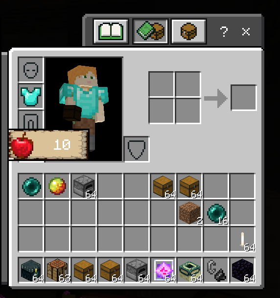

#### NativeScreenDataType.POCKET_INVENTORY_CONTENT_PANEL

口袋版背包界面

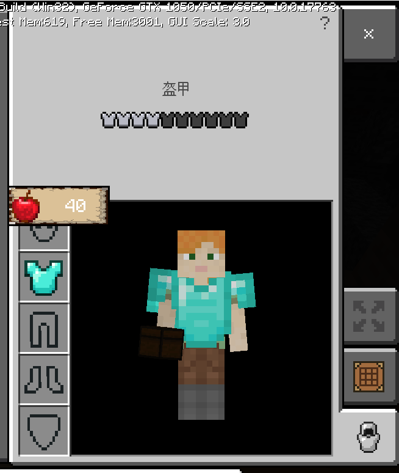

#### NativeScreenDataType.CRAFTING_CONTENT_PANEL

合成台界面

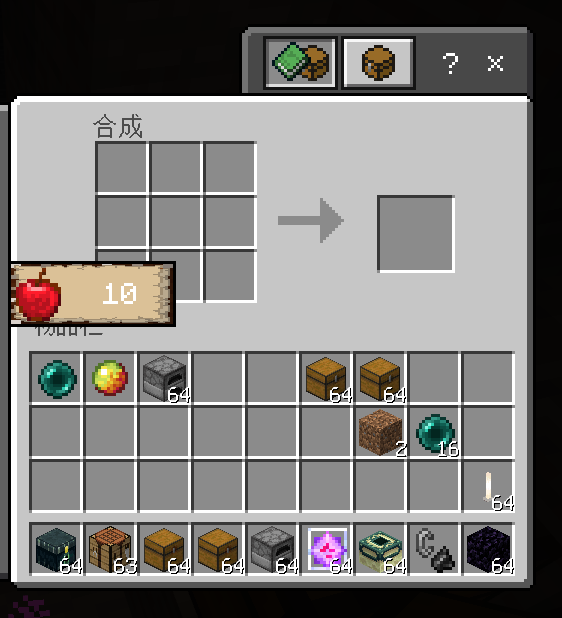

#### NativeScreenDataType.POCKET_CRAFTING_CONTENT_PANEL

口袋版合成台界面

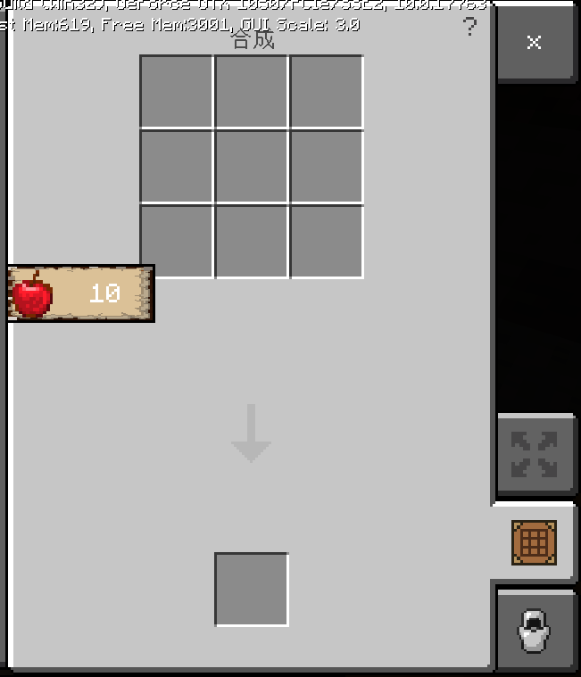

#### NativeScreenDataType.SMALL_CHEST_PANEL

小箱子界面

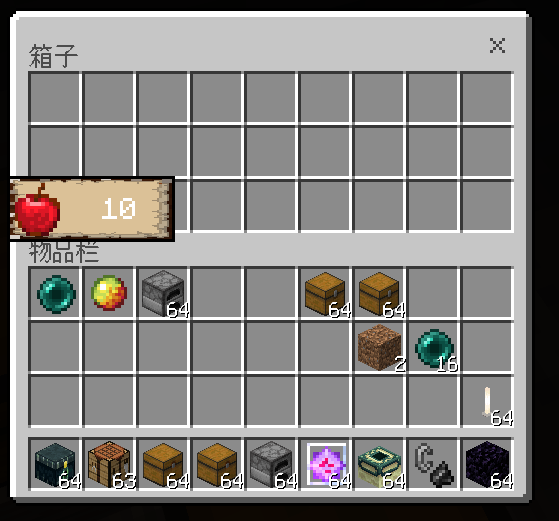

#### NativeScreenDataType.POCKET_SMALL_CHEST_PANEL

口袋版小箱子界面

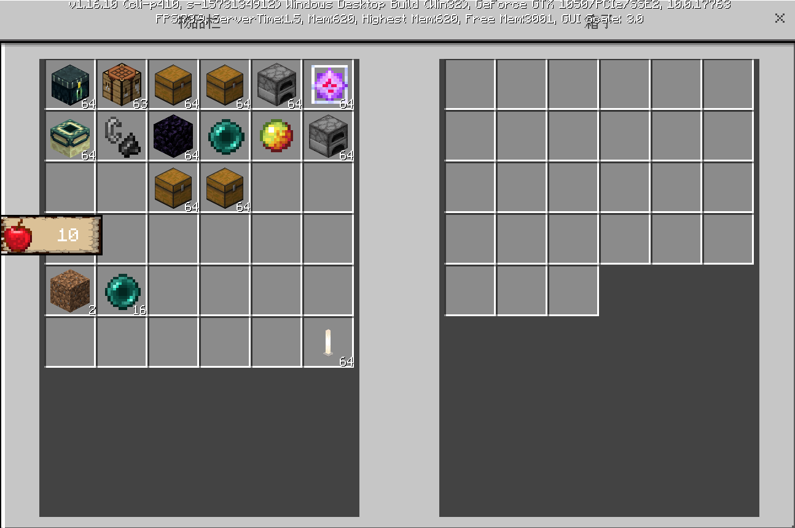

#### NativeScreenDataType.LARGE_CHEST_PANEL

大箱子界面

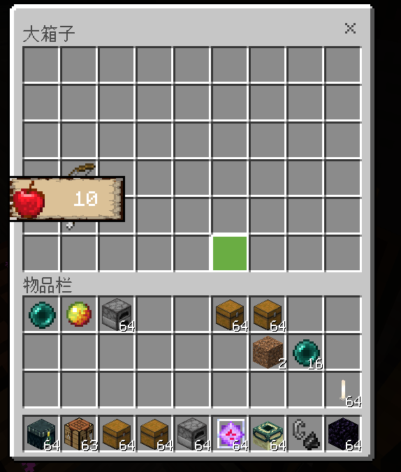

#### NativeScreenDataType.POCKET_LARGE_CHEST_PANEL

口袋版大箱子界面

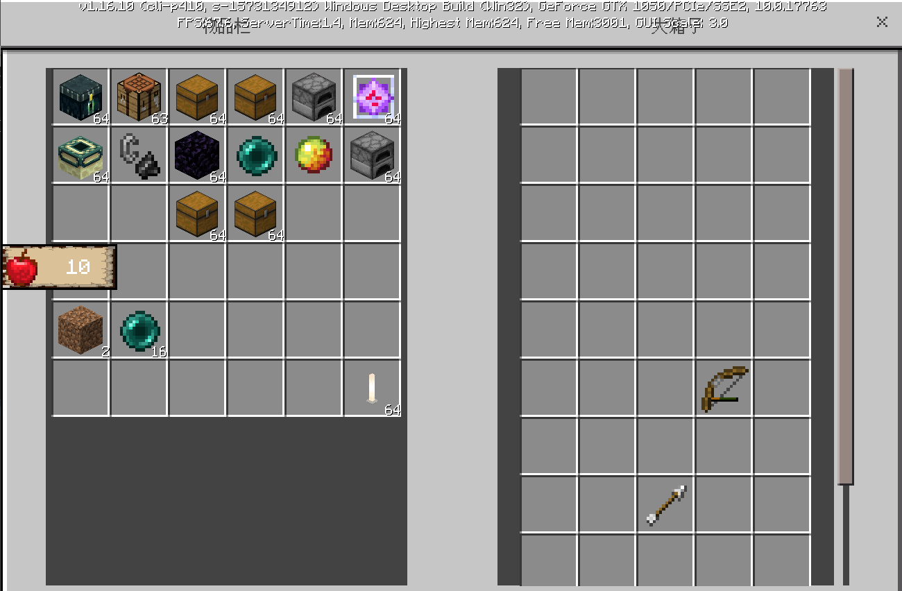

#### NativeScreenDataType.ENDER_CHEST_PANEL

末影箱界面

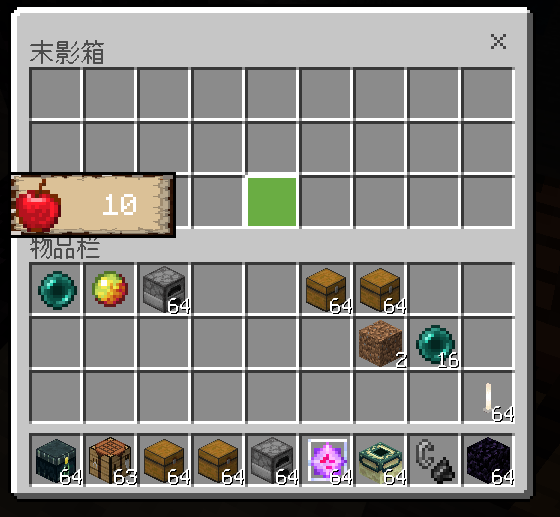

#### NativeScreenDataType.POCKET_ENDER_CHEST_PANEL

口袋版末影箱界面

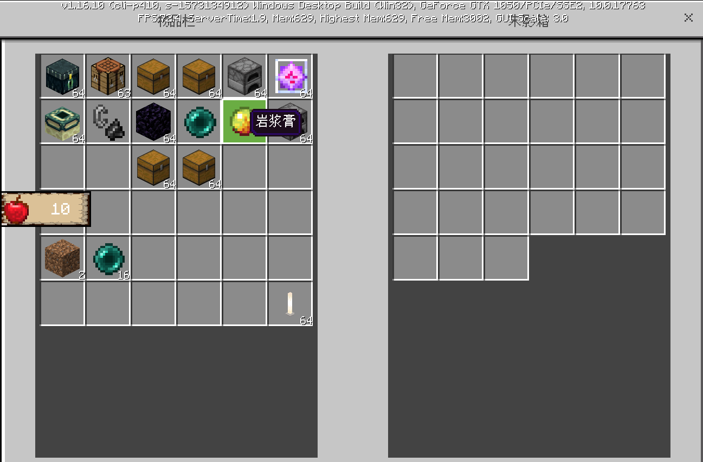

#### NativeScreenDataType.FURNACE_PANEL

熔炉界面

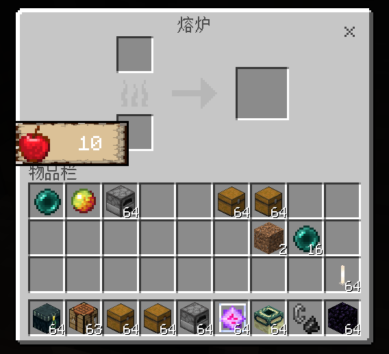

#### NativeScreenDataType.POCKET_FURNACE_PANEL

口袋版熔炉界面

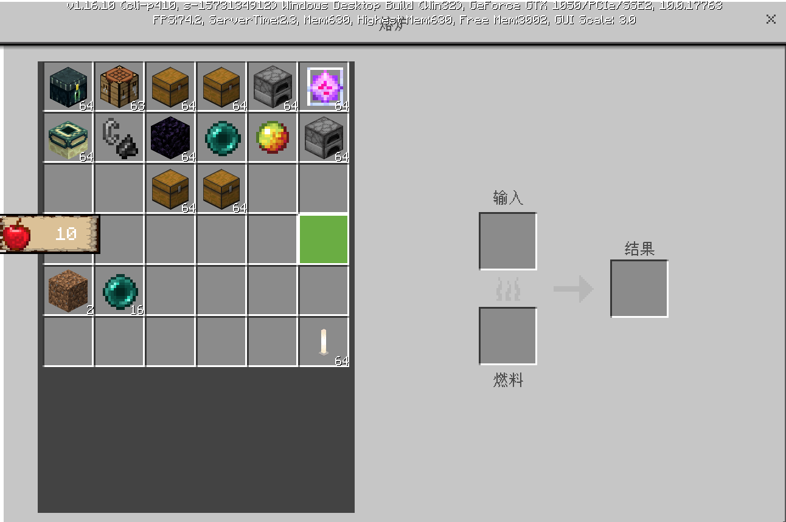

### NativeScreenManager

NativeScreenManager类是单例类，可通过extraClientApi.GetNativeScreenManagerCls()获得。该类用于管理原生界面创建时python层需要进行的操作，目前包括RegisterCustomControl和UnRegisterCustomControl关于自定义UI接口，将来会陆续添加更多新功能，敬请期待。

- 示例

```python
import client.extraClientApi as clientApi
NativeScreenManager = clientApi.GetNativeScreenManagerCls()

manager = NativeScreenManager.instance()
```

### 注册与反注册接口

#### RegisterCustomControl

- 描述

    注册对应原生界面被创建时希望附加到原生界面上的自定义UI及其控制委托类，注册成功后每次原生界面被创建时，被注册的自定义UI都会被创建到原生界面上，关闭后销毁。

- 参数

    | 参数名 | 数据类型 | 说明 |
    | :--- | :--- | :--- |
    | NativeScreenDataType | NativeScreenDataType | 可选的原生UI路径，见上文 |
    | customControlName | str | 自定义控件名称，一般由命名空间+"."+控件名组成，如"UIDemo.text0" |
    | proxyClassName | str | 继承自CustomUIControlProxy的自定义代理类模块路径 |

- 返回值

    | 数据类型 | 说明 |
    | :--- | :--- |
    | bool | 是否注册成功 True:成功 False:失败 |

- 示例

```python
import client.extraClientApi as clientApi
ClientSystem = clientApi.GetClientSystemCls()
NativeScreenManager = clientApi.GetNativeScreenManagerCls()
NativeScreenDataType = clientApi.GetMinecraftEnum().NativeScreenDataType

class UIDemoClientSystem(ClientSystem):
    def __init__(self, namespace, systemName):
        ClientSystem.__init__(self, namespace, systemName)
        NativeScreenManager.instance().RegisterCustomControl(
            NativeScreenDataType.INVENTORY_CONTENT_PANEL, "UIDemo.image0", "uidemoScripts.modClient.ui.UIDemoProxy.UIDemoProxy"
        )
```

#### UnRegisterCustomControl

- 描述

    取消注册，取消后生成原生界面时将不再生成对应的自定义UI。

- 参数

    | 参数名 | 数据类型 | 说明 |
    | :--- | :--- | :--- |
    | NativeScreenDataType | NativeScreenDataType | 可选的原生UI路径，见上文 |
    | customControlName | str | 自定义控件名称，一般由命名空间+"."+控件名组成，如"UIDemo.text0" |

- 返回值

    无

### CustomUIControlProxy

CustomUIControlProxy是自定义UI代理类，可通过extraClientApi.GetCustomUIControlProxyCls()获得。它持有生成在原生UI中自定义UI的BaseUIControl实例以及其生命周期函数，但在其生命周期函数中不进行任何操作，开发者可继承该类进行自定义逻辑编写，并将自定义类的模块路径传入注册接口进行注册，当原生界面创建完成后开发者在自定义类中重写的生命周期函数就会被调用。

- 示例

```python
import client.extraClientApi as clientApi
CustomUIControlProxy = clientApi.GetCustomUIControlProxyCls()


class UIDemoProxy(CustomUIControlProxy):
	def __init__(self, customData, customUIControl):
		CustomUIControlProxy.__init__(self, customData, customUIControl)

	def OnCreate(self):
		bgUIControl = self.GetCustomUIControl()
        labelUIControl = bgUIControl.GetChildByName("label0").asLabel()
        if labelUIControl:
            labelUIControl.SetText("10")

	def OnDestroy(self):
		print("---myProxyDestory---")

    def OnTick(self):
		print("---myProxyTick---")
```

#### GetCustomUIControl

- 描述

    获得创建在原生界面中的自定义UI的BaseUIControl实例

- 参数

    无

- 返回值

    | 数据类型 | 说明 |
    | :--- | :--- |
    | BaseUIControl | 自定义UI的BaseUIControl实例 |

#### OnCreate

- 描述

    自定义UI在原生界面中成功创建后调用的生命周期函数

- 参数

    无

- 返回值

    无

#### OnDestroy

- 描述

    当原生界面关闭时自定义UI会被销毁，销毁后调用的生命周期函数

- 参数

    无

- 返回值

    无

#### OnTick

- 描述

    每帧调用的生命周期函数

- 参数

    无

- 返回值

    无