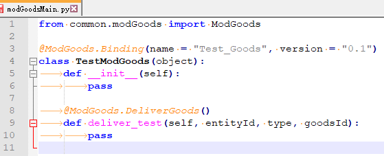
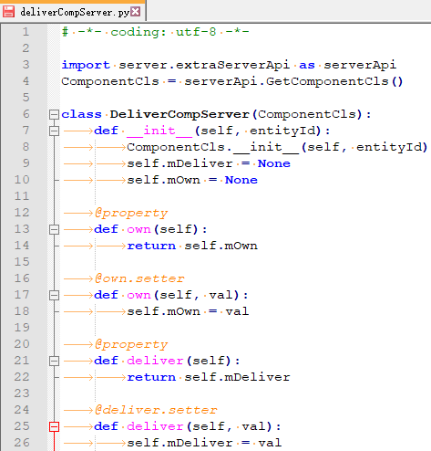

# 联机大厅商品Mod文档

## 说明

每个开发者平台上架的商品对应一个商品mod，该mod包含对应商品的资源及发货逻辑

## 编写规范

在xxxScripts中创建一个modGoodsMain.py（该名称不可更改，与modMain在同一目录）



modGoodsMain的格式如上图所示：

- ```python
  from mod.common.modGoods import ModGoods
  ```

  ModGoods为一个定义类，含下文的绑定属性，用于识别及加载商品mod

- ```python
  @ModGoods.Binding(name = ‘Test_Goods’, version = ‘0.1’)
  Class TestModGoods(object):
  ```

  该装饰器用于标识商品mod的发货类

  Name为mod名称，version为我们的版本。暂时还没有实际用途

- ```python
  @ModGoods.DeliverGoods()
  def deliver_test(self, entityId, type, goodsId):
  ```

  该装饰器用于标识商品mod的发货函数。该函数必须在上述发货类中，并有且只有一个

  **持有该商品的玩家进入游戏，或者在游戏内购买该商品，该发货函数会被调用**，三个参数解释：

  - entityId：需要发货的玩家的entityId
  - type：商品类型，暂无实际用途
  - goodsId：商品对应的id，暂无实际用途


## 发货逻辑

对于简单的仅服务端的发货逻辑（如发放物品），可以直接写在发货函数内


以下为需要**客户端**参与的发货逻辑（用到客户端组件的，如粒子特效，原版皮肤）的书写建议：
编写一个serverComp，一个serverSys，一个clientSys。并在modMain注册（参考demo或其他文档）

1. **serverComp**

   

   普普通通的一个component。用于标识玩家该商品的状态

   own: 用于保存玩家持有该商品

   deliver: 用于通知serverSys给玩家发货

   **在modGoodsMain的发货函数中修改该comp的deliver属性**

2. **玩家登陆发货**

   在serverSys的Update函数中处理上述comp，广播发货事件给所有客户端，并设置comp的own属性

   在clientSys中监听发货事件，在事件处理函数中写实际发货逻辑（如绑定粒子）

   可参考demo中TestServer.Update及TestClient.OnDeliverbbParticle

3. **处理AddPlayerEvent**

   玩家登陆时也要告知他视界内其他玩家是否需要发货。另外，视界外玩家进入视界时，也要做同样的检查

   clientSys中监听引擎AddPlayerEvent事件，发送请求事件到serverSys。serverSys监听该请求事件，检查comp的own属性，若成功则返回发货事件。可参demo中相关代码

## 注意事项

1. modGoodsMain中发货函数的所有逻辑都会在服务端运行

2. 对于需要客户端参与发货的产品，需要每次登陆及触发AddPlayerEvent时发货

3. 对于**一个房间内只发放一次**的商品

 （这种商品应该都是只在服务端发货的）

由于每次玩家登陆都会重置entity和component，所以**不**要使用comp的own属性判断是否发过货。

**建议在serverSys中保存一个dict，把商品的持有属性保存在该dict中**，serverComp中只有deliver属性用于传递发货消息。玩家登陆时检查改dict，若已存在则跳过，达到不重复发货的效果。

4. 示例见[LobbyGoodDemo](../../4-DEMO示例/示例简介.html#LobbyGoodDemo)