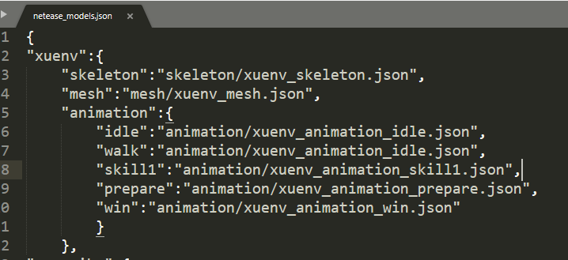
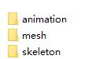
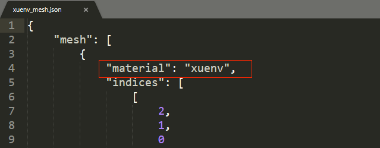
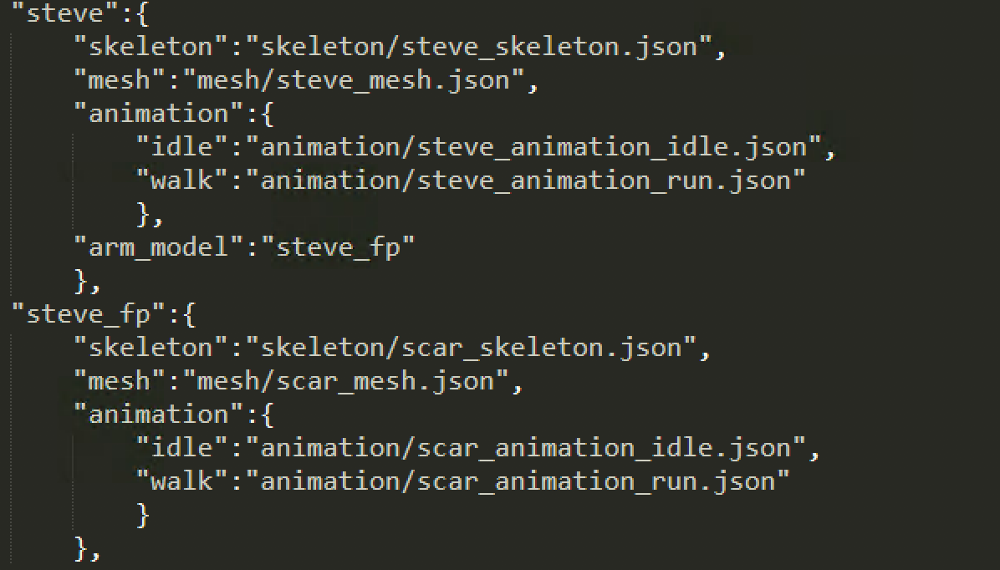
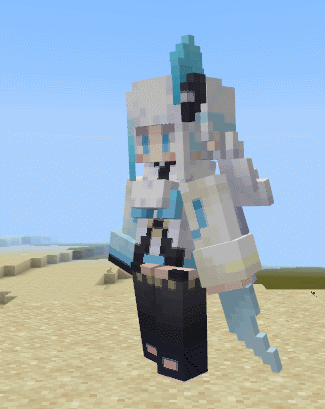
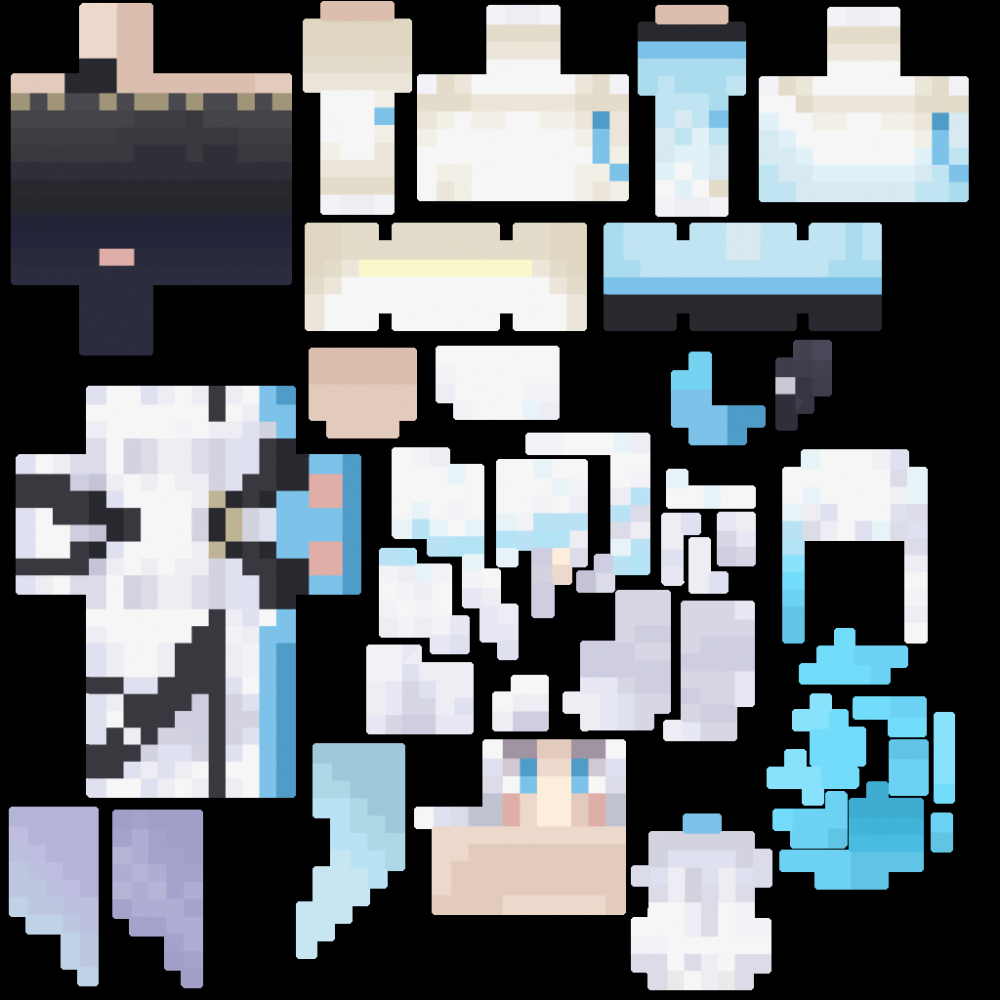
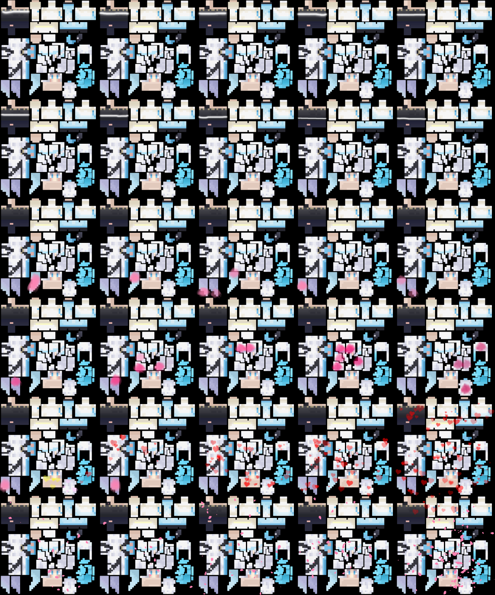
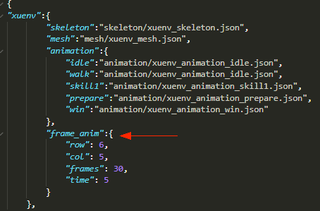

# 骨骼模型的使用

骨骼模型、骨骼动画的制作请参考[骨骼模型制作指南(3DMAX)](02-骨骼模型制作指南（3DMAX）.html)等相关文档。

通过专业的模型制作软件完成模型后，导出为FBX格式，然后再转换为《我的世界》中的模型格式（JSON格式），相应的方法请查阅[关卡编辑器使用说明-资源导入](../../../1-MC%20Studio开发工具/3-关卡编辑器使用说明.html#资源导入)。

在将骨骼模型转换为JSON格式后，我们就可以准备在游戏内使用骨骼模型了。以离线文档中 **示例/6-4 资源制作/工具和示例/fbxRes/xuenv** 资源为例，先在编辑器中导入这个模型，然后按下面的步骤进行。实际上下面的1~3步目前编辑器已经自动完成了，需要手动操作文件时可以参考。

## 1. 填入模型路径信息

在`mod_resource/models/netease_models.json`里面填入模型的骨骼，网格及动作的文件路径（目前编辑器已经自动做好这一步了），如下图所示：



**骨骼模型动画的命名最好使用英文单词/拼音/数字/下划线组成。**

## 2. 将资源放入对应目录

将skeleton、mesh、animation资源放入`mod_resource/models`下对应的文件夹：



## 3. 指定贴图

mesh文件中会有指定material，如下图所示：

名称对应到`mod_resource/textures/models/xuenv.png`，所以需要在此位置放置贴图资源。



## 4. 代码调用

采用component的结构来创建模型与控制动画播放

创建模型替换原有模型

```python
modelComp = self.CreateComponent(playerId, 'Minecraft', 'model')
# 'xuenv'即为netease_models.json里配置的骨骼模型名称
modelComp.SetModel('xuenv')
```

播放动画

```python
modelComp = self.GetComponent(playerId, 'Minecraft', 'model')
# 播放动画'prepare'，第二个参数设置为True表示循环播放该动画，接口详细信息可以查看modAPI接口文档
modelComp.PlayAnim('prepare', True) 
```

## 5. 第一人称模型

上面部分完成了第三人称视角的骨骼模型显示及动画播放，当我们想在游戏中切换到第一人称也有骨骼模型与动作时，需要另外做一套骨骼模型和动作（如下图的steve_fp），并且使动作的名称与第三人称模型的动作一致。然后把他配置为第三人称模型的“arm_model”，例如：



在上图中，我们可以看到steve有骨骼模型动画，这些属于第三人称视角的骨骼模型动画，steve中的”arm_model”属性可关联第一人称视角的骨骼模型。配置第一人称视角骨骼模型之后，当玩家切换到第一人称视角时，如果手上无物品或者手上物品不显示，则会显示第一人称骨骼模型（即这里的“steve_fp”）。

当播放动作时，第一人称视角模型的动作会跟随第三人称模型。例如给本地玩家替换steve模型后，播放walk动作，那么切换到第一人称视角时，显示的steve_fp模型也会播放walk动作。

如果替换的第三人称骨骼模型没配置”arm_model”字段（例如上述的”xuenv”模型），则在第一人称视角下手上无物品或者手上物品不显示时，不会显示任何模型。

## 6. 模型贴图序列帧动画

骨骼模型动画除了支持上述在animation文件夹下放置相应的json文件这一方式外，也支持另一种只是单纯贴图变化的序列帧动画：



制作这种贴图序列帧动画需要两个步骤，我们以上述的雪女为例：

1) 用图片处理工具修改`mod_resource/textures/models/xuenv.png` 路径下的这张贴图：
根据动画需要的帧数横竖方向重复铺开，此例中我们以6行5列总共30帧进行制作，处理每一帧中贴图需要变化的部分，序列帧播放的顺序由贴图的左上角先横再竖播放到贴图的右下角。

原图：


处理后：


2) 修改`mod_resource/models/netease_models.json`中雪女的json配置，新增frame_anim字段：



字段中各参数意义如下：
row: 贴图动画中分了多少行，此例中6行5列即6行，所以此处填6
col: 贴图动画中分了多少列，此例中6行5列即5列，所以此处填5
frames: 帧数，此例中为30帧（此数字不一定为row乘col的值，允许贴图留有空白，假如贴图右下角留了一帧的空白区域，此处可填29）
time: 动画总时长，此例中为5秒，代表5秒内播放完30帧，然后开始循环

注意：
为了节省运行时的内存，建议资源制作时尽量秉持宽高最邻近二次幂数相乘最小原则。
所谓最邻近二次幂数，即数字往上寻找最靠近自己的二次幂，二次幂就是1，2，4，8，16，32，64，128，256，512，1024，2048等等。
比如一张贴图为200 * 200的分辨率，200的最邻近二次幂数为256，则加载入内存后即占用256 * 256的大小，此处为了讲解方便，简化了一些计算细节，读者可简单理解为内存占用与宽高成正比。
在此例中，我们雪女单帧的图片大小256 * 256，6行5列排放后为1280 * 1536, 宽高最邻近二次幂数分别为2048和2048，所以占用内存为2048 * 2048。
但假如我们调整一下，用横4，竖8的方式排放，宽高即为1024 * 2048，此方式最高可支持 4 * 8 = 32帧，宽高最邻近二次幂数分别也为1024和2048，占用内存即为1024 * 2048，内存占用可降低到原来的一半！

最后，在代码调用时无须添加额外代码即可生效：
```python
modelComp = self.CreateComponent(playerId, 'Minecraft', 'model')
# 'xuenv'即为netease_models.json里配置的骨骼模型名称
modelComp.SetModel('xuenv')
```