# 粒子特效

本文档主要包括三个部分：

- [粒子属性介绍](#particleAttr)

  对粒子的每一个属性进行了介绍，方便读者了解particle json

- [粒子效果规范](#particleRule)

  对游戏中最大可支持的粒子效果提供了约束，保证粒子效果在大部分机型上能够流畅运行

- [粒子调试指令集](#particleOp)

  针对粒子编辑器暂时不能外放的现状，提供了实时预览粒子的游戏指令集，方便调试粒子效果


<span id="particleAttr"></span>
## 1. 粒子属性

粒子特效的配置文件为json格式，如下图所示：

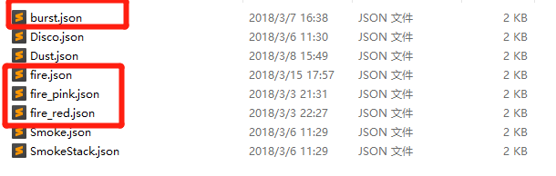

客户端中的粒子特效会根据数值变化，实时呈现不同的粒子效果，以下为对粒子配置文件json的解释。

### 1.1 Initial

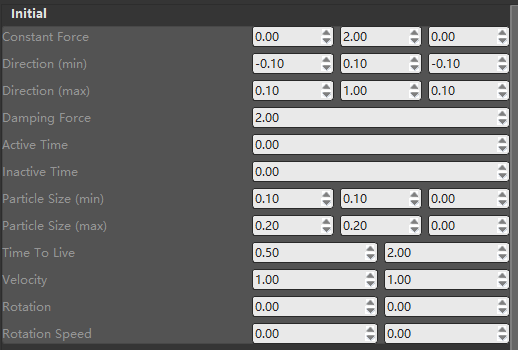

关于粒子属性：

- 3个数值框的，从左向右分别对应x，y，z，如Constant Force、Direction等

- 2个数值框的，从左向右分别对应最小值和最大值

- **粒子发射器的属性并不是完全如上对应的数值，而是最大值和最小值之间的一个随机值**

  如上图，Direction具有标有min和max的两个值，分别对应最小值和最大值

- **粒子发射器发射的粒子，实际为空间中的一个朝向相机的矩形面片，这在粒子的size设置的时候只设置x,y得到体现。**

下面简单介绍每个属性的作用及样例：

#### Constant Force

粒子受力，相当于粒子运动过程中的加速度

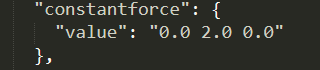

#### Direction

粒子发射的初始方向，取值为min和max之间的差值

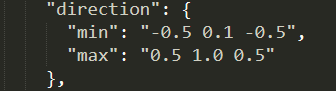

#### Damping Force

阻力理解为方向与粒子速度方向相反的加速度，每一帧的运算的公式为：

<center>v = v - damping force * v</center>
v为粒子当前速度,所以damping force实际上起到了逆向加速度因子的作用。

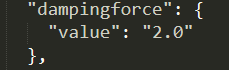

#### Active Time与Inactive Time

##### Active Time

粒子发射器活跃时间

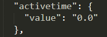

##### Inactive Time

粒子发射器冷却时间

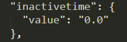

Active Time与Inactive Time这两个值是配合使用的，即粒子发射器每活跃Active Time之后，冷却Inactive Time，然后继续循环

在使用的时候，可以将Active Time当作发射器生命周期，方便调试有时间限制的效果。如果将Active Time设置为0，粒子发射器会一直发射，没有停歇

普通效果建议不设置这两个值，或者都设为0

需要实现循环喷射效果时可以使用这两个参数

#### Particle Size

粒子出生时的大小，当前只有x,y值有效，z值无效，留给以后发射立方体用

游戏中一个地形块的大小为1，以此作为尺寸参考

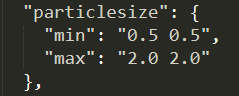

#### Time To Live

粒子生命周期，即每个粒子的存在时间

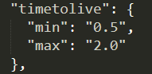

#### Velocity

粒子初始速度

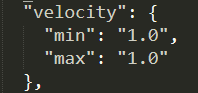

#### Rotation（废弃，建议使用Rotation Range）

粒子初始角度，即粒子绕z轴的旋转的角度（0~360）

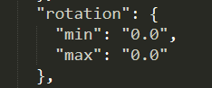

#### Rotation Speed（废弃，建议使用Rotation Speed Range）

粒子自转速度，每秒旋转Rotation Speed角度

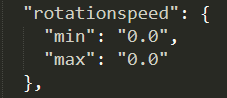

#### Rotation Range

粒子初始旋转角度，即初始时刻粒子绕x，y，z三轴的旋转角度（0-360）

```json
{
    "particleeffect": {
        "rotationRange": {
            "max": "90.0 90.0 90.0",
            "min": "0.0 0.0 0.0"
        },
        ...
    }
}
```

#### Rotation Speed Range

粒子自转速度，即绕x，y，z轴每秒旋转的角度（0-360）

```json
{
    "particleeffect": {
        "rotationSpeedRange": {
            "max": "90.0 90.0 90.0",
            "min": "0.0 0.0 0.0"
        },
        ...
    }
}
```

### 1.2 Variation

该参数与粒子生命周期内的形变有关

- Add：粒子尺寸每秒增加倍数，即`size = size * (1 + add)`，默认该值为0.0。

- Multiply：粒子尺寸每秒尺寸缩放倍数，即`size = size * multiply`，默认值为1.0。

- 每秒粒子尺寸的计算公式为：`size = size * multiply * (1 + add)`

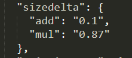

 ### 1.3 Color

#### Color

设置粒子颜色，格式为RGBA

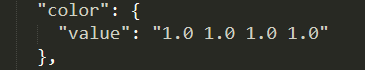

#### Color Fade

该参数与粒子生命周期内的颜色变化有关

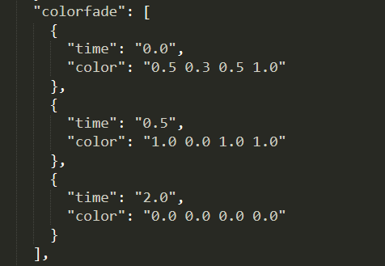

粒子在生命周期中，可以在不同的时间点设置不同的颜色关键帧，粒子的颜色逐渐向关键帧渐变。

如上图所示，粒子在0.00s时，颜色为(0.50，0.30，0.50，1.0)，在0.5s时颜色值为(1.0，0.0，1.0，1.0)，在2.0s时为(0.0，0.0，0.0，1.0)

#### Color与Color Fade

设置Color就不可设置Color Fade，设置Color Fade就不可设置Color，二者的关系是互斥的

如果二者均不设置，则直接读取贴图的颜色

#### Enable Color与Enable Texture

部分粒子配置中会出现"enablecolor"和"enabletexture"配置项，他们都能影响粒子颜色的计算流程：

- 粒子的初始颜色为纯白不透明
- 若Enable Color启用，则粒子颜色会乘上Color或Color Fade中配置的颜色值，否则跳过
- 若Enable Texture启用，则粒子颜色还会乘上贴图的颜色，否则只会乘上贴图的透明度

二者均不设置的情况下，  
只要Color或Color Fade中任一配置存在，则Enable Color启用，同时Enable Texture禁用，效果为使用设置指定的颜色；  
要是Color和Color Fade的设置均不存在，则Enable Color禁用，同时Enable Texture启用，效果恰为直接读取贴图颜色。

### 1.4 Emitter

该部分主要介绍与发射器有关的参数

处于性能考虑，每秒最多发射3000颗粒子

#### Number Of Particles

同时存活的粒子最大数量

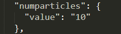

#### Emitter Size

粒子发射器尺寸，即粒子出生空间大小，(0，0，0)说明粒子都从原点出生

否则，粒子从定义的空间中随机位置生成

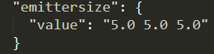

#### Emission Rate

粒子发射率，数值越高，发射频率越高

左为min，右为max

下图可以理解为最少每秒发射40次，最多每秒发射50次

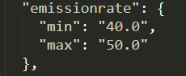

#### Emission Shape

粒子发射器形状，当前支持球形和立方体，参数分别为“Box”、”Sphere”

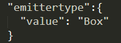

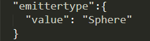

### 1.5 Resource

#### Material

**无效，开发中。**

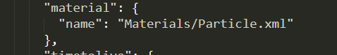

#### Texture

可参考demo中的bb.png和bb.json进行阅读

- "name"为粒子纹理路径，路径从textures开始，不需要后缀

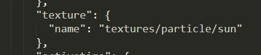

​		如果想添加新的纹理，需要将png（必须为png）文件放置在particle路径中

- "ani"为粒子序列帧
  - "ani"中"name"为序列帧的json配置文件路径，从textures开始，不需要后缀
  - "ani"中"fps"为序列帧播放帧率（注意数字要加引号），最小值为0，默认值为30
  - "ani"中"shuffle"为序列帧是否乱序播放（第一帧就开始随机），默认值为false（注意不加引号；图中未配置，使用默认值）

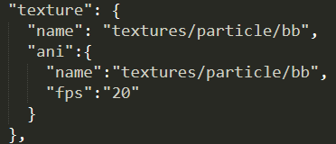

上图中，"texture"的"name"对应的`textures/particle/bb`为序列帧贴图bb.png，而"ani"的"name"对应的`textures/particle/bb`为序列帧json配置文件bb.json

[序列帧打包方式](./序列帧配置文件解析.md#TexturePacker)在序列帧文档中有介绍

### 1.6 Render

#### Blend Mode

混合模式，建议开发者多尝试一下

- "add"与背景色是叠加的关系

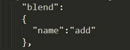

- "blend"与背景色是覆盖的关系

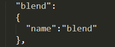

#### Face Camera Mode

可用模式:

- Rotate XYZ

  粒子始终朝向相机，适合正方形面片

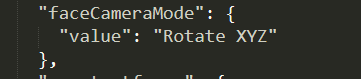

- Direction

  粒子Y轴朝向粒子运动方向，适合线性扩散效果

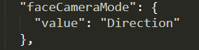

如下图所示，粒子实际为x = 0.2, y = 2.0的长方形面片，face Camera Mode为Direction：

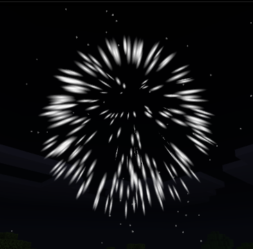

建议开发者尝试改变burst.json中的参数，观察效果可以帮助理解

#### Loop

颜色或贴图序列帧是否循环，当粒子生命周期大于Color Fade或序列帧的时长的时候，可以进入循环模式

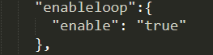

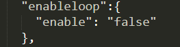


<span id="particleRule"></span>
## 2. 粒子效果规范

- 粒子单幅贴图大小不要超过 32 * 32，粒子序列帧贴图参考序列帧规范

- 小规模粒子

  Particle Num <= 30,  Particle Emitter Num <= 200

- 中规模粒子

  Particle Num <= 100, Particle Emitter Num <= 50

- 大规模粒子

  Particle Num <= 1000,Particle Emitter Num <= 5


<span id="particleOp"></span>
## 3. 粒子调试指令集

### 3.1 指令集

#### //crp \<name>

在玩家眼前创建粒子效果，name为粒子配置文件名，不包括”.json”后缀

#### ///rep <>

重新加载粒子效果，无参数

#### //rmp <>

移除游戏内所有粒子效果，无参数

### 3.2 使用样例

//crp fire

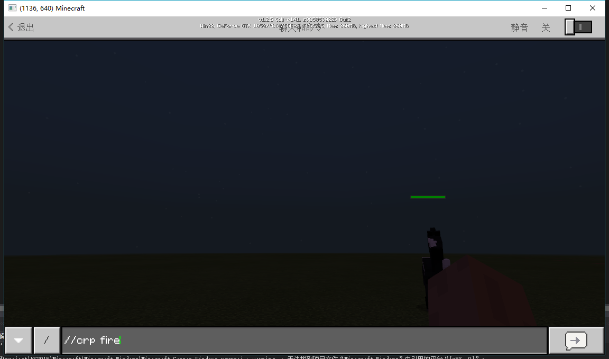

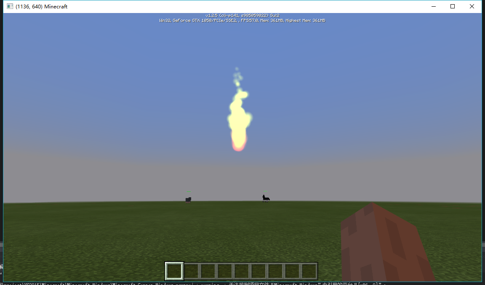


//rmp

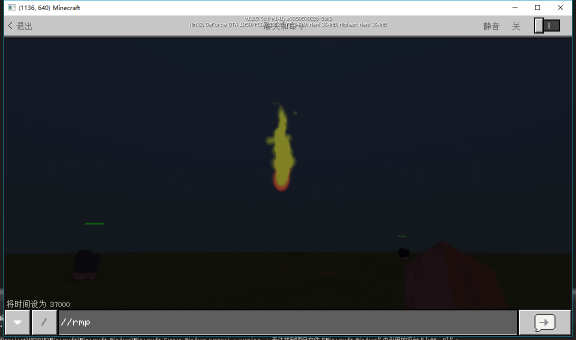

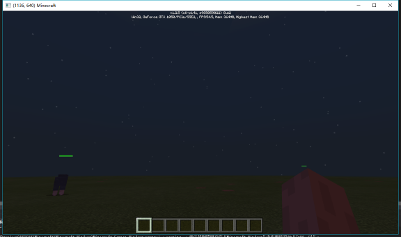


//rep

加载mod时，对应mod资源会被拷贝到如下目录中

```%AppData%\MinecraftPE_Netease\games\com.netease\resource_packs```

要动态修改粒子效果，需要修改该目录下的同名mod中的对应粒子特效配置文件，再使用`//rep`指令。

下图为fire.json所在的文件夹

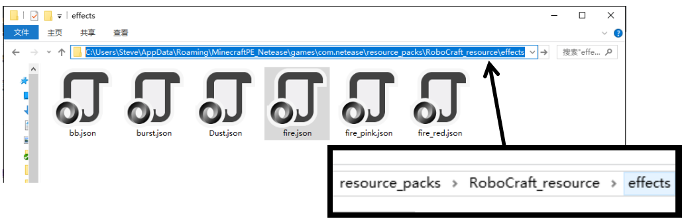

fire.json原先的配置及表现效果如下所示：

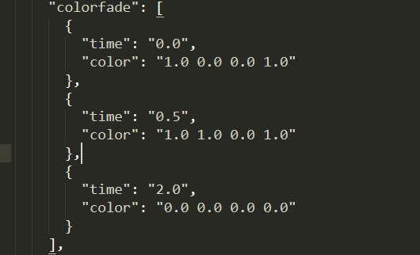

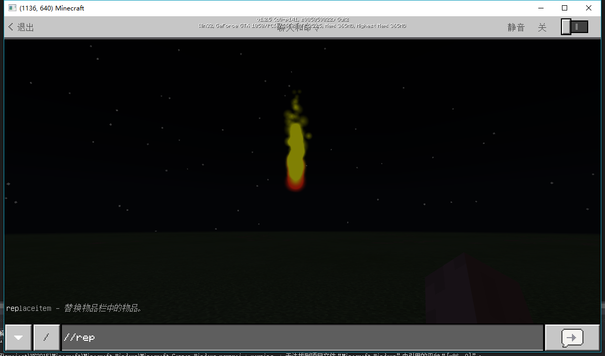

修改fire.json中参数如下图后，在游戏中输入`//rep`指令，可以看到该粒子效果发生了改变：

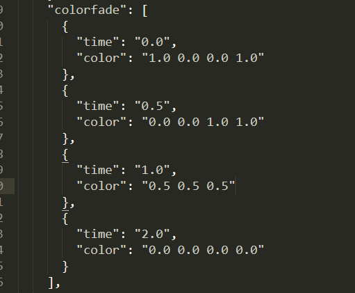

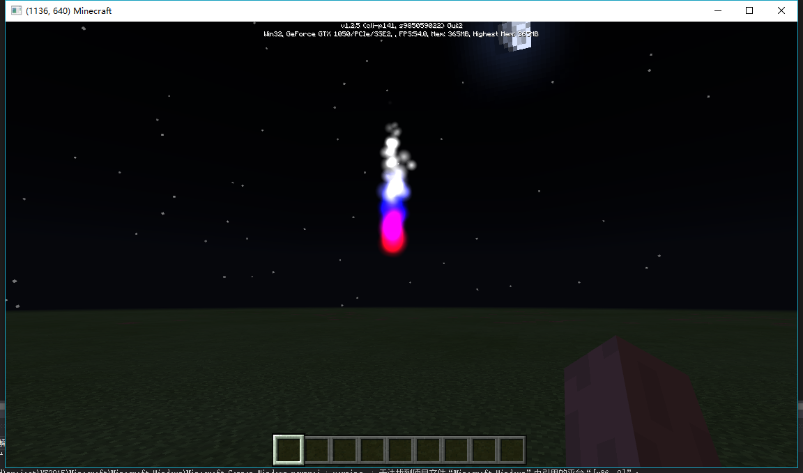


## 4. 致开发者

粒子效果非常灵活，熟练各个参数，可以做出非常出彩的效果

同时，各位开发者也一定不要忘记遵守粒子效果规范，毕竟游戏的性能是有限的


