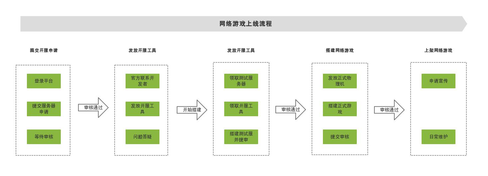
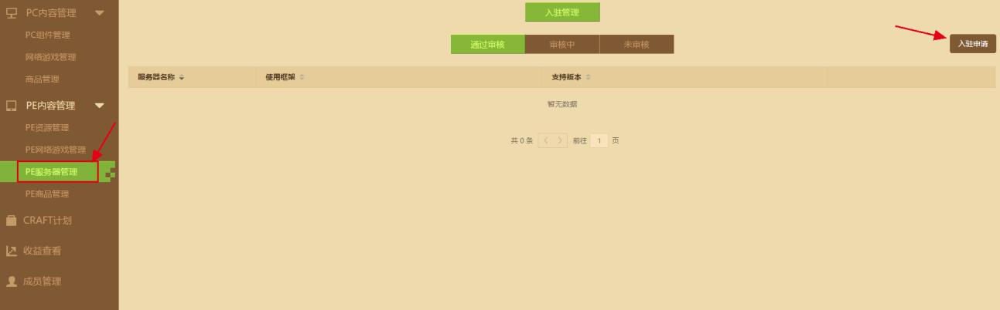
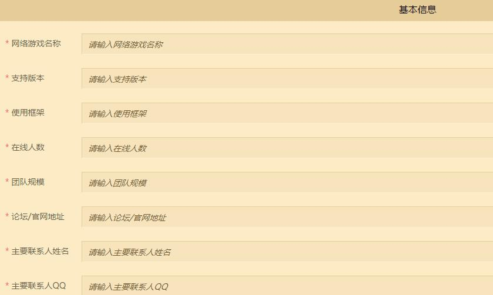
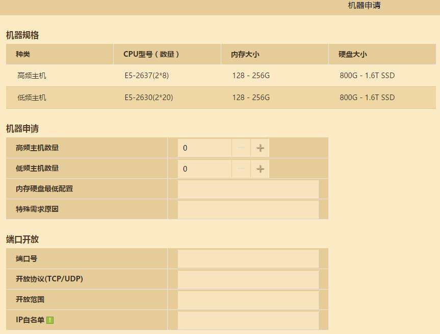

# 入驻申请

## 网络游戏入驻流程

 

 

**1、申请入驻**

首先要在[开发者平台](https://mcdev.webapp.163.com/)注册成为开发者，然后登录开发者平台，在左边一列选择“**PE内容管理**”，然后点“**PE服务器管理**”，紧接着在右边点“**入驻申请**”，即可进入到申请页面。

如下图：

 

**2、填写资料**

 

 

 **注意：**

《我的世界》中国版PE目前支持的游戏版本有：1.15、1.16，后续支持版本可查阅“开发者平台“ — ”PE网络游戏管理“ — ”适用版本“，版本支持情况会随更新情况变更。

使用框架：市面常用Nukkit，我的世界官方会提供基岩版C++开发工具Apollo，开发语言是python2.7.15

机器规格：低频机是2个cpu，每个cpu 20核，一共40核。网络游戏通常使用低频机

论坛/官网地址：能展示服务器信息的页面地址，如没有官网，其他信息介绍页也可以。

其他信息如实填写即可，所有信息填写完毕后，回到页面顶部点“保存”，然后再点“提交审核”，最后等待审核即可。

**3、提交审核并等待审核结果**

PE网络服务器申请提交后，一般审核周期为**15个工作日**，不管审核通过与否，最后都会用短信告知审核结果。

如果申请审核通过：官方会发放搭建服务器的服务端服务器，服主需要在从分配服务器那天开始算起的**90天**内搭建出服务器，最后在正式服等待终审上架，如果超过**90天**仍未提审，则自动回收申请的服务器。

如果申请审核未通过：则需要服主进行修改后再提交，每个服主/团队有**3次**提交PE网络服务器的机会，如果**3次**提交都未审核通过，则以后不能再提交PE网络服务器申请入驻。

**4、使用服务器和文档搭建测试服**

审核通过后，官方人员将根据审核信息中预留的QQ号联系开发者，发放搭建测试服所需要的服务器一台，服务器中包含开服工具**Apollo以及使用文档**，开发者可以依据文档指示进行搭建，如有疑问，官方人员会在线及时为您解决。

**5、测试服内容提交审核并等待审核结果**

搭建测试服需要在开发者平台-PE内容管理-PE网络游戏管理中选择发布游戏，并填写对应信息提交审核，官方人员会在**10个工作日**内予以审核并给到审核结果。

**6、使用正式物理机搭建正式游戏**

测试服的游戏内容经官方人员审核通过后，会依据网络游戏情况发放正式物理机，用于正式环境的网络游戏搭建。开发者搭建完成后，同样在开发者平台-PE内容管理-PE网络游戏管理中选择发布游戏即可，提交审核并通过后，游戏即可上线。