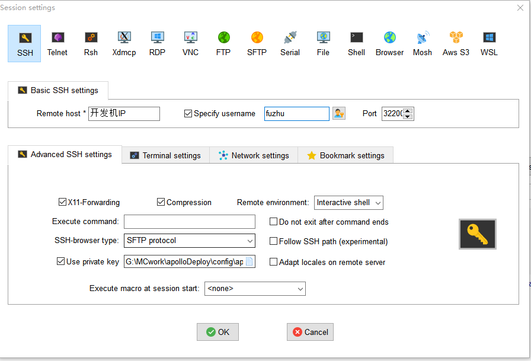

# 连接开发机

上一小节我们介绍了如何进行入驻申请，当申请通过后，官方工作人员会与您取得联系并发放开发测试机。

本小节将介绍您需要提供哪些内容给官方工作人员，以及如何连接开发测试机。

## 公钥与IP白名单

在连接开发机之前，您需要提供**登陆服务器的公钥**以及本地电脑的**固定IP**地址

- **登陆服务器的公钥**

  参考[SSH秘钥生成](./3-SSH秘钥生成.md)指引生成登录开发机的公私钥，将公钥提供给官方，妥善保管好自己的私钥。

- **固定IP**

  将本地电脑的固定IP地址提供给官方，加入IP白名单，可提供多个，否则无法登陆。

  

## 远程连接

以[MobaXterm](https://mobaxterm.mobatek.net/download-home-edition.html)为例，远程连接到开发机的步骤如下：

- 账号为fuzhu
- 机器填开发机的IP
- 端口为32200

****

- 勾选use private key,内容是本地保存的私钥的路径。私钥文件是通过[SSH秘钥生成](./3-SSH秘钥生成.md)生成的，私钥文件内通常包含private字符串。

