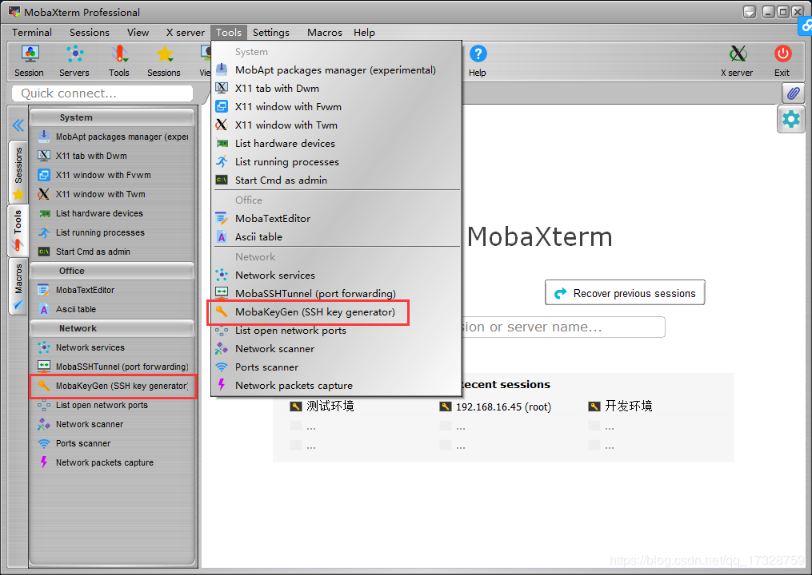
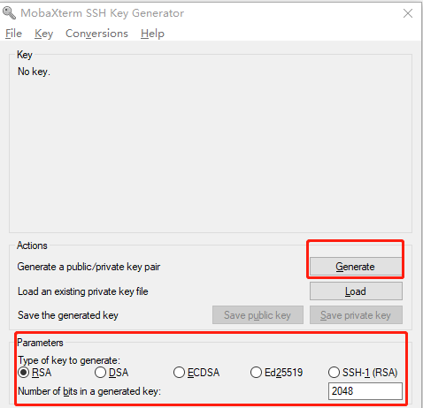
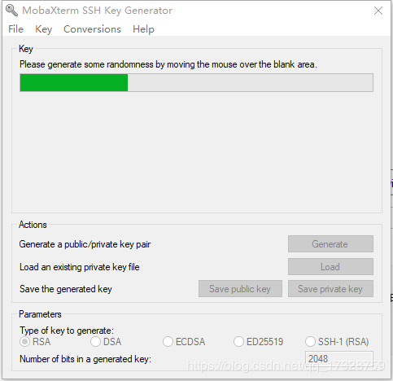
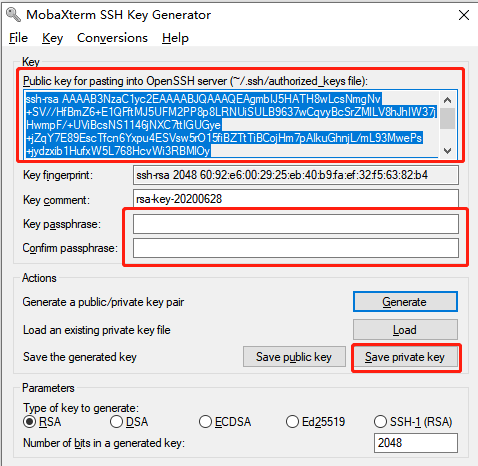
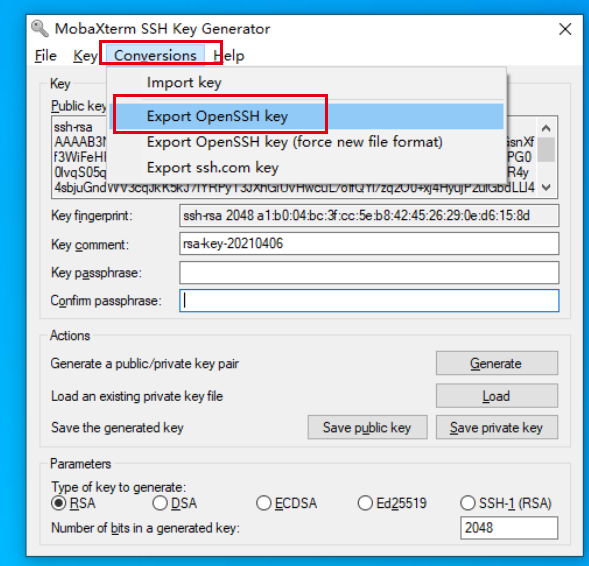

# SSH秘钥生成

- 推荐使用[MobaXterm](https://mobaxterm.mobatek.net/download-home-edition.html)。打开MobaXterm界面，Tools->MobaKeyGen

- 密钥类型选择RSA，密钥长度选择2048位

- 很快生成公钥对，单击下一步

- 密钥名称自定义，输入密钥加密的密码（可以留空，但是建议输密码）；

- 点击Save public key保存公钥，文件名建议包含public，比如fuzhu_public.pub。点击Save private key保存私钥，文件名建议包含private，比如fuzhu_private.ppk。

- 生成MC Studio使用的RSA私钥文件：

  

  如上图操作，选择Conversions 下的 Export OpenSSH key选项，可以导出MC Studio 配置Apollo服务器需要的私钥文件。

