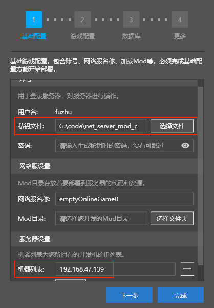
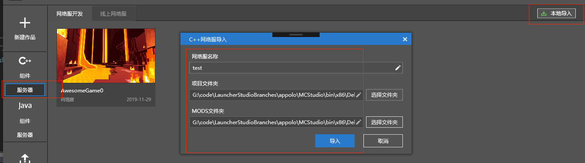
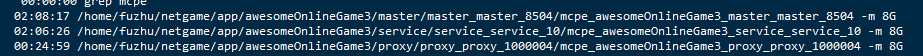

# 创建网络服

本节内容可查阅[视频教程](https://cc.163.com/act/m/daily/iframeplayer/?id=5e7428e16a37ca23faf84bc2)的**创建网络服**小节

### 新建C++网络服

如果你是第一次接触Apollo的开发者，可以点击新建作品 => 基岩版网络服 ，会看到四个网络服模板。

- 空白网络服模板：空白模板，只有一个大厅，没有Mod，进去相当于**原版生存服**
- 简易网络服模板：该模板实现了一个简单的网络游戏，由**1个大厅服和3个游戏服**构成。
- 高承载副本管理模板：该模板利用官方副本管理插件，支持在一个地图中设置多个副本，且副本之间互不干扰，大大提升了服务器的承载能力。
- 排行版模板：该模板实现了一个展示个人单服榜、个人全服榜以及公会全服榜三种。

点击对应模板上的新建，即可新建对应的网络服。

点击对应模板上的说明，即可查看该模板的详细信息。

现在，点击简易网络服模板，新建一个简易网络服，它会弹出这样下图的配置页面，下一小节我们将介绍如何配置和部署简易网络服。

### 导入本地网络服

- 如果你以前曾经使用过**bat/sh部署脚本**进行部署，则可以通过本地导入的方法导入以前使用的工程。

- 点击基岩版服务器=>网络服开发分页，选择右上角的本地导入。

- 网络服名称只允许使用字母、数字和下划线，它会成为你的**网络服目录名称，并作为进程名标识**

  

- **Mod文件夹**：存放Mod代码与资源的文件夹，**路径不允许使用中文或特殊符号**

- **项目文件夹**：deploy.json所在文件夹

