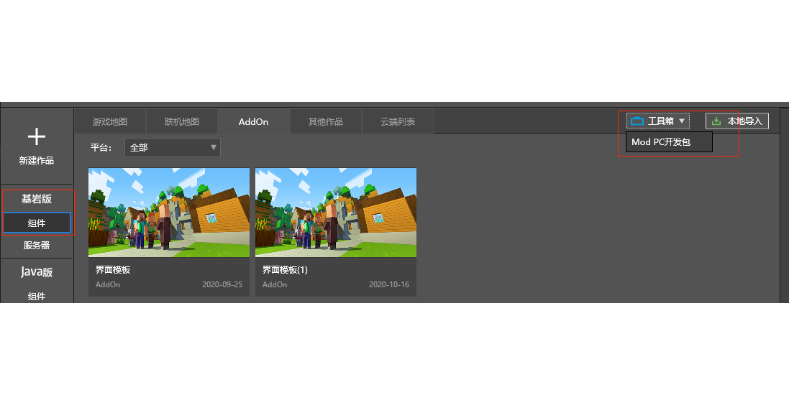
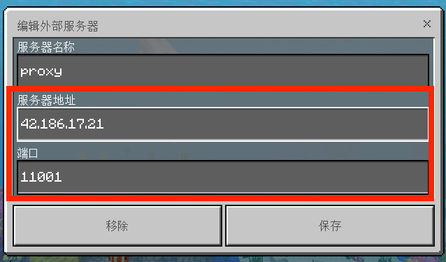
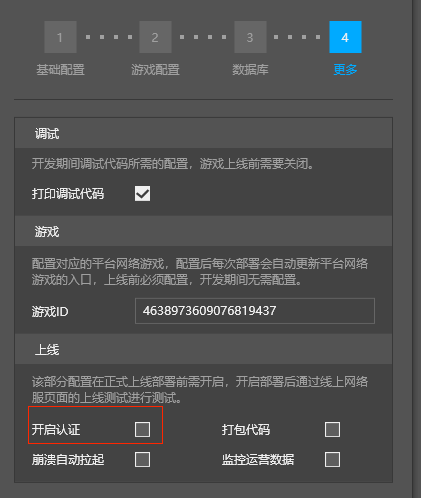

# 测试网络服

上一小节里，我们介绍了如何部署空白网络服模板，这一小节我们将介绍如何测试部署好的网络服。

## 网络服开发测试

- 选择部署好的网络服，点击开发测试

- MCStudio会启动Mod PC开发包并**自动选取**该服务器的**第一个代理服入口**进入游戏
- 如果需要**选取指定代理服或多开测试**，请通过工具箱的Mod PC开发包进行启动

## 启动Mod PC开发包

- Mod PC开发包已经集成到MCStudio的工具箱，通过基岩版-组件=>工具箱（右上角）=>Mod PC开发包启动

## 输入IP端口连接网络服

- 上一小节的末尾介绍到，部署日志的最后会列出网络服的入口地址

- 在Mod PC开发包上选择添加服务器
- 填写正确的IP和端口，保存后使用其连接即可

-  Mod PC 开发包如果连接失败，可能因为设置了开启认证选项: 在更多配置选项中不要勾选开启认证。

- 输入IP端口连接网络服时，不走登录验证流程。即便用相同昵称登录，UID也和MCStudio“开发测试”的不同。