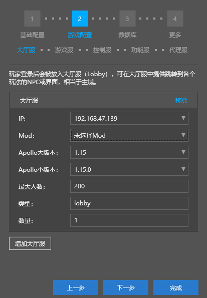
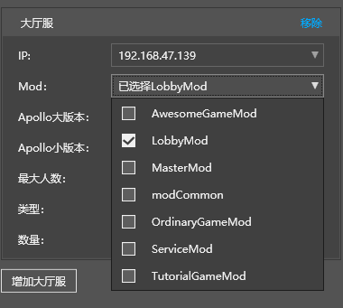
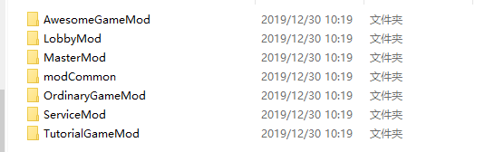
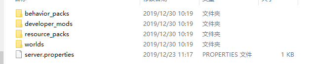
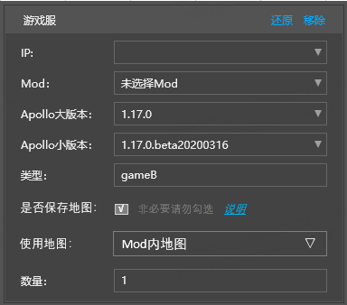
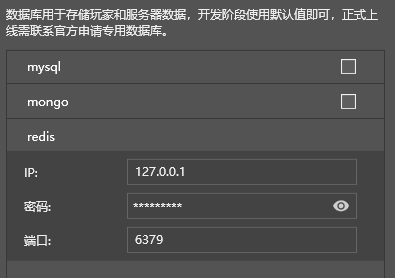
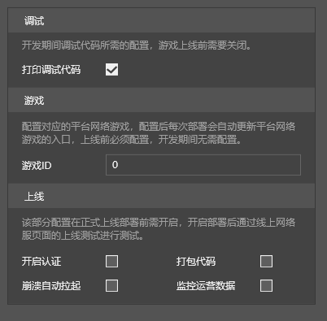

# 网络服进阶配置

本节内容可查阅[视频教程](https://cc.163.com/act/m/daily/iframeplayer/?id=5e7428e16a37ca23faf84bc2)的**网络服进阶配置**小节

## 大厅/游戏服

大厅服相当于主城，一个玩家登陆后首先会被放到类型为lobby的服务器中。

游戏服是具体的游戏玩法，玩家可以从大厅服跳转到游戏服。	

大厅服与游戏服的配置如图所示。

### Apollo大版本/小版本

- 首次创建网络服，总是选取最新的release版本即可

- 后面可根据API支持版本/整包大版本更新来按需升级

### 服务器IP

- 选择一个可用的机器
- 通常来说一个机器IP上不要部署超过40个服，具体视加载Mod性能而定

### Mod

- 该选项用于配置该服要加载的服务器Mod

- 服务器Mod是基于C++组件之上进行组合的复合型Mod，它包含多种角色的多个Mod

- 选取简易网络服模板，更多=>打开Mod目录可以查看该模板包含的服务器Mod

- 这里每一个文件夹都代表一个服务器Mod

  

- 每个Mod的标准格式

  

### 类型

- 类型名只允许使用字母、数字、下划线

- 类型用于标识该服的功能，在服务器Mod代码里需要用到，如转到指定类型的服

- 玩家登陆服务器后，会在所有类型名为lobby的大厅服务器中随机一个加入，如果没有类型名为lobby的大厅服务器，将无法登入。

  

### 游戏服地图保存说明

- 开发者在需要备份地图的时候，可以使用保存地图的功能。在开发者下一次部署的时候，开服工具将会根据开发者选择的地图进行部署网络游戏。
- 开发者如果要使用保存地图的功能，需勾选下图中的”是否保存地图”选项。开发者可以选择“使用地图”选项，里面选项有”MOD内地图”、“服务器最新地图”和已经保存的地图。
- 选择”MOD内地图”，开服工具则会选择MOD自带的地图进行部署。
- 如果当前服务器已经部署运行，则可选择“服务器最新地图”选择当前地图重新部署。
- 否则会根据所选的地图存档进行部署。开服工具会在游戏停服或者每隔24小时备份一次地图。为每一个网络游戏的每个类型的服务，开服工具最多保存两份地图。

- 地图资源建议：

  需保存地图的服务器建议使用“地图属性”插件，限制地图范围，避免地图过大，过大可能出现不稳定的情况。地图建议限制在1G以内，对应地图区块数为10万，坐标XZ范围约为5000x5000。

## 数据库

- Apollo开发测试机默认安装了三种数据库，mysql，mongo，redis

- 通过数据库配置页面可以选取与配置要使用的数据库

## 更多

​		当您需要将网络服提交审核或发布到开发者平台时，需要使用更多配置项里的选项。详细内容将在后面的教程里介绍。

