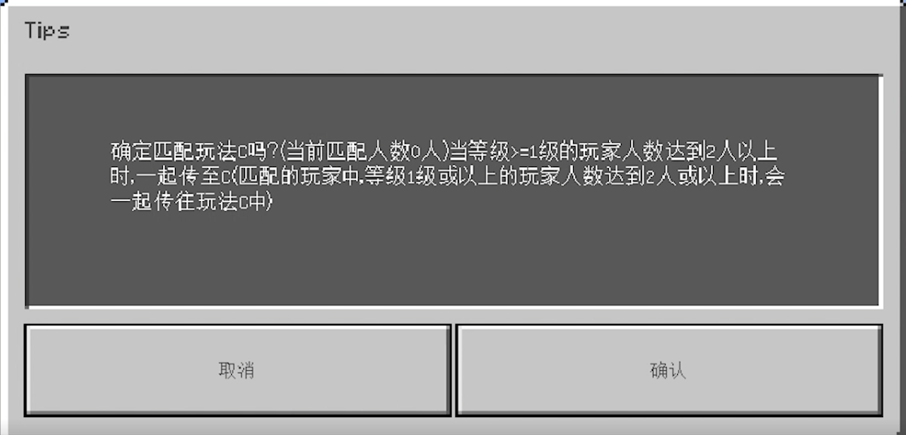
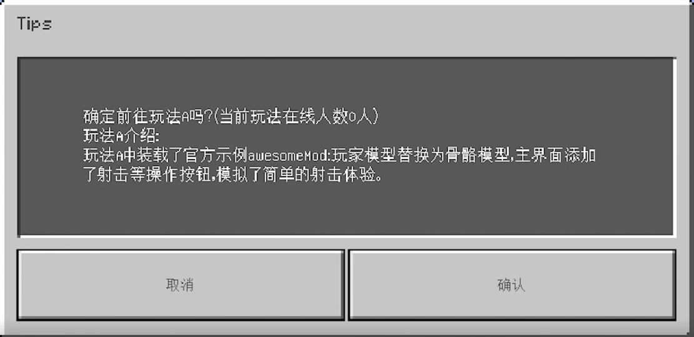
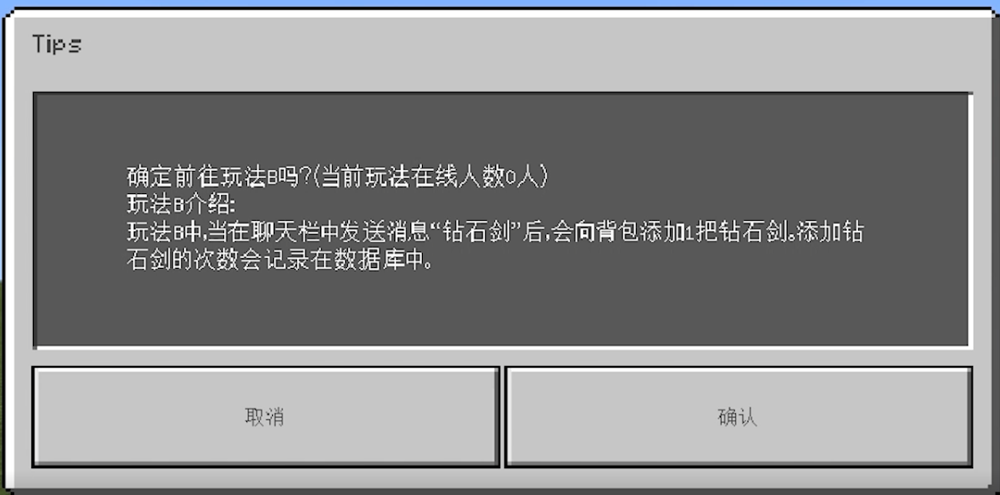

# 开发调试网络服Mod

上一小节已经介绍了MCStudio支持的几种部署方式，其中最常用的方式是部署与热更。

本小节将以简易网络服为例，介绍如何修改Mod代码并调试网络服。

本节内容可查阅[视频教程](https://cc.163.com/act/m/daily/iframeplayer/?id=5e7428e16a37ca23faf84bc2)的**网络服开发调试**小节

## 修改简易网络服NPC指向gameA

修改LobbyMod/developer_mods/AwesomeLobby/awesomeScripts/AwesomeServer.py

将OnNpcTouched函数的所有NPC都改为指向gameA

```python
def OnNpcTouched(self, args):
	...此处省略一部分...
	if npc_data.name == 'gameA':
		logger.info("%s touch NPC gameA",player_entity_id)
		#请求gameA玩家人数
		request_data = {'game': 'gameA', 'player_id': player_entity_id,'uid': uid,'client_id':netgameApi.GetServerId()}
		self.NotifyToMaster(modConfig.GetPlayerNumOfGameEvent,request_data)
	elif npc_data.name == 'gameB':
		logger.info("%s touch NPC gameB",player_entity_id)
		#请求gameA玩家人数
		request_data = {'game': 'gameA', 'player_id': player_entity_id,'uid': uid,'client_id':netgameApi.GetServerId()}
		self.NotifyToMaster(modConfig.GetPlayerNumOfGameEvent,request_data)
	elif npc_data.name == 'gameC':
		logger.info("%s touch NPC gameC",player_entity_id)
		#请求gameA玩家人数
		request_data = {'game': 'gameA', 'player_id': player_entity_id,'uid': uid,'client_id':netgameApi.GetServerId()}
		self.NotifyToMaster(modConfig.GetPlayerNumOfGameEvent,request_data)
```

点击**部署**，MCStudio会检测并上传本地Mod目录的修改内容到服务器上，并选取最优的部署方式应用更新。跟修改网络服配置类似，如果修改了控制服/功能服的Mod代码，则会触发重新部署，否则采取滚动更新方式部署。

本次修改只涉及了AwesomeServer.py，它属于LobbyMod的代码，MCStudio将推送AwesomeServer.py到远程开发机，并滚动更新大厅服。

如果当前有玩家在大厅服里游玩，那么他点击3个NPC，仍会分别指向gameA，gameB和gameC。



因为旧服不会再分配新玩家进入，后面登录的玩家都将进入应用了新代码的新服。

新进入的玩家点击3个NPC，发现它们都指向gameA了。



## 修改简易网络服NPC指向gameB

```python
def OnNpcTouched(self, args):
	...此处省略一部分...
	if npc_data.name == 'gameA':
		logger.info("%s touch NPC gameA",player_entity_id)
		#请求gameB玩家人数
		request_data = {'game': 'gameB', 'player_id': player_entity_id, 'uid': uid,
		                'client_id': netgameApi.GetServerId()}
		self.NotifyToMaster(modConfig.GetPlayerNumOfGameEvent, request_data)
	elif npc_data.name == 'gameB':
		logger.info("%s touch NPC gameB",player_entity_id)
		#请求gameB玩家人数
		request_data = {'game': 'gameB', 'player_id': player_entity_id, 'uid': uid,
		                'client_id': netgameApi.GetServerId()}
		self.NotifyToMaster(modConfig.GetPlayerNumOfGameEvent, request_data)
	elif npc_data.name == 'gameC':
		logger.info("%s touch NPC gameC",player_entity_id)
		#请求gameB玩家人数
		request_data = {'game': 'gameB', 'player_id': player_entity_id, 'uid': uid,
		                'client_id': netgameApi.GetServerId()}
		self.NotifyToMaster(modConfig.GetPlayerNumOfGameEvent, request_data)
```

本次修改只涉及了AwesomeServer.py，它属于大厅服的**服务端代码部分**，并且**只修改了函数内实现**

以上条件均符合**服务器热更**的前提，因此我们可以选中网络服=>更多=>热更来进行热更操作。

MCStudio将推送AwesomeServer.py到远程开发机，并热更大厅服。

此时，仍在大厅服游玩的玩家，无需退出重进，点击3个NPC，发现它们都指向gameB了。



热更的一个重要应用场景是：当遇到bug想添加日志调试时，不希望破坏现场，可以马上在服务端代码部分**添加调试日志**，查看当前内存中的一些变量状态时，通过热更使之生效，达到快速解决bug的目标。

