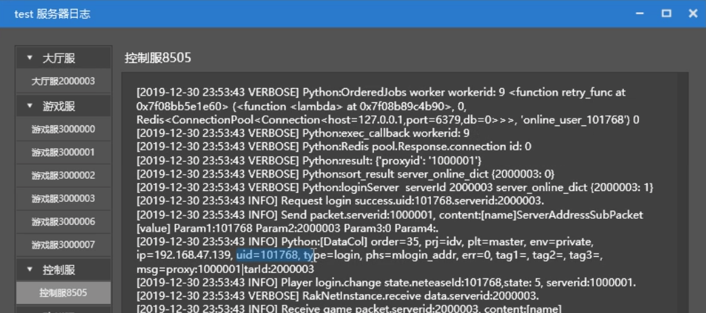
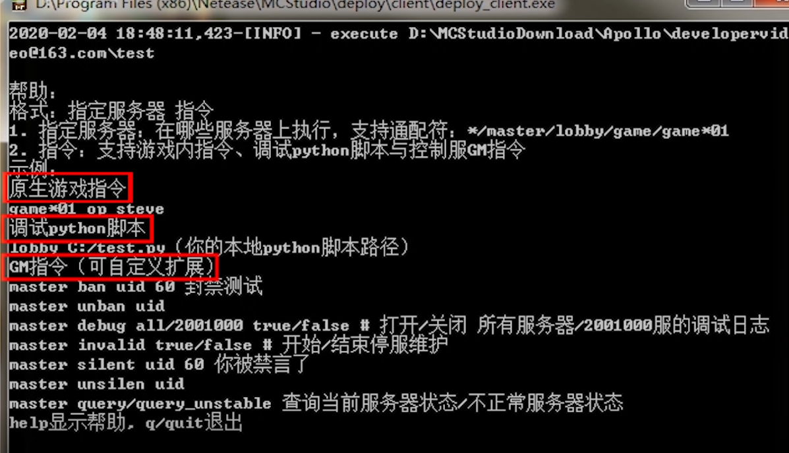
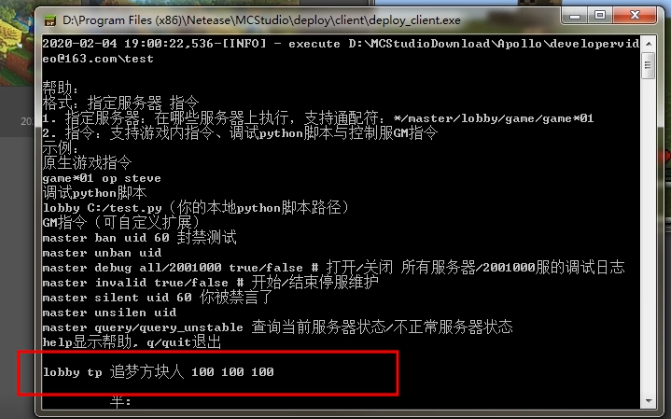
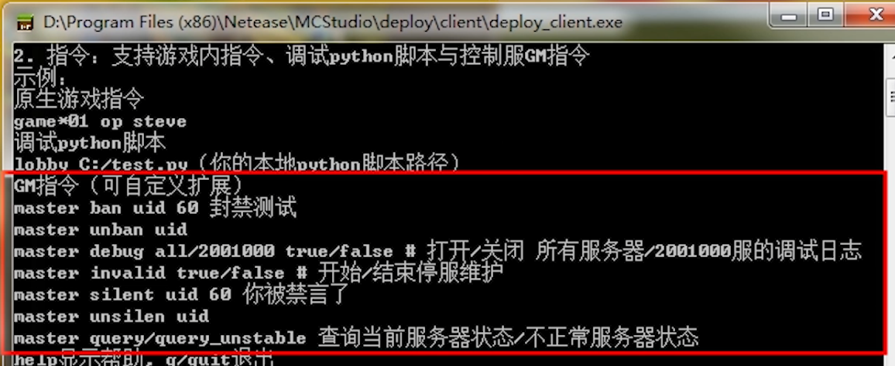
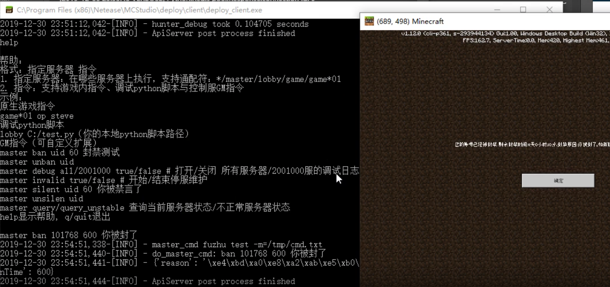
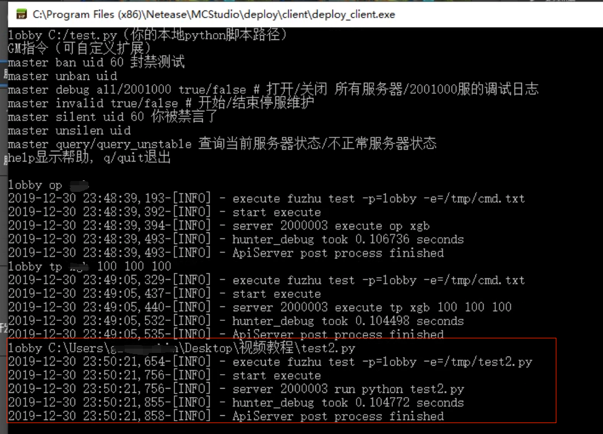
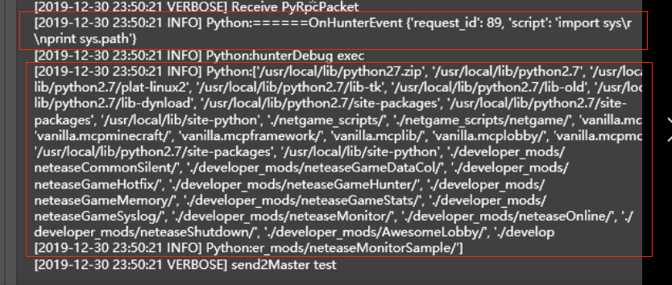

# 控制台调试

本节内容可查阅[视频教程](https://cc.163.com/act/m/daily/iframeplayer/?id=5e7428e16a37ca23faf84bc2)的**控制台调试**小节

## 服务器日志

### 打开服务器日志

- 点击服务器=>更多=>服务器日志，可以打开服务器日志窗口
- 选取不同的游戏服/大厅服可以查看不同服务器的日志

### 获取玩家uid

- 打开控制服日志
- 启动开发测试进入游戏
- 从控制服的登陆日志中可以查看登陆玩家的uid

## 打开控制台调试

- 点击服务器=>更多=>控制台调试，就可以打开控制台调试窗口

- 在控制台调试窗口，开发者可以执行**游戏原生指令**、**GM指令**以及**python脚本**

  

- 指令格式为：执行指令的服务器通配表达式   指令内容

- 服务器通配表达式支持分词与通配符，如lobby，\*lobby\*都可以表示所有进程名含lobby的服务器

- lobby_2000000，2000000都可以表示id为2000000的大厅服，master特指GM指令。

## 游戏原生指令

- 将所有大厅服的追梦方块人传送到指定位置

## GM指令

- GM指令包含封禁与解封、禁言与解封、打开与关闭调试日志、开始与结束停服维护等常用的指令功能
- 在控制台调试里输入help可以查看官方提供的GM指令列表。

- 封禁玩家

  

  

## Python脚本

- 将本地路径的python脚本推送到指定服务器上执行

  

- 执行的python脚本除了可以import服务器已有的标准库以外，还可以import对应服务器运行时目录的脚本

  

  

