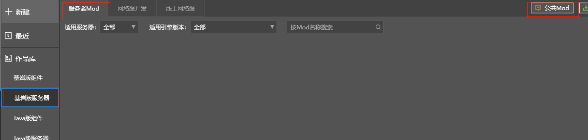
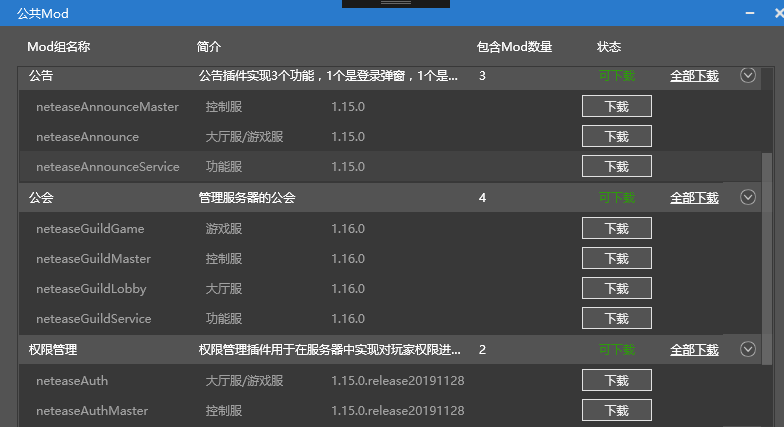
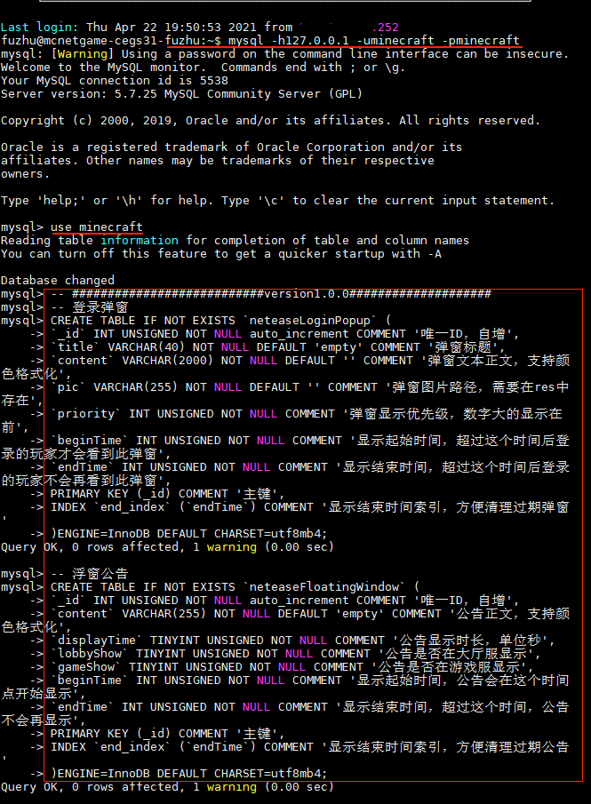
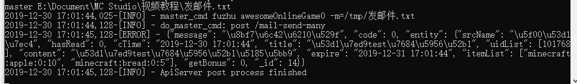
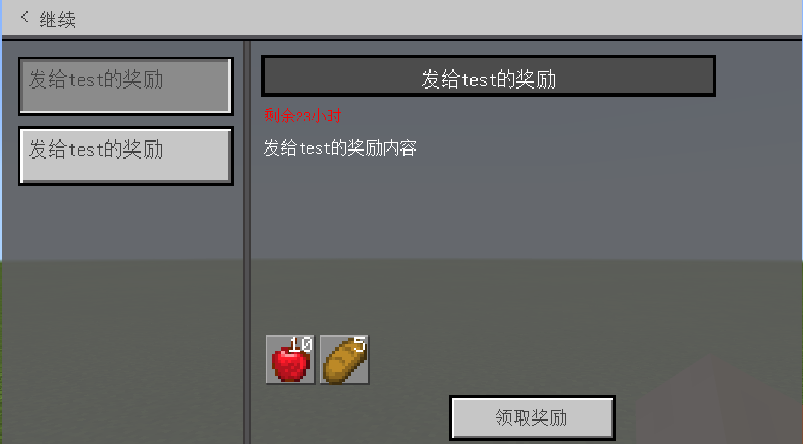
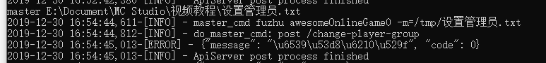
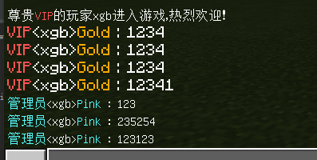

# 官方插件获得

本节内容可查阅[视频教程](https://cc.163.com/act/m/daily/iframeplayer/?id=5e7428e16a37ca23faf84bc2)的**使用官方插件**小节

## 获取官方插件

官方插件可以通过以下两种方式获取

- 下载开发者工具离线文档获取

- MCStudio=>基岩版服务器=>服务器Mod=>公共Mod

  




## 公告插件

- 公告插件由neteaseAnnounce、neteaseAnnounceMaster、neteaseAnnounceService三个Mod构成。

  如果是通过离线文档获取的插件，需要先把以上Mod**拷贝到网络服的Mod目录**下

- 执行mod.sql

  - 登录到远程开发机

  - 执行下面命令进入mysql：mysql -h机器ip -p数据库密码 -u数据库用户名。

    ```
    mysql -h127.0.0.1 -uminecraft -pminecraft
    ```

  - 执行下面命令切换数据库名称 use minecraft

    ```
    use minecraft
    ```
    
  - 执行mod.sql，把mod.sql文件的内容拷贝并执行，结果提示"Query OK"表示执行成功。示例如下：

    ```
    -- ###########################version1.0.0####################
    -- 登录弹窗
    CREATE TABLE IF NOT EXISTS `neteaseLoginPopup` (
    `_id` INT UNSIGNED NOT NULL auto_increment COMMENT '唯一ID，自增',
    `title` VARCHAR(40) NOT NULL DEFAULT 'empty' COMMENT '弹窗标题',
    `content` VARCHAR(2000) NOT NULL DEFAULT '' COMMENT '弹窗文本正文，支持颜色格式化',
    `pic` VARCHAR(255) NOT NULL DEFAULT '' COMMENT '弹窗图片路径，需要在res中存在',
    `priority` INT UNSIGNED NOT NULL COMMENT '弹窗显示优先级，数字大的显示在前',
    `beginTime` INT UNSIGNED NOT NULL COMMENT '显示起始时间，超过这个时间后登录的玩家才会看到此弹窗',
    `endTime` INT UNSIGNED NOT NULL COMMENT '显示结束时间，超过这个时间后登录的玩家不会再看到此弹窗',
    PRIMARY KEY (_id) COMMENT '主键',
    INDEX `end_index` (`endTime`) COMMENT '显示结束时间索引，方便清理过期弹窗'
    )ENGINE=InnoDB DEFAULT CHARSET=utf8mb4;
    -- 浮窗公告
    CREATE TABLE IF NOT EXISTS `neteaseFloatingWindow` (
    `_id` INT UNSIGNED NOT NULL auto_increment COMMENT '唯一ID，自增',
    `content` VARCHAR(255) NOT NULL DEFAULT 'empty' COMMENT '公告正文，支持颜色格式化',
    `displayTime` TINYINT UNSIGNED NOT NULL COMMENT '公告显示时长，单位秒',
    `lobbyShow` TINYINT UNSIGNED NOT NULL COMMENT '公告是否在大厅服显示',
    `gameShow` TINYINT UNSIGNED NOT NULL COMMENT '公告是否在游戏服显示',
    `beginTime` INT UNSIGNED NOT NULL COMMENT '显示起始时间，公告会在这个时间点开始显示',
    `endTime` INT UNSIGNED NOT NULL COMMENT '显示结束时间，超过这个时间，公告不会再显示',
    PRIMARY KEY (_id) COMMENT '主键',
    INDEX `end_index` (`endTime`) COMMENT '显示结束时间索引，方便清理过期公告'
    )ENGINE=InnoDB DEFAULT CHARSET=utf8mb4;
    -- 邮件用户信息
    CREATE TABLE IF NOT EXISTS `neteaseMailUserProp` (
    `uid` INT UNSIGNED NOT NULL COMMENT '用户唯一ID',
    `lastGroupSync` INT UNSIGNED NOT NULL COMMENT '群邮件同步进度',
    `version` INT UNSIGNED NOT NULL COMMENT '玩家信息版本',
    `cTime` INT UNSIGNED NOT NULL COMMENT '玩家首次登录游戏的时间',
    PRIMARY KEY (uid) COMMENT '主键'
    )ENGINE=InnoDB DEFAULT CHARSET=utf8mb4;
    -- 单人邮件
    CREATE TABLE IF NOT EXISTS `neteaseUserMail` (
    `_id` INT UNSIGNED NOT NULL auto_increment COMMENT '唯一ID，自增',
    `uid` INT UNSIGNED NOT NULL COMMENT '邮件属于哪位玩家',
    `title` VARCHAR(40) NOT NULL DEFAULT 'empty' COMMENT '邮件标题',
    `content` VARCHAR(1500) NOT NULL DEFAULT '' COMMENT '邮件正文',
    `itemList` VARCHAR(500) NOT NULL DEFAULT '' COMMENT '邮件附件物品列表，使用json.dumps序列化为字符串',
    `cTime` INT UNSIGNED NOT NULL COMMENT '邮件创建时间',
    `expire` INT UNSIGNED NOT NULL COMMENT '邮件过期时间',
    `srcName` VARCHAR(40) NOT NULL DEFAULT '' COMMENT '邮件发送者',
    `hasRead` TINYINT UNSIGNED NOT NULL COMMENT '是否已读',
    `getBonus` TINYINT UNSIGNED NOT NULL COMMENT '是否已经领取奖励',
    PRIMARY KEY (_id) COMMENT '主键',
    INDEX `uid_index` (`uid`) COMMENT '玩家uid索引，方便检索属于某玩家的邮件',
    INDEX `expire_index` (`expire`) COMMENT '过期时间索引，方便清理过期邮件'
    )ENGINE=InnoDB DEFAULT CHARSET=utf8mb4;
    -- 群发邮件
    CREATE TABLE IF NOT EXISTS `neteaseGroupMail` (
    `_id` INT UNSIGNED NOT NULL auto_increment COMMENT '唯一ID，自增',
    `effectTime` INT UNSIGNED NOT NULL COMMENT '生效时间，首次登录时间早于此时间的玩家才会收到此邮件',
    `title` VARCHAR(40) NOT NULL DEFAULT 'empty' COMMENT '邮件标题',
    `content` VARCHAR(1500) NOT NULL DEFAULT '' COMMENT '邮件正文',
    `itemList` VARCHAR(500) NOT NULL DEFAULT '' COMMENT '邮件附件物品列表，使用json.dumps序列化为字符串',
    `cTime` INT UNSIGNED NOT NULL COMMENT '邮件创建时间',
    `expire` INT UNSIGNED NOT NULL COMMENT '邮件过期时间',
    `srcName` VARCHAR(40) NOT NULL DEFAULT '' COMMENT '邮件发送者',
    PRIMARY KEY (_id) COMMENT '主键',
    INDEX `expire_index` (`expire`) COMMENT '过期时间索引，方便清理过期邮件'
    )ENGINE=InnoDB DEFAULT CHARSET=utf8mb4;
    -- ###########################version1.0.3####################
    -- 单人邮件：增加邮件附件长度限制
    ALTER TABLE `neteaseUserMail` MODIFY COLUMN `itemList` VARCHAR (4000) NOT NULL DEFAULT '';
    -- 群发邮件：增加邮件附件长度限制
    ALTER TABLE `neteaseGroupMail` MODIFY COLUMN `itemList` VARCHAR (4000) NOT NULL DEFAULT '';
    ```
    
    
    
    

- 创建post文本指令: 发邮件.txt

  ```pytho
    post /mail-send-many
    {
        "touids": [101768],
        "title": "发给test的奖励",
        "content": "发给test的奖励内容",
        "itemList": ["minecraft:apple:0:10", "minecraft:bread:0:5"],
        "expire": 86400,  
        "srcName": "开发组"
    }
  ```

- 通过控制台调试窗口执行GM指令执行master 发邮件.txt

  

- 在游戏中查看效果

  


## 权限管理插件

- 权限管理插件由neteaseAuth、neteaseAuthMaster两个Mod构成。

- 执行mod.sql

- 创建post文本指令: 管理员.txt

  ```pytho
  post /change-player-group
  {
      "authGroup": 2,
      "uid" : 101768
  }
  ```

- 通过控制台调试窗口执行GM指令执行master 管理员.txt

  

- 在游戏中查看效果



