# 平台发布

本节内容可查阅[视频教程](https://cc.163.com/act/m/daily/iframeplayer/?id=5e7428e16a37ca23faf84bc2)最后的**审核发布**小节

## 发布网络服

### 创建网络游戏

- 当你完成了网络服Demo的开发之后，需要到开发者平台的发布页面**创建新的网络游戏**

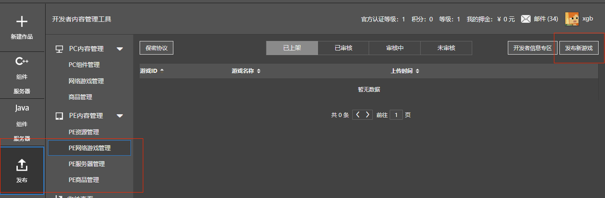

- 填入开发好的网络服信息，点击保存即可
  - **游戏IP或域名**：填写网络服部署日志最后打印的入口地址
  
  - **测试服IP或域名**：填写网络服部署日志最后打印的入口地址
  
    以上也可以随便填写，后续会介绍如何**绑定网络服开发与网络游戏**，重新部署后，后续每次部署都会**自动更新**平台的入口地址
  
  - **适用版本**：根据Apollo大版本选择
  
    
  

## 绑定网络游戏和网络服

- 为了将开发网络服和开发者平台的网络游戏进行绑定，需要配置game_id

### 获取game_id

- 每个网络游戏都有一个唯一的游戏ID，如图所示

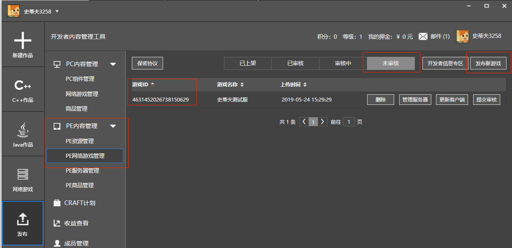

### 配置绑定game_id

- 创建审核阶段网络服:

  选择左侧功能栏-基岩版-服务器=》网络服开发=》开发阶段,右键选择复制功能,选择审核阶段复制

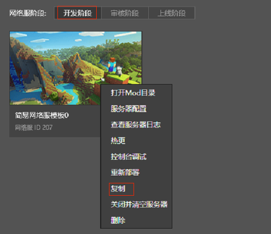

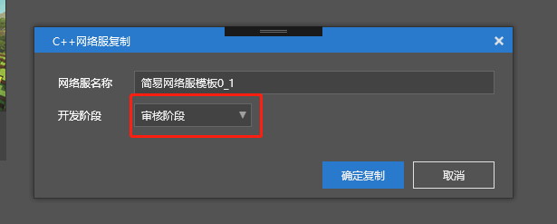

- 选择审核阶段的网络服务器,打开配置=>更多，将上述game_id填入，关闭配置页面后可以**部署网络服**

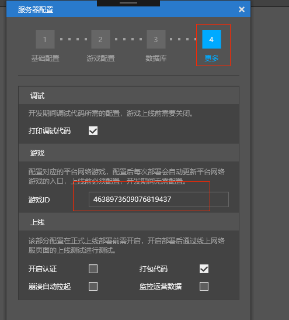

### 部署审核服

- 部署审核服，修改过的MOD需要配置升级对应的版本信息

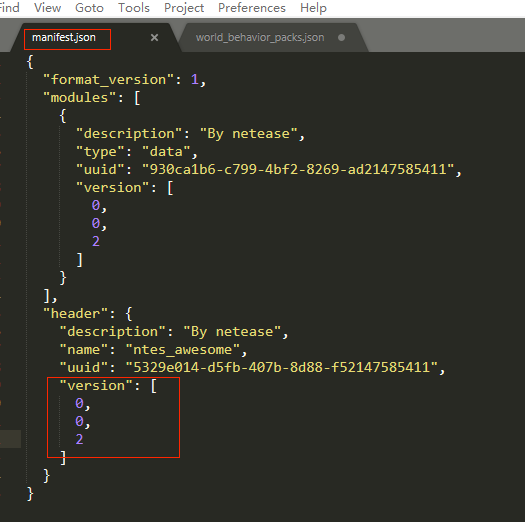

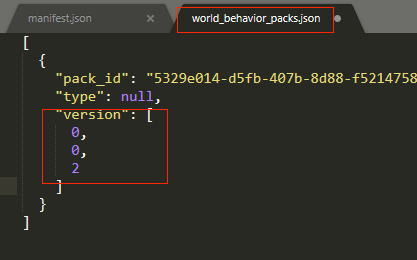

- 选择一个配置好game_id的网络服进行部署操作，部署过程将上传对应的MOD组件资源到服务器

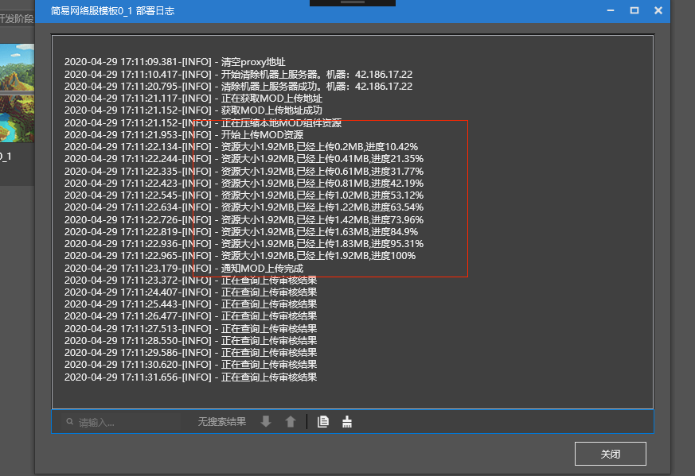

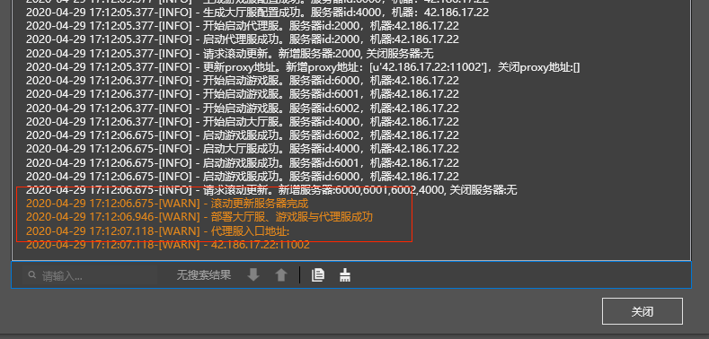

- MOD审核通过，部署成功，可关闭此部署日志界面，选择对应的网络服进行开发测试。

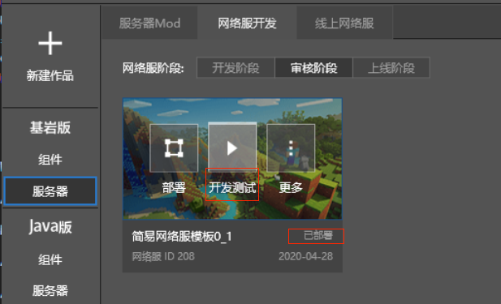

### 提交审核

- 审核服测试完成后，可以到发布界面,将网络游戏提交审核

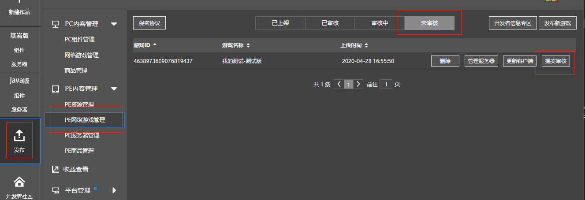

点击查看游戏详细信息,网络游戏的测试服IP已经和审核阶段的网络服部署的服务器IP进行绑定

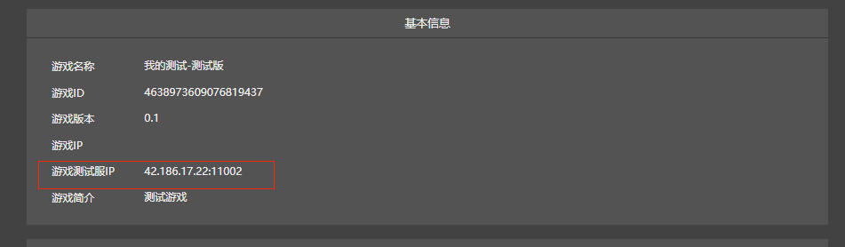

### 上线测试

- 提交审核通过的网络游戏可以进行上线测试
- 点击审核阶段网络服的”更多—>复制",把网络服复制到上线阶段。

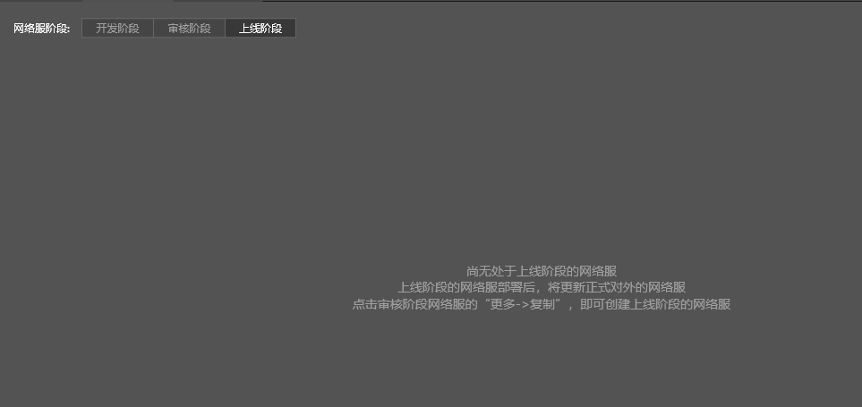

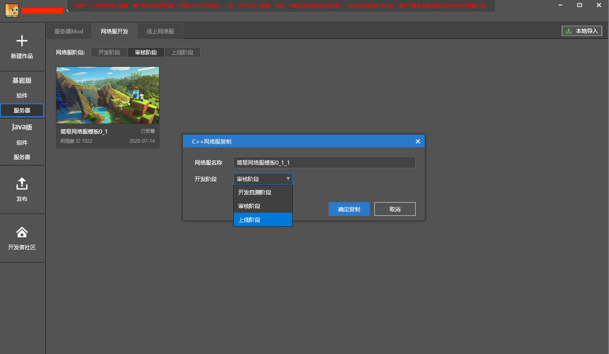

- 选择上线阶段的网络服务器,打开配置=>更多，勾选上“开启认证”、“打包代码”、“崩溃自动拉起”、“监控运营数据”几项，关闭配置页面后可以**部署网络服**。

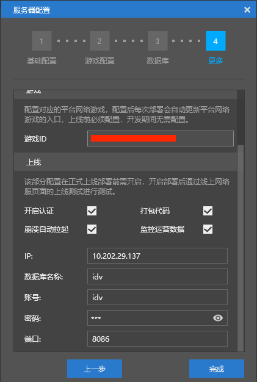

### PE端测试

- 网络服提交审核后，就可在PE端进行测试

- 通过MCStudio=>发布=>测试版启动器下载提供的二维码，手机扫码安装**PE测试客户端**

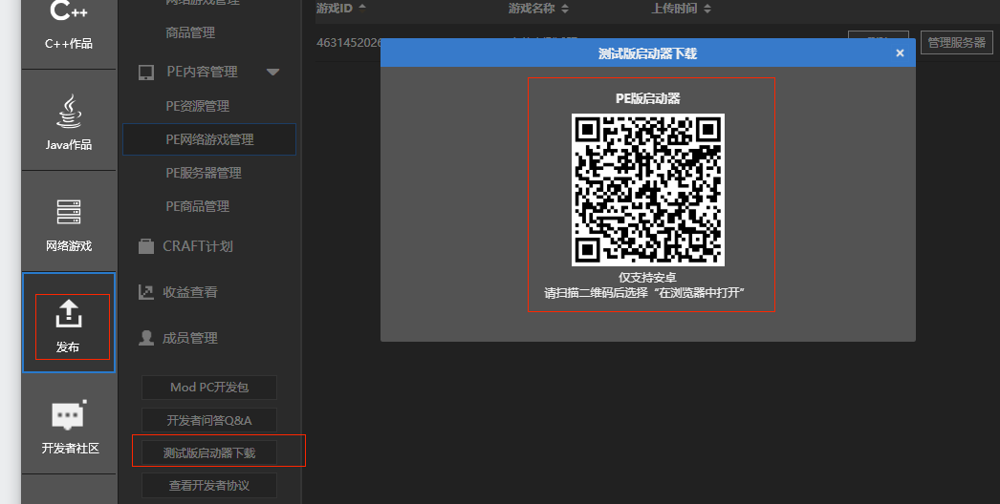

- 需要升级MOD的版本信息后部署，否则PE客户端的流量优化下载将可能下载不到最新的MOD