# 从零开始服务器Mod开发

​		这篇教材将会详细讲述如何创建一个网络游戏Mod，主要针对没有网络游戏基础的同学。本教材要求开发者已经申请到了开发机（按照“网络游戏入驻”流程申请），且会使用部署工具（参考“使用部署工具”），已经阅读“Mod开发简介”和“从零开始创建Mod”。

​		网络游戏Mod主要由服务端Mod和客户端Mod组成。客户端Mod也即行为包，它运行在玩家手机上，可以处理界面交互、特效、entity 行为等逻辑，只能使用Mod SDK客户端组件和事件。服务端Mod运行在linux机器上，它可以从数据库存取玩家数据，实现玩家之间交互，可以使用Server Mod SDK所有功能、Mod SDK服务端组件和事件。下面介绍一个简单网络游戏开发过程，功能是接收客户端请求并打印“hello world”。

## 如何创建文件夹目录

1、创建一个目录作为网络游戏根目录，使用英文或拼音，不能使用中文，另外，根目录路径中也不能包含中文。这里根目录取名为helloGame:

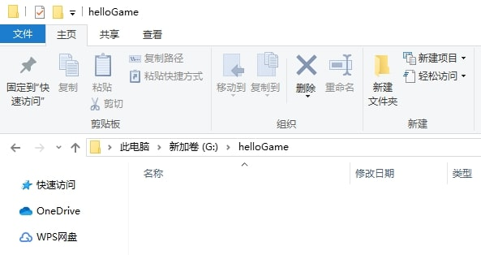 

2、helloGame文件夹下创建lobbyMod文件夹，代表大厅服的Mod。

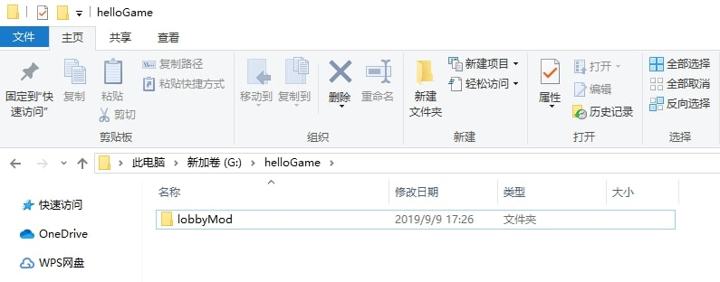 

3、lobbyMod文件夹下面创建behavior_packs、developer_mods和worlds文件夹。behavior_packs存放客户端Mod，developer_mods存放服务端Mod，worlds存放地图。

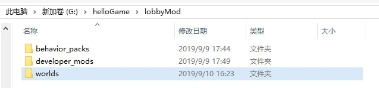 

4、behavior_packs文件夹下创建client_hello文件夹，表示客户端Mod的名字。

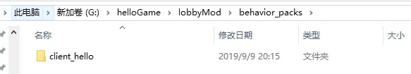 

5、client_hello文件夹下面创建helloScripts文件夹，表示Mod脚本层的根目录，另外创建manifest.json，用于唯一标识这个Mod。

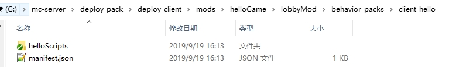 

6、developer_mods文件下面创建lobby_hello文件夹，表示服务端Mod的名字。

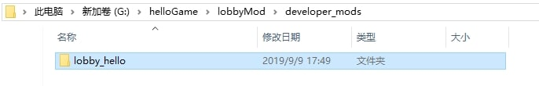 

7、lobby_hello文件夹下面创建helloScripts文件夹，表示Mod脚本层的根目录，该文件夹名建议同步骤5中创建的文件夹名一样，这样方便开发客户端和服务端mod公共代码，比如import module时可以使用相同路径。

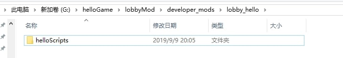 

8、worlds目录下创建level目录，用于存放地图。

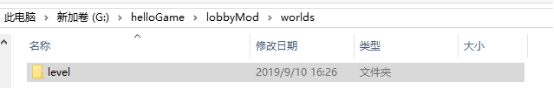 

level目录下创建db文件夹，把地图文件都放在这个文件夹中。本网络游戏没有定制地图，因此不用创建db文件夹。

9、如果存在资源文件，则还需在lobbyMod下创建resource_packs文件夹。若需要ui资源，则需在resource_packs下创建名为ui的文件夹。

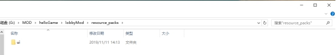 

10、在1.15版本之后，必须有一个game的Mod，就算是空的Mod。因此，还需在hellogame目录下新建一个gameMod文件夹，里面新建一个worlds文件夹，再在worlds下新建一个空的level文件夹即可。

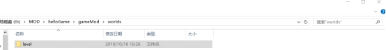 

## 如何配置manifest.json

其参数含义参考“Mod开发简介”。其中UUID是用于识别包体唯一性的标识符，用于系统区分开我们和别人的资源包、行为包。获取方式有2种： 一是使用网站https://www.uuidgenerator.net/来获取，直接复制下来使用，每次刷新可以获得新的UUID；二是使用python内置的模块uuid来获取，分布如下图所示：

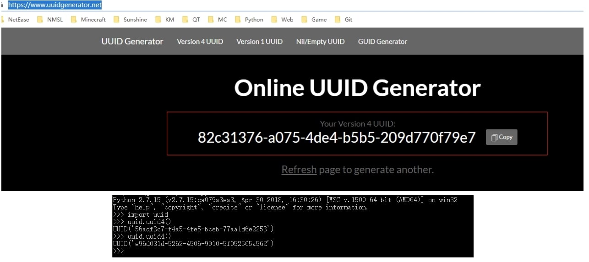 

按照各参数含义，配置manifest.json如下：

```python
{
    "format_version": 1,
    "header": {
        "description": "By netease",
        "name": "hello",
        "uuid": "5429e014-d5fb-407b-8d88-f5cb78974339",
        "version": [0, 0, 1]
    },
    "modules": [
        {
            "description": "By netease",
            "type": "data",
            "uuid": "940ca1b6-c799-4bf2-8269-ada633d15932",
            "version": [0, 0, 1]
        }
    ]
}
```


## 服务器Mod开发

1、创建脚本文件。在developer_mods下的helloScripts目录下创建__init__.py、helloServerSys.py、modMain.py文件。__init__.py是为了让python将helloScripts这个目录当成一个可以被import的package。modMain.py则是我们Mod的入口文件，里面包含入口函数和我们要执行的一些初始化操作。helloServerSys.py是一个system，可以在helloServerSys.py中调用封装好的监听事件Event的方法，以完成一个个特定的功能任务。通常，一个Mod只需要一个system。

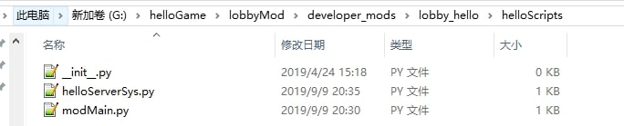 

2、使用sublime打开网络游戏Mod（PyCharm也是不错的选择）。

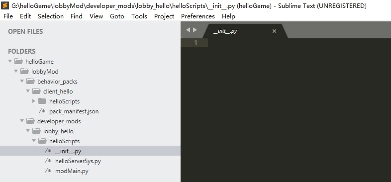 

3、打开modMain.py，开始编写代码

modMain.py代码如下：

```python
# -*- coding: utf-8 -*-
 # 上面这行是让这个文件按utf-8进行编码，这样就可以在注释中写中文了
#
# 这行是import到MOD的绑定类Mod，用于绑定类和函数
from common.mod import Mod
# 这行import到的是引擎服务端的API模块
import server.extraServerApi as serverApi
#日志相关的模块。
from mod_log import engine_logger as logger

# 用Mod.Binding来绑定MOD的类，引擎从而能够识别这个类是MOD的入口类
@Mod.Binding(name = "HELLO_LOBBY", version = "0.1")
class LobbyServerMod(object):
	# 类的初始化函数
	def __init__(self):
		pass
	
	# InitServer绑定的函数作为服务端脚本初始化的入口函数，通常是用来注册服务端系统system和组件component
	@Mod.InitServer()
	def initServer(self):
		#打印服务端info log
		logger.info('===========================init hello server mod!===============================')
		# 函数可以将System注册到服务端引擎中，实例的创建和销毁交给引擎处理。第一个参数是名字空间，第二个是System名称，第三个是自定义MOD System类的路径
		# 取名名称尽量个性化，不能与其他人的MOD冲突，可以使用英文、拼音、下划线这三种。
		self.lobbyServer = serverApi.RegisterSystem("hello", "helloServer", "helloScripts.helloServerSys.HelloServerSys")

	# DestroyServer绑定的函数作为服务端脚本退出的时候执行的析构函数，通常用来反注册一些内容,可为空
	@Mod.DestroyServer()
	def destroyServer(self):
		#打印服务端info log
		logger.info('destroy_server===============')
```


4、打开helloServerSys.py文件，开始编辑代码

helloServerSys.py

```python
# -*- coding: utf-8 -*-
 # 上面这行是让这个文件按utf-8进行编码，这样就可以在注释中写中文了

# 这行import到的是引擎服务端的API模块
import server.extraServerApi as serverApi
# 获取引擎服务端System的基类，System都要继承于ServerSystem来调用相关函数
ServerSystem = serverApi.GetServerSystemCls()
# 在modMain中注册的Server System类
class HelloServerSys(ServerSystem):
	# ServerSystem的初始化函数
	def __init__(self,namespace,systemName):
		# 首先调用父类的初始化函数
		ServerSystem.__init__(self, namespace, systemName)
		# 初始时调用监听函数监听事件
		#第一个参数是namespace，表示客户端名字空间，第二个是客户端System名称，第三个是监听事件的名字，第五个参数是回调函数（或者监听函数）
		self.ListenForEvent("hello", "helloClient", 'TestRequest', self, self.OnTestRequest)

	# 回调函数，用于处理客户端消息
	def OnTestRequest(self, args):
		print 'hello world'
		print 'request data', args

	# 函数名为Destroy才会被调用，在这个System被引擎回收的时候会调这个函数来销毁一些内容
	def Destroy(self):
		# 注销监听事件
		self.UnListenForEvent("hello", "helloClient", 'TestRequest', self, self.OnTestRequest)
```


## 客户端Mod开发

1、 创建脚本文件。在behavior_packs下的helloScripts目录下创建__init__.py、helloClientSys.py、modMain.py文件。__init__.py是为了让python将helloScripts这个目录当成一个可以被import的package。modMain.py则是我们Mod的入口文件，里面包含入口函数和我们要执行的一些初始化操作。helloClientSys.py是一个system，可以在helloClientSys.py中调用封装好的注册监听事件Event的方法，以完成一个个特定的功能任务。通常，一个Mod只需要一个system。

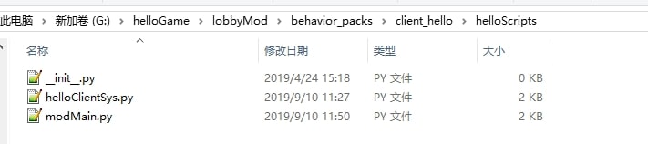 

2、 打开modMain.py，开始编写代码

```python
# -*- coding: utf-8 -*-
 # 上面这行是让这个文件按utf-8进行编码，这样就可以在注释中写中文了
#
# 这行是import到MOD的绑定类Mod，用于绑定类和函数
from common.mod import Mod
# 这行import到的是引擎客户端的API模块
import client.extraClientApi as clientApi

# 用Mod.Binding来绑定MOD的类，引擎从而能够识别这个类是MOD的入口类
@Mod.Binding(name = "HELLO_LOBBY", version = "0.1")
class LobbyBehaviorMod(object):
	# 类的初始化函数
	def __init__(self):
		pass
	
	# InitClient绑定的函数作为客户端脚本初始化的入口函数，通常用来注册客户端系统system和组件component
	@Mod.InitClient()
	def initClient(self):
		print '===========================init hello client mod!==============================='
		# 函数可以将System注册到客户端引擎中，实例的创建和销毁交给引擎处理。第一个参数是名字空间，第二个是System名称，第三个是自定义MOD System类的路径
		# 取名名称尽量个性化，不能与其他人的MOD冲突，可以使用英文、拼音、下划线这三种。
		self.lobbyClient = clientApi.RegisterSystem("hello", "helloClient", "helloScripts.helloClientSys.HelloClientSys")

	# DestroyClient绑定的函数作为客户端脚本退出的时候执行的析构函数，通常用来反注册一些内容,可为空
	@Mod.DestroyClient()
	def destroyClient(self):
		print 'destroy_client==============='
```


3、 打开helloClientSys.py，开始编辑代码

```python
# -*- coding: utf-8 -*-
 # 上面这行是让这个文件按utf-8进行编码，这样就可以在注释中写中文了

# 获取客户端引擎API模块
import client.extraClientApi as clientApi
# 获取客户端system的基类ClientSystem
ClientSystem = clientApi.GetClientSystemCls()
# 在modMain中注册的Client System类
class HelloClientSys(ClientSystem):
	# ServerSystem的初始化函数
	def __init__(self,namespace,systemName):
		# 首先调用父类的初始化函数
		ClientSystem.__init__(self, namespace, systemName)
		print "==== HelloClientSys Init ===="
		# 定义一个event,下面可以通过这个event给服务端发送消息。
		self.DefineEvent('TestRequest')
		#给服务端发送消息
		self.TestRequest()

	def TestRequest(self, args):
		#创建自定义事件的数据。data其实是个dict。
		data = self.CreateEventData()#等价于:data = {}
		data['test1'] = 'value1'
		data['test2'] = 'value2'
		#给服务端发送消息。服务端通过监听TestRequest事件处理消息，消息内容是data。
		self.NotifyToServer('TestRequest', data)

	# 函数名为Destroy才会被调用，在这个System被引擎回收的时候会调这个函数来销毁一些内容
	def Destroy(self):
		Pass
```


## 配置地图

1、 level目录下新建world_behavior_packs.json文件。若存在resource mod，则还需要创建world_resource_packs.json文件。

2、 world_behavior_packs.json中配置使用到的客户端Mod信息。这里把client_hello mod信息配置到这个文件。

把manifest.json中uuid和version信息拷贝到world_behavior_packs.json文件中

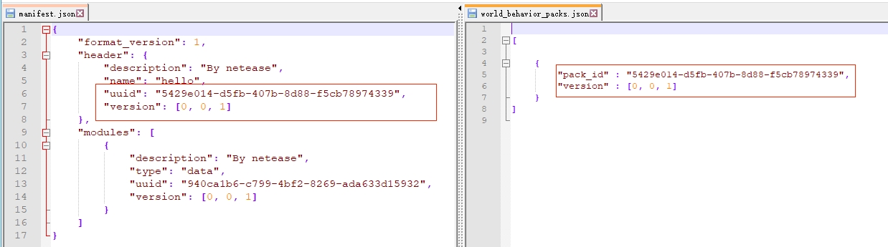 

world_behavior_packs.json文件内容：

```python
[
	
	{
		"pack_id" : "5429e014-d5fb-407b-8d88-f5cb78974339",
		"version" : [0, 0, 1]
	}
]
```


3.同样的也需要把world_resource_packs.json的uuid和version的字段拷贝到resource_packs文件夹下的mainfest.json里（如果没有文件则需新建一个）