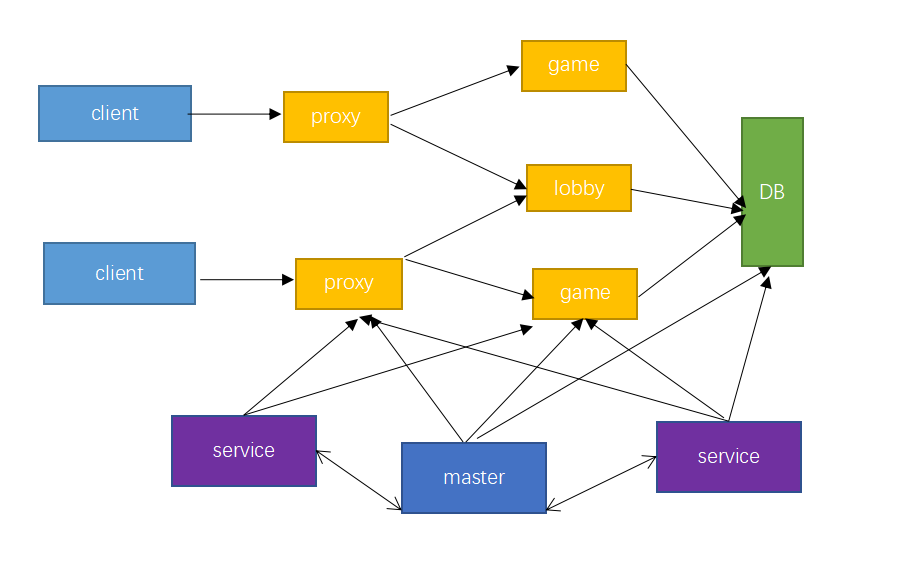

# 框架
## 框架介绍

- DB是全局存储系统，所有游戏服共享，可以是redis、mysql或mongodb等。其中，redis用于缓存临时数据，比如玩家在线状态、当日在线时长等，mysql和mongo用于持久化存储游戏数据。开发者根据需求自选。
- proxy是代理服，功能包括消息的加密和解密，消息的压缩和解压缩，登录认证和消息转发。它保持客户端到服务端的连接。 开发者不能对proxy进行开发。
- game是游戏服，提供游戏逻辑功能，一个在线玩家只存在于一个game或lobby中。 开发者在game上进行游戏玩法开发，比如实现酷跑游戏、射击游戏、战斗游戏。
- lobby是大厅服，提供大厅各项功能。 开发者在lobby开发大厅的功能，比如提供NPC选服入口，提供战斗副本入口。
- master是控制服，用于管理其他服，是全服单点，对外提供http服务。http服务是运营指令（gm指令）入口。 开发者可以在master开发运营指令，比如发奖励指令、禁止发言指令。下面通过禁言指令需求介绍master功能：
  - 需求：某玩家言词不当，需要禁止他聊天。
  - 实现：在master添加禁言指令。开发者使用http给master发送禁言请求，master会把禁言信息记录到db，然后给玩家所在服务器发消息，禁止玩家发言。玩家下次登陆时，从db中读取禁言信息，判断是否还可以聊天。
- service是功能服，用于提供分布式单点服务。开发者可以在service开发公会、全服boss、全服匹配等功能。下面通过全服匹配需求介绍service功能：
  - 需求：存在lobby1和lobby2两个大厅服，两个大厅服内玩家要按照等级、战力等属性进行匹配，进入同一个副本游戏。
  - 实现：玩家申请匹配时，lobby1或lobby2向service申请匹配，service维护一个匹配队列，记录所有正匹配玩家，service会定时取出队列玩家，按照等级和战力匹法，将匹配后玩家分配到指定副本游戏。

## 使用示例
通过一个简单网络游戏需求介绍开服工具框架的使用。可在McStudio——基岩版网络服分页，选择“简易网络服”模板，点击新建按钮创建该示例。
### 需求
玩家进入大厅服后，选择体验三种游戏：生存服，“钻石服”，对战pvp，另外游戏提供禁言指令。对战pvp要求一场战斗最多两个玩家。
### 实现

下面介绍一下简易服的功能：

- masterMod：实现了一个获取玩家在线状态的运营指令

- serviceMod：实现全服匹配。service维护匹配队列，记录所有正在匹配玩家，接着按照玩家等级匹配，将匹配成功的两个玩家分配到pvp服，

- AwesomeGameMod：实现了一个基础的生存服

- TutorialGameMod：玩家在聊天框里面输入"钻石剑"，"钻石镐"，"钻石头盔"，"钻石胸甲"，"钻石护腿"，"钻石靴子"会获得相应的装备

- OrdinaryGameMod：简单的对战pvp

- lobbyMod：提供三个NPC，点击不同NPC分别进入不同的game服
  
  
### 功能执行过程

说明玩家体验游戏过程中，引擎（开服工具框架）和开发者mod分别完成的功能。

#### 进入钻石服
1. 玩家登陆进入lobby：引擎会将玩家分配到lobby。
2. 玩家点击NPC-B，玩家切服到的TutorialGameMod：lobbyMod实现NPC和切服功能
3. 玩家在聊天框输入"钻石剑"，会获得一把钻石剑
4. 点击回城NPC，玩家可以回到lobby
#### 进入对战pvp
1. 玩家A和玩家B登陆到lobby：引擎会将玩家分配到对应lobby
2. 玩家A和玩家B点击NPC-C申请匹配：开发者lobbyMod向service申请匹配，serviceMod完成匹配，将玩家分配到OrdinaryGameMod
3. 点击回城NPC，玩家可以回到lobby
#### 进入生存服
1. 玩家登陆进入lobby：引擎会将玩家分配到lobby。
2. 玩家点击NPC-A，玩家切服到的AwesomeGameMod：lobbyMod实现NPC和切服功能
3. 点击回城NPC，玩家可以回到lobby