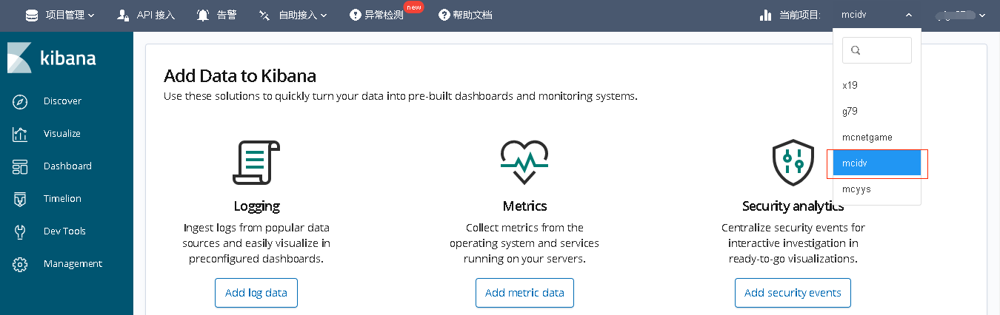
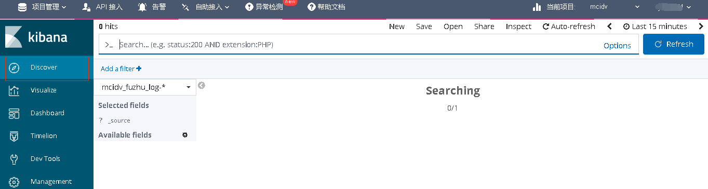
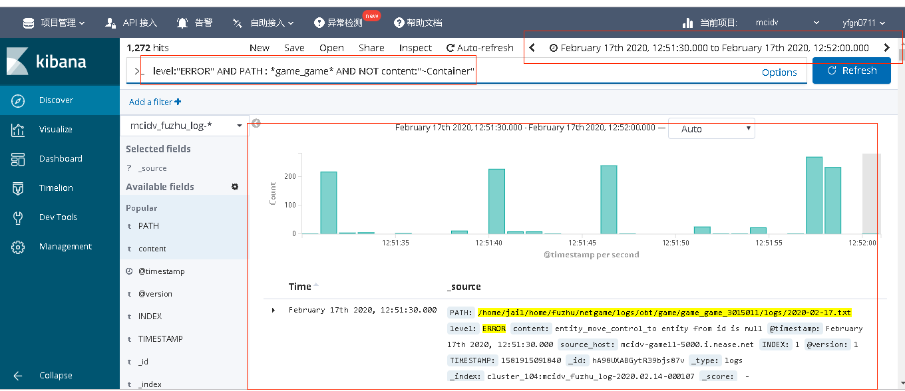
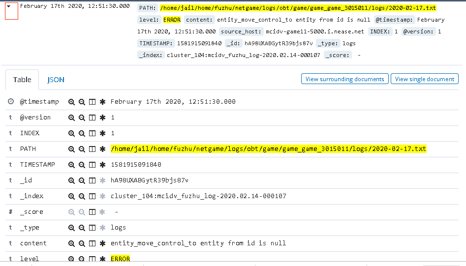
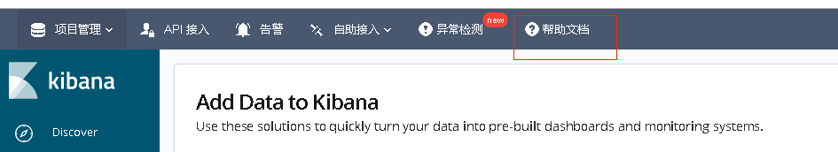

# 日志接入elk

## elk是什么？

- ELK 是简单、易用的日志分析、管理工具。
- 可以将proxy、lobby、game、service、master服务器打印的日志收集到elk，确保重新部署服务器也不会丢失日志。

## 如何接入elk？

- popo.netease.com下载popo客户端，并注册popo账号
- 把popo账号和项目名通知给我们，我们会协助接入elk。
- 通知接入成功后，点击http://elk.x.netease.com/kibana 进入elk。

## 使用elk
- 点击http://elk.x.netease.com/kibana ，使用popo账号进入elk，选择当前项目

- 点击"Discover"进入日志搜索界面

- 搜索内容。一个实例如下：

实例图说明如下：

（1） 图中最上面红框表示日志搜索时间段，可以点击设定；

（2）中间红框表示搜索条件，可以用AND连接多个搜索条件。实例表示搜索game的错误日志，日志不包括“~Container”；

（3）最下面红框表示查询结果。柱状图显示日志分布，柱状图下面表示日志具体内容；

点击查询某条日志左边三角图标，可以查看日志详细信息：

图中level、content表示日志的字段，开发者就是用这些字段写搜索条件。

- 点击“帮助文档”查看elk的详细使用说明

