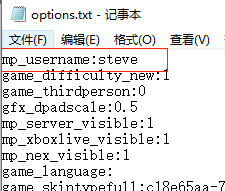
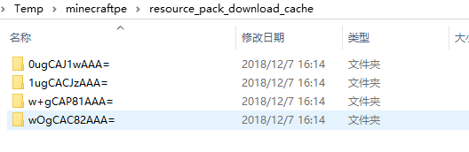

# 实用技巧

## 修改角色名

启动一次Mod PC开发包，会生成配置文件options.txt，配置文件路径如下：

%appdata%\MinecraftPE_Netease\minecraftpe\options.txt.

通过设置mp_username即可**指定角色名**，如下图所示

   

注意这个文件修改后**必须保存为utf8格式**，否则可能因为格式问题无法读取配置而被重置为默认配置昵称steve

如果要多开测试，并且不需要指定角色名，则在

%appdata%\MinecraftPE_Netease\minecraftpe\目录下创建一个空的random_name.txt

则每次打开客户端都会**随机一个用户名**进入游戏

## 清除本地客户端缓存

**原因：**测试阶段由于会不断调整mod代码、资源等，但不会每次都更新其pack_manifest.json里的版本号，因此你可能需要清除本地缓存以便客户端下载到最新的mod执行。

**方法：**执行bat目录下的**clearMod.bat**即可

**说明：**

pc版测试客户端的Mod缓存目录包括下面这两个

%appdata%\MinecraftPE_Netease\games\com.netease

%localappdata%\Temp\minecraftpe\

如下图所示是下载mod的cache目录

