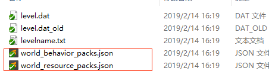
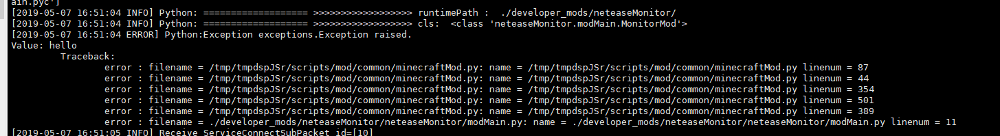

# 常见问题

## 无法登陆

## Mod不生效

### 进入游戏没有下载mod过程

- 确认本地没有该Mod的缓存，可以尝试**清除本地缓存**

- 检查存档目录下的json配置正确，必须配置了正确的Mod的uuid

  

- 检查mod目录格式，如果不符合格式，请调整后重新部署

### 有下载Mod但不生效

- 检查服务器日志，看有没有异常Traceback，如果有，则修正异常后**重新部署**

