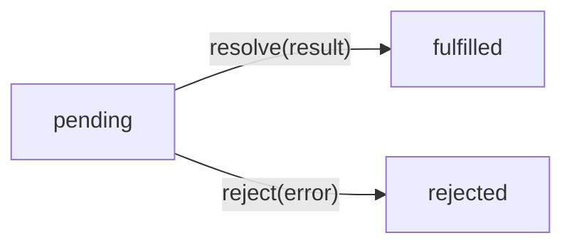
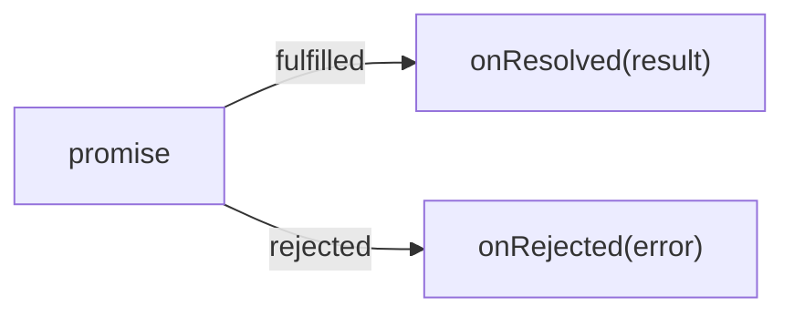
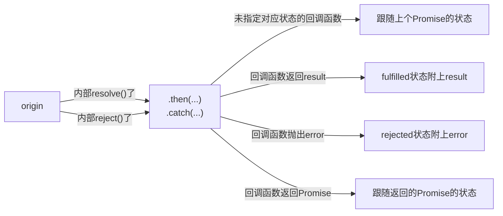
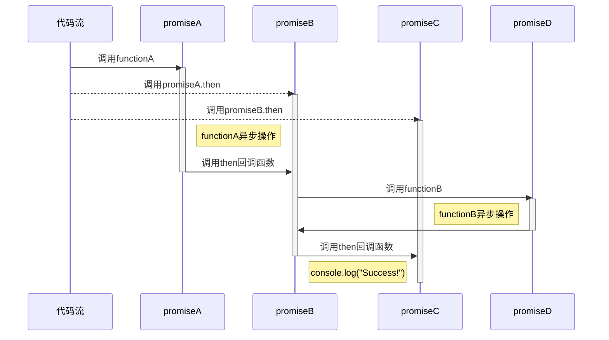

# 小白也能理解的同步与异步，回调函数、Promise与async/await，还有Generator

**前置知识：JavaScript基础知识**

## 同步执行和异步回调

首先先讲一下同步和异步。简单的来说，**同步就是可以立即返回，异步就是不能立即返回。**

例如这段代码：

```js
const a = functionA();
// do something with a
functionB(function callback(b) {
    // do something with b
});
```

`a`可以被`functionA`立即返回，时间顺序可以这样表示：

<more/>

1. 主线程执行`functionA`。
2. `functionA`立即返回值。
3. 主线程将返回值存入`a`。
4. 主线程对`a`进行一些操作。

而有些情况下函数是不能立即返回的，例如提示用户、请求网络等。如果卡在那里什么都不做，不仅是对CPU资源的极大浪费，而且会影响用户的使用体验（试想一下你点了上传文件然后什么都做不了直到上传完成才能操作的情况）。于是就有了回调函数这种操作。

以上面为例，`b`不能被`functionB`立即返回，而是通过回调函数`callback`“异步”地返回。

1. 主线程执行`functionB`。
2. `functionB`进行一些操作（无法立即返回）。
3. `functionB`结束操作后调用`callback`回调函数。
4. 回调函数中对回调函数的参数`b`进行一些操作。

为方便讨论，将`functionA`这类可以立即返回的函数称作**同步函数**，`functionB`这类不能立即返回的函数称作**异步函数**。**回调函数**是异步函数实现最方便的返回方式。

## 异步是会传染的

调用一个函数会造成一些**影响**，例如返回一个值，或是改变某些变量。同步函数造成的影响总是同步的。异步函数造成的影响可能是同步的，也可能是异步的。**异步的影响只能传递给异步执行的代码。**

一个显而易见的例子是，让同步执行的代码收到异步执行的返回值是不现实的。

```js
function a(event) {
    asyncFunc(function() {
        event.cancel = true;
    });
}

const event = { cancel: false };
a(event);
console.log(event.cancel); // false
```

为了让`asyncFunc`回调函数的影响能够传递，就需要将整个函数写成异步函数的形式。

```js
function a(event, callback) {
    asyncFunc(function() {
        event.cancel = true;
        callback();
    });
}

const event = { cancel: false };
a(event, function() {
    console.log(event.cancel); // true
});
```

最终，一个异步函数的出现往往会让多个函数变成异步函数。因此在使用异步函数前需要慎重考虑。

## 回调地狱

回调函数的使用确实方便，但在连续使用的场景下会造成一个非常尴尬的情况：

```js
functionA(function() {
    functionB(function() {
        functionC(function() {
            functionD(function() {
                functionE(function() {
                    // F, G, H ......
                })
            })
        })
    })
})
```

明明是线性的执行顺序，却使用了层叠结构的代码，而且使用的数量越多，叠的层也越多。这就是所谓的“回调地狱”。

## Promise的链式调用

为了解决这一问题，`Promise`应运而生。

`Promise`提供了一个链式调用的写法，如下：

```js
functionA()
    .then(function() {
        return functionB();
    }).then(function() {
        return functionC();
    }).then(function() {
        return functionD();
    }).then(function() {
        return functionE();
    })
    .then(/* F, G, H ... */);
```

或者用箭头函数写起来更简洁：

```js
functionA()
    .then(() => functionB())
    .then(() => functionC())
    .then(() => functionD())
    .then(() => functionE())
    .then(/* F, G, H ... */);
```

如果想知道更多可参见下文：[Promise为什么能做到这个](#promise为什么能实现链式调用)

## promise.then的替代品

虽然`Promise`的链式用法方便了很多，但本质上还是回调。因此在变量传递、判断结构、顺序结构等方面还是不够方便。于是`async`/`await`语法糖出现了。

考虑一下这一段代码：

```js
funcA()
    .then((a) => funcB(a).then((b) => [a, b]))
    .then(([a, b]) => funcC(a).then((c) => [a, b, c]))
    .then(([a, b, c]) => funcD(a, b, c));
```

只是为了传递两个变量，写起来就如此麻烦。有没有什么办法能让麻烦的异步调用写起来和同步调用一样简单呢？

答案是有的。这就是`await`与async函数。

```js
async function main() {
    const a = await funcA();
    const b = await funcB(a);
    const c = await funcC(a);
    await funcD(a, b, c);
}
```

在async函数里，可以使用`await`运算符后接一个返回`Promise`的表达式。当函数执行到这个`await`表达式时，会“暂停”async函数的执行，让处理器去做别的工作，直到对应的`Promise`表达式的`then`回调函数被调用，才恢复async函数的执行。async函数最终会返回一个`Promise`。**async函数是在`await`表达式处异步执行的异步函数。**

值得注意的是，async函数即使里面没有使用`await`，它也是异步返回的。所以当你开始使用async函数之后，你就需要考虑一下异步的传染性了。

## Promise为什么能实现链式调用？

`Promise`作为桥梁，连接了异步操作的内部和外部。

`Promise`拥有三个状态：`pending`（你先别急，我还在跑）、`fulfilled`（跑完了）、`rejected`（出事了）。其中`fulfilled`与`rejected`统称为`settled`（有结果了）。

在异步操作内部，`Promise`提供了两个操作用于切换状态：`resolve`（报告，跑完了）、`reject`（报告，出事了）。

```js
const returnPromise = new Promise((resolve, reject) => {
    // do something
    resolve();
});
```

顾名思义，`resolve`会把`pending`状态的`Promise`转换成`fulfilled`状态，而`reject`会把`pending`状态的`Promise`转换成`rejected`状态。在切换状态时可以附上跑完的结果或者错误。



而在异步操作外部，`Promise`提供了两个方法`promise.then(onResolved)`与`promise.catch(onRejected)`，允许在状态切换时调用指定的回调函数。

其中`onResolved`会在状态切换到`fulfilled`时触发，`onRejected`会在状态切换到`rejected`时触发。



有趣的是，`then`与`catch`方法会返回一个新的`Promise`。简单的来说，新的`Promise`会继承上个`Promise`的状态、回调函数的返回状态，或回调函数返回的`Promise`的状态中的一个。



例如如下代码：

```js
const promiseA = functionA();
const promiseB = promiseA.then(() => /* promiseD */ functionB());
const promiseC = promiseB.then(() => console.log("Success!"));
```

`functionA`被调用后会**立即**返回一个`Promise`。当`functionA`执行完了操作，就对之前返回的`Promise`执行`resolve`操作，使得`promiseA`变为`fulfilled`状态。状态变更像**链式反应**一样触发了`then`里面的回调函数，这个回调函数又调用了`functionB`并返回了一个新的`Promise`。等到新的`Promise`状态变为`fulfilled`时，`promiseB`的状态也跟随变为`fulfilled`。这个状态变更又触发了`then`里的回调函数……



## Generator函数与async函数的联系

Generator函数曾经是async函数的替代。

这是因为Generator函数允许使用`yield`来暂停函数的执行，同时还可以传入和返回值。

```js
function* gen() {
    const x = yield 1;
    const y = yield 2;
    return [x, y];
}

const iter = gen();
console.log(iter.next()); // { value: 1, done: false }
console.log(iter.next(100)); // { value: 2, done: false }
console.log(iter.next(200)); // { value: [ 100, 200 ], done: true }
```

这时只需选择一个合适的函数套在Generator的外层，就可以让`yield`实现类似`await`的功能。

```js
function* gen() {
    const a = yield funcA();
    const b = yield funcB(a);
    const c = yield funcC(a);
    yield funcD(a, b, c);
}

function wrap(iter) {
    const callback = (result) => {
        if (result.done) {
            return result.value;
        } else {
            return Promise.resolve(result.value)
                .then((v) => iter.next(v), (err) => iter.throw(err))
                .then(callback);
        }
    };
    return Promise.resolve().then(() => callback(iter.next()));
}

wrap(gen());
```