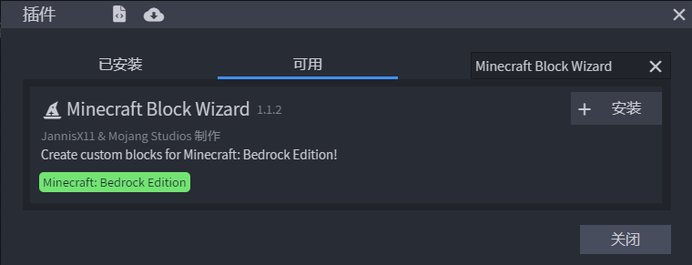
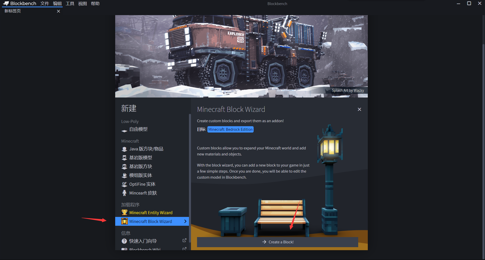
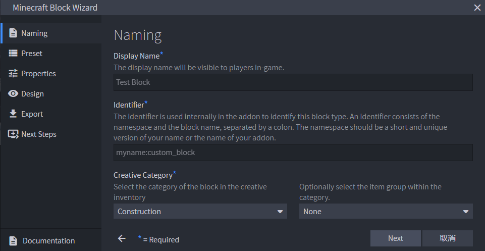
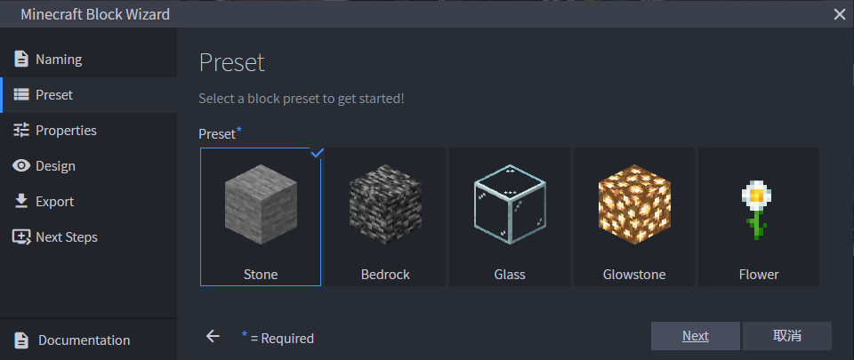
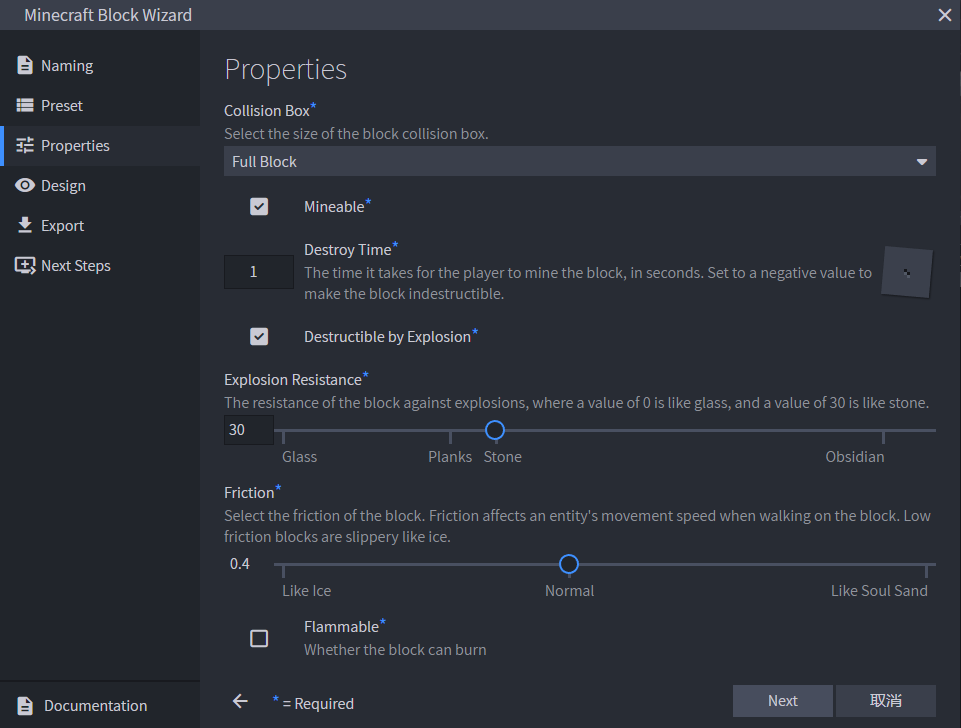
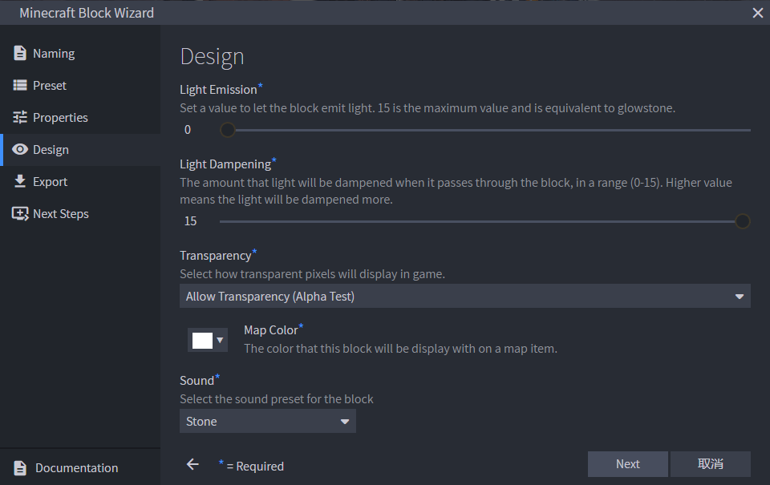
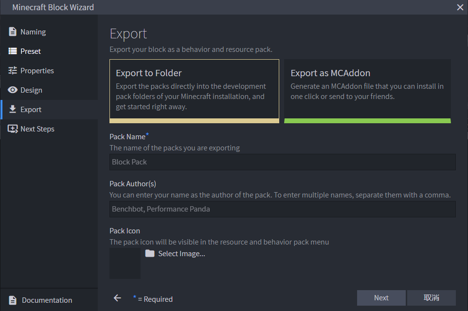
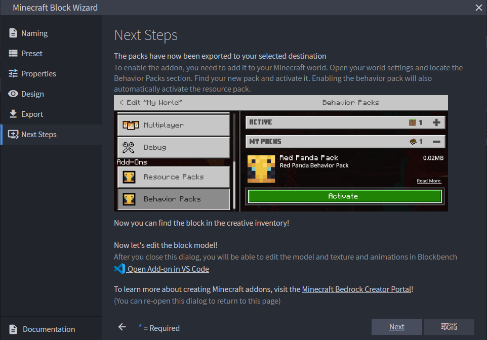

# 方块向导

**Minecraft Block Wizard**（**《我的世界》方块向导**）是Blockbench中的一个官方插件，能够通过分步骤的向导流程，帮助创作者快速生成一个可直接加载的基岩版自定义方块附加包，无需手动编写每个文件。

## 安装插件

在Blockbench中打开菜单**文件 → 插件…**，在插件列表中搜索"Minecraft Block Wizard"并点击安装。安装完成后，主界面的新建列表中会出现"Minecraft Block Wizard"入口。

/// figure-caption
在插件管理界面中找到Minecraft Block Wizard并安装。
///

/// figure-caption
安装成功后，主界面会显示Minecraft Block Wizard入口。
///

## 创建方块

### 1. 打开向导

在主界面点击Minecraft Block Wizard，进入向导对话框。

/// figure-caption
方块向导的欢迎界面。
///

### 2. 命名

**Naming**（命名）标签页中填写方块的基本信息：

/// figure-caption
填写方块的显示名称、标识符和创造栏分类。
///

/// define
**Display Name**（显示名称）

- 方块在游戏中显示的名称。

**Identifier**（标识符）

- 方块的赋命名空间标识符，格式为`命名空间:方块名`，例如`demo:my_block`。

**Creative Category**（创造栏分类）

- 方块在创造模式物品栏中所属的分类，例如`construction`（建筑）、`nature`（自然）等。

///

### 3. 预设

**Preset**（预设）标签页中选择方块的外观预设：

/// figure-caption
从预设中选择一种初始外观。
///

向导提供了多种常见方块形状的预设，例如完整方块、阶梯、台阶、栅栏等。选择最接近目标的预设可以省去大量手动建模的工作。

### 4. 属性

**Properties**（属性）标签页中配置方块的物理属性：

/// figure-caption
配置方块的碰撞箱、破坏属性等。
///

/// define
**Collision Box**（碰撞箱）

- 开启或关闭方块的碰撞体积。关闭后，实体可以穿过该方块。

**Mineable**（可开采）

- 方块是否能被工具开采。

**Destroy Time**（摧毁时间）

- 徒手开采该方块所需的基础时间（秒）。数值越大，方块越难被破坏。

**Explosion Resistance**（爆炸抗性）

- 方块抵抗爆炸的能力，数值越大越不易被炸毁。

**Friction**（摩擦力）

- 实体在该方块表面行走时受到的摩擦力大小。默认值0.4接近泥土，0.0则类似冰面。

**Flammable**（可燃）

- 方块是否能被点燃并传播火焰。

///

### 5. 设计

**Design**（设计）标签页中配置方块的视觉与光照属性：

/// figure-caption
配置方块的发光、光线衰减、地图颜色等视觉属性。
///

/// define
**Light Emission**（发光量）

- 方块的发光等级，0–15，0为不发光，15为最亮（与萤石相当）。

**Light Dampening**（光线衰减）

- 光线穿过该方块时的衰减量，0–15。普通不透明方块通常为15，玻璃类通常为0。

**Map Color**（地图颜色）

- 方块在地图上显示的颜色，使用十六进制颜色值，例如`#7f5a20`。

**Sound**（音效）

- 方块被踩踏、破坏、放置时播放的音效类型，例如`stone`、`wood`、`grass`等。

///

### 6. 导出

**Export**（导出）标签页中选择导出方式：

/// figure-caption
选择导出目标。
///

/// define
**Export to Folder**（导出至文件夹）

- 直接将附加包导出至Minecraft安装目录下的`development_behavior_packs`和`development_resource_packs`文件夹，可以立即在游戏中测试。

**Export as MCAddon**（导出为MCAddon）

- 打包为一个`.mcaddon`文件，可以双击导入Minecraft。

///

/// figure-caption
导出完成后，可以选择继续在Blockbench中编辑模型纹理，或打开文件夹进一步修改JSON文件。
///

导出完成后，你即可在游戏中找到新方块。如果需要添加更多方块置换、自定义音效或特殊碰撞形状，可参考[自定义方块](../../data-driven/blocks/)系列教程进一步完善。
