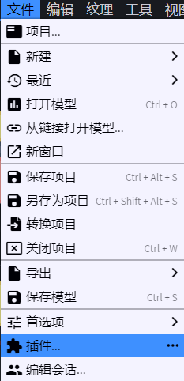
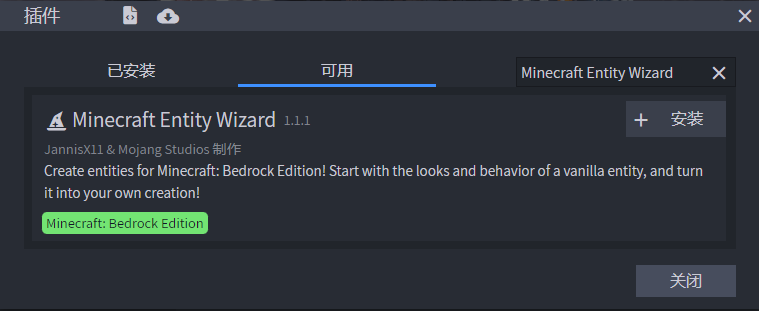
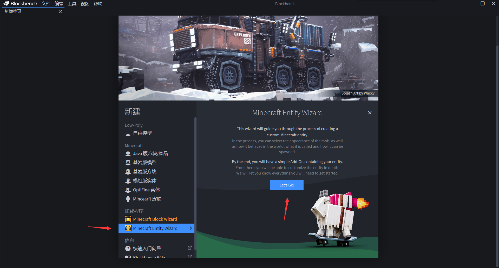
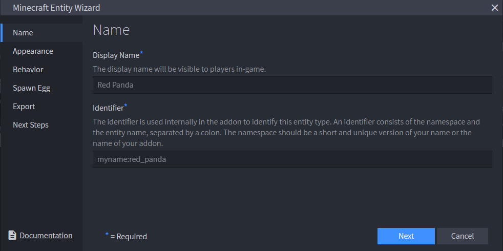
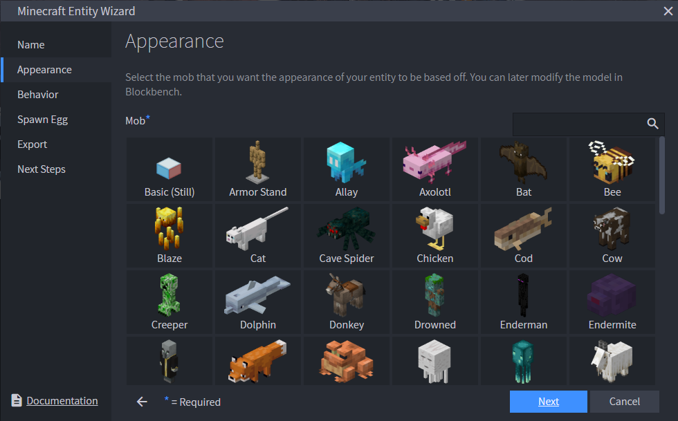
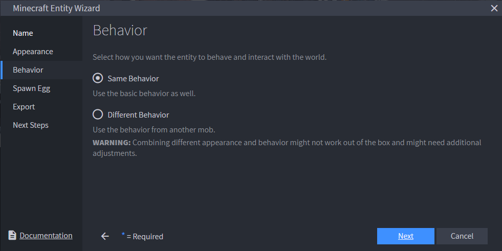
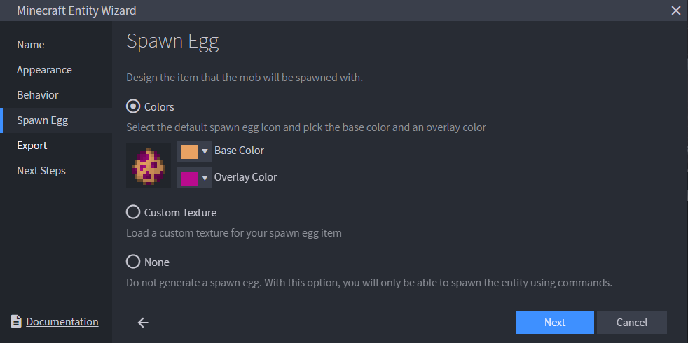
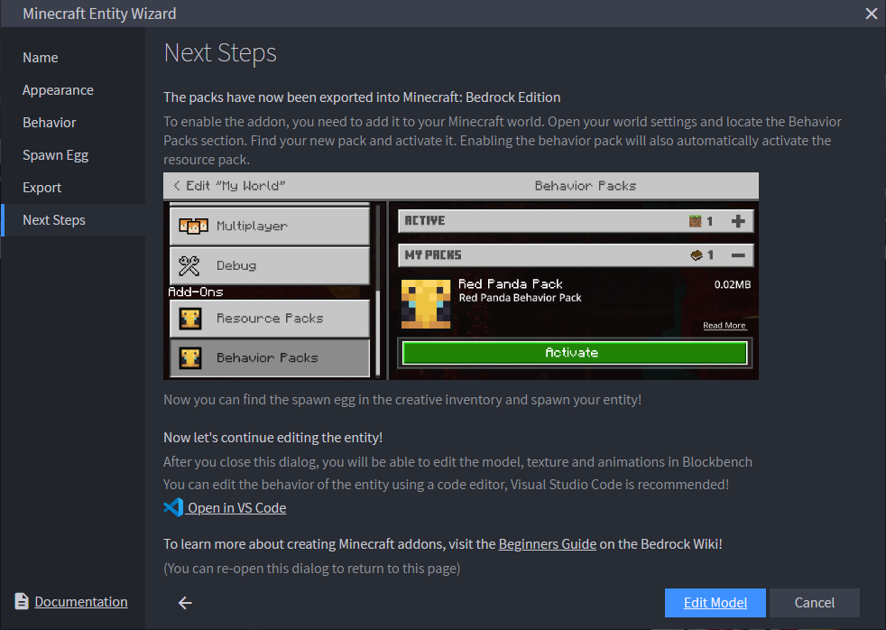

# 实体向导

**Minecraft Entity Wizard**（**《我的世界》实体向导**）是Blockbench中的一个官方插件，能够通过分步骤的向导流程，帮助创作者快速生成一个可直接加载的基岩版自定义实体附加包，无需从零手写每个文件。

## 安装插件

在Blockbench中打开菜单**文件 → 插件…**，在插件列表中搜索"Minecraft Entity Wizard"并点击安装。安装完成后，主界面的新建列表中会出现"Minecraft Entity Wizard"入口。

/// figure-caption
在插件管理界面中找到Minecraft Entity Wizard并安装。
///

/// figure-caption
安装成功后，主界面会显示Minecraft Entity Wizard入口。
///

## 创建实体

### 1. 打开向导

在主界面点击Minecraft Entity Wizard，再点击**Let's Go!**（开始吧！）按钮，进入向导对话框。

/// figure-caption
点击"Let's Go!"启动实体向导。
///

### 2. 命名

**Name**（命名）标签页中填写实体的基本信息：

/// figure-caption
填写实体的显示名称与标识符。
///

/// define
**Display Name**（显示名称）

- 实体在游戏中显示的名称。默认对应`en_US`语言，即英文名称。

**Identifier**（标识符）

- 实体的赋命名空间标识符，格式为`命名空间:实体名`，例如`demo:my_entity`。

///

### 3. 外观

**Appearance**（外观）标签页中选择外观预设：

/// figure-caption
选择一种预设作为外观基础。
///

- **Mob**（生物）：从预设列表中选择一种现有生物作为外观基础，向导会以该生物的模型和纹理为模板生成初始资源。

### 4. 行为

**Behavior**（行为）标签页中选择行为预设：

/// figure-caption
选择行为时，可以与外观使用相同预设，也可以单独指定。
///

- **Same Behavior**（相同的行为）：行为预设与外观预设相同。
- **Different Behavior**（不同的行为）：单独为行为选择一种预设，适合"长得像A，但行为像B"的场景。

### 5. 刷怪蛋

**Spawn Egg**（刷怪蛋）标签页中定制刷怪蛋外观：

/// figure-caption
可以通过颜色、自定义纹理或无图标三种方式定义刷怪蛋。
///

有三种图标方案可选：

/// define
**Colors**（颜色）

- 用颜色定义刷怪蛋图标。**Base Color**（基色）是底色，**Overlay Color**（覆盖色）是斑点颜色。

**Custom Texture**（自定义纹理）

- 上传一张PNG图片作为刷怪蛋自定义纹理。

**None**（无）

- 不显示刷怪蛋图标。

///

### 6. 导出

**Export**（导出）标签页中选择导出方式并完成导出：

/// figure-caption
选择导出位置和包名。
///

/// define
**Export to Folder**（导出至文件夹）

- 直接将附加包导出至Minecraft安装目录中的`development_behavior_packs`和`development_resource_packs`文件夹，可以立即在游戏中测试。

**Integrate into Pack**（集成至包）

- 将生成的文件合并到一个已有的附加包项目中。

**Export as MCAddon**（导出为MCAddon）

- 打包为一个`.mcaddon`文件，可以双击导入Minecraft。

///

还可以在导出前填写以下信息：

/// define
**Pack Name**（包名称）

- 导出的附加包名称。

**Pack Author(s)**（包作者）

- 包的作者，多个作者以英文逗号分隔。

**Pack Icon**（包图标）

- 导出的附加包图标，建议选择一张方形PNG图片。

///

### 7. 后续编辑

导出完成后，向导会提示在Blockbench中继续编辑模型，或通过Visual Studio Code打开包文件夹进行进一步调整。

/// figure-caption
导出完成后，选择在Blockbench中继续编辑还是直接去编辑文件。
///

此时生成的包已经包含了最基本的行为包服务端定义文件、资源包客户端实体文件、几何体、纹理和本地化文件，你可以在此基础上按[自定义实体教程](../../data-driven/entities/adding-custom-entities.md)继续完善组件和外观。
