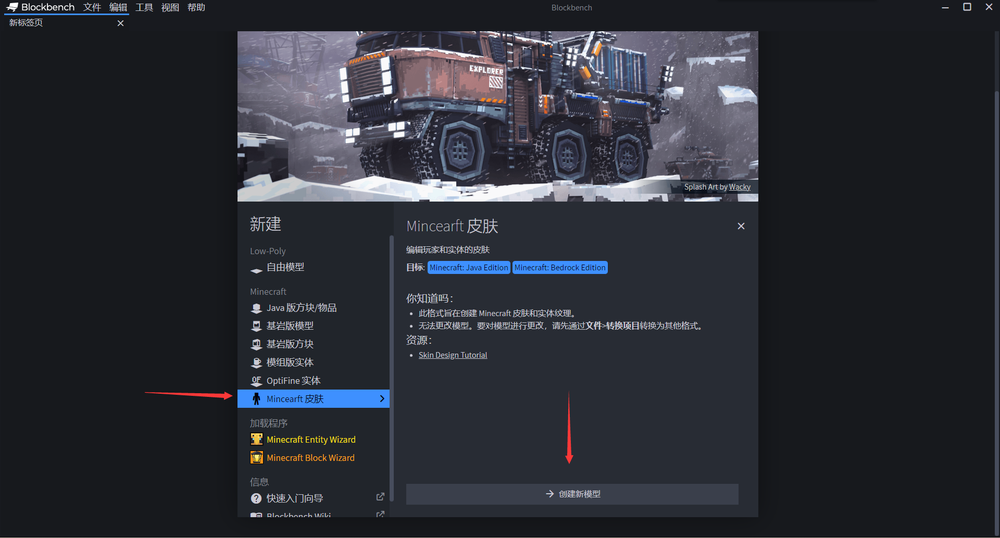
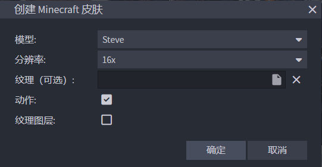
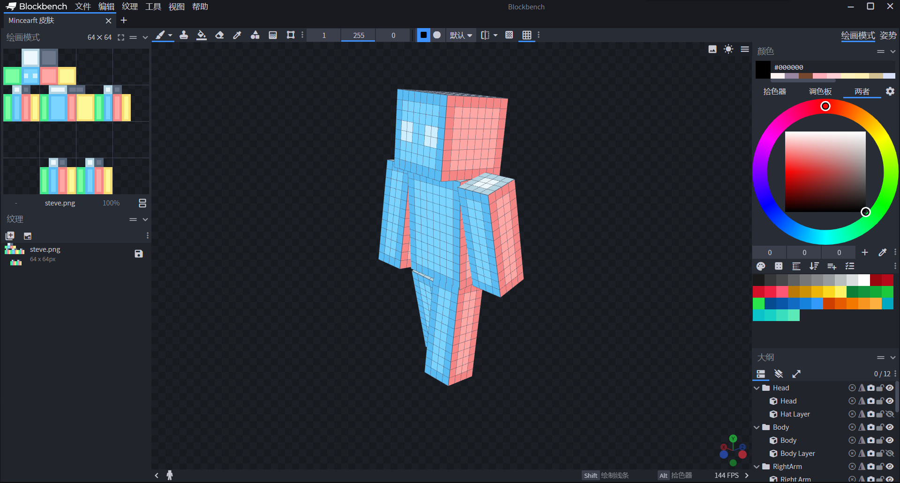
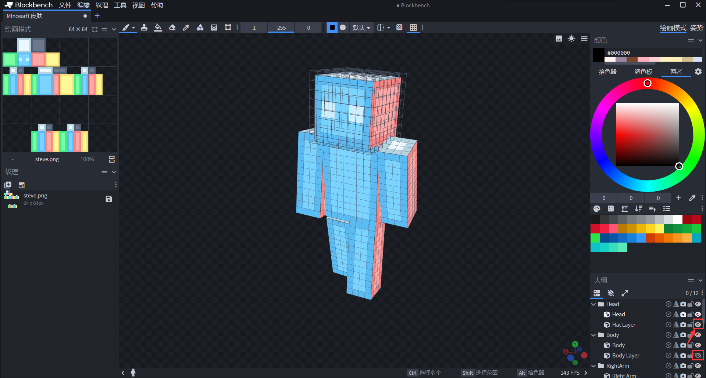
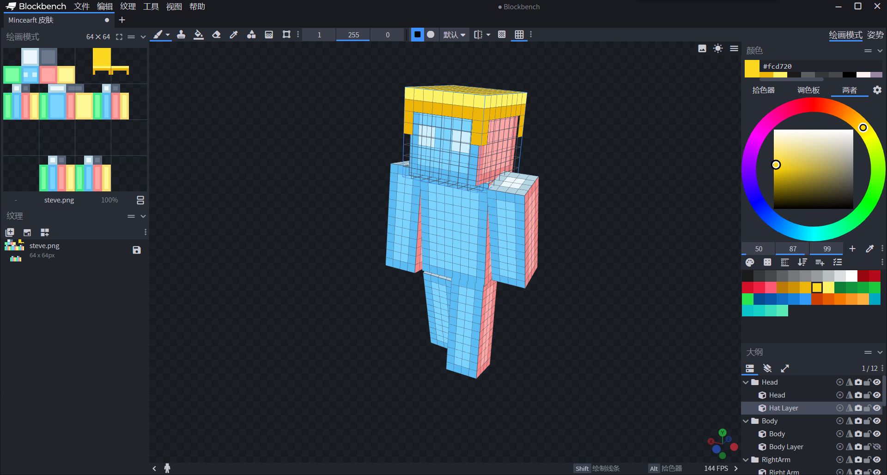

# 绘制皮肤

Blockbench不仅是一款制作实体模型的工具，也可以用来绘制Minecraft皮肤。Blockbench的皮肤项目会把人物躯体拆分成可独立绘制的骨骼区域，让你在三维视图中直接看到上色效果，省去了在平铺纹理上反复对照坐标的麻烦。

## 创建皮肤项目

打开Blockbench，在主界面"新建"区域找到皮肤（Skin）入口，点击即可开始。

/// figure-caption
Blockbench主界面，皮肤入口位于新建列表中。
///

点击后，在弹出的对话框中选择模型类型：

- 希望绘制史蒂夫体型的皮肤，保持默认的**Steve**选项不变；
- 希望绘制艾利克斯体型的皮肤，在"Model"下拉菜单中选择**Alex**。

/// figure-caption
新建皮肤时选择史蒂夫或艾利克斯体型。
///

选好后点击"确定"，即可进入皮肤编辑状态。

/// figure-caption
新建皮肤项目后的默认外观。
///

## 绘制皮肤

进入皮肤项目时，Blockbench会自动切换到**绘画模式**。在右侧拾色器或调色板中选择颜色，再将鼠标移至三维模型上的任意位置，按住鼠标左键即可上色。也可以在左侧的UV面板上直接在展开的纹理上绘制。

## 绘制盔甲层

Minecraft皮肤由内层（主体）和外层（盔甲层/帽子层）两张叠加的纹理组成。外层默认在视图中隐藏。要绘制外层，找到右下角骨骼列表：

/// figure-caption
骨骼列表中，名称含有"Layer"的骨骼对应盔甲层。
///

点击名称含有`Layer`的骨骼旁的眼睛图标，使其可见，即可看到对应的外层区域，然后像绘制内层一样在上面上色。

/// figure-caption
打开头盔层可见性后，可以在外层单独绘制帽子等装饰。
///

## 保存皮肤

绘制完成后，在左侧"纹理"面板中找到皮肤纹理，点击软盘状的"保存"按钮，选择路径保存为PNG文件。导出的PNG文件即可直接放入皮肤包中作为皮肤纹理文件使用，详见[制作皮肤包](../../creating-skin-packs.md)。

/// tip | 直接保存至皮肤包目录
如果已经有一个皮肤包项目文件夹，建议在首次保存时直接把PNG保存到皮肤包根目录，这样修改后也只需在Blockbench中点击保存，不用反复复制文件。
///
