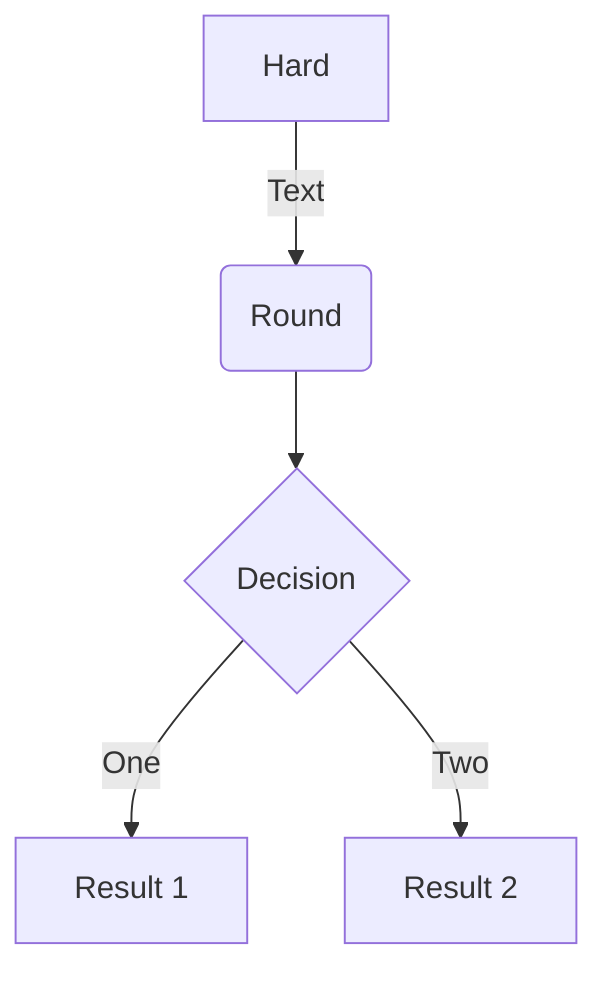
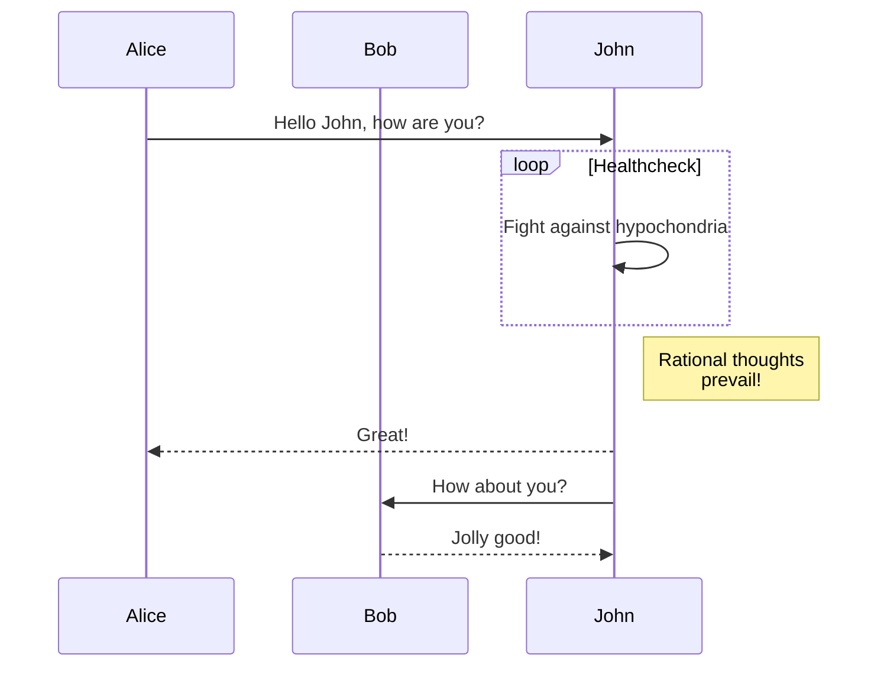
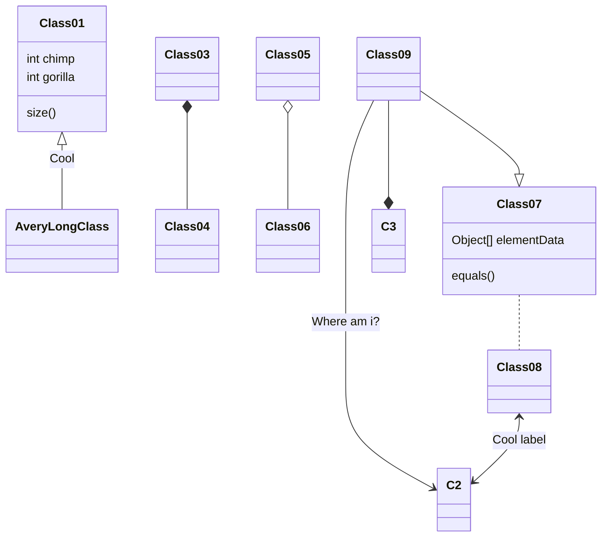
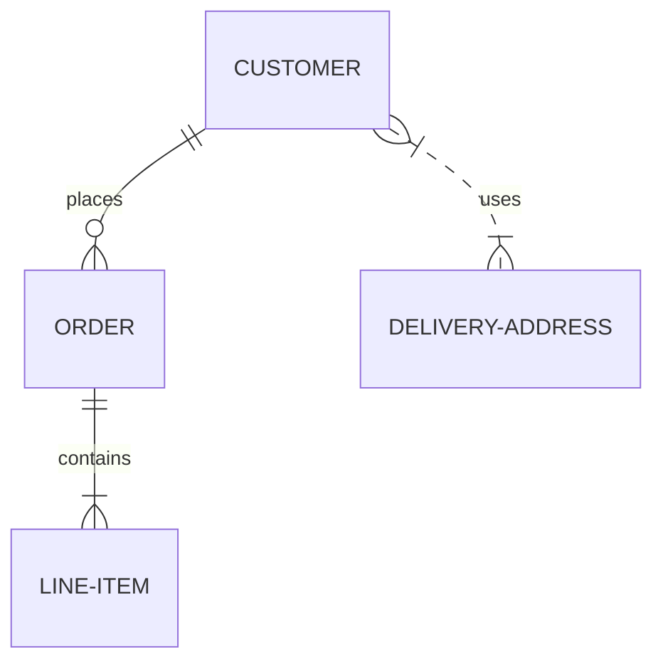
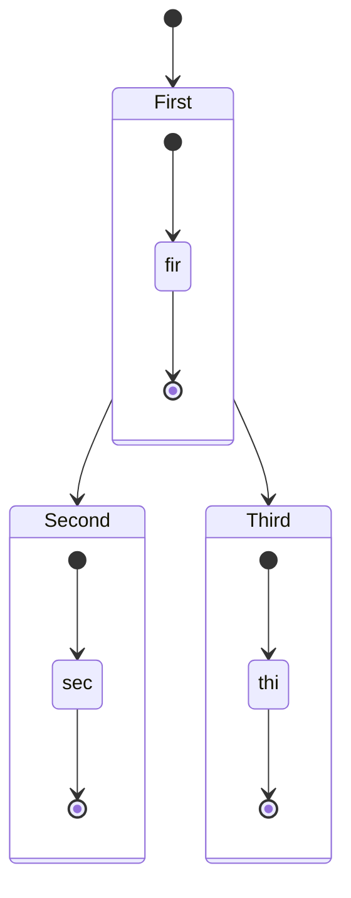
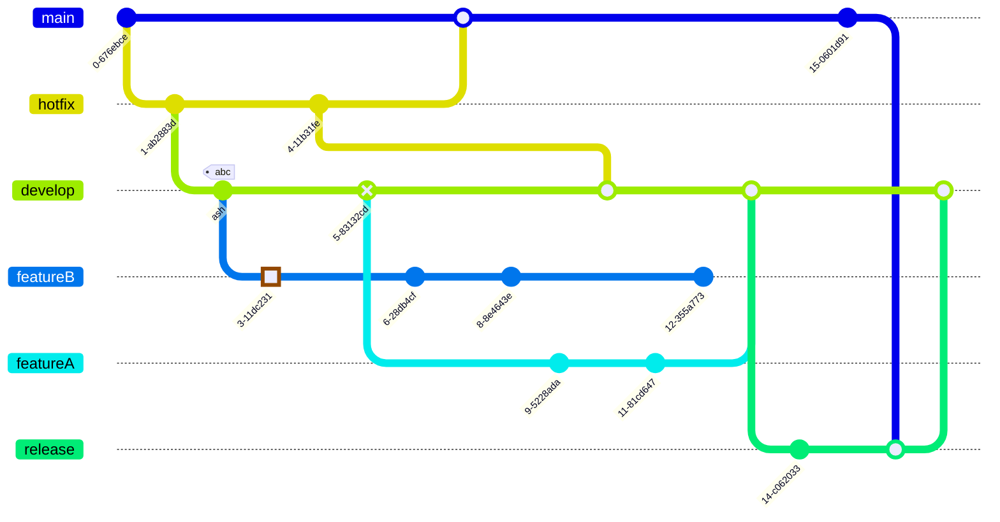
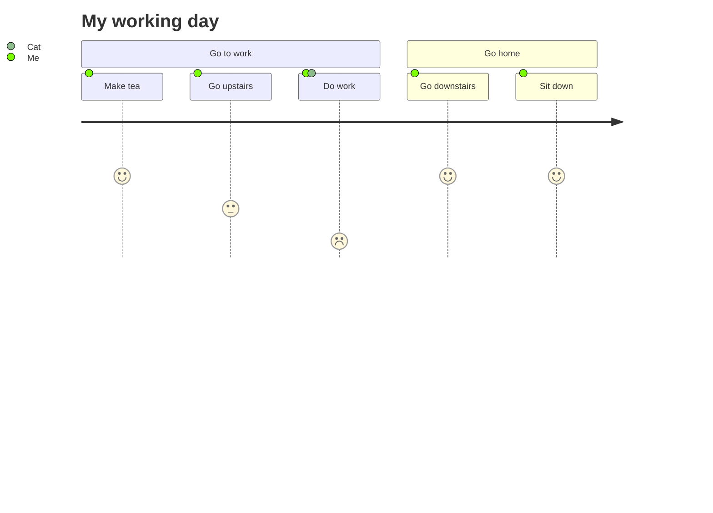
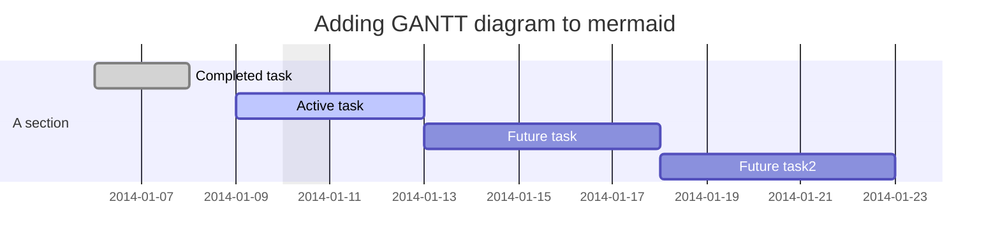
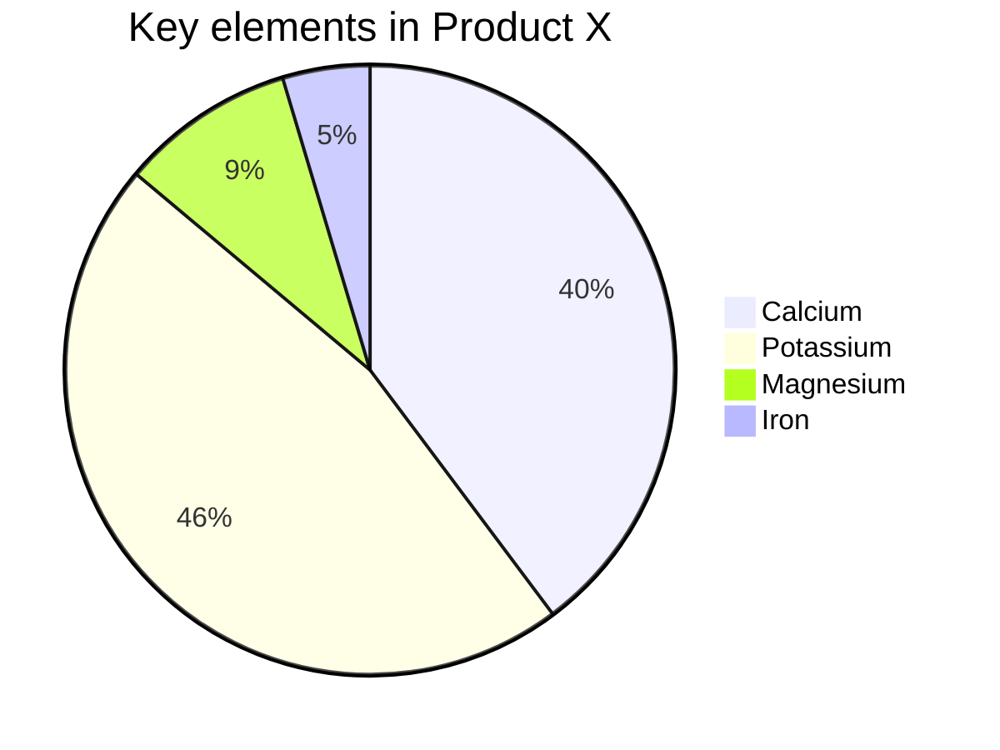

# 如何贡献

欢迎贡献基岩文档。我们非常感谢您的帮助，无论是提交错误报告、修复错误、改进文档或提供新的内容。在作出贡献之前，请阅读以下指南。

## 构建与编辑文档

本网站文档使用[Material for MkDocs](https://squidfunk.github.io/)软件提供支持。要在本地构建和编辑文档，您需要安装以下软件：

- [Python](https://www.python.org/downloads/)
- [GTK](https://www.gtk.org/)
- [MkDocs](https://www.mkdocs.org/)
- [Material for MkDocs](https://squidfunk.github.io/mkdocs-material/)

在一切开始之前，请务必保证自身设备中安装有`cairo`库和`libcairo-2`库。要做到这一点，只需要安装GTK；如果您在使用Windows系统，请至<!-- md:samp @tschoonj/GTK-for-Windows-Runtime-Environment-Installer -->安装最新的GTK Windows安装程序。

在安装完成Python后，您可以在控制台中运行如下命令以安装依赖：

```shell
pip install mkdocs-material[recommended,git,imaging]
pip install mkdocs-rss-plugin
pip install mkdocs-git-revision-date-localized-plugin
pip install mkdocs-git-committers-plugin-2
pip install mkdocs-minify-plugin
pip install mkdocs-glightbox
```

这将安装MkDocs和Material for MkDocs以及其他必要的插件。然后，您可以在本项目的根目录于控制台中使用`python -m mkdocs serve --dirtyreload`命令，此命令会开启实时托管，此后即可在<!-- md:samp localhost:8000 -->实时看到做出的更改。

注意，如果发生错误，请将`tools`文件夹复制(1)到`docs`文件夹内再重新执行托管命令。
{ .annotate }

1.  注意：不是移动。

在第一次运行时，MkDocs会自动联网获取各文件的贡献者，可能会稍加缓慢，请耐心等待；之后再次运行时，只会重新获取已改动文件的贡献者，不会再耗费太多时间。

在完成编辑后，您可以提交并推送更改。GitHub Actions会自动构建并将文档推送至GitHub Pages。然后，您可以在[<!-- md:samp https://miemiemethod.github.io/bedrock-docs/ -->](https://miemiemethod.github.io/bedrock-docs/)查看更改后的效果。

## 文档语法

本文档使用Markdown语法编写。如果您不熟悉Markdown语法，可以参考[这篇文章](https://www.markdownguide.org/basic-syntax/)，或这篇[中文文章](https://markdown-zh.readthedocs.io/en/latest/)。此外，您还可以参考[Material for MkDocs的文档](https://squidfunk.github.io/mkdocs-material/reference/)以了解更多关于Material for MkDocs的独有语法，以及参考[PyMdown Extensions的文档](https://facelessuser.github.io/pymdown-extensions/)以了解更多关于PyMdown Extensions提供的额外语法。本站加载有所有PyMdown Extensions提供的扩展，请编者放心使用。

此外，此处也以中文语言重新记录了一些上述提供的额外语法：

### 一般内联语法

| 描述     | 语法                                                                   | 效果                                                          |
|--------|----------------------------------------------------------------------|-------------------------------------------------------------|
| 删除线    | `~~删除~~`                                                             | ~~删除~~                                                      |
| 下划线    | `^^插入^^`                                                             | ^^插入^^                                                      |
| 下标     | `~下标~`                                                               | ~下标~                                                        |
| 上标     | `^上标^`                                                               | ^上标^                                                        |
| 插入     | <code>{\++插入++}</code>                                               | {++插入++}                                                    |
| 移除     | <code>{\--移除-\-}</code>                                              | {--移除--}                                                    |
| 替换     | <code>{\~\~A\~>B~~}</code>                                           | {~~A~>B~~}                                                  |
| 文本高亮   | <code>{\==高亮==}</code><br/><code>\==高亮==</code>                      | {==高亮==}                                                    |
| 注释     | <code>{\>>注释<<}</code>                                               | {>>注释<<}                                                    |
| 代码高亮   | <code>\`#!js foo = 1 / 2;\`</code>                                   | `#!js foo = 1 / 2;`                                         |
| 快捷键    | `++ctrl+alt+delete++`                                                | ++ctrl+alt+delete++                                         |
| 进度条    | `[=85% "85%"]`                                                       | [=85% "85%"]                                                |
| Wiki链接 | `[|[方块]]`<br/>`[|[mcwzh:方块|]]`<br/>`[|[mcwzh:方块|Minecraft Wiki:方块]]` | [[方块]]<br/>[[mcwzh:方块|]]<br/>[[mcwzh:方块|Minecraft Wiki:方块]] |

值得注意的是，如果上下标中含有空格，空格需要转义，即使用<code>\\ </code>代替单纯的<code> </code>。快捷键语法中的各键位标识符详见[Keys扩展文档](https://facelessuser.github.io/pymdown-extensions/extensions/keys/#extendingmodifying-key-map-index)。进度条允许[注入](#注入特性)一些类使其变成糖衣色、动态糖衣色或窄进度条，具体详见[ProgressBar扩展文档](https://facelessuser.github.io/pymdown-extensions/extensions/progressbar/#overview)。

对于强调语法（斜体和加粗），我们区分了`*`、`**`与`_`、`__`的用法。`*`、`**`未开启智能语法；`_`、`__`开启了智能语法，具体的智能语法可以参考[BetterEm扩展文档](https://facelessuser.github.io/pymdown-extensions/extensions/betterem/)，但智能语法具有在中文中必须空格才能被正确解析的缺点。例如：

```markdown
能够*被正确强调*。

不能_被正确强调_。

能够 _被正确强调_。
```

/// html | div.result
能够*被正确强调*。

不能_被正确强调_。

能够 _被正确强调_。
///

### 注入特性

依赖于[Attribute Lists扩展](https://python-markdown.github.io/extensions/attr_list/)，本文档支持向HTML标签注入特性。在一个可能会被解析为HTML标签的语法结构之后使用语法`{:.class #id key=value key="spaced value"}`来注入特性，其中`.class`代表类，`#id`代表锚点ID，`key=value`代表键值对，`key="spaced value"`代表键值对中的值含有空格，每一种皆是可选的，其中类和键值对可以有任意多个。此外，`{: }`中的冒号可以省略，即`{.class #id key=value key="spaced value"}`也是合法的。例如给一个段落的`#!html <p>`标签注入：

```markdown
这是一个段落。
{:.data-class #custom-id key1=value key2="spaced value"}
```

/// html | div.result
//// tab | HTML
```html
<p class="data-class" id="custom-id" key1="value" key2="spaced value">这是一个段落。</p>
```
////
//// tab | 效果
这是一个段落。
{:.data-class #custom-id key1=value key2="spaced value"}
////
///

### 围栏

围栏语法即代码块语法，可以使用三个或三个以上的`~`或<code>\`</code>作为包装字面量。为了规范，我们要求在本站点贡献时，只可使用三个<code>\`</code>的包装语法。本站围栏使用[Pygments](https://pygments.org/)进行代码高亮，并通过[SuperFences扩展](https://facelessuser.github.io/pymdown-extensions/extensions/superfences/)进行了封装。您可以使用`title`、`linenums`、`hl_lines`三个参数来定制围栏。

`linenums`的第一个参数是起始行号，第二个参数是显示行号的步长，第三个参数是特殊行号的步长；如不指定该参数，则不显示行号。`hl_lines`代表高亮的行。可以用单个行号或用短横杠`-`表示从第几行至第几行，之间用空格隔开。

围栏也可以使用上述[注入](#注入特性)的方式指定参数，例如以下两种格式的输出是等价的：

/// tab | 常规
````markdown
```python title="示例" linenums="1 2 3" hl_lines="1-2 5 7-8"
import foo
import boo.baz
import foo.bar.baz

class Foo:
   def __init__(self):
       self.foo = None
       self.bar = None
       self.baz = None
```
````

//// html | div.result
```python title="示例" linenums="1 2 3" hl_lines="1-2 5 7-8"
import foo
import boo.baz
import foo.bar.baz

class Foo:
   def __init__(self):
       self.foo = None
       self.bar = None
       self.baz = None
```
////
///
/// tab | 注入
````markdown
```{.python title="示例" linenums="1 2 3" hl_lines="1-2 5 7-8"}
import foo
import boo.baz
import foo.bar.baz

class Foo:
   def __init__(self):
       self.foo = None
       self.bar = None
       self.baz = None
```
````

//// html | div.result
```{.python title="示例" linenums="1 2 3" hl_lines="1-2 5 7-8"}
import foo
import boo.baz
import foo.bar.baz

class Foo:
   def __init__(self):
       self.foo = None
       self.bar = None
       self.baz = None
```
////
///

关于更多的注入相关信息，可以参考[SuperFences扩展文档](https://facelessuser.github.io/pymdown-extensions/extensions/superfences/#injecting-classes-ids-and-attributes)。

### 内容块

内容块是一种特殊的块级元素，通过三个或三个以上的`/`包装。大致语法如下：

```markdown
/// name | argument
    options1: value
    options2: value
    ...
这是一个内容块，此处是正常Markdown内容。
///
```

内容块嵌套时，可以使用`///`和`////`等来表示不同级别的嵌套。往往越深的嵌套级别越多个`/`。

#### 警告块

警告块是一种特殊的内容块，用于强调一些需要注意的内容。最简单的语法如下：

```markdown
/// admonition | 标题
内容。
///
```

/// html | div.result
//// admonition | 标题
内容。
////
///

实际上，警告块有多种类型，可以通过`type`选项来指定。若没有指定，默认为`note`。此外，可以用类型标识符替换`admonition`实现快速给出该类型的警告块。例如。以下两种格式的输出是一致的：

/// tab | 常规
```markdown
/// admonition | 标题
    type: warning
内容。
///
```

//// html | div.result
///// admonition | 标题
    type: warning
内容。
/////
////
///
/// tab | 快捷
```markdown
/// warning | 标题
内容。
///
```

//// html | div.result
///// warning | 标题
内容。
/////
////
///

下面给出了本站所有可用的警告块类型：

/// tab | `new`
```markdown
/// new | 标题
内容。
///
```

//// html | div.result
///// new | 标题
内容。
/////
////
///
/// tab | `settings`
```markdown
/// settings | 标题
内容。
///
```

//// html | div.result
///// settings | 标题
内容。
/////
////
///
/// tab | `note`
```markdown
/// note | 标题
内容。
///
```

//// html | div.result
///// note | 标题
内容。
/////
////
///
/// tab | `abstract`
```markdown
/// abstract | 标题
内容。
///
```

//// html | div.result
///// abstract | 标题
内容。
/////
////
///
/// tab | `info`
```markdown
/// info | 标题
内容。
///
```

//// html | div.result
///// info | 标题
内容。
/////
////
///
/// tab | `tip`
```markdown
/// tip | 标题
内容。
///
```

//// html | div.result
///// tip | 标题
内容。
/////
////
///
/// tab | `success`
```markdown
/// success | 标题
内容。
///
```

//// html | div.result
///// success | 标题
内容。
/////
////
///
/// tab | `question`
```markdown
/// question | 标题
内容。
///
```

//// html | div.result
///// question | 标题
内容。
/////
////
///
/// tab | `warning`
```markdown
/// warning | 标题
内容。
///
```

//// html | div.result
///// warning | 标题
内容。
/////
////
///
/// tab | `failure`
```markdown
/// failure | 标题
内容。
///
```

//// html | div.result
///// failure | 标题
内容。
/////
////
///
/// tab | `danger`
```markdown
/// danger | 标题
内容。
///
```

//// html | div.result
///// danger | 标题
内容。
/////
////
///
/// tab | `bug`
```markdown
/// bug | 标题
内容。
///
```

//// html | div.result
///// bug | 标题
内容。
/////
////
///
/// tab | `example`
```markdown
/// example | 标题
内容。
///
```

//// html | div.result
///// example | 标题
内容。
/////
////
///
/// tab | `quote`
```markdown
/// quote | 标题
内容。
///
```

//// html | div.result
///// quote | 标题
内容。
/////
////
///

此外，您可以使用`attrs`选项来更改类、ID和其他特性。更多的功能可以参考[Admonition扩展文档](https://facelessuser.github.io/pymdown-extensions/extensions/blocks/plugins/admonition/)。

将`admonition`替换为`details`可以将警告块转换为详情块。详情块是一种特殊的警告块，用于隐藏一些内容。例如：

/// tab | 常规
```markdown
/// details | 标题
    type: warning
内容。
///
```

//// html | div.result
///// details | 标题
      type: warning
内容。
/////
////
///
/// tab | 快捷
```markdown
/// details-warning | 标题
内容。
///
```

//// html | div.result
///// details-warning | 标题
内容。
/////
////
///

#### HTML块


#### 定义列表

#### 标签组

### 注解

注解通过注入`annotate`类，紧跟着给出一个有序列表来实现。例如，在段落中使用注解：

```markdown
这是一个段落(1)。
{.annotate}

1.  这是一个注解。
```

/// html | div.result
这是一个段落(1)。
{.annotate}

1.  这是一个注解。
///

注解可以在任何支持注入的地方使用。例如，在围栏中使用注解：

/// tab | 常规
````markdown
```{.python .annotate}
print("Hello, World!") # 这是一个注释。(1)
```

1.  这是一个注解。
````

//// html | div.result
```{.python .annotate}
print("Hello, World!") # 这是一个注释。(1)
```

1.  这是一个注解。
////
///
/// tab | 隐藏注释
````markdown
```{.python .annotate}
print("Hello, World!") # 这是一个注释。(1)!
```

1.  这是一个注解。
````

//// html | div.result
```{.python .annotate}
print("Hello, World!") # 这是一个注释。(1)!
```

1.  这是一个注解。
////
///

有些地方虽然不支持注入语法，但是支持自定义类，因此也可以使用注解。例如，在内容块中使用注解：

/// tab | 警告块
```markdown
/// note | 注
    attrs: { class: annotate }
这是一个内容块(1)。
///

1.  这是一个注解。
```

//// html | div.result
///// note | 注
      attrs: { class: annotate }
这是一个内容块(1)。
/////

1.  这是一个注解。
////
///
/// tab | HTML块
```markdown
/// html | div.annotate
这是一个内容块(1)。
///

1.  这是一个注解。
```

//// html | div.result
///// html | div.annotate
这是一个内容块(1)。
/////

1.  这是一个注解。
////
///
/// tab | 标签组
```markdown
/// tab | 标签1
这是一个内容块(1)。
///
/// tab | 标签2
    attrs: { class: annotate }
这是一个内容块(2)。
///

1.  这是一个注解。
2.  这是第二个注解。
```

//// html | div.result
///// tab | 标签1
这是一个内容块(1)。
/////
///// tab | 标签2
     attrs: { class: annotate }
这是一个内容块(2)。
/////

1.  这是一个注解。
2.  这是第二个注解。
////
///

您可以在注解中使用[内联语法](#一般内联语法)，以及使用另一个注解。例如：

```markdown
这是一个段落(1)。
{.annotate}

1.  这是一个注解。在注解底部缩进对齐使用`{.annotate}`以在注解中添加注解。(1)
    {.annotate}

    1.  这里是第二个注解。
```

/// html | div.result
这是一个段落(1)。
{.annotate}

1.  这是一个注解。在注解底部缩进对齐使用`{.annotate}`以在注解中添加注解。(1)
    {.annotate}

    1.  这里是第二个注解。
///


### 公式

### 图片

图片可以通过[注入](#注入特性)实现左右对齐、设置宽度和懒加载等，具体详见[Material for MkDocs图片参考文档](https://squidfunk.github.io/mkdocs-material/reference/images/#usage)。

### 按钮

### 图表

本站通过自定义围栏支持了不同的图表格式，包括Mermaid和GraphViz。这些图表用围栏语法包装，然后在围栏的第一行指定图表类型。围栏的内容则为图表本身的定义。

#### Mermaid

Mermaid是一种流程图、序列图和甘特图的描述语言。我们使用`mermaid`作为围栏的第一行来指定图表类型。例如：


/// success | 可以使用的Mermaid图表类型
//// tab | 流程图

````markdown

````

///// html | div.result

/////
////

//// tab | 序列图
````markdown

````

///// html | div.result

/////
////

//// tab | 类图
````markdown

````

///// html | div.result

/////
////

//// tab | 实体关系
````markdown

````

///// html | div.result

/////
////

//// tab | 状态图
````markdown

````

///// html | div.result

/////
////

//// tab | Git图

````markdown

````

///// html | div.result

/////
////

//// tab | 日程表

````markdown

````

///// html | div.result

/////
////
///

/// failure | 无法使用的Mermaid图表类型
//// tab | 甘特图

甘特图通常太大而无法在页面中正确渲染。如果元素足够大以容纳它，并且图表很大，它们会渲染得太小而无法看到。如果元素的宽度不够，图表有时会渲染得很挤，很难阅读。

````markdown

````

///// html | div.result

/////

////

//// tab | 饼状图

饼状图有时看起来效果很好，但有时很难阅读，或者完全缺少标签。与此列表中的其他图表一样，它与大小和缩放有关。例如，如果您在移动设备上查看，您可能会看到饼图的关键部分缺失。

````markdown

````

///// html | div.result

/////

////
///


#### GraphViz

GraphViz是一种图形描述语言。我们使用`viz`作为围栏的第一行来指定图表类型。例如：

````markdown
```viz
digraph "ActorLink" {
rankdir = LR
110
110 -> 111
111 -> 112
110 -> 113
113 -> 114
110 -> 115
115 -> 116
110 -> 117
117 -> 118
110 -> 119
119 -> 120

110 [label="ActorLink",comment="name: \"ActorLink\", typeName: \"\", id: 110, branchId: 0, recurseId: -1, attributes: 0, notes: \"\""];
111 [label="Actor Unique ID - A",comment="name: \"Actor Unique ID - A\", typeName: \"ActorUniqueID\", id: 111, branchId: 0, recurseId: -1, attributes: 256, notes: \"\""];
112 [label="ActorUniqueID",comment="name: \"ActorUniqueID\", typeName: \"\", id: 112, branchId: 0, recurseId: -1, attributes: 512, notes: \"\""];
113 [label="Actor Unique ID - B",comment="name: \"Actor Unique ID - B\", typeName: \"ActorUniqueID\", id: 113, branchId: 0, recurseId: -1, attributes: 256, notes: \"\""];
114 [label="ActorUniqueID",comment="name: \"ActorUniqueID\", typeName: \"\", id: 114, branchId: 0, recurseId: -1, attributes: 512, notes: \"\""];
115 [label="Link Type",comment="name: \"Link Type\", typeName: \"\", id: 115, branchId: 0, recurseId: -1, attributes: 0, notes: \"enumeration: ActorLinkType\""];
116 [label="byte",comment="name: \"byte\", typeName: \"\", id: 116, branchId: 0, recurseId: -1, attributes: 512, notes: \"\""];
117 [label="Immediate",comment="name: \"Immediate\", typeName: \"\", id: 117, branchId: 0, recurseId: -1, attributes: 0, notes: \"\""];
118 [label="bool",comment="name: \"bool\", typeName: \"\", id: 118, branchId: 0, recurseId: -1, attributes: 512, notes: \"\""];
119 [label="Passenger Initiated",comment="name: \"Passenger Initiated\", typeName: \"\", id: 119, branchId: 0, recurseId: -1, attributes: 0, notes: \"Whether the link was changed by the passenger\""];
120 [label="bool",comment="name: \"bool\", typeName: \"\", id: 120, branchId: 0, recurseId: -1, attributes: 512, notes: \"\""];
{ rank = max;112;114;116;118;120}

}
```
````

/// html | div.result
```viz
digraph "ActorLink" {
rankdir = LR
110
110 -> 111
111 -> 112
110 -> 113
113 -> 114
110 -> 115
115 -> 116
110 -> 117
117 -> 118
110 -> 119
119 -> 120

110 [label="ActorLink",comment="name: \"ActorLink\", typeName: \"\", id: 110, branchId: 0, recurseId: -1, attributes: 0, notes: \"\""];
111 [label="Actor Unique ID - A",comment="name: \"Actor Unique ID - A\", typeName: \"ActorUniqueID\", id: 111, branchId: 0, recurseId: -1, attributes: 256, notes: \"\""];
112 [label="ActorUniqueID",comment="name: \"ActorUniqueID\", typeName: \"\", id: 112, branchId: 0, recurseId: -1, attributes: 512, notes: \"\""];
113 [label="Actor Unique ID - B",comment="name: \"Actor Unique ID - B\", typeName: \"ActorUniqueID\", id: 113, branchId: 0, recurseId: -1, attributes: 256, notes: \"\""];
114 [label="ActorUniqueID",comment="name: \"ActorUniqueID\", typeName: \"\", id: 114, branchId: 0, recurseId: -1, attributes: 512, notes: \"\""];
115 [label="Link Type",comment="name: \"Link Type\", typeName: \"\", id: 115, branchId: 0, recurseId: -1, attributes: 0, notes: \"enumeration: ActorLinkType\""];
116 [label="byte",comment="name: \"byte\", typeName: \"\", id: 116, branchId: 0, recurseId: -1, attributes: 512, notes: \"\""];
117 [label="Immediate",comment="name: \"Immediate\", typeName: \"\", id: 117, branchId: 0, recurseId: -1, attributes: 0, notes: \"\""];
118 [label="bool",comment="name: \"bool\", typeName: \"\", id: 118, branchId: 0, recurseId: -1, attributes: 512, notes: \"\""];
119 [label="Passenger Initiated",comment="name: \"Passenger Initiated\", typeName: \"\", id: 119, branchId: 0, recurseId: -1, attributes: 0, notes: \"Whether the link was changed by the passenger\""];
120 [label="bool",comment="name: \"bool\", typeName: \"\", id: 120, branchId: 0, recurseId: -1, attributes: 512, notes: \"\""];
{ rank = max;112;114;116;118;120}

}
```
///

### 脚注

### 网格

### 工具提示

### 符号

仿照[Material for MkDocs的约定](https://squidfunk.github.io/mkdocs-material/conventions/)，本站支持了一些符号。可用符号如下：

| 名称  | 语法                                                                                                                 | 效果                                                                                                       |
|-----|--------------------------------------------------------------------------------------------------------------------|----------------------------------------------------------------------------------------------------------|
| 版本  | `<!-/- md:version 1.20.0 -->`<br/>`<!-/- md:version range 1.12.0 1.20.0 true false -->`                            | <!-- md:version 1.20.0 --><br/><!-- md:version range 1.12.0 1.20.0 true false -->  { #version }          |
| 可选  | `<!-/- md:optional 注释 -->`                                                                                         | <!-- md:optional 注释 -->  { #optional }                                                                   |
| 默认  | `<!-/- md:default none -->`<br/>`<!-/- md:default computed -->`<br/><code><!-\- md:default \`default\` -\-></code> | <!-- md:default none --><br/><!-- md:default computed --><br/><!-- md:default `default` --> { #default } |
| 必选  | `<!-/- md:flag required -->`                                                                                       | <!-- md:flag required --> { #flag }                                                                      |
| 实验性 | `<!-/- md:flag experimental -->`                                                                                   | <!-- md:flag experimental -->                                                                            |

此外，还有两种快捷输出参数名的符号：

/// tab | 定义列表
```markdown
/// define
<!-/- md:option a.arg1 -->

- `arg1`的描述。您可以用`[arg1](#+a.arg1)`来链接到这个参数。

<!-/- md:option b.arg2 -->

- `arg2`的描述。您可以用`[arg2](#+b.arg2)`来链接到这个参数。

///
```

//// html | div.result
///// define
<!-- md:option a.arg1 -->

- `arg1`的描述。您可以用`[arg1](#+a.arg1)`来链接到这个参数。

<!-- md:option b.arg2 -->

- `arg2`的描述。您可以用`[arg2](#+b.arg2)`来链接到这个参数。

/////
////
///
/// tab | 标题
```markdown
#### <!-/- md:setting a.arg1 -->

- `arg1`的描述。您可以用`[arg1][a.arg1]`来链接到这个参数。

#### <!-/- md:setting b.arg2 -->

- `arg2`的描述。您可以用`[arg2][b.arg2]`来链接到这个参数。
```

//// html | div.result
#### <!-- md:setting a.arg1 -->

- `arg1`的描述。您可以用`[arg1][a.arg1]`来链接到这个参数。

#### <!-- md:setting b.arg2 -->

- `arg2`的描述。您可以用`[arg2][b.arg2]`来链接到这个参数。
////
///

还可以通过`example`符号指定示例的页面链接和下载链接：

```markdown
<!-/- md:version 1.20.0 --> <!-/- md:optional 注释 --> <!-/- md:example example -->
```

/// html | div.result
<!-- md:version 1.20.0 --> <!-- md:optional 注释 --> <!-- md:example example -->
///

默认的表格是不可排序的。使用`sortable`符号可以指定表格为可排序表格：

```markdown
| 方法       | 描述                        |
|----------|---------------------------|
| `GET`    | :material-check:     获取资源 |
| `PUT`    | :material-check-all: 更新资源 |
| `DELETE` | :material-close:     删除资源 |

<!-/- md:sortable -->
```

/// html | div.result
| 方法       | 描述                        |
|----------|---------------------------|
| `GET`    | :material-check:     获取资源 |
| `PUT`    | :material-check-all: 更新资源 |
| `DELETE` | :material-close:     删除资源 |

<!-- md:sortable -->
///

注意，强烈建议`<!-/- md:sortable -->`放在表格紧挨着的下一行，或至少放在下一个表格出现之前，否则当前表格将无法变更为可排序表格，取而代之的是其他表格会应用该功能。

你可以使用`samp`符号来表示需要等宽显示但其本身不是代码的文本：

```markdown
<!-/- md:samp typewriter_text -->和`code_text`皆是等宽的。
```

/// html | div.result
<!-- md:samp typewriter_text -->和`code_text`皆是等宽的。
///

### 嵌入文件

可以使用`--8<--`在文章中任意位置嵌入Markdown文件。例如：

```markdown
;--8<-- "example.md"
```

/// html | div.result
--8<-- "example.md"
///

更多关于嵌入文件的信息可以参考[Snippets扩展文档](https://facelessuser.github.io/pymdown-extensions/extensions/snippets/)。本站嵌入文件的默认基路径是`includes/`。