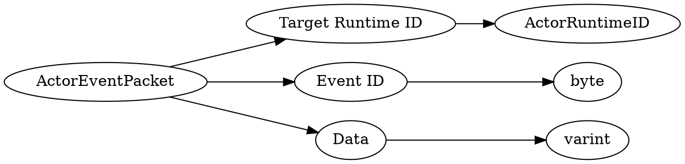

# <!-- md:samp ActorEventPacket -->

> 文档版本：r/20_u7 协议版本：662

<!-- md:samp ActorEventPacket -->数据包，数字ID是`27`。

## 结构

## 字段

/// define
ActorEventPacket

Target Runtime ID：[<!-- md:samp ActorRuntimeID -->](refs/protocols/types/ActorRuntimeID.md)

- 类型：ActorRuntimeID。

Event ID：<!-- md:samp byte -->

- 类型：byte。enumeration: ActorEvent

Data：<!-- md:samp varint -->

- 类型：varint。

///
