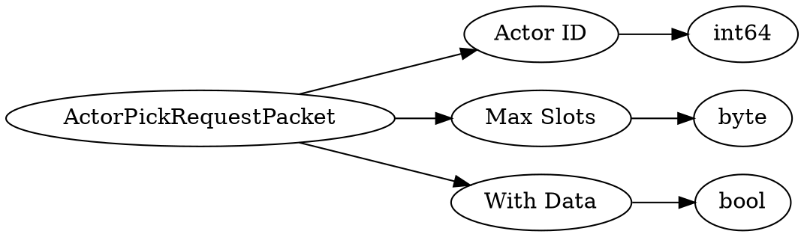

# <!-- md:samp ActorPickRequestPacket -->

> 文档版本：r/20_u7 协议版本：662

<!-- md:samp ActorPickRequestPacket -->数据包，数字ID是`35`。

## 结构

## 字段

/// define
ActorPickRequestPacket

Actor ID：<!-- md:samp int64 -->

- 类型：int64。Target Actor ID

Max Slots：<!-- md:samp byte -->

- 类型：byte。number of empty hotbar slots (to dec'id'e whether to overwrite a slot or add it to an empty one)

With Data：<!-- md:samp bool -->

- 类型：bool。whether we want to store the NBT data along with the item

///
