# <!-- md:samp AddPlayerPacket -->

> 文档版本：r/20_u7 协议版本：662

<!-- md:samp AddPlayerPacket -->数据包，数字ID是`12`。

## 结构

```dot
digraph AddPlayerPacket {
	graph [rankdir=LR];
	{
		graph [rank=max];
		2	[comment="name: \"mce::UUID\", typeName: \"\", id: 2, branchId: 0, recurseId: -1, attributes: 512, notes: \"\"",
			label="mce::UUID"];
		4	[comment="name: \"string\", typeName: \"\", id: 4, branchId: 0, recurseId: -1, attributes: 512, notes: \"\"",
			label=string];
		6	[comment="name: \"ActorRuntimeID\", typeName: \"\", id: 6, branchId: 0, recurseId: -1, attributes: 512, notes: \"\"",
			label=ActorRuntimeID];
		8	[comment="name: \"string\", typeName: \"\", id: 8, branchId: 0, recurseId: -1, attributes: 512, notes: \"\"",
			label=string];
		10	[comment="name: \"Vec3\", typeName: \"\", id: 10, branchId: 0, recurseId: -1, attributes: 512, notes: \"\"",
			label=Vec3];
		12	[comment="name: \"Vec3\", typeName: \"\", id: 12, branchId: 0, recurseId: -1, attributes: 512, notes: \"\"",
			label=Vec3];
		14	[comment="name: \"Vec2\", typeName: \"\", id: 14, branchId: 0, recurseId: -1, attributes: 512, notes: \"\"",
			label=Vec2];
		16	[comment="name: \"float\", typeName: \"\", id: 16, branchId: 0, recurseId: -1, attributes: 512, notes: \"\"",
			label=float];
		45	[comment="name: \"NetworkItemStackDescriptor\", typeName: \"\", id: 45, branchId: 0, recurseId: -1, attributes: 512, notes: \"\"",
			label=NetworkItemStackDescriptor];
		47	[comment="name: \"varint\", typeName: \"\", id: 47, branchId: 0, recurseId: -1, attributes: 512, notes: \"\"",
			label=varint];
		56	[comment="name: \"std::vector<class std::unique_ptr<class DataItem,struct std::default_delete<class DataItem> >,class std::allocator<class \
std::unique_ptr<class DataItem,struct std::default_delete<class DataItem> > > >\", typeName: \"\", id: 56, branchId: 0, recurseId: \
-1, attributes: 512, notes: \"\"",
			label="std::vector<class std::unique_ptr<class DataItem,struct std::default_delete<class DataItem> >,class std::allocator<class std::unique_\
ptr<class DataItem,struct std::default_delete<class DataItem> > > >"];
		59	[comment="name: \"std::vector<class std::unique_ptr<class DataItem,struct std::default_delete<class DataItem> >,class std::allocator<class \
std::unique_ptr<class DataItem,struct std::default_delete<class DataItem> > > >\", typeName: \"\", id: 59, branchId: 0, recurseId: \
-1, attributes: 512, notes: \"\"",
			label="std::vector<class std::unique_ptr<class DataItem,struct std::default_delete<class DataItem> >,class std::allocator<class std::unique_\
ptr<class DataItem,struct std::default_delete<class DataItem> > > >"];
		78	[comment="name: \"PropertySyncData\", typeName: \"\", id: 78, branchId: 0, recurseId: -1, attributes: 512, notes: \"\"",
			label=PropertySyncData];
		104	[comment="name: \"SerializedAbilitiesData\", typeName: \"\", id: 104, branchId: 0, recurseId: -1, attributes: 512, notes: \"\"",
			label=SerializedAbilitiesData];
		107	[comment="name: \"unsigned varint\", typeName: \"\", id: 107, branchId: 0, recurseId: -1, attributes: 512, notes: \"\"",
			label="unsigned varint"];
		121	[comment="name: \"ActorLink\", typeName: \"\", id: 121, branchId: 0, recurseId: -1, attributes: 512, notes: \"\"",
			label=ActorLink];
		123	[comment="name: \"string\", typeName: \"\", id: 123, branchId: 0, recurseId: -1, attributes: 512, notes: \"\"",
			label=string];
		125	[comment="name: \"int\", typeName: \"\", id: 125, branchId: 0, recurseId: -1, attributes: 512, notes: \"\"",
			label=int];
	}
	0	[comment="name: \"AddPlayerPacket\", typeName: \"\", id: 0, branchId: 12, recurseId: -1, attributes: 0, notes: \"\"",
		label=AddPlayerPacket];
	1	[comment="name: \"UUID\", typeName: \"mce::UUID\", id: 1, branchId: 0, recurseId: -1, attributes: 256, notes: \"\"",
		label=UUID];
	0 -> 1;
	3	[comment="name: \"Player Name\", typeName: \"\", id: 3, branchId: 0, recurseId: -1, attributes: 0, notes: \"\"",
		label="Player Name"];
	0 -> 3;
	5	[comment="name: \"Target Runtime ID\", typeName: \"ActorRuntimeID\", id: 5, branchId: 0, recurseId: -1, attributes: 256, notes: \"\"",
		label="Target Runtime ID"];
	0 -> 5;
	7	[comment="name: \"Platform Chat Id\", typeName: \"\", id: 7, branchId: 0, recurseId: -1, attributes: 0, notes: \"\"",
		label="Platform Chat Id"];
	0 -> 7;
	9	[comment="name: \"Position\", typeName: \"Vec3\", id: 9, branchId: 0, recurseId: -1, attributes: 256, notes: \"\"",
		label=Position];
	0 -> 9;
	11	[comment="name: \"Velocity\", typeName: \"Vec3\", id: 11, branchId: 0, recurseId: -1, attributes: 256, notes: \"\"",
		label=Velocity];
	0 -> 11;
	13	[comment="name: \"Rotation\", typeName: \"Vec2\", id: 13, branchId: 0, recurseId: -1, attributes: 256, notes: \"\"",
		label=Rotation];
	0 -> 13;
	15	[comment="name: \"Y-Head Rotation\", typeName: \"\", id: 15, branchId: 0, recurseId: -1, attributes: 0, notes: \"\"",
		label="Y-Head Rotation"];
	0 -> 15;
	17	[comment="name: \"Carried Item\", typeName: \"NetworkItemStackDescriptor\", id: 17, branchId: 0, recurseId: -1, attributes: 256, notes: \"\"",
		label="Carried Item"];
	0 -> 17;
	46	[comment="name: \"Player Game Type\", typeName: \"\", id: 46, branchId: 0, recurseId: -1, attributes: 0, notes: \"enumeration: GameType\"",
		label="Player Game Type"];
	0 -> 46;
	48	[comment="name: \"Dependency on 'SynchedActorDataEntityWrapper exist?'\", typeName: \"\", id: 48, branchId: 0, recurseId: -1, attributes: 2, notes: \"\"",
		label="Dependency on 'SynchedActorDataEntityWrapper exist?'",
		shape=note];
	0 -> 48;
	60	[comment="name: \"Synched Properties\", typeName: \"PropertySyncData\", id: 60, branchId: 0, recurseId: -1, attributes: 256, notes: \"\"",
		label="Synched Properties"];
	0 -> 60;
	79	[comment="name: \"AbilitiesData\", typeName: \"SerializedAbilitiesData\", id: 79, branchId: 0, recurseId: -1, attributes: 256, notes: \"\"",
		label=AbilitiesData];
	0 -> 79;
	105	[comment="name: \"Actor Links\", typeName: \"\", id: 105, branchId: 0, recurseId: -1, attributes: 8, notes: \"\"",
		label="Actor Links"];
	0 -> 105;
	122	[comment="name: \"Device Id\", typeName: \"\", id: 122, branchId: 0, recurseId: -1, attributes: 0, notes: \"A unique device id obtained from the \
connection request.\"",
		label="Device Id"];
	0 -> 122;
	124	[comment="name: \"Build Platform\", typeName: \"\", id: 124, branchId: 0, recurseId: -1, attributes: 0, notes: \"enumeration: BuildPlatform\"",
		label="Build Platform"];
	0 -> 124;
	1 -> 2;
	3 -> 4;
	5 -> 6;
	7 -> 8;
	9 -> 10;
	11 -> 12;
	13 -> 14;
	15 -> 16;
	17 -> 45;
	46 -> 47;
	49	[comment="name: \"if (0)\", typeName: \"\", id: 49, branchId: 0, recurseId: -1, attributes: 4, notes: \"\"",
		label="if (0)",
		shape=diamond];
	48 -> 49;
	57	[comment="name: \"if (1)\", typeName: \"\", id: 57, branchId: 1, recurseId: -1, attributes: 4, notes: \"\"",
		label="if (1)",
		shape=diamond];
	48 -> 57;
	50	[comment="name: \"Unpack\", typeName: \"std::vector<class std::unique_ptr<class DataItem,struct std::default_delete<class DataItem> >,class std::\
allocator<class std::unique_ptr<class DataItem,struct std::default_delete<class DataItem> > > >\", id: 50, branchId: 0, recurseId: \
-1, attributes: 256, notes: \"std::vector<std::unique_ptr<DataItem>>\"",
		label=Unpack];
	49 -> 50;
	50 -> 56;
	58	[comment="name: \"Entity Data PackAll\", typeName: \"std::vector<class std::unique_ptr<class DataItem,struct std::default_delete<class DataItem> >,\
class std::allocator<class std::unique_ptr<class DataItem,struct std::default_delete<class DataItem> > > >\", id: 58, branchId: 0, \
recurseId: -1, attributes: 256, notes: \"std::vector<std::unique_ptr<DataItem>>\"",
		label="Entity Data PackAll"];
	57 -> 58;
	58 -> 59;
	60 -> 78;
	79 -> 104;
	106	[comment="name: \"Array Size\", typeName: \"\", id: 106, branchId: 0, recurseId: -1, attributes: 0, notes: \"\"",
		label="Array Size"];
	105 -> 106;
	108	[comment="name: \"example element\", typeName: \"\", id: 108, branchId: 0, recurseId: -1, attributes: 16, notes: \"\"",
		label="example element",
		style=dotted];
	105 -> 108;
	106 -> 107;
	109	[comment="name: \"Link\", typeName: \"ActorLink\", id: 109, branchId: 0, recurseId: -1, attributes: 256, notes: \"\"",
		label=Link];
	108 -> 109;
	109 -> 121;
	122 -> 123;
	124 -> 125;
}

```

## 字段

/// define
AddPlayerPacket

UUID：[<!-- md:samp mce::UUID -->](refs/protocols/types/mce::UUID.md)

- 类型：mce::UUID。

Player Name：<!-- md:samp string -->

- 类型：string。

Target Runtime ID：[<!-- md:samp ActorRuntimeID -->](refs/protocols/types/ActorRuntimeID.md)

- 类型：ActorRuntimeID。

Platform Chat Id：<!-- md:samp string -->

- 类型：string。

Position：[<!-- md:samp Vec3 -->](refs/protocols/types/Vec3.md)

- 类型：Vec3。

Velocity：[<!-- md:samp Vec3 -->](refs/protocols/types/Vec3.md)

- 类型：Vec3。

Rotation：[<!-- md:samp Vec2 -->](refs/protocols/types/Vec2.md)

- 类型：Vec2。

Y-Head Rotation：<!-- md:samp float -->

- 类型：float。

Carried Item：[<!-- md:samp NetworkItemStackDescriptor -->](refs/protocols/types/NetworkItemStackDescriptor.md)

- 类型：NetworkItemStackDescriptor。

Player Game Type：<!-- md:samp varint -->

- 类型：varint。enumeration: GameType

Dependency on 'SynchedActorDataEntityWrapper exist?'

//// tab | if (0)
///// define
if (0)

Unpack：[<!-- md:samp std::vector<class std::unique_ptr<class DataItem,struct std::default_delete<class DataItem> >,class std::allocator<class std::unique_ptr<class DataItem,struct std::default_delete<class DataItem> > > > -->](refs/protocols/types/std::vector<class std::unique_ptr<class DataItem,struct std::default_delete<class DataItem> >,class std::allocator<class std::unique_ptr<class DataItem,struct std::default_delete<class DataItem> > > >.md)

- 类型：std::vector<class std::unique_ptr<class DataItem,struct std::default_delete<class DataItem> >,class std::allocator<class std::unique_ptr<class DataItem,struct std::default_delete<class DataItem> > > >。std::vector<std::unique_ptr<DataItem>>

/////

////

//// tab | if (1)
///// define
if (1)

Entity Data PackAll：[<!-- md:samp std::vector<class std::unique_ptr<class DataItem,struct std::default_delete<class DataItem> >,class std::allocator<class std::unique_ptr<class DataItem,struct std::default_delete<class DataItem> > > > -->](refs/protocols/types/std::vector<class std::unique_ptr<class DataItem,struct std::default_delete<class DataItem> >,class std::allocator<class std::unique_ptr<class DataItem,struct std::default_delete<class DataItem> > > >.md)

- 类型：std::vector<class std::unique_ptr<class DataItem,struct std::default_delete<class DataItem> >,class std::allocator<class std::unique_ptr<class DataItem,struct std::default_delete<class DataItem> > > >。std::vector<std::unique_ptr<DataItem>>

/////

////

Synched Properties：[<!-- md:samp PropertySyncData -->](refs/protocols/types/PropertySyncData.md)

- 类型：PropertySyncData。

AbilitiesData：[<!-- md:samp SerializedAbilitiesData -->](refs/protocols/types/SerializedAbilitiesData.md)

- 类型：SerializedAbilitiesData。

Actor Links

Actor Links数组的大小：<!-- md:samp unsigned varint -->

- 类型：unsigned varint。

Actor Links的示例元素

Link：[<!-- md:samp ActorLink -->](refs/protocols/types/ActorLink.md)

- 类型：ActorLink。

Device Id：<!-- md:samp string -->

- 类型：string。A unique device 'id' obtained from the connection request.

Build Platform：<!-- md:samp int -->

- 类型：int。enumeration: BuildPlatform

///
