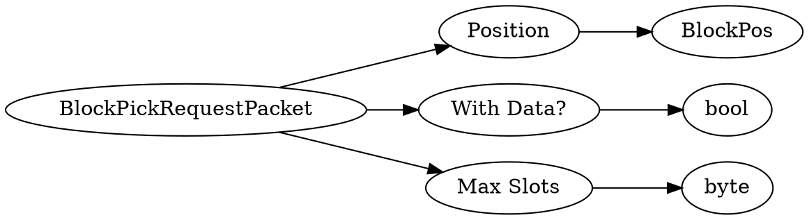

# <!-- md:samp BlockPickRequestPacket -->

> 文档版本：r/20_u7 协议版本：662

<!-- md:samp BlockPickRequestPacket -->数据包，数字ID是`34`。

## 结构

## 字段

/// define
BlockPickRequestPacket

Position：[<!-- md:samp BlockPos -->](refs/protocols/types/BlockPos.md)

- 类型：BlockPos。

With Data?：<!-- md:samp bool -->

- 类型：bool。

Max Slots：<!-- md:samp byte -->

- 类型：byte。

///
